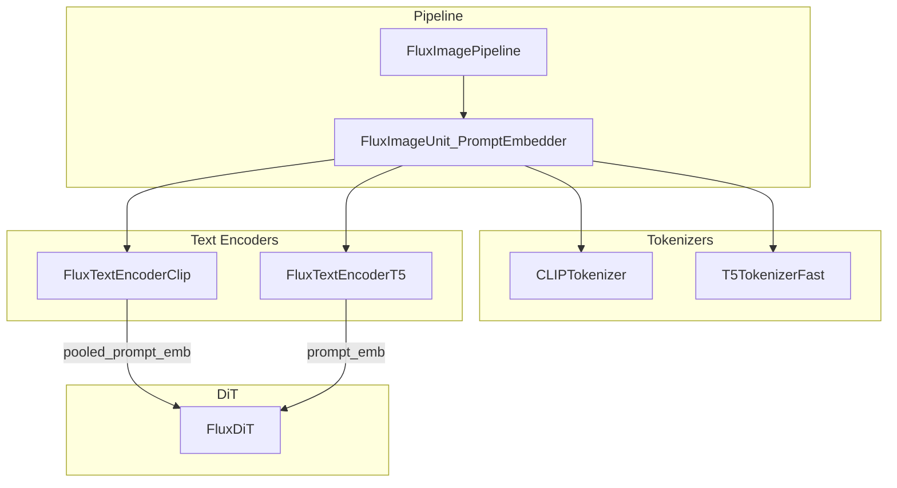
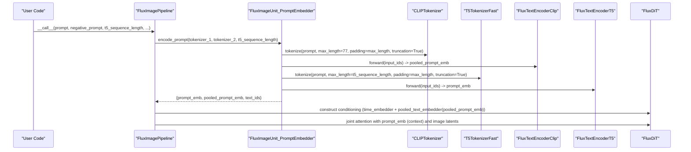
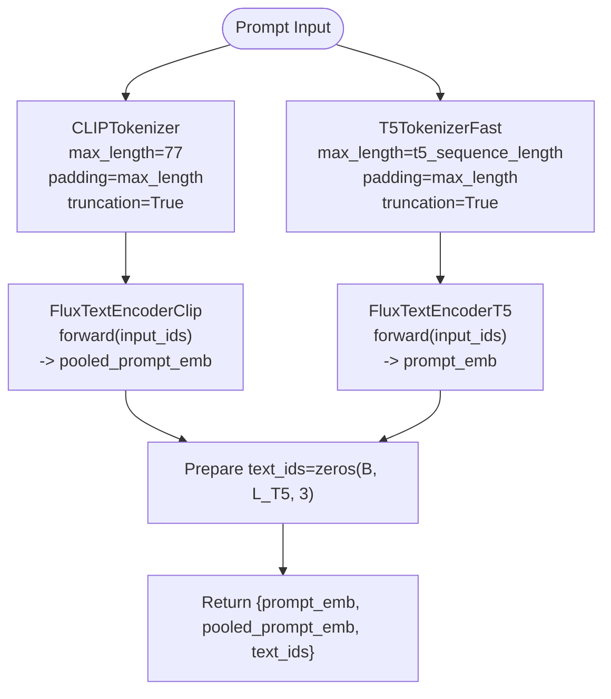
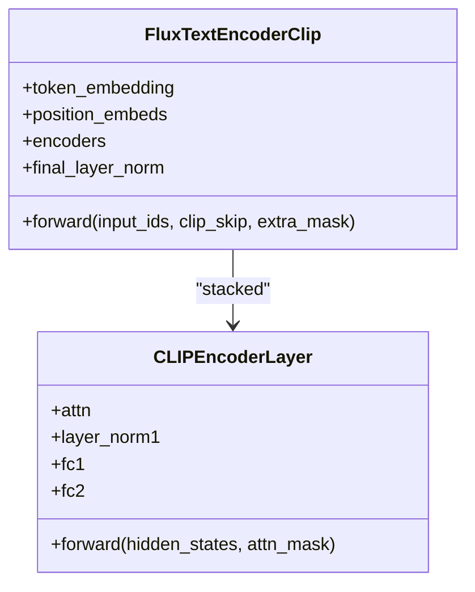
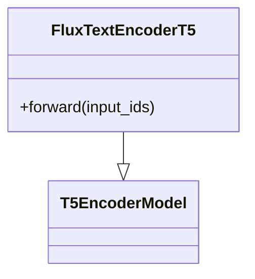
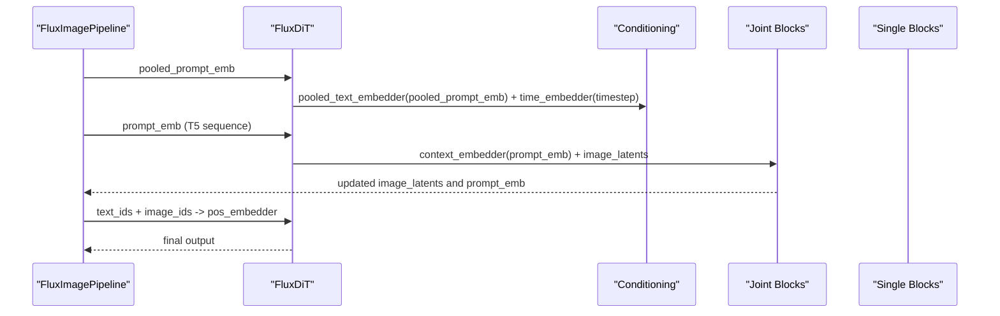
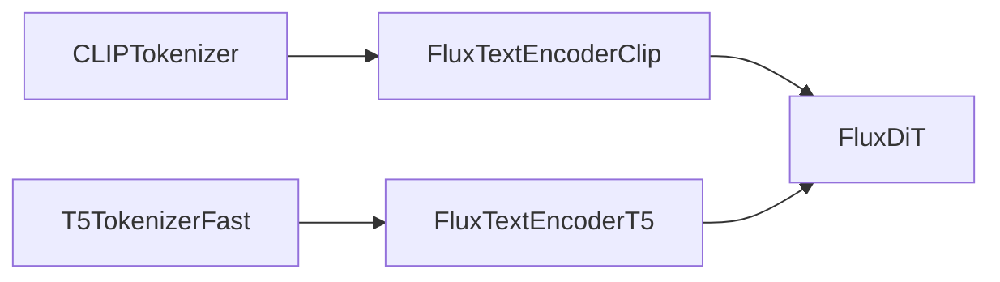

# Text Encoding System

<cite>
**Referenced Files in This Document**
- [flux_image.py](file://diffsynth/pipelines/flux_image.py)
- [flux_text_encoder_clip.py](file://diffsynth/models/flux_text_encoder_clip.py)
- [flux_text_encoder_t5.py](file://diffsynth/models/flux_text_encoder_t5.py)
- [flux_dit.py](file://diffsynth/models/flux_dit.py)
- [model_configs.py](file://diffsynth/configs/model_configs.py)
- [FLUX.1-dev.py](file://examples/flux/model_inference/FLUX.1-dev.py)
</cite>

## Table of Contents
1. [Introduction](#introduction)
2. [Project Structure](#project-structure)
3. [Core Components](#core-components)
4. [Architecture Overview](#architecture-overview)
5. [Detailed Component Analysis](#detailed-component-analysis)
6. [Dependency Analysis](#dependency-analysis)
7. [Performance Considerations](#performance-considerations)
8. [Troubleshooting Guide](#troubleshooting-guide)
9. [Conclusion](#conclusion)
10. [Appendices](#appendices)

## Introduction
This document explains the dual text encoding system used by FLUX pipelines to process prompts with two complementary encoders: CLIP and T5. It focuses on how FluxImageUnit_PromptEmbedder tokenizes, encodes, and generates embeddings for positive and negative prompts; how CLIPTokenizer and T5TokenizerFast are configured; sequence length handling and padding strategies; and how pooled CLIP embeddings and T5 sequence embeddings are combined and consumed by the DiT model’s attention mechanisms. It also provides configuration guidance for t5_sequence_length, prompt formats, and performance optimization techniques.

## Project Structure
The FLUX pipeline composes a series of PipelineUnits that prepare inputs and run inference. The text encoding path is implemented within FluxImageUnit_PromptEmbedder and relies on two tokenizer/encoder pairs:
- CLIP path: CLIPTokenizer + FluxTextEncoderClip
- T5 path: T5TokenizerFast + FluxTextEncoderT5

**Diagram sources**
- [flux_image.py:336-394](file://diffsynth/pipelines/flux_image.py#L336-L394)
- [flux_text_encoder_clip.py:75-113](file://diffsynth/models/flux_text_encoder_clip.py#L75-L113)
- [flux_text_encoder_t5.py:5-44](file://diffsynth/models/flux_text_encoder_t5.py#L5-L44)
- [flux_dit.py:277-324](file://diffsynth/models/flux_dit.py#L277-L324)

**Section sources**
- [flux_image.py:57-107](file://diffsynth/pipelines/flux_image.py#L57-L107)
- [model_configs.py:319-347](file://diffsynth/configs/model_configs.py#L319-L347)

## Core Components
- FluxImageUnit_PromptEmbedder: Tokenizes and encodes prompts using both CLIP and T5, producing pooled CLIP embeddings and T5 sequence embeddings along with placeholder text_ids for positional routing.
- FluxTextEncoderClip: A compact CLIP-style encoder returning a pooled embedding per prompt and optionally hidden states.
- FluxTextEncoderT5: A T5 encoder wrapper returning last_hidden_state as the sequence of token embeddings.
- FluxDiT: Consumes pooled CLIP embeddings via a dedicated projector and uses T5 sequence embeddings as context tokens in joint attention blocks.

Key responsibilities:
- Tokenization: Fixed-length max_length for CLIP (77), configurable t5_sequence_length for T5, with padding and truncation.
- Embedding generation: CLIP produces a single pooled vector; T5 produces a full sequence.
- Positional IDs: text_ids are initialized as zeros and later concatenated with image_ids for RoPE-based positional encoding.

**Section sources**
- [flux_image.py:336-394](file://diffsynth/pipelines/flux_image.py#L336-L394)
- [flux_text_encoder_clip.py:75-113](file://diffsynth/models/flux_text_encoder_clip.py#L75-L113)
- [flux_text_encoder_t5.py:5-44](file://diffsynth/models/flux_text_encoder_t5.py#L5-L44)
- [flux_dit.py:277-324](file://diffsynth/models/flux_dit.py#L277-L324)

## Architecture Overview
The pipeline constructs conditioning for each denoising step by combining time and pooled CLIP embeddings, then feeds T5 sequence embeddings into joint transformer blocks alongside image latents.

**Diagram sources**
- [flux_image.py:336-394](file://diffsynth/pipelines/flux_image.py#L336-L394)
- [flux_image.py:1104](file://diffsynth/pipelines/flux_image.py#L1104)
- [flux_dit.py:277-324](file://diffsynth/models/flux_dit.py#L277-L324)

**Section sources**
- [flux_image.py:180-291](file://diffsynth/pipelines/flux_image.py#L180-L291)
- [flux_image.py:1000-1203](file://diffsynth/pipelines/flux_image.py#L1000-L1203)

## Detailed Component Analysis

### FluxImageUnit_PromptEmbedder
Responsibilities:
- Encode positive and negative prompts separately when CFG is enabled.
- Use CLIPTokenizer with fixed max_length=77 and T5TokenizerFast with user-specified t5_sequence_length.
- Apply padding="max_length" and truncation=True to ensure consistent shapes.
- Generate text_ids as zero tensors matching T5 sequence length for later concatenation with image_ids.

Encoding flow:
- CLIP: input_ids -> FluxTextEncoderClip -> pooled_prompt_emb (shape [B, 768])
- T5: input_ids -> FluxTextEncoderT5 -> prompt_emb (shape [B, L_T5, 4096])
- text_ids: shape [B, L_T5, 3] filled with zeros

**Diagram sources**
- [flux_image.py:347-383](file://diffsynth/pipelines/flux_image.py#L347-L383)

**Section sources**
- [flux_image.py:336-394](file://diffsynth/pipelines/flux_image.py#L336-L394)

### FluxTextEncoderClip
Design:
- Token embedding + fixed position embeddings.
- Stacked encoder layers with attention and MLP blocks.
- Attention mask is causal/triangular.
- Returns pooled embedding by selecting token positions based on argmax over input_ids (CLIP pooling).

Complexity:
- Linear in sequence length (fixed at 77) and number of layers.
- Memory dominated by attention matrices over 77 tokens.

**Diagram sources**
- [flux_text_encoder_clip.py:75-113](file://diffsynth/models/flux_text_encoder_clip.py#L75-L113)
- [flux_text_encoder_clip.py:41-73](file://diffsynth/models/flux_text_encoder_clip.py#L41-L73)

**Section sources**
- [flux_text_encoder_clip.py:75-113](file://diffsynth/models/flux_text_encoder_clip.py#L75-L113)

### FluxTextEncoderT5
Design:
- Wraps transformers T5EncoderModel with explicit config.
- forward returns last_hidden_state as prompt_emb.

Complexity:
- Scales with t5_sequence_length and model depth/width.
- Dominant memory usage from large hidden dimensions (4096).

**Diagram sources**
- [flux_text_encoder_t5.py:5-44](file://diffsynth/models/flux_text_encoder_t5.py#L5-L44)

**Section sources**
- [flux_text_encoder_t5.py:5-44](file://diffsynth/models/flux_text_encoder_t5.py#L5-L44)

### DiT Integration of Text Embeddings
How text embeddings are used:
- pooled_prompt_emb is projected via pooled_text_embedder and added to timestep embedding to form conditioning.
- prompt_emb (T5 sequence) is passed through context_embedder and concatenated with image latents in joint attention blocks.
- text_ids (zeros) are concatenated with image_ids and fed to RoPE embedding to provide spatial-temporal positional information.

**Diagram sources**
- [flux_image.py:1104](file://diffsynth/pipelines/flux_image.py#L1104)
- [flux_dit.py:277-324](file://diffsynth/models/flux_dit.py#L277-L324)
- [flux_dit.py:389-399](file://diffsynth/models/flux_dit.py#L389-L399)

**Section sources**
- [flux_image.py:1000-1203](file://diffsynth/pipelines/flux_image.py#L1000-L1203)
- [flux_dit.py:277-324](file://diffsynth/models/flux_dit.py#L277-L324)

## Dependency Analysis
- Tokenizers:
  - CLIPTokenizer: loaded via from_pretrained(model_id or path)
  - T5TokenizerFast: loaded via from_pretrained(model_id or path)
- Encoders:
  - FluxTextEncoderClip: custom implementation
  - FluxTextEncoderT5: wraps T5EncoderModel
- DiT: consumes both embeddings and manages positional ids

**Diagram sources**
- [flux_image.py:120-177](file://diffsynth/pipelines/flux_image.py#L120-L177)
- [model_configs.py:319-347](file://diffsynth/configs/model_configs.py#L319-L347)

**Section sources**
- [flux_image.py:120-177](file://diffsynth/pipelines/flux_image.py#L120-L177)
- [model_configs.py:319-347](file://diffsynth/configs/model_configs.py#L319-L347)

## Performance Considerations
- Sequence length tuning:
  - t5_sequence_length directly impacts memory and compute. Smaller values reduce VRAM but may truncate long prompts.
  - CLIP path is fixed at 77 tokens; no runtime tuning needed there.
- Padding strategy:
  - Both tokenizers use padding="max_length" and truncation=True, ensuring stable tensor shapes across batches.
- Mixed precision:
  - Pipeline defaults to bfloat16; encoders operate in this dtype for efficiency.
- Optional acceleration:
  - TeaCache can skip recomputation when changes are small across steps.
  - Tiled inference reduces peak memory by processing latents in patches.
- Model loading:
  - Only load necessary models to device; pipeline supports selective loading for VRAM management.

[No sources needed since this section provides general guidance]

## Troubleshooting Guide
Common issues and resolutions:
- Out-of-memory during T5 encoding:
  - Reduce t5_sequence_length.
  - Ensure only required models are loaded to GPU.
- Prompt truncation artifacts:
  - Verify t5_sequence_length is sufficient for your prompt length.
  - Check that truncation=True is set (default behavior).
- Mismatched shapes between prompt_emb and text_ids:
  - Ensure text_ids shape matches prompt_emb sequence length (both B x L_T5 x 3).
- CFG not applied:
  - When cfg_scale != 1.0, ensure negative_prompt is provided so separate negative embeddings are generated.

**Section sources**
- [flux_image.py:336-394](file://diffsynth/pipelines/flux_image.py#L336-L394)
- [flux_image.py:180-291](file://diffsynth/pipelines/flux_image.py#L180-L291)

## Conclusion
The FLUX pipeline employs a robust dual text encoding system that leverages CLIP for global semantic cues and T5 for detailed token-level context. FluxImageUnit_PromptEmbedder orchestrates tokenization and encoding, while FluxDiT integrates these embeddings into its attention architecture to guide image synthesis. Proper configuration of t5_sequence_length and careful prompt formatting are key to balancing quality and performance.

[No sources needed since this section summarizes without analyzing specific files]

## Appendices

### Configuration Examples
- Basic usage with default parameters:
  - See example script for minimal setup and generation.
- Configuring t5_sequence_length:
  - Pass t5_sequence_length parameter to pipeline call to adjust T5 sequence length.
- Handling different prompt formats:
  - Positive and negative prompts are supported; ensure negative_prompt is provided when cfg_scale > 1.

**Section sources**
- [FLUX.1-dev.py:1-27](file://examples/flux/model_inference/FLUX.1-dev.py#L1-L27)
- [flux_image.py:180-291](file://diffsynth/pipelines/flux_image.py#L180-L291)