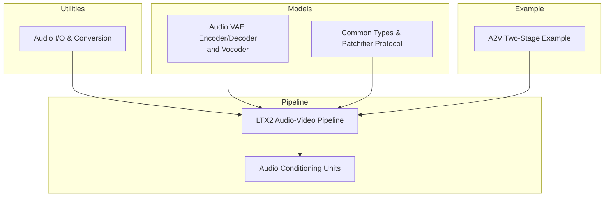
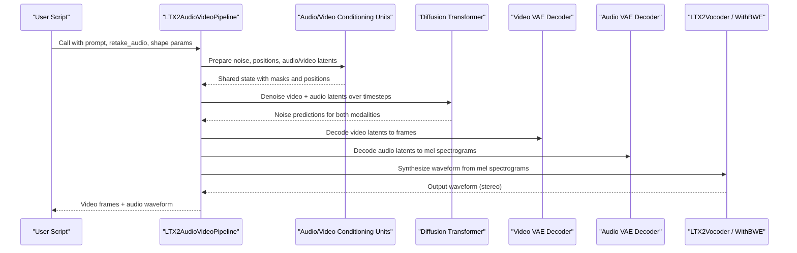
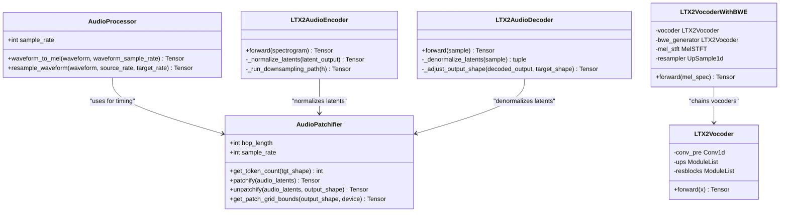
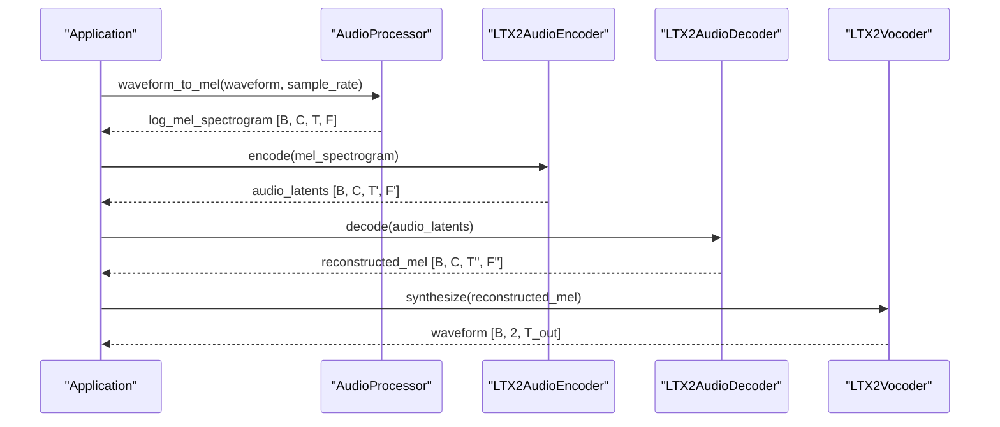
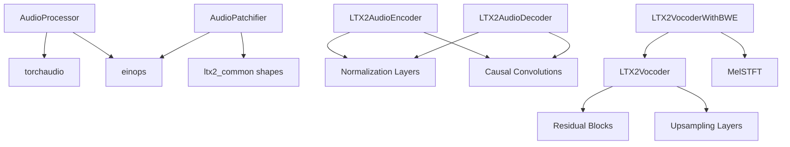
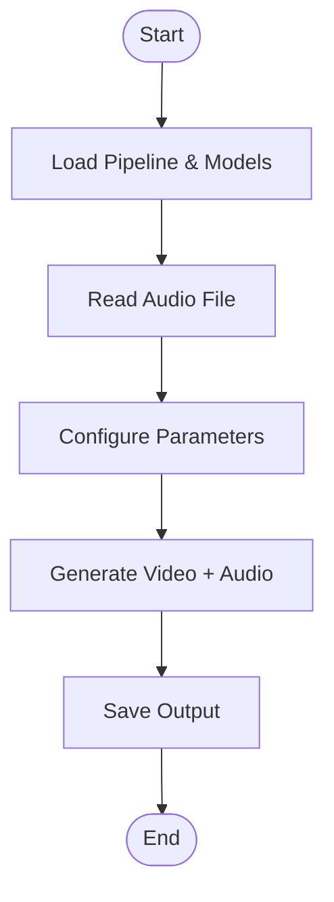

# Audio Processing Components

<cite>
**Referenced Files in This Document**
- [ltx2_audio_vae.py](file://diffsynth/models/ltx2_audio_vae.py)
- [ltx2_audio_video.py](file://diffsynth/pipelines/ltx2_audio_video.py)
- [audio.py](file://diffsynth/utils/data/audio.py)
- [ltx2_common.py](file://diffsynth/models/ltx2_common.py)
- [LTX-2.3-A2V-TwoStage.py](file://examples/ltx2/model_inference/LTX-2.3-A2V-TwoStage.py)
</cite>

## Table of Contents
1. Introduction
2. Project Structure
3. Core Components
4. Architecture Overview
5. Detailed Component Analysis
6. Dependency Analysis
7. Performance Considerations
8. Troubleshooting Guide
9. Conclusion
10. Appendices

## Introduction
This document explains the LTX2 audio processing components and how they integrate with the video generation pipeline to produce synchronized audio–video outputs. It covers:
- The audio VAE encoder/decoder architecture for compressing and reconstructing mel spectrograms
- Mel spectrogram conversion and waveform synthesis via a BigVGAN-style vocoder (with optional bandwidth extension)
- Temporal alignment using the AudioPatchifier
- Waveform manipulation utilities in AudioProcessor and stereo conversion helpers
- Latent space representation, sample rate handling, and synchronization with video frames
- Examples of preprocessing, format conversion, and quality optimization
- Integration points with speech synthesis and music generation workflows
- Guidance on customizing audio processing parameters

## Project Structure
The audio processing is implemented across model definitions, pipeline orchestration, and utility modules:
- Models: Audio VAE encoder/decoder and vocoder are defined under models/ltx2_audio_vae.py
- Pipeline: Audio–video diffusion pipeline and conditioning units are defined under pipelines/ltx2_audio_video.py
- Utilities: Audio I/O, resampling, and channel conversion utilities are under utils/data/audio.py
- Common types: Shape definitions and patchifier protocol under models/ltx2_common.py
- Example usage: A two-stage audio-to-video example under examples/ltx2/model_inference

**Diagram sources**
- [ltx2_audio_vae.py:873-1280](file://diffsynth/models/ltx2_audio_vae.py#L873-L1280)
- [ltx2_common.py:95-158](file://diffsynth/models/ltx2_common.py#L95-L158)
- [ltx2_audio_video.py:28-249](file://diffsynth/pipelines/ltx2_audio_video.py#L28-L249)
- [audio.py:1-109](file://diffsynth/utils/data/audio.py#L1-L109)
- [LTX-2.3-A2V-TwoStage.py:1-67](file://examples/ltx2/model_inference/LTX-2.3-A2V-TwoStage.py#L1-L67)

**Section sources**
- [ltx2_audio_vae.py:1-200](file://diffsynth/models/ltx2_audio_vae.py#L1-L200)
- [ltx2_audio_video.py:1-120](file://diffsynth/pipelines/ltx2_audio_video.py#L1-L120)
- [audio.py:1-109](file://diffsynth/utils/data/audio.py#L1-L109)
- [ltx2_common.py:1-120](file://diffsynth/models/ltx2_common.py#L1-L120)
- [LTX-2.3-A2V-TwoStage.py:1-67](file://examples/ltx2/model_inference/LTX-2.3-A2V-TwoStage.py#L1-L67)

## Core Components
- AudioProcessor: Converts waveforms to log-mel spectrograms with optional resampling; supports mono/stereo inputs and consistent dtype/device handling.
- AudioPatchifier: Aligns latent frames to real-time seconds based on hop length, downsampling factor, and causality; provides patch/unpatch operations and temporal bounds.
- LTX2AudioEncoder: Compresses mel spectrograms into normalized latents using a causal/residual U-Net-like structure with per-channel statistics normalization.
- LTX2AudioDecoder: Reconstructs mel spectrograms from latents with symmetric upsampling path and shape adjustment for variable-length sequences.
- LTX2Vocoder: Synthesizes waveforms from mel spectrograms using a BigVGAN v2-style generator; supports AMP blocks and configurable activations.
- LTX2VocoderWithBWE: Extends vocoder output to higher sample rates by predicting residuals from a mel-based BWE generator and adding a sinc-resampled skip connection.
- Audio utilities: Convert between mono/stereo, resample waveforms, read/write audio files efficiently.

**Section sources**
- [ltx2_audio_vae.py:12-100](file://diffsynth/models/ltx2_audio_vae.py#L12-L100)
- [ltx2_audio_vae.py:67-261](file://diffsynth/models/ltx2_audio_vae.py#L67-L261)
- [ltx2_audio_vae.py:873-1060](file://diffsynth/models/ltx2_audio_vae.py#L873-L1060)
- [ltx2_audio_vae.py:1062-1280](file://diffsynth/models/ltx2_audio_vae.py#L1062-L1280)
- [ltx2_audio_vae.py:1541-1686](file://diffsynth/models/ltx2_audio_vae.py#L1541-L1686)
- [ltx2_audio_vae.py:1767-1873](file://diffsynth/models/ltx2_audio_vae.py#L1767-L1873)
- [audio.py:1-109](file://diffsynth/utils/data/audio.py#L1-L109)

## Architecture Overview
The audio–video pipeline integrates text prompts, optional input media, and audio conditioning through modular units that prepare latents, positions, and masks before diffusion denoising. After denoising, video frames are decoded by the video VAE decoder and audio latents are decoded by the audio VAE decoder then synthesized by the vocoder.

**Diagram sources**
- [ltx2_audio_video.py:149-249](file://diffsynth/pipelines/ltx2_audio_video.py#L149-L249)
- [ltx2_audio_video.py:648-732](file://diffsynth/pipelines/ltx2_audio_video.py#L648-L732)
- [ltx2_audio_vae.py:1062-1280](file://diffsynth/models/ltx2_audio_vae.py#L1062-L1280)
- [ltx2_audio_vae.py:1541-1686](file://diffsynth/models/ltx2_audio_vae.py#L1541-L1686)

## Detailed Component Analysis

### AudioProcessor: Waveform to Mel Spectrogram
- Resamples input waveform to the configured sample rate if needed
- Computes log-mel spectrogram using torchaudio transforms with Slaney normalization
- Returns tensors with consistent device/dtype and channel ordering suitable for downstream VAE encoding

Key behaviors:
- Causal-friendly padding and centering
- Log compression with clamping to avoid numerical issues
- Permute to match expected channel-first time-frequency layout

**Section sources**
- [ltx2_audio_vae.py:12-65](file://diffsynth/models/ltx2_audio_vae.py#L12-L65)

### AudioPatchifier: Temporal Alignment and Patching
- Maps latent indices to real-time seconds using hop_length, sample_rate, and downsample factor
- Supports causal alignment to prevent future leakage
- Provides patchify/unpatchify for flattening and restoring latent grids
- Computes per-patch temporal bounds for synchronization with video frames

Important details:
- Uses einops rearrange for efficient reshaping
- Maintains batched timestamps for each latent frame
- Ensures consistency between audio and video positional embeddings

**Section sources**
- [ltx2_audio_vae.py:67-261](file://diffsynth/models/ltx2_audio_vae.py#L67-L261)
- [ltx2_common.py:302-357](file://diffsynth/models/ltx2_common.py#L302-L357)

### LTX2AudioEncoder: Mel to Latents
- Applies causal 2D convolutions and residual blocks across multiple resolutions
- Uses attention at selected resolutions and optional mid-block attention
- Normalizes latents via per-channel statistics after patchifying
- Outputs normalized latents compatible with diffusion transformer

Design highlights:
- Configurable ch_mult, num_res_blocks, dropout, norm_type
- Causality enforced along height or width axis depending on configuration
- Double-z mode produces mean/variance channels; only mean used for normalization

**Section sources**
- [ltx2_audio_vae.py:873-1060](file://diffsynth/models/ltx2_audio_vae.py#L873-L1060)

### LTX2AudioDecoder: Latents to Mel Spectrogram
- Symmetric upsampling path mirroring encoder structure
- Adjusts output shape to target frames and mel bins for variable-length audio
- Handles causal padding adjustments during upsample steps

Quality considerations:
- Precise cropping and padding ensure exact target dimensions
- Optional tanh activation for bounded outputs when required

**Section sources**
- [ltx2_audio_vae.py:1062-1280](file://diffsynth/models/ltx2_audio_vae.py#L1062-L1280)

### LTX2Vocoder: Mel to Waveform
- BigVGAN v2-style generator with configurable residual blocks and upsampling stages
- Supports AMP blocks with Snake/SnakeBeta activations for improved timbre
- Produces stereo waveforms directly from stereo mel inputs

Performance notes:
- Parallel evaluation of multiple residual branches per stage
- Final activation can be tanh or clamp depending on configuration

**Section sources**
- [ltx2_audio_vae.py:1541-1686](file://diffsynth/models/ltx2_audio_vae.py#L1541-L1686)

### LTX2VocoderWithBWE: Bandwidth Extension
- Chains base vocoder with a second vocoder to predict high-band residual
- Uses causal STFT bases and mel filterbank for precise spectral analysis
- Upsamples low-rate output via sinc resampler and adds predicted residual

Benefits:
- Higher output sample rate without retraining full vocoder
- Maintains phase coherence through mel-domain residual prediction

**Section sources**
- [ltx2_audio_vae.py:1767-1873](file://diffsynth/models/ltx2_audio_vae.py#L1767-L1873)

### Audio Utilities: Format Conversion and I/O
- convert_to_stereo: Ensures stereo channel count by duplicating mono channels
- resample_waveform: Efficient resampling using torchaudio functional API
- read_audio/save_audio: High-performance I/O using torchcodec backend

Usage patterns:
- Always convert to stereo before feeding into audio VAE encoder
- Use consistent sample rates across pipeline stages for synchronization

**Section sources**
- [audio.py:1-109](file://diffsynth/utils/data/audio.py#L1-L109)

### Pipeline Integration: Audio Conditioning and Synchronization
- InputAudioEmbedder: Converts retake audio to mel spectrograms and encodes to latents
- AudioRetakeEmbedder: Enables partial audio control with region-specific denoising masks
- Positional embeddings computed via AudioPatchifier ensure frame-rate alignment

Workflow:
- Audio latents generated alongside video latents
- Both modalities denoised jointly through shared transformer
- Final decoding produces synchronized audio waveform matching video duration

**Section sources**
- [ltx2_audio_video.py:380-471](file://diffsynth/pipelines/ltx2_audio_video.py#L380-L471)
- [ltx2_audio_video.py:330-361](file://diffsynth/pipelines/ltx2_audio_video.py#L330-L361)

### Class Diagram: Audio VAE Components

**Diagram sources**
- [ltx2_audio_vae.py:12-65](file://diffsynth/models/ltx2_audio_vae.py#L12-L65)
- [ltx2_audio_vae.py:67-261](file://diffsynth/models/ltx2_audio_vae.py#L67-L261)
- [ltx2_audio_vae.py:873-1060](file://diffsynth/models/ltx2_audio_vae.py#L873-L1060)
- [ltx2_audio_vae.py:1062-1280](file://diffsynth/models/ltx2_audio_vae.py#L1062-L1280)
- [ltx2_audio_vae.py:1541-1686](file://diffsynth/models/ltx2_audio_vae.py#L1541-L1686)
- [ltx2_audio_vae.py:1767-1873](file://diffsynth/models/ltx2_audio_vae.py#L1767-L1873)

### Sequence Diagram: Audio Preprocessing and Synthesis

**Diagram sources**
- [ltx2_audio_vae.py:12-65](file://diffsynth/models/ltx2_audio_vae.py#L12-L65)
- [ltx2_audio_vae.py:873-1060](file://diffsynth/models/ltx2_audio_vae.py#L873-L1060)
- [ltx2_audio_vae.py:1062-1280](file://diffsynth/models/ltx2_audio_vae.py#L1062-L1280)
- [ltx2_audio_vae.py:1541-1686](file://diffsynth/models/ltx2_audio_vae.py#L1541-L1686)

## Dependency Analysis
The audio processing components have clear dependency relationships:
- AudioProcessor depends on torchaudio for mel spectrogram computation
- AudioPatchifier relies on common shape definitions and einops for tensor manipulation
- Audio VAE components use shared normalization layers and causal convolution utilities
- Pipeline orchestrates all components through well-defined interfaces

**Diagram sources**
- [ltx2_audio_vae.py:1-10](file://diffsynth/models/ltx2_audio_vae.py#L1-L10)
- [ltx2_common.py:221-237](file://diffsynth/models/ltx2_common.py#L221-L237)

**Section sources**
- [ltx2_audio_vae.py:1-10](file://diffsynth/models/ltx2_audio_vae.py#L1-L10)
- [ltx2_common.py:221-237](file://diffsynth/models/ltx2_common.py#L221-L237)

## Performance Considerations
- Memory efficiency: Use tiled decoding for large video sequences and consider VRAM management strategies
- Computational efficiency: Leverage parallel residual block evaluation in vocoder stages
- Numerical stability: Apply appropriate clamping and normalization throughout the pipeline
- Sample rate handling: Ensure consistent sample rates across components to avoid unnecessary resampling
- Causal processing: Use causal convolutions for streaming applications where future information cannot be accessed

Optimization recommendations:
- Cache mel spectrograms for repeated processing
- Use appropriate data types (bfloat16) for memory-constrained environments
- Implement gradient checkpointing for training scenarios
- Consider quantization for deployment scenarios

## Troubleshooting Guide
Common issues and solutions:
- Shape mismatches: Verify AudioLatentShape calculations match actual tensor dimensions
- Sample rate inconsistencies: Ensure all components use the same sample rate configuration
- Stereo conversion errors: Confirm input audio has correct channel dimensions before processing
- Memory overflow: Reduce batch size or enable tiled processing for large sequences
- Quality degradation: Check mel spectrogram parameters and vocoder configuration

Debugging tips:
- Inspect intermediate tensor shapes at each pipeline stage
- Validate temporal alignment between audio and video frames
- Monitor audio amplitude ranges to prevent clipping
- Test with known reference audio samples for quality assessment

**Section sources**
- [ltx2_audio_video.py:380-471](file://diffsynth/pipelines/ltx2_audio_video.py#L380-L471)
- [audio.py:1-109](file://diffsynth/utils/data/audio.py#L1-L109)

## Conclusion
The LTX2 audio processing system provides a comprehensive solution for audio-aware video generation. The modular design enables flexible integration of different audio processing techniques while maintaining synchronization with visual content. The combination of mel spectrogram processing, VAE-based latent modeling, and advanced vocoder synthesis delivers high-quality audio outputs that align precisely with generated video frames.

Key strengths include:
- Robust audio preprocessing with format flexibility
- Efficient latent space representation for diffusion modeling
- High-quality waveform synthesis with bandwidth extension options
- Seamless integration with video generation pipeline
- Comprehensive utilities for audio manipulation and I/O

## Appendices

### Example Usage: Audio-to-Video Generation
The following example demonstrates complete audio-to-video generation workflow:

**Diagram sources**
- [LTX-2.3-A2V-TwoStage.py:1-67](file://examples/ltx2/model_inference/LTX-2.3-A2V-TwoStage.py#L1-L67)

### Customization Guidelines
- Audio parameters: Adjust mel_bins, hop_length, and n_fft for different audio characteristics
- VAE configuration: Modify ch_mult and num_res_blocks for different compression ratios
- Vocoder settings: Tune resblock_kernel_sizes and upsample_rates for quality vs. speed trade-offs
- Pipeline options: Enable/disable two-stage processing and distilled pipelines for performance optimization

**Section sources**
- [ltx2_audio_vae.py:873-928](file://diffsynth/models/ltx2_audio_vae.py#L873-L928)
- [ltx2_audio_vae.py:1565-1598](file://diffsynth/models/ltx2_audio_vae.py#L1565-L1598)
- [ltx2_audio_video.py:28-80](file://diffsynth/pipelines/ltx2_audio_video.py#L28-L80)