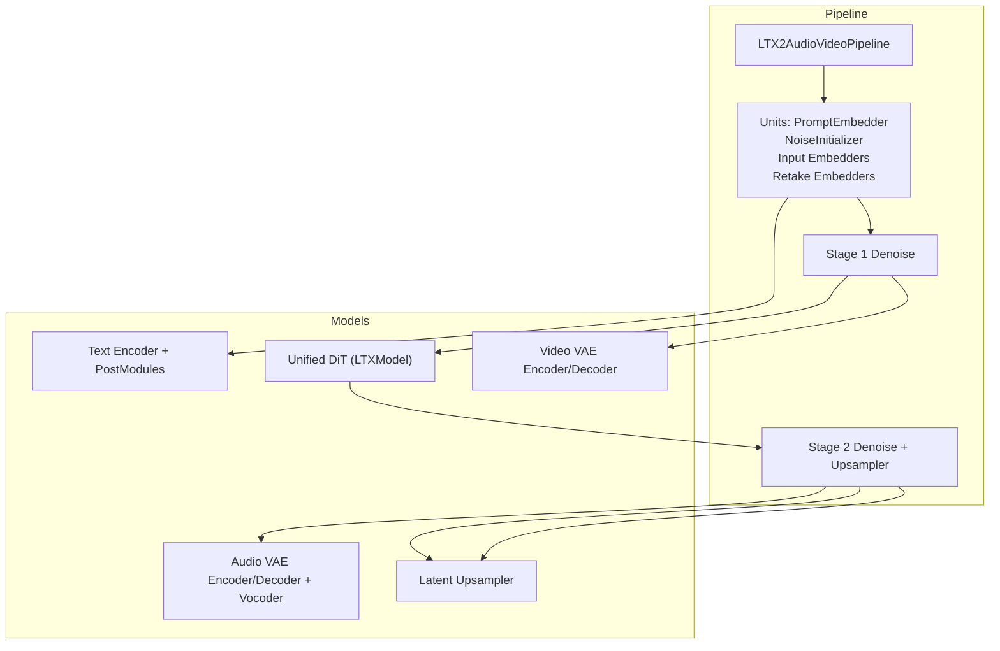
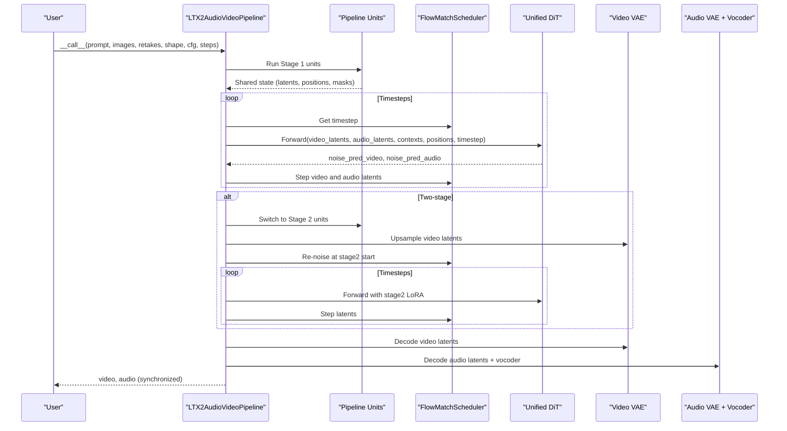
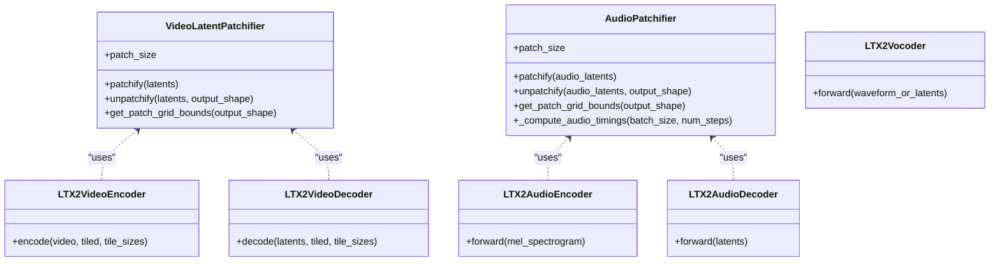
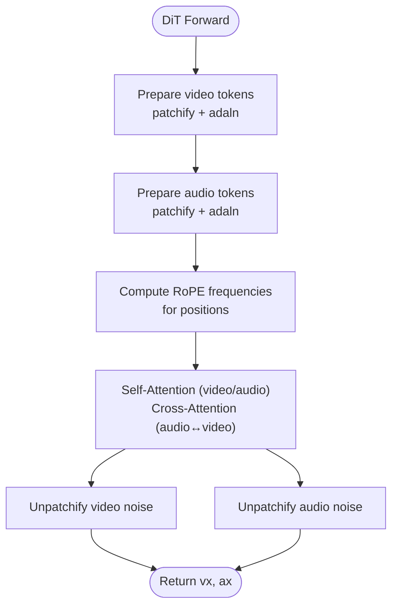
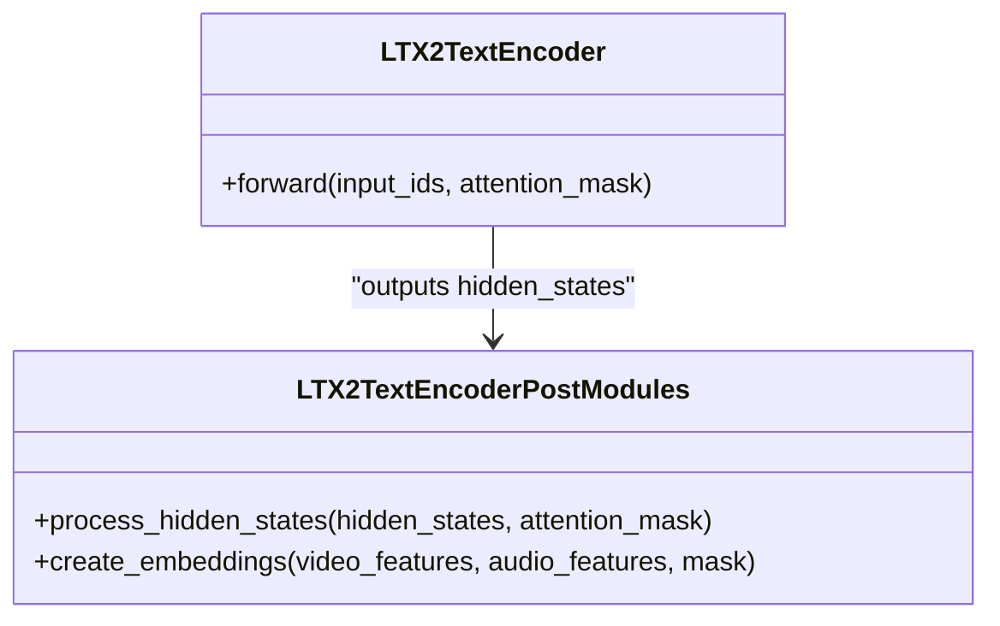
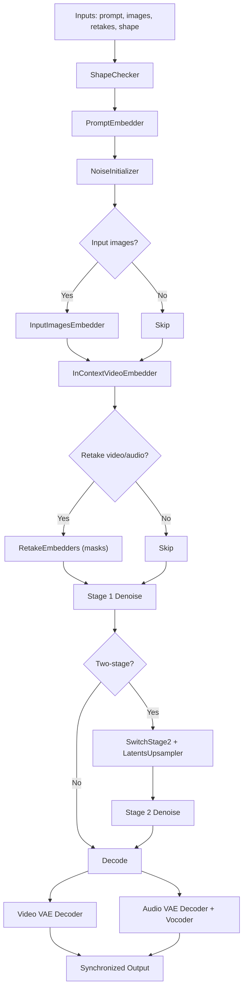
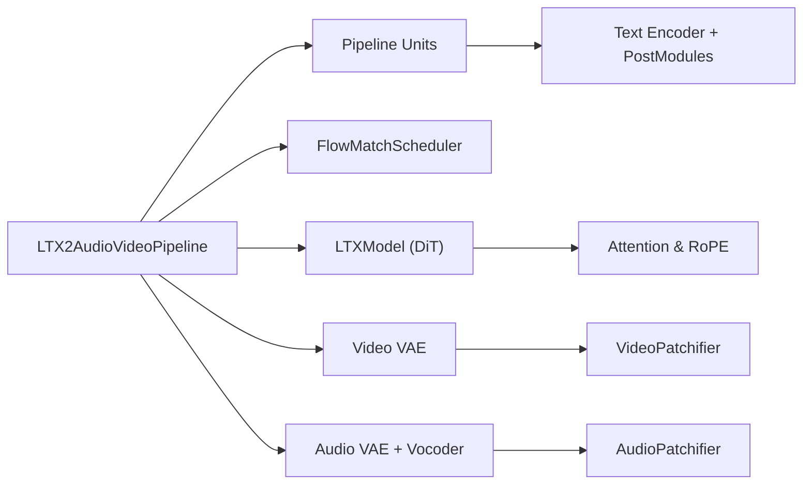

# LTX2 Audio-Video Pipeline

<cite>
**Referenced Files in This Document**
- [ltx2_audio_video.py](file://diffsynth/pipelines/ltx2_audio_video.py)
- [ltx2_dit.py](file://diffsynth/models/ltx2_dit.py)
- [ltx2_audio_vae.py](file://diffsynth/models/ltx2_audio_vae.py)
- [ltx2_video_vae.py](file://diffsynth/models/ltx2_video_vae.py)
- [ltx2_text_encoder.py](file://diffsynth/models/ltx2_text_encoder.py)
- [ltx2_common.py](file://diffsynth/models/ltx2_common.py)
- [LTX-2.md](file://docs/en/Model_Details/LTX-2.md)
</cite>

## Table of Contents
1. [Introduction](#introduction)
2. [Project Structure](#project-structure)
3. [Core Components](#core-components)
4. [Architecture Overview](#architecture-overview)
5. [Detailed Component Analysis](#detailed-component-analysis)
6. [Dependency Analysis](#dependency-analysis)
7. [Performance Considerations](#performance-considerations)
8. [Troubleshooting Guide](#troubleshooting-guide)
9. [Conclusion](#conclusion)
10. [Appendices](#appendices)

## Introduction
This document explains the LTX2 audio-video pipeline that generates synchronized audio and video content with precise temporal alignment. It covers the dual VAE architecture for audio and video, the unified diffusion transformer (DiT), cross-modal attention mechanisms, and the pipeline units responsible for preprocessing, synchronization, joint encoding/decoding, and optional two-stage upscaling. It also provides examples for music videos, narrated content, and interactive media, and outlines training approaches and evaluation considerations.

## Project Structure
The LTX2 implementation is organized into:
- Pipeline orchestration and units for preprocessing, conditioning, denoising, and decoding
- Dual VAEs for audio and video with patchifiers and causal/temporal handling
- Unified DiT with multimodal inputs and cross-attention
- Text encoder and post-processing modules to produce separate video/audio contexts
- Shared data structures and utilities for shapes, normalization, and positional embeddings

**Diagram sources**
- [ltx2_audio_video.py](file://diffsynth/pipelines/ltx2_audio_video.py)
- [ltx2_dit.py](file://diffsynth/models/ltx2_dit.py)
- [ltx2_audio_vae.py](file://diffsynth/models/ltx2_audio_vae.py)
- [ltx2_video_vae.py](file://diffsynth/models/ltx2_video_vae.py)
- [ltx2_text_encoder.py](file://diffsynth/models/ltx2_text_encoder.py)

**Section sources**
- [ltx2_audio_video.py](file://diffsynth/pipelines/ltx2_audio_video.py)
- [LTX-2.md](file://docs/en/Model_Details/LTX-2.md)

## Core Components
- LTX2AudioVideoPipeline: Orchestrates stages, units, scheduler, and model loading; exposes a single call interface for text/image/audio/video conditioning and returns synchronized video and audio.
- Dual VAEs:
  - Video VAE: Spatiotemporal latent space with patchifier and causal 3D convolutions; supports tiling and per-channel statistics.
  - Audio VAE: Log-mel spectrogram processing, causal 2D convolutions, and a vocoder for waveform synthesis.
- Unified DiT: Accepts both video and audio latents, their positions, and text contexts; applies AdaLN, RoPE, and cross-modal attention to jointly denoise both modalities.
- Text Encoder: Gemma-based text encoder with post-modules producing separate video and audio contexts.
- Patchifiers and Shapes: VideoLatentPatchifier and AudioPatchifier map between dense grids and token sequences while preserving temporal alignment.

**Section sources**
- [ltx2_audio_video.py](file://diffsynth/pipelines/ltx2_audio_video.py)
- [ltx2_video_vae.py](file://diffsynth/models/ltx2_video_vae.py)
- [ltx2_audio_vae.py](file://diffsynth/models/ltx2_audio_vae.py)
- [ltx2_dit.py](file://diffsynth/models/ltx2_dit.py)
- [ltx2_text_encoder.py](file://diffsynth/models/ltx2_text_encoder.py)
- [ltx2_common.py](file://diffsynth/models/ltx2_common.py)

## Architecture Overview
The pipeline runs two denoising stages (optional two-stage). Each stage iterates over scheduler timesteps, calling the DiT to predict noise for both modalities simultaneously. Conditioning includes:
- Text prompt via text encoder and post-modules
- Optional input images as reference frames
- Optional in-context videos
- Optional retake regions for video and audio

Temporal alignment is ensured by:
- Matching frame rate and duration across video and audio latent shapes
- Patchifier-derived timestamps for each latent token
- Causal handling in audio and video encoders/decoders

**Diagram sources**
- [ltx2_audio_video.py](file://diffsynth/pipelines/ltx2_audio_video.py)
- [ltx2_dit.py](file://diffsynth/models/ltx2_dit.py)
- [ltx2_video_vae.py](file://diffsynth/models/ltx2_video_vae.py)
- [ltx2_audio_vae.py](file://diffsynth/models/ltx2_audio_vae.py)

## Detailed Component Analysis

### Dual VAE Architecture
- Video VAE
  - Patchifier converts (B, C, F, H, W) to tokens with spatial patching and temporal stride 1.
  - Causal 3D convolutions ensure future frames do not leak into past predictions.
  - Per-channel statistics normalize/denormalize latents for stable training/inference.
- Audio VAE
  - AudioProcessor resamples waveforms and computes log-mel spectrograms.
  - AudioPatchifier flattens time-frequency patches and computes real-time timestamps aligned with hop length and downsampling factors.
  - Causal 2D convolutions maintain strict temporal causality.

**Diagram sources**
- [ltx2_video_vae.py](file://diffsynth/models/ltx2_video_vae.py)
- [ltx2_audio_vae.py](file://diffsynth/models/ltx2_audio_vae.py)

**Section sources**
- [ltx2_video_vae.py](file://diffsynth/models/ltx2_video_vae.py)
- [ltx2_audio_vae.py](file://diffsynth/models/ltx2_audio_vae.py)

### Unified Diffusion Transformer and Cross-Modal Attention
- Inputs:
  - Video latents and positions (time, height, width)
  - Audio latents and positions (time)
  - Text contexts (separate for video and audio)
  - Timestep embeddings via AdaLN-single
- Processing:
  - Patchify projections convert latents to sequence tokens
  - Rotary positional embeddings (interleaved or split) encode spatio-temporal positions
  - Self-attention within each modality and cross-attention between modalities
  - Optional perturbation configs to skip certain attention types during training
- Outputs:
  - Noise predictions for video and audio, unpatchified back to grid shapes

**Diagram sources**
- [ltx2_dit.py](file://diffsynth/models/ltx2_dit.py)

**Section sources**
- [ltx2_dit.py](file://diffsynth/models/ltx2_dit.py)

### Text Encoder and Context Separation
- Text encoder based on Gemma produces hidden states across layers.
- Post-modules aggregate multi-layer features and project into separate video and audio context embeddings.
- Supports both shared and separated feature extraction paths depending on model variant.

**Diagram sources**
- [ltx2_text_encoder.py](file://diffsynth/models/ltx2_text_encoder.py)

**Section sources**
- [ltx2_text_encoder.py](file://diffsynth/models/ltx2_text_encoder.py)

### Pipeline Units and Synchronization Modules
Key units:
- PipelineChecker: Validates configuration flags and VRAM requirements
- ShapeChecker: Ensures resolutions divisible by required factors for one/two-stage pipelines
- PromptEmbedder: Encodes prompts into separate video/audio contexts
- NoiseInitializer: Generates initial latents and computes positions aligned to frame rate
- InputVideoEmbedder / InputImagesEmbedder: Encode reference frames and apply first-frame conditioning
- InContextVideoEmbedder: Incorporate external video guidance
- RetakeEmbedders: Apply region-specific denoising masks for video and audio
- Stage switching and schedule updates for two-stage inference

Temporal alignment is maintained by:
- Using consistent frame_rate and fps across video and audio latent shapes
- Computing patch grid bounds and converting to pixel coordinates for precise timing
- Applying causal offsets where necessary

**Diagram sources**
- [ltx2_audio_video.py](file://diffsynth/pipelines/ltx2_audio_video.py)

**Section sources**
- [ltx2_audio_video.py](file://diffsynth/pipelines/ltx2_audio_video.py)

### Joint Encoding/Decoding and Temporal Alignment
- Video:
  - Latent shape derived from pixel shape using VIDEO_SCALE_FACTORS
  - Positions normalized by frame_rate to align with audio timestamps
- Audio:
  - Latent shape derived from video duration using sample_rate, hop_length, and downsample factor
  - Timestamps computed from patch bounds and causal offsets
- Synchronization:
  - Both modalities share the same number of effective seconds via frame_rate and audio parameters
  - Region-wise masks allow partial retakes without breaking alignment

**Section sources**
- [ltx2_common.py](file://diffsynth/models/ltx2_common.py)
- [ltx2_audio_video.py](file://diffsynth/pipelines/ltx2_audio_video.py)

## Dependency Analysis
High-level dependencies:
- Pipeline depends on models and units
- DiT depends on attention utilities and positional embedding helpers
- VAEs depend on patchifiers and causal convolution modules
- Text encoder depends on Gemma tokenizer and post-modules

**Diagram sources**
- [ltx2_audio_video.py](file://diffsynth/pipelines/ltx2_audio_video.py)
- [ltx2_dit.py](file://diffsynth/models/ltx2_dit.py)
- [ltx2_video_vae.py](file://diffsynth/models/ltx2_video_vae.py)
- [ltx2_audio_vae.py](file://diffsynth/models/ltx2_audio_vae.py)
- [ltx2_text_encoder.py](file://diffsynth/models/ltx2_text_encoder.py)

**Section sources**
- [ltx2_audio_video.py](file://diffsynth/pipelines/ltx2_audio_video.py)
- [ltx2_dit.py](file://diffsynth/models/ltx2_dit.py)
- [ltx2_video_vae.py](file://diffsynth/models/ltx2_video_vae.py)
- [ltx2_audio_vae.py](file://diffsynth/models/ltx2_audio_vae.py)
- [ltx2_text_encoder.py](file://diffsynth/models/ltx2_text_encoder.py)

## Performance Considerations
- VRAM management: Models are loaded on-demand; use tiled VAE decoding to reduce memory usage
- Two-stage pipeline: Improves quality at higher resolution but requires additional LoRA and upsampler
- Gradient checkpointing: Available in DiT forward to trade compute for memory
- Efficient attention: Use interleaved or split RoPE variants; consider skipping certain attention types during training
- Tiling: Configure tile sizes and overlaps to balance speed and quality

[No sources needed since this section provides general guidance]

## Troubleshooting Guide
Common issues and resolutions:
- Shape mismatches: Ensure height/width are multiples of 32 (one-stage) or 64 (two-stage); num_frames must satisfy VAE temporal constraints
- Misaligned audio/video: Verify frame_rate and audio sample_rate/hop_length/downsample_factor settings; check patch grid bounds
- Insufficient VRAM: Enable VRAM management, use tiled decoding, reduce batch size, or switch to distilled pipeline
- Missing stage2 components: For two-stage, ensure stage2_lora_config and upsampler are loaded

**Section sources**
- [ltx2_audio_video.py](file://diffsynth/pipelines/ltx2_audio_video.py)

## Conclusion
The LTX2 audio-video pipeline integrates dual VAEs, a unified DiT, and robust conditioning mechanisms to generate temporally synchronized audio and video. Through careful patchification, causal modeling, and explicit timestamp alignment, it supports diverse generation modes including music videos, narrated content, and interactive media. The modular design enables flexible training and inference strategies, including two-stage upscaling and distilled pipelines.

[No sources needed since this section summarizes without analyzing specific files]

## Appendices

### Examples of Use Cases
- Music videos: Provide prompt describing musical style and visuals; optionally supply retake_audio for precise lip-sync or beat alignment
- Narrated content: Supply retake_audio for voiceover; adjust retake_audio_regions to match speech segments
- Interactive media: Use in_context_videos for scene continuity; combine input_images for keyframe control

[No sources needed since this section doesn't analyze specific files]

### Training Approaches and Evaluation Metrics
- Training:
  - Unified training script supports full and LoRA fine-tuning for LTX-2 series
  - Dataset metadata and repetition controls enable scalable training
  - Frame rate and dynamic resolution supported
- Evaluation:
  - Multimodal quality assessment typically combines visual metrics (e.g., FID, CLIP-I) and audio metrics (e.g., PESQ, STOI)
  - Synchronization quality can be measured via lip-sync accuracy and audio-visual correlation scores

**Section sources**
- [LTX-2.md](file://docs/en/Model_Details/LTX-2.md)