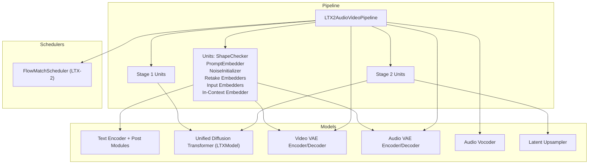
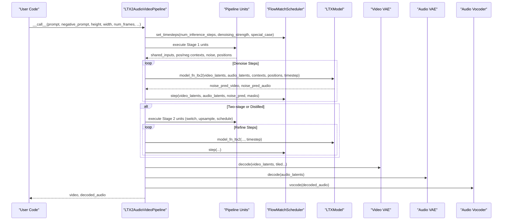
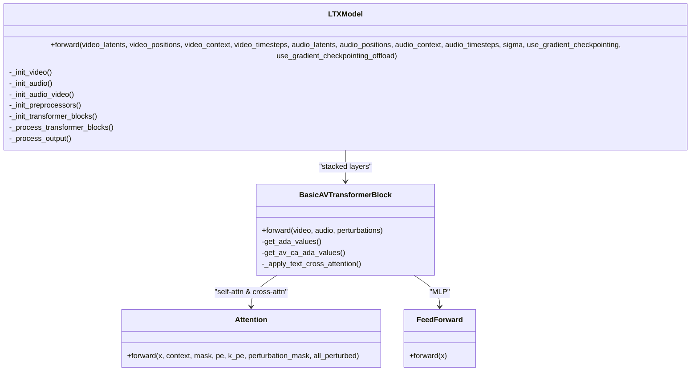
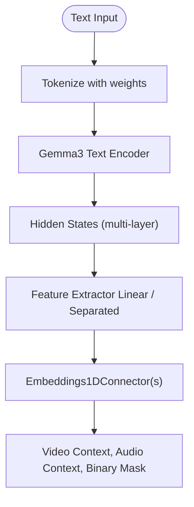
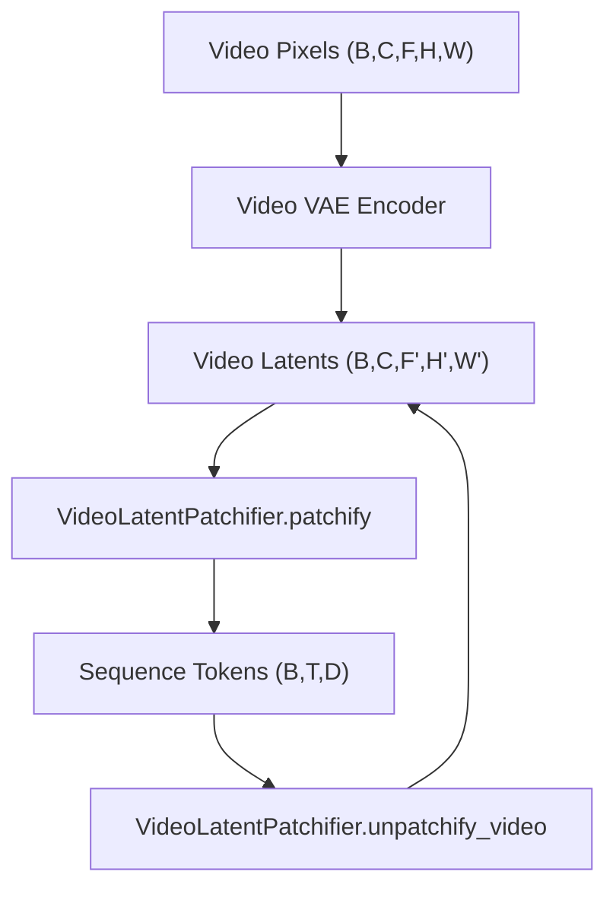
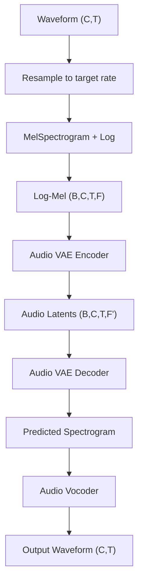
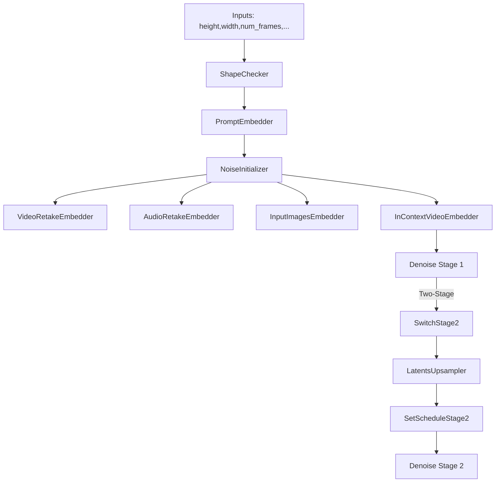
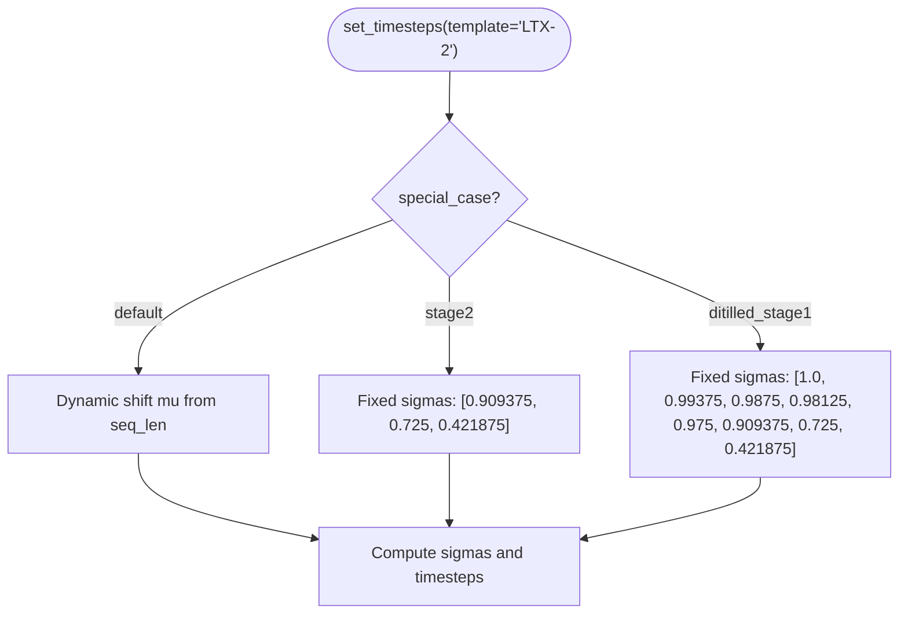
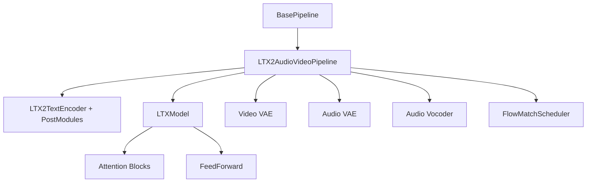

# LTX2 Pipeline Architecture

<cite>
**Referenced Files in This Document**
- [ltx2_audio_video.py](file://diffsynth/pipelines/ltx2_audio_video.py)
- [ltx2_dit.py](file://diffsynth/models/ltx2_dit.py)
- [ltx2_text_encoder.py](file://diffsynth/models/ltx2_text_encoder.py)
- [ltx2_common.py](file://diffsynth/models/ltx2_common.py)
- [ltx2_video_vae.py](file://diffsynth/models/ltx2_video_vae.py)
- [ltx2_audio_vae.py](file://diffsynth/models/ltx2_audio_vae.py)
- [base_pipeline.py](file://diffsynth/diffusion/base_pipeline.py)
- [flow_match.py](file://diffsynth/diffusion/flow_match.py)
- [LTX-2-T2AV-OneStage.py](file://examples/ltx2/model_inference/LTX-2-T2AV-OneStage.py)
- [LTX-2-T2AV-TwoStage.py](file://examples/ltx2/model_inference/LTX-2-T2AV-TwoStage.py)
- [LTX-2-T2AV-DistilledPipeline.py](file://examples/ltx2/model_inference/LTX-2-T2AV-DistilledPipeline.py)
</cite>

## Table of Contents
1. [Introduction](#introduction)
2. [Project Structure](#project-structure)
3. [Core Components](#core-components)
4. [Architecture Overview](#architecture-overview)
5. [Detailed Component Analysis](#detailed-component-analysis)
6. [Dependency Analysis](#dependency-analysis)
7. [Performance Considerations](#performance-considerations)
8. [Troubleshooting Guide](#troubleshooting-guide)
9. [Conclusion](#conclusion)
10. [Appendices](#appendices)

## Introduction
This document explains the LTX2 audio-video pipeline architecture, focusing on:
- Dual-stage denoising and distilled pipeline behavior
- Unified diffusion transformer design with cross-modal attention
- Modular unit system for shape checking, prompt embedding, noise initialization, retake functionality, and more
- One-stage vs two-stage generation modes
- VRAM management and inference optimization
- Integration between text encoding, video processing, and audio synthesis

The LTX2 pipeline generates synchronized audio and video from text prompts, optional images, and/or audio inputs, using a flow-matching scheduler and a unified transformer that jointly models video and audio tokens.

## Project Structure
At a high level, the LTX2 pipeline is implemented as a modular pipeline built on a base pipeline framework. The key modules include:
- Pipeline orchestration and units (shape checks, embeddings, noise init, retakes, stage switching)
- Unified diffusion transformer (video + audio)
- Text encoder and post-processing to produce separate video/audio contexts
- Video VAE encoder/decoder and patchifier
- Audio VAE encoder/decoder and vocoder, plus mel spectrogram processor
- Flow matching scheduler with special cases for distilled and stage 2

**Diagram sources**
- [ltx2_audio_video.py:28-249](file://diffsynth/pipelines/ltx2_audio_video.py#L28-L249)
- [ltx2_dit.py:1278-1684](file://diffsynth/models/ltx2_dit.py#L1278-L1684)
- [ltx2_text_encoder.py:11-88](file://diffsynth/models/ltx2_text_encoder.py#L11-L88)
- [ltx2_video_vae.py:18-159](file://diffsynth/models/ltx2_video_vae.py#L18-L159)
- [ltx2_audio_vae.py:12-200](file://diffsynth/models/ltx2_audio_vae.py#L12-L200)
- [flow_match.py:175-200](file://diffsynth/diffusion/flow_match.py#L175-L200)

**Section sources**
- [ltx2_audio_video.py:28-249](file://diffsynth/pipelines/ltx2_audio_video.py#L28-L249)
- [base_pipeline.py:61-114](file://diffsynth/diffusion/base_pipeline.py#L61-L114)

## Core Components
- LTX2AudioVideoPipeline: Orchestrates loading, unit execution, denoising stages, decoding, and output formatting. Supports one-stage, two-stage, and distilled pipelines.
- Unified Diffusion Transformer (LTXModel): Jointly processes video and audio latents with cross-attention, AdaLN modulation, and RoPE positional encodings.
- Text Encoder and Post Modules: Gemma-based text encoder with post-processing to produce separate video and audio contexts.
- Video VAE: Encodes/decodes video frames into/from latent space; includes patchifier and coordinate utilities.
- Audio VAE and Vocoding: Converts waveforms to log-mel spectrograms, encodes/decodes audio latents, and vocodes back to waveform.
- FlowMatchScheduler: Generates timesteps for LTX-2 with special handling for distilled stage 1 and stage 2.

Key responsibilities:
- Shape validation and resizing to satisfy divisibility constraints
- Prompt tokenization and context projection
- Noise initialization aligned to shapes and frame rates
- Retake conditioning for partial re-denoising of video/audio regions
- Input image conditioning and in-context video control
- Stage switching, LoRA loading, and schedule adjustment

**Section sources**
- [ltx2_audio_video.py:28-249](file://diffsynth/pipelines/ltx2_audio_video.py#L28-L249)
- [ltx2_dit.py:1278-1684](file://diffsynth/models/ltx2_dit.py#L1278-L1684)
- [ltx2_text_encoder.py:406-464](file://diffsynth/models/ltx2_text_encoder.py#L406-L464)
- [ltx2_video_vae.py:18-159](file://diffsynth/models/ltx2_video_vae.py#L18-L159)
- [ltx2_audio_vae.py:12-200](file://diffsynth/models/ltx2_audio_vae.py#L12-L200)
- [flow_match.py:175-200](file://diffsynth/diffusion/flow_match.py#L175-L200)

## Architecture Overview
The LTX2 pipeline follows a dual-stage denoising process driven by a flow-matching scheduler. In one-stage mode, the model generates at the target resolution directly. In two-stage mode, it first generates at a lower resolution and then upsamples and refines in stage 2. Distilled pipelines use a specialized schedule and skip CFG.

**Diagram sources**
- [ltx2_audio_video.py:149-249](file://diffsynth/pipelines/ltx2_audio_video.py#L149-L249)
- [flow_match.py:175-200](file://diffsynth/diffusion/flow_match.py#L175-L200)
- [ltx2_dit.py:1675-1684](file://diffsynth/models/ltx2_dit.py#L1675-L1684)

**Section sources**
- [ltx2_audio_video.py:149-249](file://diffsynth/pipelines/ltx2_audio_video.py#L149-L249)
- [flow_match.py:175-200](file://diffsynth/diffusion/flow_match.py#L175-L200)

## Detailed Component Analysis

### Unified Diffusion Transformer (LTXModel)
The transformer jointly processes video and audio modalities:
- Separate self-attention streams for video and audio
- Cross-attention between audio and video (A2V and V2A)
- AdaLN modulation conditioned on timestep and cross-modality sigma
- RoPE positional embeddings for spatio-temporal coordinates
- Optional gated attention per head

**Diagram sources**
- [ltx2_dit.py:1278-1684](file://diffsynth/models/ltx2_dit.py#L1278-L1684)
- [ltx2_dit.py:875-1221](file://diffsynth/models/ltx2_dit.py#L875-L1221)
- [ltx2_dit.py:465-554](file://diffsynth/models/ltx2_dit.py#L465-L554)

**Section sources**
- [ltx2_dit.py:1278-1684](file://diffsynth/models/ltx2_dit.py#L1278-L1684)
- [ltx2_dit.py:875-1221](file://diffsynth/models/ltx2_dit.py#L875-L1221)

### Text Encoding and Context Projection
- Tokenizer wraps Gemma tokenizer with left padding and max length
- Text encoder uses Gemma3ForConditionalGeneration configuration
- Post modules aggregate hidden states across layers and project to separate video and audio contexts
- Connector supports both single and separated feature extraction paths

**Diagram sources**
- [ltx2_text_encoder.py:90-151](file://diffsynth/models/ltx2_text_encoder.py#L90-L151)
- [ltx2_text_encoder.py:406-464](file://diffsynth/models/ltx2_text_encoder.py#L406-L464)
- [ltx2_text_encoder.py:277-404](file://diffsynth/models/ltx2_text_encoder.py#L277-L404)

**Section sources**
- [ltx2_text_encoder.py:90-151](file://diffsynth/models/ltx2_text_encoder.py#L90-L151)
- [ltx2_text_encoder.py:406-464](file://diffsynth/models/ltx2_text_encoder.py#L406-L464)

### Video VAE and Patchifier
- Video latent shape derived from pixel shape using scale factors
- Patchifier converts latents to sequence tokens and back
- Coordinate computation maps latent bounds to pixel coordinates for positioning

**Diagram sources**
- [ltx2_video_vae.py:18-159](file://diffsynth/models/ltx2_video_vae.py#L18-L159)
- [ltx2_common.py:8-93](file://diffsynth/models/ltx2_common.py#L8-L93)
- [ltx2_common.py:359-389](file://diffsynth/models/ltx2_common.py#L359-L389)

**Section sources**
- [ltx2_video_vae.py:18-159](file://diffsynth/models/ltx2_video_vae.py#L18-L159)
- [ltx2_common.py:8-93](file://diffsynth/models/ltx2_common.py#L8-L93)

### Audio VAE, Processor, and Vocoding
- AudioProcessor converts waveforms to log-mel spectrograms with resampling
- AudioPatchifier handles time alignment and causal offsets
- Audio VAE encodes/decodes mel latents; vocoder synthesizes waveform

**Diagram sources**
- [ltx2_audio_vae.py:12-200](file://diffsynth/models/ltx2_audio_vae.py#L12-L200)
- [ltx2_audio_vae.py:67-200](file://diffsynth/models/ltx2_audio_vae.py#L67-L200)

**Section sources**
- [ltx2_audio_vae.py:12-200](file://diffsynth/models/ltx2_audio_vae.py#L12-L200)
- [ltx2_audio_vae.py:67-200](file://diffsynth/models/ltx2_audio_vae.py#L67-L200)

### Pipeline Units and Stages
- ShapeChecker ensures divisibility constraints for one-stage (32) and two-stage (64) resolutions
- PromptEmbedder produces separate video and audio contexts
- NoiseInitializer generates aligned noise and positions for both modalities
- Retake embedders support partial re-denoising via masks
- InputImagesEmbedder applies first-frame replacement and reference frames
- InContextVideoEmbedder concatenates context videos with adjusted positions
- Stage2 units switch resolution, clear context, load LoRA, and adjust schedule

**Diagram sources**
- [ltx2_audio_video.py:275-646](file://diffsynth/pipelines/ltx2_audio_video.py#L275-L646)

**Section sources**
- [ltx2_audio_video.py:252-646](file://diffsynth/pipelines/ltx2_audio_video.py#L252-L646)

### Flow Matching Scheduler Special Cases
- LTX-2 scheduler supports dynamic shift based on sequence length
- Distilled stage 1 uses a fixed short schedule
- Stage 2 uses a fixed short schedule for refinement

**Diagram sources**
- [flow_match.py:175-200](file://diffsynth/diffusion/flow_match.py#L175-L200)

**Section sources**
- [flow_match.py:175-200](file://diffsynth/diffusion/flow_match.py#L175-L200)

## Dependency Analysis
The pipeline orchestrates multiple components with clear separation of concerns:
- BasePipeline provides device/dtype handling, shape checks, VRAM management hooks, and unit runner
- LTX2AudioVideoPipeline composes units and manages model lifecycle
- LTXModel encapsulates transformer logic and cross-modal attention
- Text encoder and post modules provide modality-specific contexts
- VAEs and vocoders handle modality-specific encoding/decoding

**Diagram sources**
- [base_pipeline.py:61-114](file://diffsynth/diffusion/base_pipeline.py#L61-L114)
- [ltx2_audio_video.py:28-249](file://diffsynth/pipelines/ltx2_audio_video.py#L28-L249)
- [ltx2_dit.py:1278-1684](file://diffsynth/models/ltx2_dit.py#L1278-L1684)

**Section sources**
- [base_pipeline.py:61-114](file://diffsynth/diffusion/base_pipeline.py#L61-L114)
- [ltx2_audio_video.py:28-249](file://diffsynth/pipelines/ltx2_audio_video.py#L28-L249)

## Performance Considerations
- VRAM Management: Use vram_config to offload/onload models dynamically; enable vram_management_enabled in pipeline
- Tiled Decoding: Enable tiled=True for large videos to reduce memory spikes
- Gradient Checkpointing: Available in LTXModel for training or memory-constrained inference
- Distilled Pipeline: Uses fewer steps and disables CFG for speed
- Two-Stage Mode: Lower-resolution first pass reduces compute; upsampler refines details
- Model Configurations: Separate submodule loading avoids redundant memory usage

Practical tips:
- Prefer repackaged checkpoints to load only needed parts
- Adjust num_inference_steps based on quality/speed trade-offs
- Use appropriate dtype (bf16) for efficiency
- Clear LoRA before stage 2 if necessary to avoid conflicts

[No sources needed since this section provides general guidance]

## Troubleshooting Guide
Common issues and resolutions:
- Two-stage without LoRA: Ensure stage2_lora_config is provided when use_two_stage_pipeline=True
- Missing upsampler: Two-stage requires an upsampler model loaded
- Shape mismatches: Ensure height/width divisible by required factors; pipeline auto-resizes but may warn
- Audio timing misalignment: Verify sample_rate and hop_length settings; causal offsets are handled internally
- CFG not applied in distilled: Distilled pipeline sets cfg_scale=1.0 automatically

**Section sources**
- [ltx2_audio_video.py:260-272](file://diffsynth/pipelines/ltx2_audio_video.py#L260-L272)
- [ltx2_audio_video.py:287-295](file://diffsynth/pipelines/ltx2_audio_video.py#L287-L295)

## Conclusion
The LTX2 pipeline integrates text, video, and audio through a unified transformer with cross-modal attention, enabling synchronized generation. Its modular unit system supports flexible conditioning, retaking, and multi-stage refinement. With options for distilled and two-stage modes, users can balance quality, speed, and memory usage effectively.

[No sources needed since this section summarizes without analyzing specific files]

## Appendices

### Configuration Examples
- One-stage generation: See example script for minimal setup and tiled decoding
- Two-stage generation: Requires upsampler and LoRA; demonstrates higher resolution output
- Distilled pipeline: Uses distilled transformer and fixed schedule for fast inference

**Section sources**
- [LTX-2-T2AV-OneStage.py:24-36](file://examples/ltx2/model_inference/LTX-2-T2AV-OneStage.py#L24-L36)
- [LTX-2-T2AV-TwoStage.py:24-39](file://examples/ltx2/model_inference/LTX-2-T2AV-TwoStage.py#L24-L39)
- [LTX-2-T2AV-DistilledPipeline.py:15-29](file://examples/ltx2/model_inference/LTX-2-T2AV-DistilledPipeline.py#L15-L29)