# Video Processing Components

<cite>
**Referenced Files in This Document**
- [ltx2_common.py](file://diffsynth/models/ltx2_common.py)
- [ltx2_video_vae.py](file://diffsynth/models/ltx2_video_vae.py)
- [ltx2_dit.py](file://diffsynth/models/ltx2_dit.py)
- [ltx2_audio_video.py](file://diffsynth/pipelines/ltx2_audio_video.py)
- [media_io_ltx2.py](file://diffsynth/utils/data/media_io_ltx2.py)
- [ltx2_upsampler.py](file://diffsynth/models/ltx2_upsampler.py)
- [LTX-2-T2AV-OneStage.py](file://examples/ltx2/model_inference/LTX-2-T2AV-OneStage.py)
</cite>

## Table of Contents
1. Introduction
2. Project Structure
3. Core Components
4. Architecture Overview
5. Detailed Component Analysis
6. Dependency Analysis
7. Performance Considerations
8. Troubleshooting Guide
9. Conclusion
10. Appendices

## Introduction
This document explains the LTX2 video processing components with a focus on shape handling, temporal dimension management, spatial-temporal tokenization, tile-based decoding for memory efficiency, multi-resolution support, and the end-to-end pipeline for text-to-audio-video generation. It also covers preprocessing, frame interpolation strategies, quality enhancement via upsampling, and guidance for optimizing parameters in image-to-video and video-to-video workflows.

## Project Structure
The LTX2 video stack is organized into:
- Shape and normalization utilities (common types and helpers)
- VAE encoder/decoder with tiling and causal convolutions
- Diffusion transformer (DiT) with audio-video cross attention
- Pipeline orchestrating preprocessing, denoising stages, and decoding
- Upsampler for latent-space super-resolution
- Media I/O utilities for consistent preprocessing

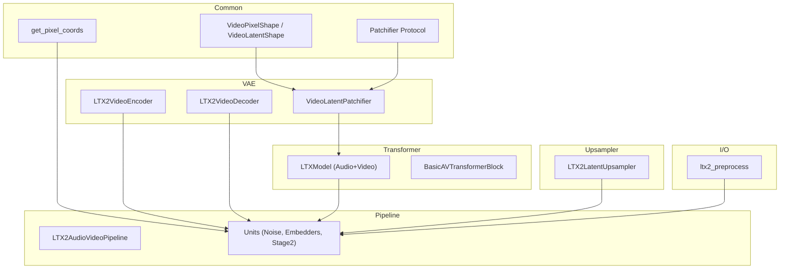

**Diagram sources**
- [ltx2_common.py:8-93](file://diffsynth/models/ltx2_common.py#L8-L93)
- [ltx2_video_vae.py:18-159](file://diffsynth/models/ltx2_video_vae.py#L18-L159)
- [ltx2_dit.py:1278-1684](file://diffsynth/models/ltx2_dit.py#L1278-L1684)
- [ltx2_audio_video.py:28-249](file://diffsynth/pipelines/ltx2_audio_video.py#L28-L249)
- [ltx2_upsampler.py:182-296](file://diffsynth/models/ltx2_upsampler.py#L182-L296)
- [media_io_ltx2.py:34-44](file://diffsynth/utils/data/media_io_ltx2.py#L34-L44)

**Section sources**
- [ltx2_common.py:8-93](file://diffsynth/models/ltx2_common.py#L8-L93)
- [ltx2_video_vae.py:18-159](file://diffsynth/models/ltx2_video_vae.py#L18-L159)
- [ltx2_dit.py:1278-1684](file://diffsynth/models/ltx2_dit.py#L1278-L1684)
- [ltx2_audio_video.py:28-249](file://diffsynth/pipelines/ltx2_audio_video.py#L28-L249)
- [ltx2_upsampler.py:182-296](file://diffsynth/models/ltx2_upsampler.py#L182-L296)
- [media_io_ltx2.py:34-44](file://diffsynth/utils/data/media_io_ltx2.py#L34-L44)

## Core Components
- VideoPixelShape and VideoLatentShape define pixel and latent tensor shapes, including FPS and conversion between spaces using spatio-temporal scale factors.
- VideoLatentPatchifier implements spatial-temporal tokenization by patchifying latents along height and width while keeping temporal stride fixed at 1.
- LTX2VideoEncoder/Decoder implement causal 3D convolutions, space-to-depth and depth-to-space downsampling/upsampling, and tiled encode/decode for memory efficiency.
- LTXModel provides a multimodal transformer with self-attention, text cross-attention, and audio-video cross-attention, plus RoPE positional embeddings and AdaLN modulation.
- LTX2AudioVideoPipeline orchestrates prompt embedding, noise initialization, conditioning (first-frame, reference frames, in-context videos), two-stage denoising, and tiled decoding.
- LTX2LatentUpsampler performs learned spatial/temporal upsampling in latent space to improve resolution and temporal smoothness.

**Section sources**
- [ltx2_common.py:8-93](file://diffsynth/models/ltx2_common.py#L8-L93)
- [ltx2_video_vae.py:18-159](file://diffsynth/models/ltx2_video_vae.py#L18-L159)
- [ltx2_dit.py:1278-1684](file://diffsynth/models/ltx2_dit.py#L1278-L1684)
- [ltx2_audio_video.py:28-249](file://diffsynth/pipelines/ltx2_audio_video.py#L28-L249)
- [ltx2_upsampler.py:182-296](file://diffsynth/models/ltx2_upsampler.py#L182-L296)

## Architecture Overview
The LTX2 system processes text prompts and optional inputs (images, retake videos/audio) through a diffusion transformer that jointly models video and audio latents. The VAE encodes/decodes video frames with causal temporal modeling and supports tiled operations. A two-stage pipeline can upsample latents before final decoding.

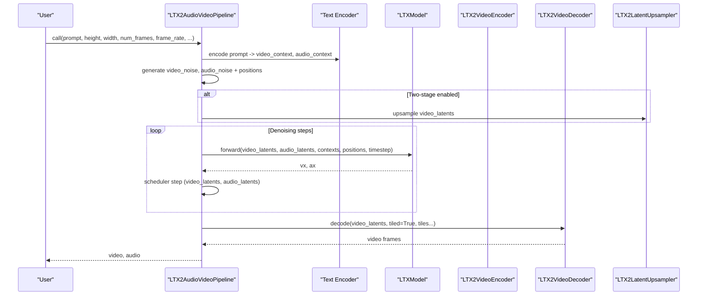

**Diagram sources**
- [ltx2_audio_video.py:149-249](file://diffsynth/pipelines/ltx2_audio_video.py#L149-L249)
- [ltx2_dit.py:1675-1684](file://diffsynth/models/ltx2_dit.py#L1675-L1684)
- [ltx2_video_vae.py:1294-1491](file://diffsynth/models/ltx2_video_vae.py#L1294-L1491)
- [ltx2_upsampler.py:182-296](file://diffsynth/models/ltx2_upsampler.py#L182-L296)

## Detailed Component Analysis

### VideoPixelShape and VideoLatentShape
- VideoPixelShape captures batch, frames, height, width, and fps for raw pixels.
- VideoLatentShape represents (B, C, F, H, W) in VAE latent space with methods to convert from/to torch shapes and from pixel shapes using SpatioTemporalScaleFactors.
- Default scale factors are time=8, height=32, width=32, reflecting VAE compression.

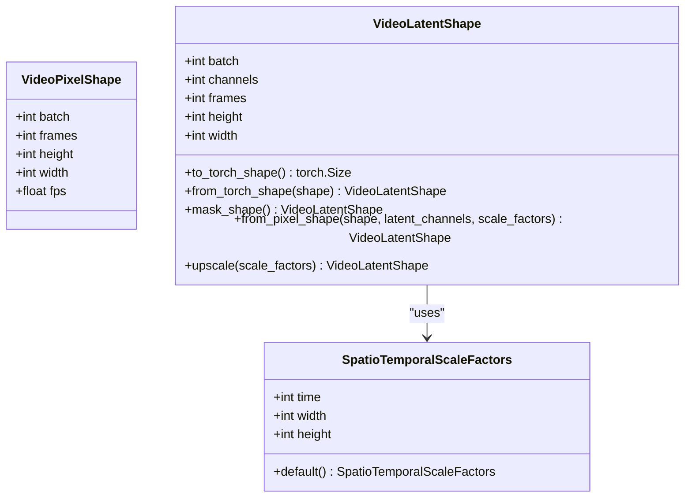

**Diagram sources**
- [ltx2_common.py:8-93](file://diffsynth/models/ltx2_common.py#L8-L93)

**Section sources**
- [ltx2_common.py:8-93](file://diffsynth/models/ltx2_common.py#L8-L93)

### Temporal Dimension Management and Frame Rate Handling
- Positions are computed in latent coordinates and mapped to pixel coordinates using get_pixel_coords with causal fix for first frame.
- In the pipeline, temporal position values are divided by frame_rate to ensure consistent timing across resolutions and lengths.
- VAE encoder enforces frame counts of form 1 + 8k; decoder respects this constraint during reconstruction.

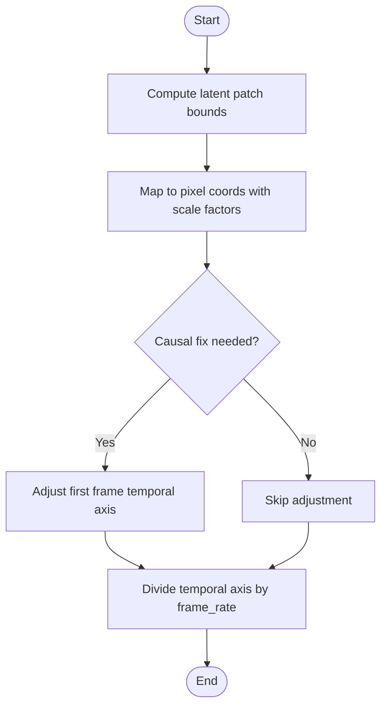

**Diagram sources**
- [ltx2_common.py:359-389](file://diffsynth/models/ltx2_common.py#L359-L389)
- [ltx2_audio_video.py:337-357](file://diffsynth/pipelines/ltx2_audio_video.py#L337-L357)
- [ltx2_video_vae.py:1430-1491](file://diffsynth/models/ltx2_video_vae.py#L1430-L1491)

**Section sources**
- [ltx2_common.py:359-389](file://diffsynth/models/ltx2_common.py#L359-L389)
- [ltx2_audio_video.py:337-357](file://diffsynth/pipelines/ltx2_audio_video.py#L337-L357)
- [ltx2_video_vae.py:1430-1491](file://diffsynth/models/ltx2_video_vae.py#L1430-L1491)

### VideoLatentPatchifier: Spatial-Temporal Tokenization
- Implements Patchifier protocol with patchify/unpatchify for video latents.
- Temporal patch size is fixed to 1 (symmetric patchifier), ensuring per-frame tokens.
- Provides get_patch_grid_bounds to compute per-patch coordinate intervals for precise masking and conditioning.

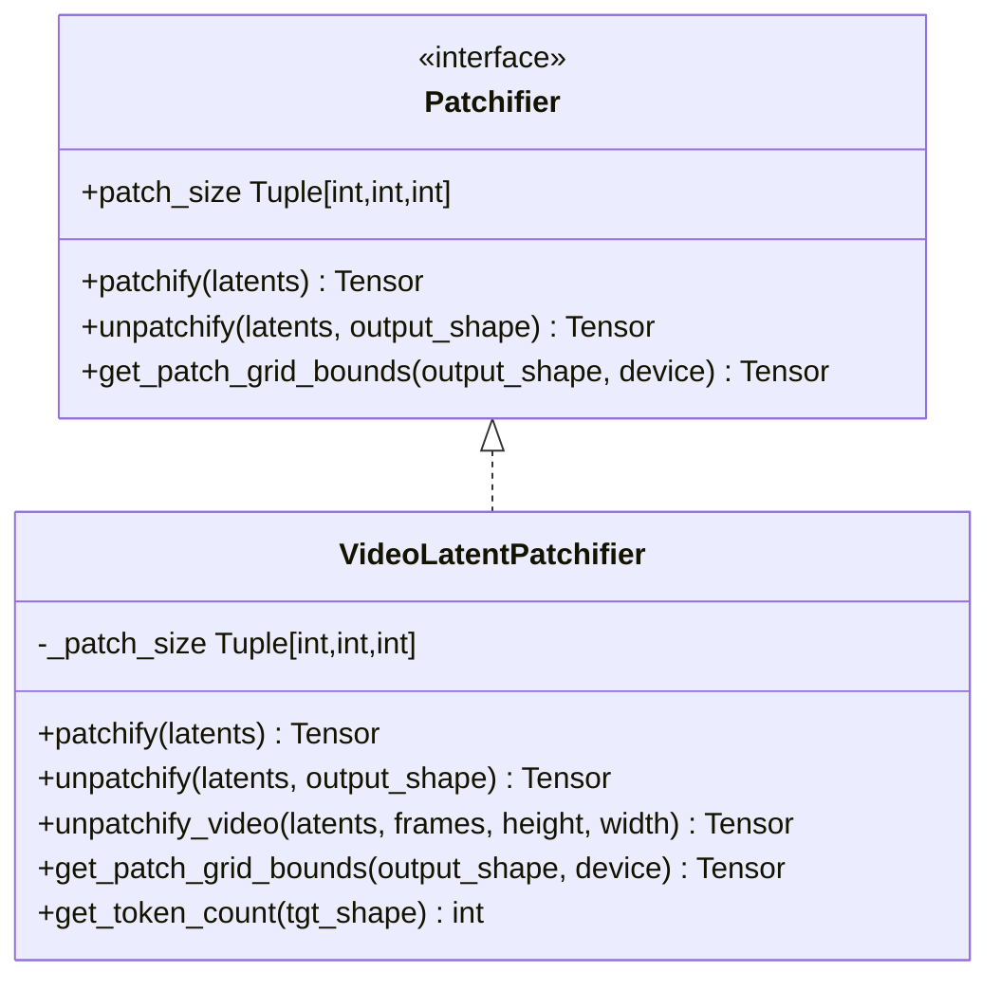

**Diagram sources**
- [ltx2_common.py:302-357](file://diffsynth/models/ltx2_common.py#L302-L357)
- [ltx2_video_vae.py:18-159](file://diffsynth/models/ltx2_video_vae.py#L18-L159)

**Section sources**
- [ltx2_common.py:302-357](file://diffsynth/models/ltx2_common.py#L302-L357)
- [ltx2_video_vae.py:18-159](file://diffsynth/models/ltx2_video_vae.py#L18-L159)

### Tile-Based Decoding for Memory Efficiency
- TilingConfig defines spatial and temporal tile sizes and overlaps.
- create_tiles splits tensors into overlapping tiles with blending masks to avoid seams.
- Decoder uses tiled decode to reconstruct frames efficiently within VRAM limits.

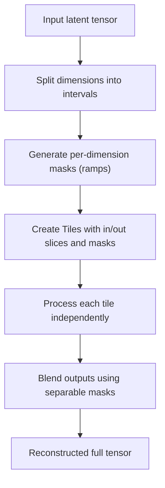

**Diagram sources**
- [ltx2_video_vae.py:980-1186](file://diffsynth/models/ltx2_video_vae.py#L980-L1186)

**Section sources**
- [ltx2_video_vae.py:980-1186](file://diffsynth/models/ltx2_video_vae.py#L980-L1186)

### Multi-Resolution Support and Latent Upsampling
- LTX2LatentUpsampler supports spatial-only, temporal-only, or joint spatiotemporal upsampling.
- Uses PixelShuffleND and rational resamplers with blur downsampling for anti-aliasing.
- Integrated in stage 2 to increase resolution before final decoding.

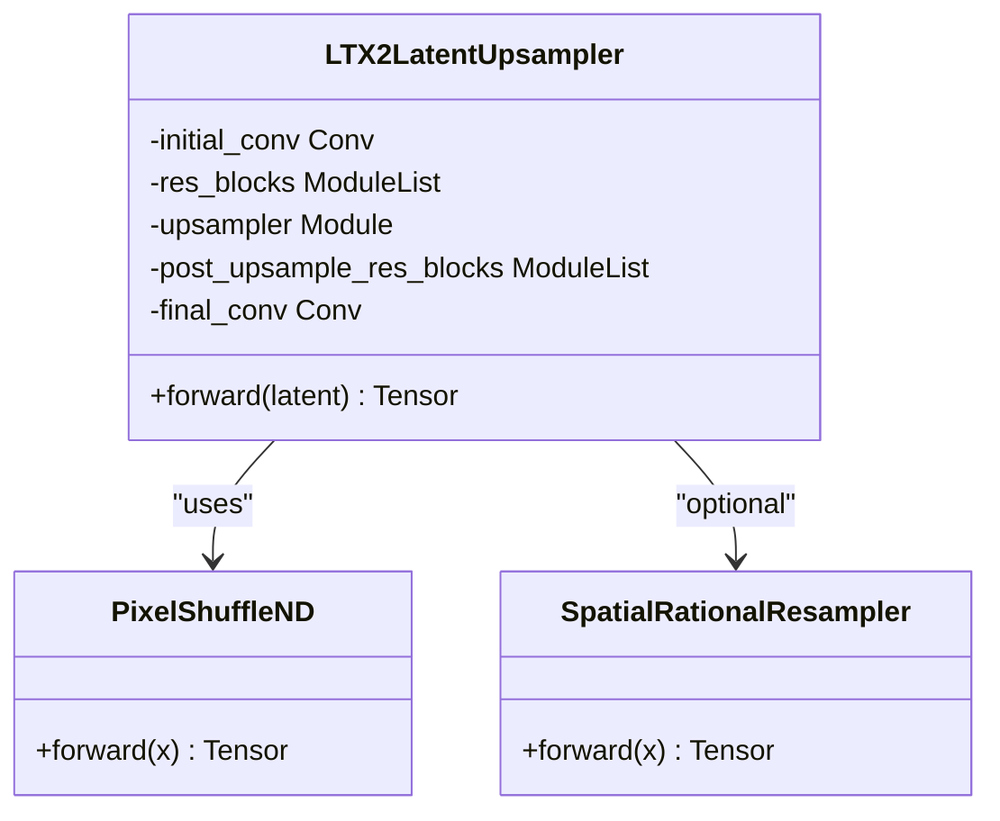

**Diagram sources**
- [ltx2_upsampler.py:182-296](file://diffsynth/models/ltx2_upsampler.py#L182-L296)

**Section sources**
- [ltx2_upsampler.py:182-296](file://diffsynth/models/ltx2_upsampler.py#L182-L296)

### Video Preprocessing Pipeline and Quality Enhancement
- ltx2_preprocess ensures consistent encoding by round-tripping through an encoder-decoder path to standardize pixel formats and reduce artifacts.
- Pipeline units handle input images, retake videos/audio, and in-context videos, generating appropriate latents and masks for conditioning.
- Two-stage pipeline optionally applies latent upsampling to enhance detail and smoothness.

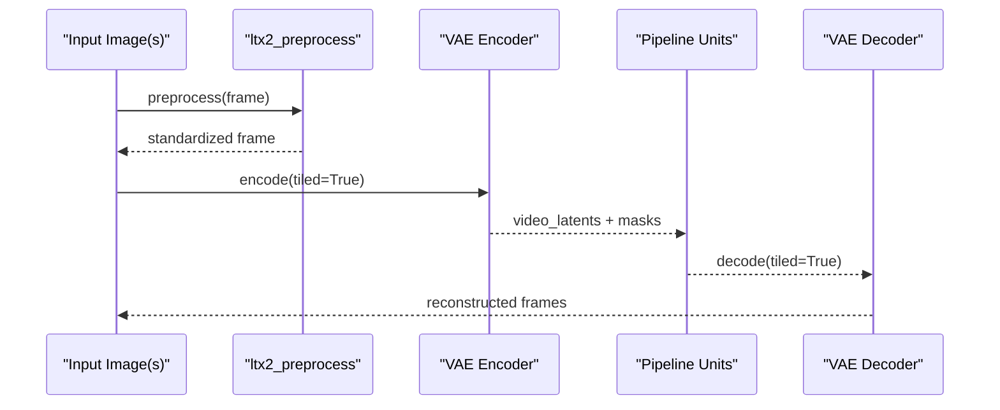

**Diagram sources**
- [media_io_ltx2.py:34-44](file://diffsynth/utils/data/media_io_ltx2.py#L34-L44)
- [ltx2_audio_video.py:473-540](file://diffsynth/pipelines/ltx2_audio_video.py#L473-L540)
- [ltx2_video_vae.py:1294-1491](file://diffsynth/models/ltx2_video_vae.py#L1294-L1491)

**Section sources**
- [media_io_ltx2.py:34-44](file://diffsynth/utils/data/media_io_ltx2.py#L34-L44)
- [ltx2_audio_video.py:473-540](file://diffsynth/pipelines/ltx2_audio_video.py#L473-L540)
- [ltx2_video_vae.py:1294-1491](file://diffsynth/models/ltx2_video_vae.py#L1294-L1491)

### Frame Interpolation and Temporal Consistency
- Causal convolutions enforce temporal consistency by only attending to past frames during encoding/decoding.
- Positional embeddings use fractional positions derived from latent grid and frame rate to maintain smooth motion.
- Optional temporal upsampling in latent space increases frame density for smoother playback.

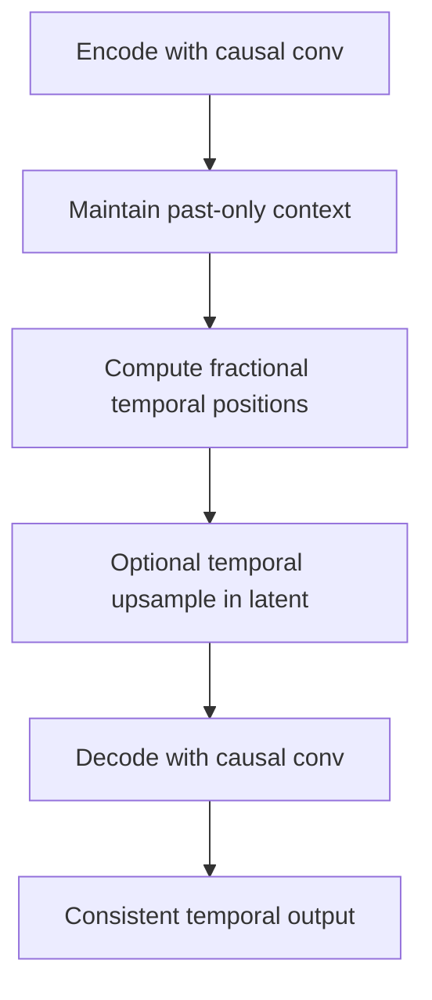

**Diagram sources**
- [ltx2_video_vae.py:357-410](file://diffsynth/models/ltx2_video_vae.py#L357-L410)
- [ltx2_common.py:359-389](file://diffsynth/models/ltx2_common.py#L359-L389)
- [ltx2_upsampler.py:252-296](file://diffsynth/models/ltx2_upsampler.py#L252-L296)

**Section sources**
- [ltx2_video_vae.py:357-410](file://diffsynth/models/ltx2_video_vae.py#L357-L410)
- [ltx2_common.py:359-389](file://diffsynth/models/ltx2_common.py#L359-L389)
- [ltx2_upsampler.py:252-296](file://diffsynth/models/ltx2_upsampler.py#L252-L296)

### Integration with Image-to-Video and Video-to-Video Workflows
- Input images are encoded and injected as reference frames or first-frame conditions with corresponding denoise masks.
- Retake videos/audio allow partial re-synthesis over specified time regions using masks.
- In-context videos provide additional conditioning sequences with downsampled spatial resolution.

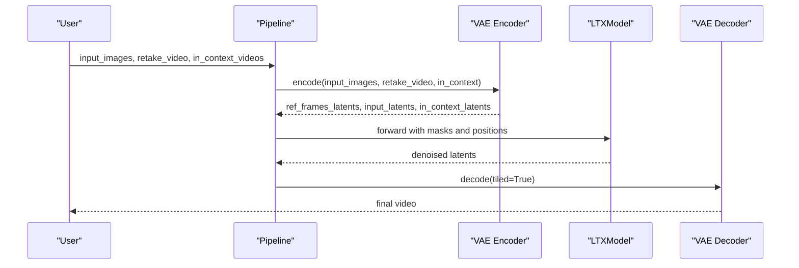

**Diagram sources**
- [ltx2_audio_video.py:473-540](file://diffsynth/pipelines/ltx2_audio_video.py#L473-L540)
- [ltx2_audio_video.py:402-428](file://diffsynth/pipelines/ltx2_audio_video.py#L402-L428)
- [ltx2_audio_video.py:543-588](file://diffsynth/pipelines/ltx2_audio_video.py#L543-L588)

**Section sources**
- [ltx2_audio_video.py:473-540](file://diffsynth/pipelines/ltx2_audio_video.py#L473-L540)
- [ltx2_audio_video.py:402-428](file://diffsynth/pipelines/ltx2_audio_video.py#L402-L428)
- [ltx2_audio_video.py:543-588](file://diffsynth/pipelines/ltx2_audio_video.py#L543-L588)

### Examples: Video Input Handling, Resolution Scaling, and Temporal Consistency
- Example script demonstrates loading models, setting height/width/num_frames, enabling tiled decoding, and writing output with correct fps and sample rate.
- Resolution scaling is enforced by division factors (height/width divisible by 32, frames by 8).
- Temporal consistency is maintained via causal convolutions and normalized temporal positions.

**Section sources**
- [LTX-2-T2AV-OneStage.py:24-66](file://examples/ltx2/model_inference/LTX-2-T2AV-OneStage.py#L24-L66)
- [ltx2_audio_video.py:28-38](file://diffsynth/pipelines/ltx2_audio_video.py#L28-L38)
- [ltx2_video_vae.py:1430-1491](file://diffsynth/models/ltx2_video_vae.py#L1430-L1491)

## Dependency Analysis
Key dependencies and relationships:
- VideoLatentShape and VideoPixelShape underpin all shape conversions and mask computations.
- VideoLatentPatchifier bridges latent grids and sequence tokens for transformer input.
- LTXModel consumes modality-specific latents, contexts, and positions, producing noise predictions for both modalities.
- Pipeline units orchestrate data flow, conditioning, and stage switching.

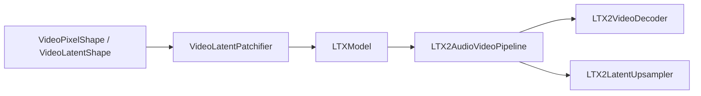

**Diagram sources**
- [ltx2_common.py:8-93](file://diffsynth/models/ltx2_common.py#L8-L93)
- [ltx2_video_vae.py:18-159](file://diffsynth/models/ltx2_video_vae.py#L18-L159)
- [ltx2_dit.py:1278-1684](file://diffsynth/models/ltx2_dit.py#L1278-L1684)
- [ltx2_audio_video.py:28-249](file://diffsynth/pipelines/ltx2_audio_video.py#L28-L249)
- [ltx2_upsampler.py:182-296](file://diffsynth/models/ltx2_upsampler.py#L182-L296)

**Section sources**
- [ltx2_common.py:8-93](file://diffsynth/models/ltx2_common.py#L8-L93)
- [ltx2_video_vae.py:18-159](file://diffsynth/models/ltx2_video_vae.py#L18-L159)
- [ltx2_dit.py:1278-1684](file://diffsynth/models/ltx2_dit.py#L1278-L1684)
- [ltx2_audio_video.py:28-249](file://diffsynth/pipelines/ltx2_audio_video.py#L28-L249)
- [ltx2_upsampler.py:182-296](file://diffsynth/models/ltx2_upsampler.py#L182-L296)

## Performance Considerations
- Enable tiled encoding/decoding to reduce peak VRAM usage; tune tile_size_in_pixels and tile_overlap_in_pixels for your GPU capacity.
- Use two-stage pipeline with latent upsampling for higher resolution outputs; balance stage2_spatial_upsample_factor against memory.
- Gradient checkpointing in DiT reduces training memory at modest speed cost.
- Prefer bfloat16 for computation to save memory and improve throughput on modern GPUs.
- Keep num_frames aligned to 1 + 8k to avoid cropping and ensure causal consistency.

[No sources needed since this section provides general guidance]

## Troubleshooting Guide
- Frame count mismatch: Ensure input frames satisfy 1 + 8k constraint; encoder will crop otherwise.
- Shape divisibility: Height/width must be divisible by 32 (or 64 in two-stage); pipeline units enforce resizing.
- Mask alignment: When applying input images or retake regions, verify denoise_mask shapes match latent dimensions.
- VRAM errors: Reduce tile sizes, lower batch size, or enable offloading; consider distilled pipeline to disable CFG and reduce memory.

**Section sources**
- [ltx2_video_vae.py:1430-1491](file://diffsynth/models/ltx2_video_vae.py#L1430-L1491)
- [ltx2_audio_video.py:275-296](file://diffsynth/pipelines/ltx2_audio_video.py#L275-L296)
- [ltx2_audio_video.py:402-428](file://diffsynth/pipelines/ltx2_audio_video.py#L402-L428)

## Conclusion
LTX2’s video processing stack combines robust shape handling, efficient tokenization, causal temporal modeling, and memory-aware tiling to deliver high-quality audio-video generation. The modular design enables flexible integration of image/video conditioning, multi-resolution scaling, and quality enhancement through latent upsampling. Proper parameter tuning and adherence to dimensional constraints ensure stable and efficient operation.

[No sources needed since this section summarizes without analyzing specific files]

## Appendices
- Practical tips for optimizing generation parameters:
  - Increase num_inference_steps for higher fidelity at the cost of time.
  - Adjust cfg_scale for stronger prompt adherence; distilled pipelines set cfg_scale=1.0.
  - Use tiled decoding with moderate overlap to balance seam reduction and memory.
  - For temporal smoothness, enable temporal upsampling in stage 2 when supported.

[No sources needed since this section provides general guidance]