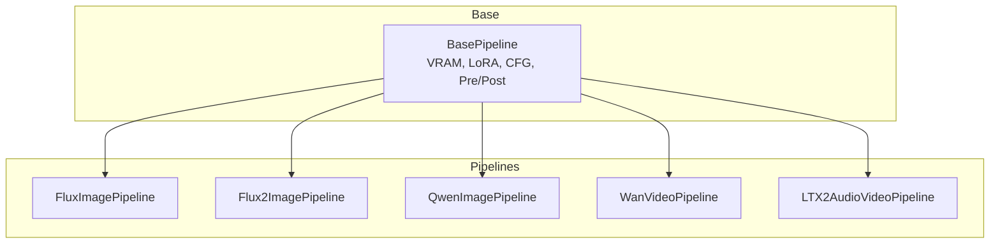
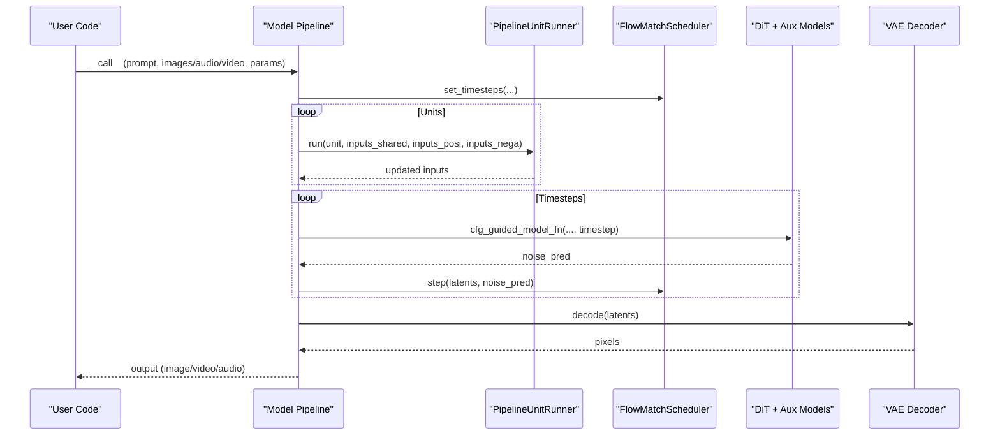
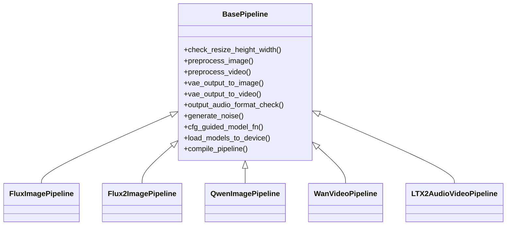

# Model-Specific Pipelines

<cite>
**Referenced Files in This Document**
- [base_pipeline.py](file://diffusion/base_pipeline.py)
- [flux_image.py](file://diffusion/pipelines/flux_image.py)
- [flux2_image.py](file://diffusion/pipelines/flux2_image.py)
- [qwen_image.py](file://diffusion/pipelines/qwen_image.py)
- [wan_video.py](file://diffusion/pipelines/wan_video.py)
- [ltx2_audio_video.py](file://diffusion/pipelines/ltx2_audio_video.py)
</cite>

## Table of Contents
1. Introduction
2. Project Structure
3. Core Components
4. Architecture Overview
5. Detailed Component Analysis
6. Dependency Analysis
7. Performance Considerations
8. Troubleshooting Guide
9. Conclusion

## Introduction
This document explains how model-specific pipelines extend a shared base pipeline to provide specialized functionality for different model families: FLUX, WanVideo, Qwen-Image, and LTX-2 (audio-video). It covers common patterns used across pipelines, unique features per model type, configuration examples, handling of model-specific parameters, processing of various input modalities (text, image, audio, video), guidance on choosing the right pipeline, and how to customize or extend pipelines for new models.

## Project Structure
The repository organizes diffusion logic under a shared base pipeline and implements model-specific pipelines as modular extensions. Each pipeline composes a sequence of PipelineUnit steps that prepare inputs, run denoising iterations, and decode outputs. The base pipeline provides utilities for device management, VRAM control, LoRA loading, CFG guidance, and common preprocessing/postprocessing.

**Diagram sources**
- [base_pipeline.py](file://diffusion/base_pipeline.py)
- [flux_image.py](file://diffusion/pipelines/flux_image.py)
- [flux2_image.py](file://diffusion/pipelines/flux2_image.py)
- [qwen_image.py](file://diffusion/pipelines/qwen_image.py)
- [wan_video.py](file://diffusion/pipelines/wan_video.py)
- [ltx2_audio_video.py](file://diffusion/pipelines/ltx2_audio_video.py)

**Section sources**
- [base_pipeline.py](file://diffusion/base_pipeline.py)
- [flux_image.py](file://diffusion/pipelines/flux_image.py)
- [flux2_image.py](file://diffusion/pipelines/flux2_image.py)
- [qwen_image.py](file://diffusion/pipelines/qwen_image.py)
- [wan_video.py](file://diffusion/pipelines/wan_video.py)
- [ltx2_audio_video.py](file://diffusion/pipelines/ltx2_audio_video.py)

## Core Components
- BasePipeline: Provides shape checks, preprocessing for images/videos, noise generation, CFG-guided inference, VRAM management, LoRA hotloading/fusing, and torch.compile integration.
- PipelineUnit: A composable step with declared input/output parameters, optional CFG separation, and optional model onload hooks.
- PipelineUnitRunner: Executes units in order, supporting three modes: shared-only, CFG-separated, and take-over.
- FlowMatchScheduler: Used by all pipelines for timestep scheduling.

Key responsibilities:
- Shape normalization and time dimension constraints
- Device/dtype management and VRAM offload/onload
- CFG guidance with positive/negative branches
- Modular unit graph for flexible composition

**Section sources**
- [base_pipeline.py](file://diffusion/base_pipeline.py)

## Architecture Overview
Each model-specific pipeline inherits from BasePipeline and defines:
- A scheduler instance
- A list of PipelineUnit instances defining the processing graph
- A model_fn that feeds latents and conditioning into the DiT
- Optional post-processing units and stage switching

Common flow:
1. Initialize scheduler timesteps
2. Populate inputs_shared, inputs_posi, inputs_nega
3. Run units to prepare embeddings, latents, and controls
4. Iterate over timesteps, calling cfg_guided_model_fn and stepping latents
5. Decode via VAE and convert to output modality

**Diagram sources**
- [base_pipeline.py](file://diffusion/base_pipeline.py)
- [flux_image.py](file://diffusion/pipelines/flux_image.py)
- [flux2_image.py](file://diffusion/pipelines/flux2_image.py)
- [qwen_image.py](file://diffusion/pipelines/qwen_image.py)
- [wan_video.py](file://diffusion/pipelines/wan_video.py)
- [ltx2_audio_video.py](file://diffusion/pipelines/ltx2_audio_video.py)

## Detailed Component Analysis

### FLUX Image Pipeline
Specialization highlights:
- Dual text encoders (CLIP and T5) with separate tokenizers
- ControlNet support via MultiControlNet wrapper
- IP-Adapter integration for image prompts
- Entity control (EliGen), InfiniteYou identity embedding, Flex inpainting/control, Value Controller, Step1x connector, NexusGen adapters
- TeaCache acceleration option
- Tile-aware VAE decoding

Typical configuration:
- Use from_pretrained with model_configs for DiT, text encoders, VAE, ControlNet, IP-Adapter, etc.
- Provide prompt, negative_prompt, cfg_scale, embedded_guidance, t5_sequence_length
- Input image for img2img; denoising_strength controls strength
- ControlNet inputs with scales and start/end ranges
- IP-Adapter images and scale
- EliGen entity prompts/masks and optional negative-side usage
- Flex inpaint/control images and strengths
- Value controller scalar inputs
- Step1x reference image for editing
- NexusGen reference image for generation/editing
- LoRA encoder inputs and scale
- TeaCache threshold for acceleration
- Tiling options for large images

Input modalities:
- Text: prompt/negative_prompt
- Image: input_image, kontext_images, ipadapter_images, eligen_entity_masks, infinityou_id_image, flex_inpaint_image/mask, flex_control_image, step1x_reference_image, nexus_gen_reference_image

Choosing this pipeline:
- Best for high-quality text-to-image and image editing with strong control via ControlNet/IP-Adapter/Entity control and value controllers.

Customization tips:
- Add new units to self.units to inject new conditioning or preprocessing
- Extend model_fn_flux_image to consume new kwargs
- Use onload_model_names in units to manage VRAM efficiently

**Section sources**
- [flux_image.py](file://diffusion/pipelines/flux_image.py)
- [base_pipeline.py](file://diffusion/base_pipeline.py)

### FLUX2 Image Pipeline
Specialization highlights:
- Updated text encoder and tokenizer setup
- Support for Qwen3-style prompt embedder
- Simplified unit chain compared to FLUX.1 while retaining core capabilities

Typical configuration:
- from_pretrained with model_configs for text encoder, DiT, VAE, tokenizer
- Prompt-based generation with cfg_scale and embedded_guidance
- Optional edit_image for editing workflows
- Standard shape and randomness parameters

Input modalities:
- Text: prompt/negative_prompt
- Image: input_image, edit_image

Choosing this pipeline:
- When using FLUX.2 family models for fast, high-quality image generation/editing with modern text encoders.

Customization tips:
- Extend units for additional conditioning (e.g., ControlNet variants)
- Adjust dynamic_shift_len in scheduler if needed

**Section sources**
- [flux2_image.py](file://diffusion/pipelines/flux2_image.py)
- [base_pipeline.py](file://diffusion/base_pipeline.py)

### Qwen-Image Pipeline
Specialization highlights:
- Blockwise ControlNet support for fine-grained spatial control
- Entity control (EliGen) with masks and optional negative-side usage
- Edit workflows with auto-resize and multi-image editing
- Layered input images and context images
- Specialized SR-oriented model_fn path for condition_latents and type embeddings

Typical configuration:
- from_pretrained with model_configs for text encoder, DiT, VAE, blockwise ControlNets, SigLIP2/DINOv3 encoders, and image2LoRA modules
- Prompt/negative_prompt, cfg_scale
- input_image for generation; inpaint_mask for inpainting
- blockwise_controlnet_inputs for layered control
- edit_image(s) for editing; layer_input_image and context_image for advanced workflows
- Tiling options for large images

Input modalities:
- Text: prompt/negative_prompt
- Image: input_image, inpaint_mask, edit_image(s), layer_input_image, context_image, blockwise control conditions

Choosing this pipeline:
- For precise editing, inpainting, and controlled generation with blockwise ControlNet and entity-level control.

Customization tips:
- Add new conditioning units (e.g., new ControlNet types)
- Extend model_fn_qwen_image_sr_core for custom super-resolution paths

**Section sources**
- [qwen_image.py](file://diffusion/pipelines/qwen_image.py)
- [base_pipeline.py](file://diffusion/base_pipeline.py)

### WanVideo Pipeline
Specialization highlights:
- Video-focused with time dimension division factors and frame-aware shapes
- Rich conditioning: text, images, videos, motion control, camera control, VACE, Animate adapters, VAP, LongCat-Video
- Two-stage DiT switching based on timestep boundary
- Unified Sequence Parallel (USP) support for scalability
- Post-denoising units and framewise decoding

Typical configuration:
- from_pretrained with model_configs for text encoder, DiT(s), VAE, image encoder, motion controller, VACE, animate adapter, audio encoder
- Prompt/negative_prompt, cfg_scale
- input_image/end_image for I2V/T2V/I2I2V
- input_video for v2v with denoising_strength
- Audio inputs for speech-to-video (input_audio, audio_embeds, sample rate)
- Motion control, camera control parameters
- VACE video/mask/reference and scale
- Animate pose/face/inpaint/mask videos
- VAP video and prompts
- Tiling and sliding window options
- Teacache thresholds
- WanToDance music/path/keyframes

Input modalities:
- Text: prompt/negative_prompt
- Image: input_image, end_image, reference_image
- Video: input_video, control_video, vace_video, animate_pose/face/inpaint/mask videos, vap_video, longcat_video
- Audio: input_audio, audio_embeds

Choosing this pipeline:
- For comprehensive video generation/editing with multiple control signals and scalable inference.

Customization tips:
- Insert new units for additional conditioning or post-processing
- Toggle USP via enable_usp() for distributed inference
- Switch DiT models at timestep boundaries as implemented

**Section sources**
- [wan_video.py](file://diffusion/pipelines/wan_video.py)
- [base_pipeline.py](file://diffusion/base_pipeline.py)

### LTX-2 Audio-Video Pipeline
Specialization highlights:
- Joint audio-video generation with separate patchifiers and schedulers
- Two-stage pipeline with latent upsampler and optional distilled mode
- Retake conditioning for both video and audio with region masking
- In-context video conditioning and reference frames
- Default negative prompts tailored for audio-video quality

Typical configuration:
- from_pretrained with model_configs for text encoder, post-modules, DiT, video/audio VAEs, vocoder, upsampler
- Tokenizer and processor configuration for Gemma-based text
- Stage 2 LoRA config and strength for two-stage refinement
- Prompt/negative_prompt, cfg_scale
- input_images with indexes and strength for first-frame and reference frames
- retake_video/retake_audio with region masks
- in_context_videos with downsample factor
- Frame rate, resolution, and tiling parameters
- use_two_stage_pipeline and use_distilled_pipeline flags

Input modalities:
- Text: prompt/negative_prompt
- Image: input_images (reference/first-frame)
- Video: retake_video, in_context_videos
- Audio: retake_audio (waveform, sample rate)

Choosing this pipeline:
- For synchronized audio-video generation with strong conditioning and optional two-stage refinement.

Customization tips:
- Add stage-specific units in stage2_units
- Modify model_fn_ltx2 to handle new conditioning or modalities
- Use clear_lora_before_state_two to reset LoRA between stages

**Section sources**
- [ltx2_audio_video.py](file://diffusion/pipelines/ltx2_audio_video.py)
- [base_pipeline.py](file://diffusion/base_pipeline.py)

## Dependency Analysis
All pipelines depend on BasePipeline for shared functionality and on their respective model components (text encoders, DiTs, VAEs, auxiliary modules). Units encapsulate dependencies via onload_model_names to minimize VRAM usage during execution.

**Diagram sources**
- [base_pipeline.py](file://diffusion/base_pipeline.py)
- [flux_image.py](file://diffusion/pipelines/flux_image.py)
- [flux2_image.py](file://diffusion/pipelines/flux2_image.py)
- [qwen_image.py](file://diffusion/pipelines/qwen_image.py)
- [wan_video.py](file://diffusion/pipelines/wan_video.py)
- [ltx2_audio_video.py](file://diffusion/pipelines/ltx2_audio_video.py)

**Section sources**
- [base_pipeline.py](file://diffusion/base_pipeline.py)
- [flux_image.py](file://diffusion/pipelines/flux_image.py)
- [flux2_image.py](file://diffusion/pipelines/flux2_image.py)
- [qwen_image.py](file://diffusion/pipelines/qwen_image.py)
- [wan_video.py](file://diffusion/pipelines/wan_video.py)
- [ltx2_audio_video.py](file://diffusion/pipelines/ltx2_audio_video.py)

## Performance Considerations
- VRAM Management: Use load_models_to_device to selectively offload/onload modules per unit or iteration. Enable vram_management_enabled when supported by child modules.
- Compilation: compile_pipeline supports regional compilation for repeated blocks and full-model compilation.
- Teacache: Some pipelines expose tea_cache_l1_thresh to skip redundant computations.
- Tiling: Large inputs can be processed with tiled encoding/decoding to reduce memory pressure.
- Sequence Parallel: WanVideo supports unified sequence parallelism for scaling.
- CFG Separation: Separate positive/negative branches only when cfg_scale != 1.0 to avoid unnecessary computation.

[No sources needed since this section provides general guidance]

## Troubleshooting Guide
Common issues and resolutions:
- Shape mismatches: Ensure height/width are divisible by configured division factors; use check_resize_height_width automatically applied by units.
- Missing models: Verify model_configs include required components; from_pretrained fetches them via ModelPool.
- VRAM errors: Reduce batch size, enable tiling, or use load_models_to_device to limit active modules.
- CFG behavior: If cfg_scale=1.0, negative branch is skipped; ensure inputs_nega are still populated if downstream units expect them.
- LoRA hotloading: Requires VRAM management enabled on target modules; otherwise, fusing is used.
- Two-stage pipelines: Ensure stage2_lora_config and upsampler are provided when use_two_stage_pipeline=True.

**Section sources**
- [base_pipeline.py](file://diffusion/base_pipeline.py)
- [ltx2_audio_video.py](file://diffusion/pipelines/ltx2_audio_video.py)

## Conclusion
Model-specific pipelines share a robust base that standardizes preprocessing, scheduling, CFG guidance, and VRAM management while allowing rich customization through PipelineUnits. Choose FLUX/FLUX2 for high-quality image tasks, Qwen-Image for precise editing and control, WanVideo for comprehensive video generation with diverse controls, and LTX-2 for synchronized audio-video synthesis. Extending pipelines involves adding units, updating model_fn, and leveraging onload_model_names for efficient resource usage.

[No sources needed since this section summarizes without analyzing specific files]