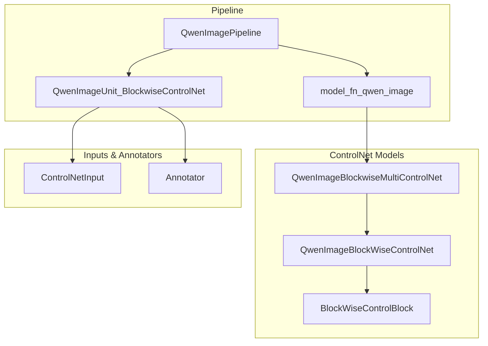
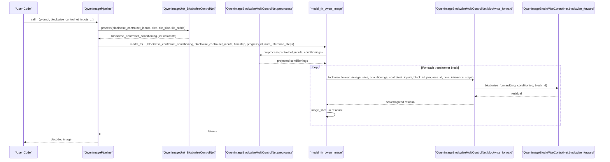
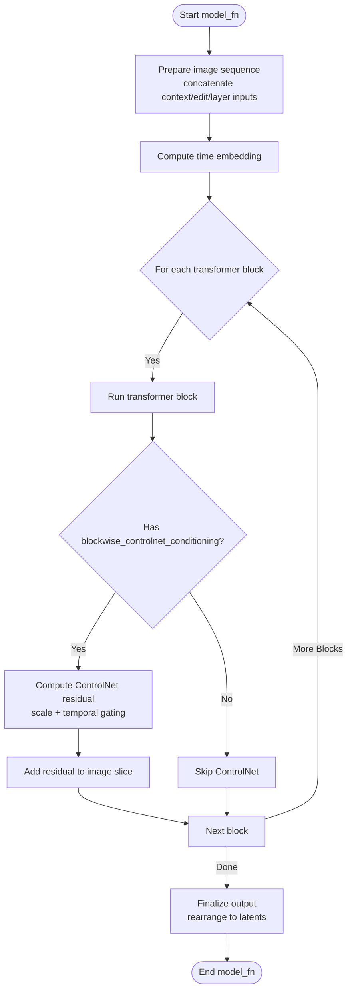
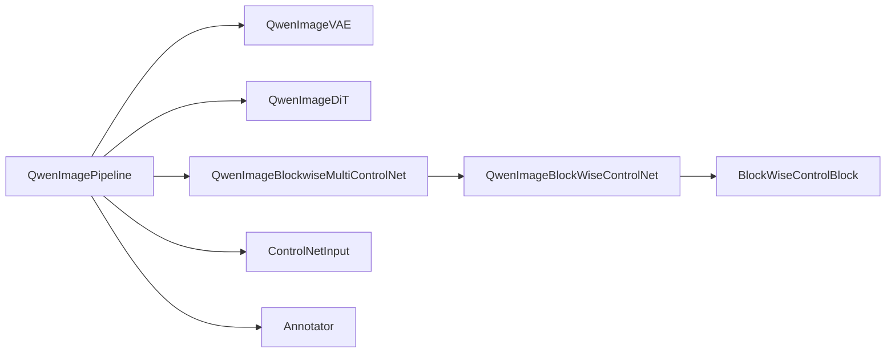

# Blockwise ControlNet Integration

<cite>
**Referenced Files in This Document**
- [qwen_image.py](file://diffsynth/pipelines/qwen_image.py)
- [qwen_image_controlnet.py](file://diffsynth/models/qwen_image_controlnet.py)
- [controlnet_input.py](file://diffsynth/utils/controlnet/controlnet_input.py)
- [annotator.py](file://diffsynth/utils/controlnet/annotator.py)
- [Qwen-Image-Blockwise-ControlNet-Canny.py](file://examples/qwen_image/model_inference/Qwen-Image-Blockwise-ControlNet-Canny.py)
- [Qwen-Image-Blockwise-ControlNet-Depth.py](file://examples/qwen_image/model_inference/Qwen-Image-Blockwise-ControlNet-Depth.py)
- [Qwen-Image-Blockwise-ControlNet-Inpaint.py](file://examples/qwen_image/model_inference/Qwen-Image-Blockwise-ControlNet-Inpaint.py)
</cite>

## Table of Contents
1. Introduction
2. Project Structure
3. Core Components
4. Architecture Overview
5. Detailed Component Analysis
6. Dependency Analysis
7. Performance Considerations
8. Troubleshooting Guide
9. Conclusion
10. Appendices

## Introduction
This document explains the Blockwise ControlNet integration for Qwen-Image, focusing on how fine-grained control over different regions and layers is achieved through a blockwise conditioning mechanism. It covers the QwenImageBlockWiseMultiControlNet architecture, the ControlNetInput data structure, preprocessing of control conditions (including inpainting masks), the blockwise forward pass during diffusion, and integration with the main diffusion model. Practical examples include edge detection (Canny), depth maps, semantic segmentation, and custom control conditions. It also details scale parameters, temporal control during inference, and performance optimization techniques such as tiled encoding/decoding and gradient checkpointing.

## Project Structure
The Blockwise ControlNet feature spans three primary areas:
- Pipeline orchestration and units: qwen_image.py
- ControlNet models: qwen_image_controlnet.py
- Control inputs and annotators: controlnet_input.py, annotator.py
- Example scripts demonstrating usage: examples/qwen_image/model_inference/*

**Diagram sources**
- [qwen_image.py:25-59](file://diffsynth/pipelines/qwen_image.py#L25-L59)
- [qwen_image.py:200-226](file://diffsynth/pipelines/qwen_image.py#L200-L226)
- [qwen_image.py:523-563](file://diffsynth/pipelines/qwen_image.py#L523-L563)
- [qwen_image_controlnet.py:6-56](file://diffsynth/models/qwen_image_controlnet.py#L6-L56)
- [controlnet_input.py:5-15](file://diffsynth/utils/controlnet/controlnet_input.py#L5-L15)
- [annotator.py:9-63](file://diffsynth/utils/controlnet/annotator.py#L9-L63)

**Section sources**
- [qwen_image.py:25-59](file://diffsynth/pipelines/qwen_image.py#L25-L59)
- [qwen_image_controlnet.py:6-56](file://diffsynth/models/qwen_image_controlnet.py#L6-L56)
- [controlnet_input.py:5-15](file://diffsynth/utils/controlnet/controlnet_input.py#L5-L15)
- [annotator.py:9-63](file://diffsynth/utils/controlnet/annotator.py#L9-L63)

## Core Components
- ControlNetInput: A lightweight dataclass that carries per-control condition metadata and images, including optional inpainting mask and processor identifiers.
- QwenImageBlockWiseControlNet: A per-control-condition module that projects control latents into the DiT latent space and provides a per-block residual via blockwise_forward.
- QwenImageBlockwiseMultiControlNet: A container managing multiple ControlNet instances, preprocessing control latents, and aggregating residuals across active controls at each transformer block.
- QwenImageUnit_BlockwiseControlNet: A pipeline unit that encodes control images to latents, applies inpainting masking, and returns conditioning tensors for the model function.
- model_fn_qwen_image: The core diffusion step function where blockwise ControlNet residuals are injected into the image sequence after each transformer block.

Key responsibilities:
- Preprocessing: Convert PIL images to normalized tensors, encode via VAE, optionally concatenate an inverted mask channel for inpainting.
- Conditioning projection: Map control latents to DiT dimensionality once per control input.
- Blockwise injection: At each transformer block, compute a residual from the corresponding ControlNet block and add it to the image sequence slice.
- Temporal gating: Use start/end parameters to activate controls only within specific ranges of the denoising schedule.

**Section sources**
- [controlnet_input.py:5-15](file://diffsynth/utils/controlnet/controlnet_input.py#L5-L15)
- [qwen_image_controlnet.py:6-56](file://diffsynth/models/qwen_image_controlnet.py#L6-L56)
- [qwen_image.py:200-226](file://diffsynth/pipelines/qwen_image.py#L200-L226)
- [qwen_image.py:523-563](file://diffsynth/pipelines/qwen_image.py#L523-L563)
- [qwen_image.py:991-1150](file://diffsynth/pipelines/qwen_image.py#L991-L1150)

## Architecture Overview
The Blockwise ControlNet integrates directly into the Qwen-Image DiT loop by injecting per-block residuals derived from control conditions. The flow is:
1. Prepare ControlNetInput objects with images and optional masks.
2. Encode control images to latents; optionally append an inverted mask channel for inpainting.
3. Project control latents into DiT dimensionality once per control.
4. During each transformer block, compute a residual using the corresponding ControlNet block and add it to the image sequence slice.
5. Scale residuals by control.scale and gate activation by control.start/end relative to the denoising progress.

**Diagram sources**
- [qwen_image.py:523-563](file://diffsynth/pipelines/qwen_image.py#L523-L563)
- [qwen_image.py:200-226](file://diffsynth/pipelines/qwen_image.py#L200-L226)
- [qwen_image.py:991-1150](file://diffsynth/pipelines/qwen_image.py#L991-L1150)
- [qwen_image_controlnet.py:29-56](file://diffsynth/models/qwen_image_controlnet.py#L29-L56)

## Detailed Component Analysis

### ControlNetInput Data Structure
- Fields:
  - controlnet_id: Index selecting which ControlNet instance to use.
  - scale: Multiplicative factor applied to the residual output.
  - start/end: Denoising progress thresholds controlling when the control is active.
  - image: Primary control image (e.g., edges, depth).
  - inpaint_image/inpaint_mask: Optional inpainting guidance; mask is used to zero out regions before encoding and to append an inverted mask channel to latents.
  - processor_id: Identifier for pre-processing via Annotator (e.g., canny, depth, softedge).

Usage patterns:
- Edge detection: Set processor_id="canny" and provide a source image.
- Depth maps: Set processor_id="depth" and provide a source image.
- Semantic segmentation: Provide a segmentation map as image or implement a custom processor_id.
- Inpainting: Provide inpaint_mask to mask out regions in both image and latent channels.

**Section sources**
- [controlnet_input.py:5-15](file://diffsynth/utils/controlnet/controlnet_input.py#L5-L15)
- [annotator.py:9-63](file://diffsynth/utils/controlnet/annotator.py#L9-L63)

### QwenImageBlockWiseControlNet and BlockWiseControlBlock
- QwenImageBlockWiseControlNet:
  - Projects control latents into DiT dimensionality via img_in.
  - Maintains one BlockWiseControlBlock per DiT layer (num_layers typically matches DiT blocks).
  - Exposes blockwise_forward to return a residual for a given block_id.
- BlockWiseControlBlock:
  - Applies RMSNorm to both inputs (image and conditioning), projects their sum, activates with GELU, and outputs via a linear layer initialized to zero for stable training.

Complexity:
- Projection cost is O(C_in * D) per control latent, where C_in is control latent channels and D is DiT dimension.
- Per-block residual computation is O(D^2) due to linear projections inside the block.

Initialization:
- Zero-initialization ensures early-stage stability and minimal disruption to pretrained DiT weights.

**Section sources**
- [qwen_image_controlnet.py:6-56](file://diffsynth/models/qwen_image_controlnet.py#L6-L56)

### QwenImageBlockwiseMultiControlNet
- Manages a list of QwenImageBlockWiseControlNet instances.
- preprocess:
  - Rearranges control latents from patchified form to sequence form.
  - Projects each control latent via its corresponding ControlNet instance.
- blockwise_forward:
  - Computes denoising progress from progress_id and num_inference_steps.
  - Activates a control only if progress falls within [start, end].
  - Scales residuals by control.scale and sums contributions across all active controls.

Temporal control:
- start/end define the fraction of the denoising schedule where the control is effective.
- Useful for coarse-to-fine control strategies or limiting influence to early/later steps.

**Section sources**
- [qwen_image.py:200-226](file://diffsynth/pipelines/qwen_image.py#L200-L226)

### QwenImageUnit_BlockwiseControlNet (Preprocessing and Masking)
- Encodes control images to latents using the VAE with optional tiling.
- Applies inpainting mask:
  - On image: zeros out masked pixels before encoding.
  - On latents: appends an inverted mask channel to guide inpainting.
- Returns a list of conditionings aligned with ControlNetInput entries.

Inpainting mask handling:
- Masks are resized to match image size, normalized, and averaged across channels.
- Latent mask channel is computed as 1 - interpolated(mask) to emphasize unmasked regions.

**Section sources**
- [qwen_image.py:523-563](file://diffsynth/pipelines/qwen_image.py#L523-L563)

### Integration with model_fn_qwen_image
- After each transformer block, the current image sequence slice is cloned and augmented with the ControlNet residual.
- ControlNet conditioning is preprocessed once per call to avoid redundant projections.
- Residuals are added only to the noise/image portion of the sequence (excluding appended context/edit/layer inputs).

**Diagram sources**
- [qwen_image.py:991-1150](file://diffsynth/pipelines/qwen_image.py#L991-L1150)

**Section sources**
- [qwen_image.py:991-1150](file://diffsynth/pipelines/qwen_image.py#L991-L1150)

### Examples of Control Scenarios
- Edge detection (Canny):
  - Use processor_id="canny" to generate edge maps from a source image.
  - Provide ControlNetInput(image=edge_map) to constrain structure.
- Depth maps:
  - Use processor_id="depth" to estimate depth from a source image.
  - Provide ControlNetInput(image=depth_map) to enforce geometry.
- Semantic segmentation:
  - Provide a segmentation map as ControlNetInput(image=seg_map).
  - Optionally implement a custom processor_id to produce segmentation-like conditions.
- Custom control conditions:
  - Implement any image-based condition (e.g., normal maps, texture maps) and supply via ControlNetInput(image=custom_map).
  - Ensure the ControlNet model was trained for the chosen condition type.

Reference scripts demonstrate these scenarios:
- Canny: [Qwen-Image-Blockwise-ControlNet-Canny.py](file://examples/qwen_image/model_inference/Qwen-Image-Blockwise-ControlNet-Canny.py)
- Depth: [Qwen-Image-Blockwise-ControlNet-Depth.py](file://examples/qwen_image/model_inference/Qwen-Image-Blockwise-ControlNet-Depth.py)
- Inpainting: [Qwen-Image-Blockwise-ControlNet-Inpaint.py](file://examples/qwen_image/model_inference/Qwen-Image-Blockwise-ControlNet-Inpaint.py)

**Section sources**
- [Qwen-Image-Blockwise-ControlNet-Canny.py:1-32](file://examples/qwen_image/model_inference/Qwen-Image-Blockwise-ControlNet-Canny.py#L1-L32)
- [Qwen-Image-Blockwise-ControlNet-Depth.py:1-33](file://examples/qwen_image/model_inference/Qwen-Image-Blockwise-ControlNet-Depth.py#L1-L33)
- [Qwen-Image-Blockwise-ControlNet-Inpaint.py:1-34](file://examples/qwen_image/model_inference/Qwen-Image-Blockwise-ControlNet-Inpaint.py#L1-L34)

## Dependency Analysis
The Blockwise ControlNet depends on:
- QwenImagePipeline for orchestration and scheduler management.
- QwenImageVAE for encoding/decoding images to/from latents.
- QwenImageDiT for the transformer blocks where residuals are injected.
- QwenImageBlockwiseMultiControlNet and QwenImageBlockWiseControlNet for control processing.
- ControlNetInput and Annotator for preparing control conditions.

**Diagram sources**
- [qwen_image.py:25-59](file://diffsynth/pipelines/qwen_image.py#L25-L59)
- [qwen_image_controlnet.py:6-56](file://diffsynth/models/qwen_image_controlnet.py#L6-L56)
- [controlnet_input.py:5-15](file://diffsynth/utils/controlnet/controlnet_input.py#L5-L15)
- [annotator.py:9-63](file://diffsynth/utils/controlnet/annotator.py#L9-L63)

**Section sources**
- [qwen_image.py:25-59](file://diffsynth/pipelines/qwen_image.py#L25-L59)
- [qwen_image_controlnet.py:6-56](file://diffsynth/models/qwen_image_controlnet.py#L6-L56)
- [controlnet_input.py:5-15](file://diffsynth/utils/controlnet/controlnet_input.py#L5-L15)
- [annotator.py:9-63](file://diffsynth/utils/controlnet/annotator.py#L9-L63)

## Performance Considerations
- Tiled encoding/decoding:
  - Enable tiled=True with tile_size and tile_stride to reduce memory usage during VAE encode/decode and DiT processing.
- Gradient checkpointing:
  - Use gradient_checkpoint_forward in transformer blocks to trade compute for lower memory.
- VRAM management:
  - The pipeline loads/unloads models per iteration; ensure vram_management_enabled flags are respected by ControlNet modules.
- Control scaling and gating:
  - Tune control.scale to balance control strength vs. prompt fidelity.
  - Adjust control.start/end to limit control influence to specific phases of denoising.
- Sequence length and resolution:
  - Higher resolutions increase sequence length quadratically; consider reducing tile_size or stride for large images.

[No sources needed since this section provides general guidance]

## Troubleshooting Guide
Common issues and remedies:
- Control has no effect:
  - Verify control.scale > 0 and that control.start < control.end.
  - Ensure blockwise_controlnet_conditioning is provided to model_fn_qwen_image.
- Inpainting artifacts:
  - Confirm inpaint_mask is correctly sized and normalized; check that the inverted mask channel is appended to latents.
  - Increase num_inference_steps for smoother blending.
- Memory errors:
  - Enable tiled mode for VAE and DiT; reduce tile_size or increase tile_stride overlap carefully.
  - Disable unnecessary features (context/edit/layer inputs) during debugging.
- Processor not found:
  - Ensure required controlnet_aux detectors are installed and model_path is correct for depth/normal processors.

**Section sources**
- [qwen_image.py:523-563](file://diffsynth/pipelines/qwen_image.py#L523-L563)
- [qwen_image.py:991-1150](file://diffsynth/pipelines/qwen_image.py#L991-L1150)
- [annotator.py:9-63](file://diffsynth/utils/controlnet/annotator.py#L9-L63)

## Conclusion
The Blockwise ControlNet integration in Qwen-Image enables precise, per-block conditioning through lightweight residuals injected into the DiT transformer. By leveraging ControlNetInput for flexible control specification, robust preprocessing with inpainting support, and efficient blockwise forward passes, users can achieve fine-grained control over image generation tasks such as edge-guided synthesis, depth-consistent rendering, and inpainting. Proper tuning of scale and temporal gating parameters, combined with tiled inference and gradient checkpointing, ensures both quality and performance.

[No sources needed since this section summarizes without analyzing specific files]

## Appendices

### API Usage Examples
- Edge detection (Canny):
  - See [Qwen-Image-Blockwise-ControlNet-Canny.py](file://examples/qwen_image/model_inference/Qwen-Image-Blockwise-ControlNet-Canny.py)
- Depth maps:
  - See [Qwen-Image-Blockwise-ControlNet-Depth.py](file://examples/qwen_image/model_inference/Qwen-Image-Blockwise-ControlNet-Depth.py)
- Inpainting:
  - See [Qwen-Image-Blockwise-ControlNet-Inpaint.py](file://examples/qwen_image/model_inference/Qwen-Image-Blockwise-ControlNet-Inpaint.py)

### Key Parameters Summary
- ControlNetInput fields:
  - controlnet_id: selects ControlNet instance
  - scale: residual multiplier
  - start/end: denoising progress activation window
  - image: control image
  - inpaint_image/inpaint_mask: optional inpainting guidance
  - processor_id: annotator selection (canny, depth, etc.)
- Pipeline parameters:
  - tiled: enable tiled VAE/DiT processing
  - tile_size/tile_stride: control tile dimensions and overlap
  - num_inference_steps: number of denoising steps
  - cfg_scale: classifier-free guidance strength

[No sources needed since this section aggregates previously analyzed content]