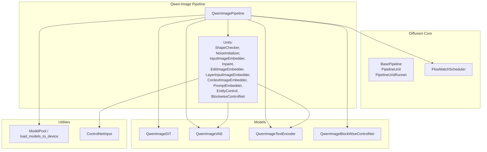
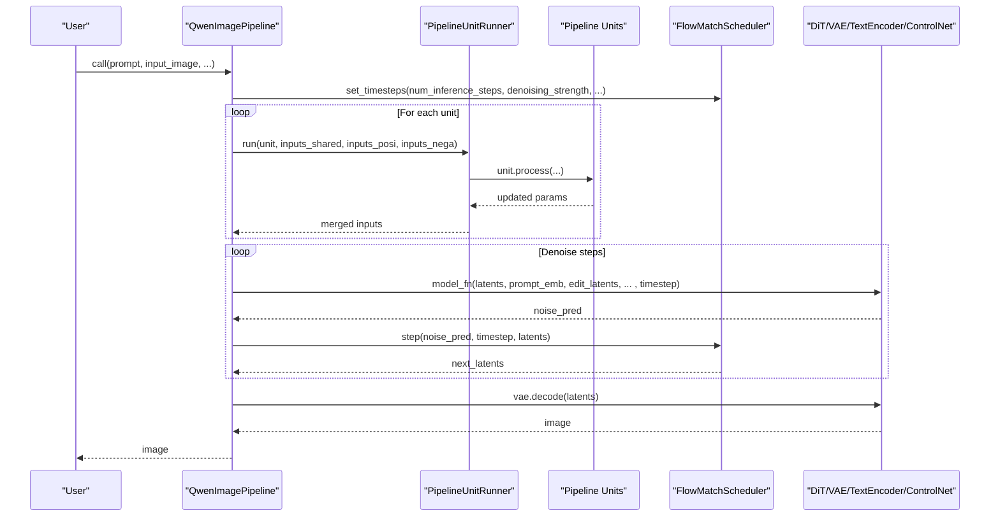
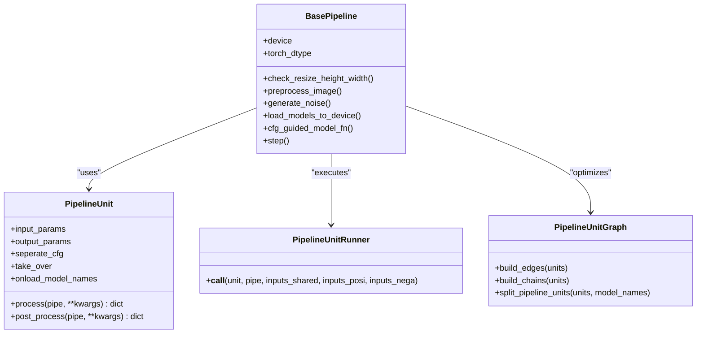
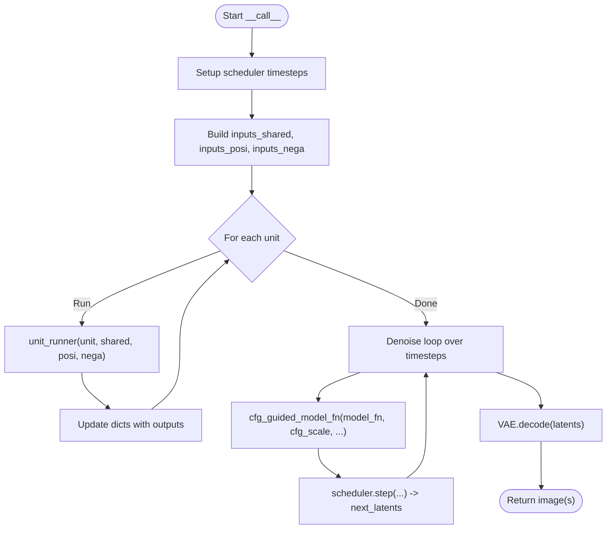
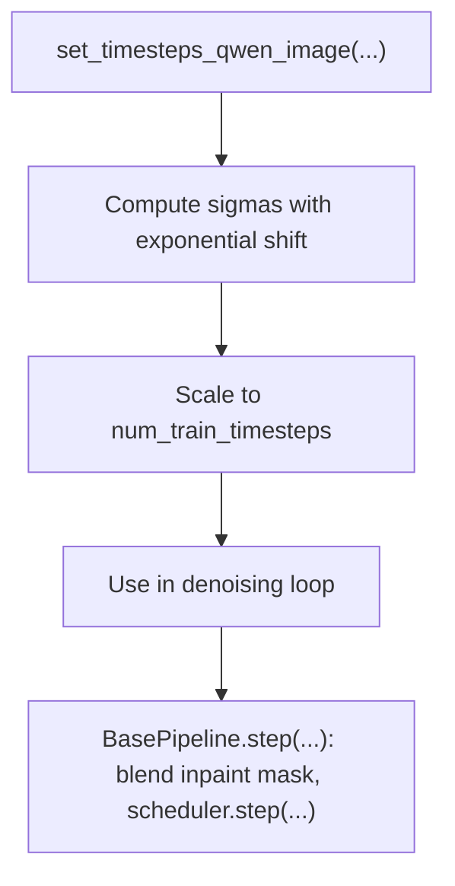
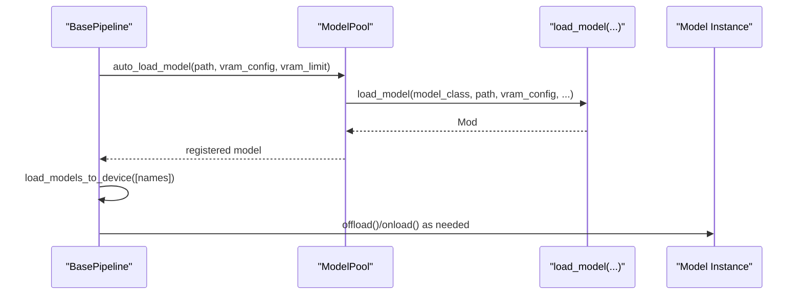
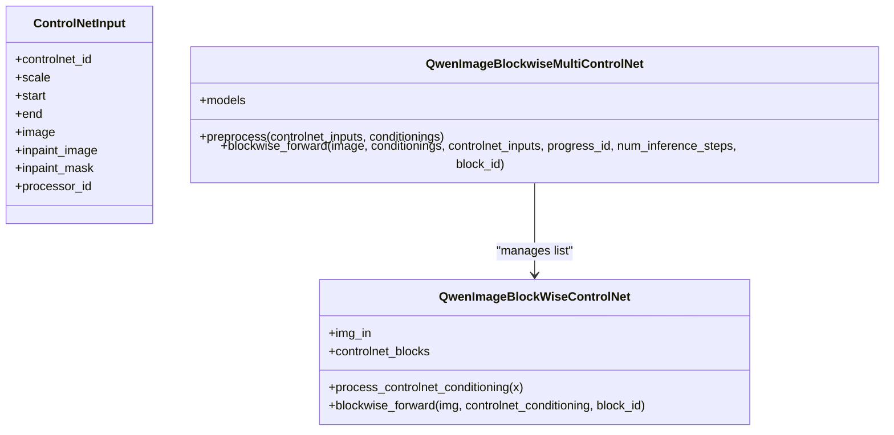
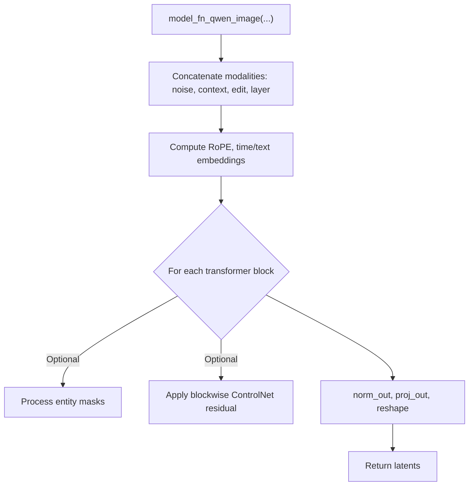
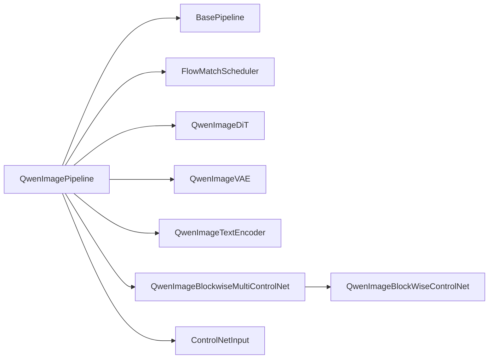

# Core Architecture and Pipeline Units

<cite>
**Referenced Files in This Document**
- [base_pipeline.py](file://diffusion/base_pipeline.py)
- [qwen_image.py](file://diffusion/pipelines/qwen_image.py)
- [flow_match.py](file://diffusion/flow_match.py)
- [model_loader.py](file://diffusion/models/model_loader.py)
- [controlnet_input.py](file://diffusion/utils/controlnet/controlnet_input.py)
- [qwen_image_controlnet.py](file://diffusion/models/qwen_image_controlnet.py)
- [qwen_image_dit.py](file://diffusion/models/qwen_image_dit.py)
</cite>

## Table of Contents
1. [Introduction](#introduction)
2. [Project Structure](#project-structure)
3. [Core Components](#core-components)
4. [Architecture Overview](#architecture-overview)
5. [Detailed Component Analysis](#detailed-component-analysis)
6. [Dependency Analysis](#dependency-analysis)
7. [Performance Considerations](#performance-considerations)
8. [Troubleshooting Guide](#troubleshooting-guide)
9. [Conclusion](#conclusion)
10. [Appendices](#appendices)

## Introduction
This document explains the Qwen-Image pipeline core architecture with a focus on:
- BasePipeline inheritance structure and its unit-based processing system
- How pipeline units orchestrate image understanding and editing tasks
- Data flow between units, parameter passing mechanisms, and model loading strategies
- Integration of the scheduler with the denoising loop
- Extensibility patterns for custom units

The Qwen-Image pipeline is implemented as a sequence of PipelineUnit stages that prepare inputs, encode prompts and images, apply control signals, and drive the DiT denoiser through a FlowMatchScheduler. The design emphasizes modularity, VRAM management, and CFG-guided inference.

## Project Structure
At a high level:
- Base abstractions live under diffusion.base_pipeline (BasePipeline, PipelineUnit, PipelineUnitRunner, PipelineUnitGraph).
- The Qwen-Image pipeline implementation lives under diffusion.pipelines.qwen_image.
- Scheduler logic is under diffusion.flow_match.
- Model loading and VRAM management are under diffusion.models.model_loader.
- ControlNet input structures and blockwise ControlNet modules are under diffusion.utils.controlnet and diffusion.models.qwen_image_controlnet.
- The DiT backbone and attention utilities are under diffusion.models.qwen_image_dit.

**Diagram sources**
- [base_pipeline.py:61-115](file://diffusion/base_pipeline.py#L61-L115)
- [qwen_image.py:25-61](file://diffusion/pipelines/qwen_image.py#L25-L61)
- [flow_match.py:5-74](file://diffusion/flow_match.py#L5-L74)
- [model_loader.py:7-114](file://diffusion/models/model_loader.py#L7-L114)
- [controlnet_input.py:5-15](file://diffusion/utils/controlnet/controlnet_input.py#L5-L15)
- [qwen_image_controlnet.py:29-57](file://diffusion/models/qwen_image_controlnet.py#L29-L57)

**Section sources**
- [base_pipeline.py:61-115](file://diffusion/base_pipeline.py#L61-L115)
- [qwen_image.py:25-61](file://diffusion/pipelines/qwen_image.py#L25-L61)

## Core Components
- BasePipeline: Provides device/dtype handling, shape checks, preprocessing helpers, VRAM-aware model loading, noise generation, CFG guidance wrapper, LoRA support, and the step function that integrates the scheduler.
- PipelineUnit: A composable stage with explicit input/output parameters, optional CFG separation, optional takeover mode, and model onload hooks.
- PipelineUnitRunner: Executes units with correct routing of shared, positive, and negative inputs based on unit configuration.
- PipelineUnitGraph: Builds dependency edges and chains to split computation into related/unrelated subgraphs for VRAM optimization.
- FlowMatchScheduler: Generates sigmas/timesteps per template; Qwen-Image uses dynamic exponential shift tuned by image sequence length.
- ModelPool: Auto-detects model type via hash, loads with VRAM config, and exposes fetch_model.

Key responsibilities:
- Unit I/O contracts ensure deterministic data flow across the pipeline.
- VRAM management toggles offload/onload for models not currently needed.
- CFG splits positive/negative branches when cfg_scale != 1.

**Section sources**
- [base_pipeline.py:14-59](file://diffusion/base_pipeline.py#L14-L59)
- [base_pipeline.py:61-115](file://diffusion/base_pipeline.py#L61-L115)
- [base_pipeline.py:157-180](file://diffusion/base_pipeline.py#L157-L180)
- [base_pipeline.py:220-227](file://diffusion/base_pipeline.py#L220-L227)
- [base_pipeline.py:296-310](file://diffusion/base_pipeline.py#L296-L310)
- [base_pipeline.py:375-467](file://diffusion/base_pipeline.py#L375-L467)
- [base_pipeline.py:470-501](file://diffusion/base_pipeline.py#L470-L501)
- [flow_match.py:5-74](file://diffusion/flow_match.py#L5-L74)
- [model_loader.py:7-114](file://diffusion/models/model_loader.py#L7-L114)

## Architecture Overview
The Qwen-Image pipeline composes a fixed set of units before the denoising loop. Each unit declares which parameters it reads/writes, enabling automatic wiring. During inference:
- Preprocessing units validate shapes, generate noise, embed input images, inpaint masks, edit images, layer inputs, context images, and prompts.
- EntityControl optionally prepares entity-level prompts and masks for fine-grained control.
- BlockwiseControlNet prepares conditioning tensors for blockwise injection.
- The denoising loop calls the model_fn with current latents, timestep, and all embeddings/controls.
- After denoising, VAE decodes latents to images.

**Diagram sources**
- [qwen_image.py:100-197](file://diffusion/pipelines/qwen_image.py#L100-L197)
- [flow_match.py:5-74](file://diffusion/flow_match.py#L5-L74)
- [base_pipeline.py:470-501](file://diffusion/base_pipeline.py#L470-L501)

## Detailed Component Analysis

### BasePipeline and Unit System
- BasePipeline provides:
  - Shape validation and rounding to division factors
  - Image/video preprocessing and decoding helpers
  - VRAM-aware model loading/offloading
  - CFG-guided model function wrapper
  - Step integration with scheduler and optional inpainting blending
- PipelineUnit defines:
  - Input/output parameter contracts
  - CFG separation modes (seperate_cfg) or full takeover (take_over)
  - Model onload hooks (onload_model_names)
- PipelineUnitRunner routes inputs correctly for shared, positive, and negative branches.
- PipelineUnitGraph builds edges/chains to isolate related computations for VRAM efficiency.

**Diagram sources**
- [base_pipeline.py:61-115](file://diffusion/base_pipeline.py#L61-L115)
- [base_pipeline.py:14-59](file://diffusion/base_pipeline.py#L14-L59)
- [base_pipeline.py:375-467](file://diffusion/base_pipeline.py#L375-L467)
- [base_pipeline.py:470-501](file://diffusion/base_pipeline.py#L470-L501)

**Section sources**
- [base_pipeline.py:61-115](file://diffusion/base_pipeline.py#L61-L115)
- [base_pipeline.py:14-59](file://diffusion/base_pipeline.py#L14-L59)
- [base_pipeline.py:375-467](file://diffusion/base_pipeline.py#L375-L467)
- [base_pipeline.py:470-501](file://diffusion/base_pipeline.py#L470-L501)

### QwenImagePipeline and Denoising Loop
- QwenImagePipeline initializes:
  - FlowMatchScheduler with Qwen-Image template
  - Model references (text encoder, DiT, VAE, blockwise ControlNet, encoders, processors)
  - Unit list defining the processing order
- __call__ orchestrates:
  - Timestep setup
  - Parameter dictionaries (shared, positive, negative)
  - Sequential unit execution via unit_runner
  - CFG-guided denoising loop over timesteps
  - VAE decode and output formatting

**Diagram sources**
- [qwen_image.py:100-197](file://diffusion/pipelines/qwen_image.py#L100-L197)

**Section sources**
- [qwen_image.py:25-61](file://diffusion/pipelines/qwen_image.py#L25-L61)
- [qwen_image.py:100-197](file://diffusion/pipelines/qwen_image.py#L100-L197)

### Key Pipeline Units

#### QwenImageUnit_ShapeChecker
- Purpose: Ensures height/width satisfy division constraints.
- Inputs: height, width
- Outputs: height, width (possibly adjusted)

**Section sources**
- [qwen_image.py:229-238](file://diffusion/pipelines/qwen_image.py#L229-L238)

#### QwenImageUnit_NoiseInitializer
- Purpose: Generates initial Gaussian noise at latent resolution; supports layered outputs when layer_num is provided.
- Inputs: height, width, seed, rand_device, layer_num
- Outputs: noise

**Section sources**
- [qwen_image.py:242-254](file://diffusion/pipelines/qwen_image.py#L242-L254)

#### QwenImageUnit_InputImageEmbedder
- Purpose: Encodes input_image via VAE to produce latents and input_latents; applies noise scheduling if not training.
- Inputs: input_image, noise, tiled, tile_size, tile_stride
- Outputs: latents, input_latents
- Model loading: vae

**Section sources**
- [qwen_image.py:258-284](file://diffusion/pipelines/qwen_image.py#L258-L284)

#### QwenImageUnit_Inpaint
- Purpose: Prepares inpaint_mask at latent scale; optional Gaussian blur.
- Inputs: inpaint_mask, height, width, inpaint_blur_size, inpaint_blur_sigma
- Outputs: inpaint_mask

**Section sources**
- [qwen_image.py:338-354](file://diffusion/pipelines/qwen_image.py#L338-L354)

#### QwenImageUnit_EditImageEmbedder
- Purpose: Encodes edit_image(s) via VAE; supports auto-resize and multi-image lists.
- Inputs: edit_image, tiled, tile_size, tile_stride, edit_image_auto_resize
- Outputs: edit_latents, edit_image (resized)
- Model loading: vae

**Section sources**
- [qwen_image.py:566-606](file://diffusion/pipelines/qwen_image.py#L566-L606)

#### QwenImageUnit_LayerInputImageEmbedder
- Purpose: Encodes layer_input_image for layered control scenarios.
- Inputs: layer_input_image, tiled, tile_size, tile_stride
- Outputs: layer_input_latents
- Model loading: vae

**Section sources**
- [qwen_image.py:321-335](file://diffusion/pipelines/qwen_image.py#L321-L335)

#### QwenImageUnit_ContextImageEmbedder
- Purpose: Encodes context_image (optionally RGBA) to context_latents; resizes to target dimensions.
- Inputs: context_image, height, width, tiled, tile_size, tile_stride, layer_input_image
- Outputs: context_latents
- Model loading: vae

**Section sources**
- [qwen_image.py:719-735](file://diffusion/pipelines/qwen_image.py#L719-L735)

#### QwenImageUnit_PromptEmbedder
- Purpose: Encodes text prompts (and optional edit images) via text encoder; handles tokenization, hidden state extraction, padding, and mask creation. Supports single and multi-image edit prompts.
- Inputs: prompt, edit_image (optional)
- Outputs: prompt_emb, prompt_emb_mask
- CFG: seperate_cfg with separate positive/negative prompt paths
- Model loading: text_encoder

**Section sources**
- [qwen_image.py:357-438](file://diffusion/pipelines/qwen_image.py#L357-L438)

#### QwenImageUnit_EntityControl
- Purpose: Prepares entity-level prompts and masks for EliGen-style control; can enable negative branch; takes over unit execution.
- Inputs: eligen_entity_prompts, width, height, eligen_enable_on_negative, cfg_scale
- Outputs: entity_prompt_emb, entity_masks, entity_prompt_emb_mask
- CFG: take_over mode; updates inputs_posi and optionally inputs_nega
- Model loading: text_encoder

**Section sources**
- [qwen_image.py:441-519](file://diffusion/pipelines/qwen_image.py#L441-L519)

#### QwenImageUnit_BlockwiseControlNet
- Purpose: Encodes control images via VAE; optionally merges inpaint mask into latents; returns conditionings for blockwise ControlNet injection.
- Inputs: blockwise_controlnet_inputs, tiled, tile_size, tile_stride
- Outputs: blockwise_controlnet_conditioning
- Model loading: vae

**Section sources**
- [qwen_image.py:523-563](file://diffusion/pipelines/qwen_image.py#L523-L563)

### Scheduler Integration
- FlowMatchScheduler sets sigmas and timesteps using Qwen-Image template with dynamic exponential shift based on image sequence length.
- The pipeline’s step function blends inpaint masks into noise predictions and advances latents.

**Diagram sources**
- [flow_match.py:45-74](file://diffusion/flow_match.py#L45-L74)
- [base_pipeline.py:220-227](file://diffusion/base_pipeline.py#L220-L227)

**Section sources**
- [flow_match.py:45-74](file://diffusion/flow_match.py#L45-L74)
- [base_pipeline.py:220-227](file://diffusion/base_pipeline.py#L220-L227)

### Model Loading Strategies
- download_and_load_models triggers ModelPool.auto_load_model with VRAM configs derived from ModelConfig.
- load_models_to_device selectively offloads non-needed models and onloads required ones based on model_names.
- ModelPool detects model type via file hash and instantiates with appropriate VRAM module mapping.

**Diagram sources**
- [base_pipeline.py:296-310](file://diffusion/base_pipeline.py#L296-L310)
- [base_pipeline.py:157-180](file://diffusion/base_pipeline.py#L157-L180)
- [model_loader.py:64-83](file://diffusion/models/model_loader.py#L64-L83)

**Section sources**
- [base_pipeline.py:296-310](file://diffusion/base_pipeline.py#L296-L310)
- [base_pipeline.py:157-180](file://diffusion/base_pipeline.py#L157-L180)
- [model_loader.py:64-83](file://diffusion/models/model_loader.py#L64-L83)

### ControlNet Integration
- ControlNetInput carries id, scale, start/end ranges, images, and masks.
- QwenImageBlockWiseMultiControlNet preprocesses conditionings and injects per-block residuals during DiT forward.
- QwenImageBlockWiseControlNet maps conditioning into DiT dimension and applies residual per block.

**Diagram sources**
- [controlnet_input.py:5-15](file://diffusion/utils/controlnet/controlnet_input.py#L5-L15)
- [qwen_image.py:200-227](file://diffusion/pipelines/qwen_image.py#L200-L227)
- [qwen_image_controlnet.py:29-57](file://diffusion/models/qwen_image_controlnet.py#L29-L57)

**Section sources**
- [controlnet_input.py:5-15](file://diffusion/utils/controlnet/controlnet_input.py#L5-L15)
- [qwen_image.py:200-227](file://diffusion/pipelines/qwen_image.py#L200-L227)
- [qwen_image_controlnet.py:29-57](file://diffusion/models/qwen_image_controlnet.py#L29-L57)

### DiT Forward and Multi-Modal Conditioning
- model_fn_qwen_image concatenates multiple modalities (noise, context, edit, layer inputs), computes RoPE, time/text embeddings, and iterates transformer blocks.
- Optional entity masks and blockwise ControlNet residuals are injected per block.
- Tiled variants support large images by overlapping tiles and merging outputs.

**Diagram sources**
- [qwen_image.py:991-1150](file://diffusion/pipelines/qwen_image.py#L991-L1150)
- [qwen_image_dit.py:14-39](file://diffusion/models/qwen_image_dit.py#L14-L39)

**Section sources**
- [qwen_image.py:991-1150](file://diffusion/pipelines/qwen_image.py#L991-L1150)
- [qwen_image_dit.py:14-39](file://diffusion/models/qwen_image_dit.py#L14-L39)

## Dependency Analysis
- QwenImagePipeline depends on:
  - FlowMatchScheduler for timestep schedule
  - BasePipeline for unit runner, VRAM management, CFG wrapper, step
  - DiT, VAE, Text Encoder, ControlNet modules
  - ControlNetInput for specifying control conditions
- Units depend on specific models via onload_model_names, ensuring minimal VRAM usage.

**Diagram sources**
- [qwen_image.py:25-61](file://diffusion/pipelines/qwen_image.py#L25-L61)
- [base_pipeline.py:61-115](file://diffusion/base_pipeline.py#L61-L115)
- [flow_match.py:5-74](file://diffusion/flow_match.py#L5-L74)
- [controlnet_input.py:5-15](file://diffusion/utils/controlnet/controlnet_input.py#L5-L15)
- [qwen_image_controlnet.py:29-57](file://diffusion/models/qwen_image_controlnet.py#L29-L57)

**Section sources**
- [qwen_image.py:25-61](file://diffusion/pipelines/qwen_image.py#L25-L61)
- [base_pipeline.py:61-115](file://diffusion/base_pipeline.py#L61-L115)
- [flow_match.py:5-74](file://diffusion/flow_match.py#L5-L74)
- [controlnet_input.py:5-15](file://diffusion/utils/controlnet/controlnet_input.py#L5-L15)
- [qwen_image_controlnet.py:29-57](file://diffusion/models/qwen_image_controlnet.py#L29-L57)

## Performance Considerations
- VRAM Management:
  - Use load_models_to_device to keep only necessary models active.
  - Leverage vram_management_enabled models’ offload/onload methods.
- Compilation:
  - compile_pipeline supports torch.compile with regional compilation for repeated blocks.
- Tiled Inference:
  - Large images can be processed via tiled_model_fn variants to reduce memory footprint.
- Attention Optimization:
  - Flash attention available when enabled; FP8 attention supported in some configurations.

[No sources needed since this section provides general guidance]

## Troubleshooting Guide
- Shape mismatches: Ensure height/width are multiples of division factors; ShapeChecker will adjust automatically.
- Missing models: Verify model_configs and ModelPool registration; check model hashes.
- CFG issues: When cfg_scale=1, negative branch may be skipped; ensure inputs_nega are populated if needed.
- ControlNet injection: Validate ControlNetInput ranges (start/end) and scales; ensure conditionings match expected resolutions.
- VRAM errors: Enable vram_management_enabled and use load_models_to_device to manage model lifecycles.

**Section sources**
- [base_pipeline.py:97-114](file://diffusion/base_pipeline.py#L97-L114)
- [base_pipeline.py:157-180](file://diffusion/base_pipeline.py#L157-L180)
- [model_loader.py:64-83](file://diffusion/models/model_loader.py#L64-L83)
- [controlnet_input.py:5-15](file://diffusion/utils/controlnet/controlnet_input.py#L5-L15)

## Conclusion
The Qwen-Image pipeline leverages a modular unit-based architecture built atop BasePipeline to orchestrate complex image understanding and editing workflows. Units encapsulate preprocessing, encoding, and control logic with explicit I/O contracts, while the scheduler and DiT handle denoising. VRAM-aware model loading and CFG guidance provide robustness and efficiency. The design enables easy extension with custom units and flexible integration of additional modalities.

[No sources needed since this section summarizes without analyzing specific files]

## Appendices

### Extending the Pipeline with Custom Units
To add a new unit:
- Subclass PipelineUnit and define input_params, output_params, and optionally seperate_cfg or take_over.
- Implement process(pipe, **kwargs) to read inputs and return outputs.
- Specify onload_model_names to trigger model loading within the unit.
- Insert the unit into QwenImagePipeline.units at the desired position.

Example pattern:
- Define unit class with I/O contract
- Implement process method
- Register in pipeline units list

**Section sources**
- [base_pipeline.py:14-59](file://diffusion/base_pipeline.py#L14-L59)
- [qwen_image.py:47-58](file://diffusion/pipelines/qwen_image.py#L47-L58)