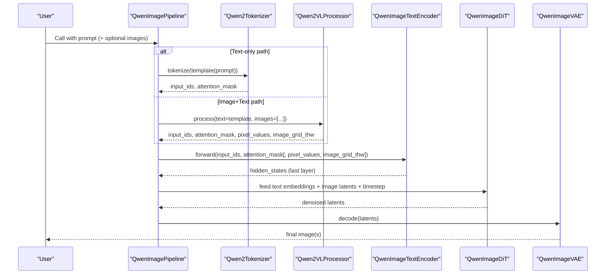
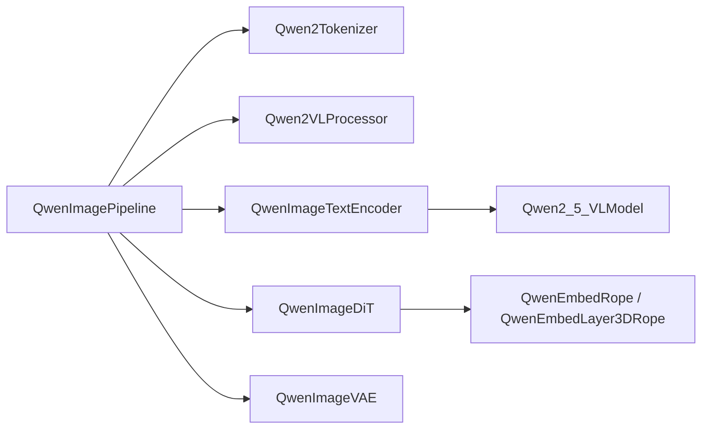

# Multimodal Processing and Text-Image Integration

<cite>
**Referenced Files in This Document**
- [qwen_image.py](file://diffsynth/pipelines/qwen_image.py)
- [qwen_image_text_encoder.py](file://diffsynth/models/qwen_image_text_encoder.py)
- [qwen_image_dit.py](file://diffsynth/models/qwen_image_dit.py)
- [Qwen-Image.py](file://examples/qwen_image/model_inference/Qwen-Image.py)
- [Qwen-Image-Edit.py](file://examples/qwen_image/model_inference/Qwen-Image-Edit.py)
- [nexus_gen_ar_model.py](file://diffsynth/models/nexus_gen_ar_model.py)
</cite>

## Table of Contents
1. Introduction
2. Project Structure
3. Core Components
4. Architecture Overview
5. Detailed Component Analysis
6. Dependency Analysis
7. Performance Considerations
8. Troubleshooting Guide
9. Conclusion

## Introduction
This document explains how Qwen-Image processes multimodal inputs, focusing on text prompt handling via Qwen2Tokenizer and Qwen2VLProcessor, template formatting for different use cases (basic description, edit instructions, multi-image prompts), integration with vision-language models for natural language guided editing, prompt embedding extraction, attention mask handling, and the combination of text embeddings with image features. It also provides examples of prompt templates, multi-image workflows, and strategies for variable-length prompts and images.

## Project Structure
The Qwen-Image pipeline is implemented as a modular pipeline that orchestrates tokenization, vision-language encoding, DiT-based diffusion, and VAE decoding. Key modules include:
- Pipeline orchestration and units for prompt/image preprocessing and conditioning
- Qwen2 tokenizer and Qwen2VL processor integration for text and image tokens
- Qwen2_5-VL-based text encoder to extract hidden states
- Qwen-Image DiT transformer with dual-stream attention and RoPE
- VAE for latent decoding

```mermaid
graph TB
subgraph "Pipeline"
P["QwenImagePipeline"]
U1["PromptEmbedder Unit"]
U2["Edit/Context/Layer Units"]
U3["Blockwise ControlNet Unit"]
end
subgraph "Tokenization & Processor"
T["Qwen2Tokenizer"]
VP["Qwen2VLProcessor"]
end
subgraph "Text Encoder"
TE["QwenImageTextEncoder<br/>Qwen2_5_VLModel"]
end
subgraph "Diffusion Model"
DIT["QwenImageDiT<br/>Dual-Stream Attention + RoPE"]
end
subgraph "VAE"
VAE["QwenImageVAE"]
end
P --> U1 --> TE
P --> U2 --> DIT
P --> U3 --> DIT
T --> U1
VP --> U1
TE --> DIT
DIT --> VAE
```

**Diagram sources**
- [qwen_image.py:25-98](file://diffsynth/pipelines/qwen_image.py#L25-L98)
- [qwen_image_text_encoder.py:1-191](file://diffsynth/models/qwen_image_text_encoder.py#L1-L191)
- [qwen_image_dit.py:590-746](file://diffsynth/models/qwen_image_dit.py#L590-L746)

**Section sources**
- [qwen_image.py:25-98](file://diffsynth/pipelines/qwen_image.py#L25-L98)
- [qwen_image_text_encoder.py:1-191](file://diffsynth/models/qwen_image_text_encoder.py#L1-L191)
- [qwen_image_dit.py:590-746](file://diffsynth/models/qwen_image_dit.py#L590-L746)

## Core Components
- QwenImagePipeline: Orchestrates model loading, unit execution, scheduler steps, and decoding. Initializes Qwen2Tokenizer and Qwen2VLProcessor when provided.
- QwenImageUnit_PromptEmbedder: Formats prompts into templates, tokenizes via Qwen2Tokenizer or processes via Qwen2VLProcessor for image+text, extracts masked hidden states from QwenImageTextEncoder, and produces prompt embeddings and masks.
- QwenImageTextEncoder: Wraps Qwen2_5_VLModel to return hidden states; supports input_ids, attention_mask, pixel_values, and image_grid_thw for multimodal inputs.
- QwenImageDiT: Dual-stream transformer mixing text and image sequences, using 3D RoPE for spatial-temporal positions, timestep conditioning, and optional entity masks for structured attention.

**Section sources**
- [qwen_image.py:25-98](file://diffsynth/pipelines/qwen_image.py#L25-L98)
- [qwen_image.py:357-439](file://diffsynth/pipelines/qwen_image.py#L357-L439)
- [qwen_image_text_encoder.py:148-191](file://diffsynth/models/qwen_image_text_encoder.py#L148-L191)
- [qwen_image_dit.py:590-746](file://diffsynth/models/qwen_image_dit.py#L590-L746)

## Architecture Overview
The multimodal processing flow integrates text and image modalities through a unified sequence in the DiT. The pipeline constructs templates, tokenizes or processes multimodal inputs, extracts embeddings, and feeds them into the DiT where text and image tokens attend jointly.



**Diagram sources**
- [qwen_image.py:357-439](file://diffsynth/pipelines/qwen_image.py#L357-L439)
- [qwen_image_text_encoder.py:148-191](file://diffsynth/models/qwen_image_text_encoder.py#L148-L191)
- [qwen_image_dit.py:696-728](file://diffsynth/models/qwen_image_dit.py#L696-L728)

**Section sources**
- [qwen_image.py:357-439](file://diffsynth/pipelines/qwen_image.py#L357-L439)
- [qwen_image_text_encoder.py:148-191](file://diffsynth/models/qwen_image_text_encoder.py#L148-L191)
- [qwen_image_dit.py:696-728](file://diffsynth/models/qwen_image_dit.py#L696-L728)

## Detailed Component Analysis

### Prompt Templates and Embedding Extraction
- Basic description template: system instruction followed by user prompt and assistant marker. Used for pure text generation.
- Edit instruction template: includes an image token placeholder and instructs the model to describe key features and apply modifications. Supports single or multiple images.
- Multi-image template: concatenates multiple image placeholders before the user prompt to condition on several reference images.

Embedding extraction:
- For text-only: tokenize with Qwen2Tokenizer, run QwenImageTextEncoder, extract last hidden state, drop initial tokens based on template structure, pad to max length, and build attention mask.
- For image+text: use Qwen2VLProcessor to produce input_ids, attention_mask, pixel_values, and image_grid_thw; pass to QwenImageTextEncoder; extract and trim hidden states similarly.

Variable-length handling:
- Hidden states are split per sample according to attention_mask, trimmed by a fixed drop index, then padded to a common sequence length across the batch.

Examples of templates and usage:
- Basic description: see encode_prompt method.
- Single-image edit: see encode_prompt_edit method.
- Multi-image edit: see encode_prompt_edit_multi method.

**Section sources**
- [qwen_image.py:386-439](file://diffsynth/pipelines/qwen_image.py#L386-L439)
- [qwen_image.py:457-475](file://diffsynth/pipelines/qwen_image.py#L457-L475)

### Qwen2Tokenizer and Qwen2VLProcessor Integration
- Qwen2Tokenizer: used for text-only paths; configured with max_length and truncation; returns input_ids and attention_mask.
- Qwen2VLProcessor: wraps image processor and tokenizer; handles image token insertion and multimodal batching; returns pixel_values and image_grid_thw for vision inputs.

Integration points:
- Pipeline initializes tokenizer and processor via ModelConfig paths.
- PromptEmbedder selects between tokenizer-only and processor-based encoding depending on presence of images.

**Section sources**
- [qwen_image.py:63-98](file://diffsynth/pipelines/qwen_image.py#L63-L98)
- [qwen_image.py:386-439](file://diffsynth/pipelines/qwen_image.py#L386-L439)
- [nexus_gen_ar_model.py:950-986](file://diffsynth/models/nexus_gen_ar_model.py#L950-L986)

### Vision-Language Model Integration and Attention Mask Handling
- QwenImageTextEncoder forwards multimodal inputs to Qwen2_5_VLModel, returning hidden_states for downstream use.
- In DiT, text and image sequences are concatenated and processed via dual-stream attention. RoPE encodes positions for both modalities.
- Entity control masks can construct custom attention patterns, enabling selective prompt-image interactions and masking between prompt segments.

Attention mask construction:
- For basic flows, attention_mask is None or derived from prompt masks.
- For entity-controlled flows, attention_mask is built to restrict cross-attention between specific prompt segments and image regions, and to prevent inter-prompt interference.

**Section sources**
- [qwen_image_text_encoder.py:148-191](file://diffsynth/models/qwen_image_text_encoder.py#L148-L191)
- [qwen_image_dit.py:628-693](file://diffsynth/models/qwen_image_dit.py#L628-L693)
- [qwen_image_dit.py:362-432](file://diffsynth/models/qwen_image_dit.py#L362-L432)

### Combining Text Embeddings with Image Features
- Text embeddings are projected via txt_in and normalized before entering transformer blocks.
- Image latents are rearranged into sequences and projected via img_in.
- Timestep conditioning is injected via time_text_embed; modulate parameters are computed for adaptive modulation.
- Joint attention mixes text and image tokens; outputs are residual-added back to respective streams.

RoPE and positional encoding:
- 3D RoPE computes frequency tensors for video/image shapes and text lengths; supports sampling variants for edit scenarios.

**Section sources**
- [qwen_image_dit.py:590-746](file://diffsynth/models/qwen_image_dit.py#L590-L746)
- [qwen_image_dit.py:60-166](file://diffsynth/models/qwen_image_dit.py#L60-L166)

### Multi-Image Processing Workflows
- Multi-image prompts concatenate multiple image placeholders before the user text.
- Images are resized to consistent dimensions; processor batches pixel_values and image_grid_thw accordingly.
- DiT receives concatenated image sequences; attention masks ensure correct cross-modal interactions.

Workflow highlights:
- Template assembly for multiple images.
- Processor batching and grid shape handling.
- Sequence concatenation and attention masking.

**Section sources**
- [qwen_image.py:408-419](file://diffsynth/pipelines/qwen_image.py#L408-L419)
- [qwen_image_dit.py:628-693](file://diffsynth/models/qwen_image_dit.py#L628-L693)

### Examples of Prompt Templates and Usage
- Basic description: system instruction prompting detailed visual description; used for text-to-image generation.
- Edit instruction: system instruction plus image token placeholder; instructs modification while preserving consistency.
- Multi-image: multiple image placeholders concatenated; useful for style/reference conditioning.

Usage examples:
- Generation example script demonstrates loading pipeline and generating an image from a text prompt.
- Edit example shows providing an input image and a prompt to modify it, with optional auto-resize.

**Section sources**
- [qwen_image.py:386-419](file://diffsynth/pipelines/qwen_image.py#L386-L419)
- [Qwen-Image.py:1-18](file://examples/qwen_image/model_inference/Qwen-Image.py#L1-L18)
- [Qwen-Image-Edit.py:1-26](file://examples/qwen_image/model_inference/Qwen-Image-Edit.py#L1-L26)

## Dependency Analysis
The pipeline depends on transformers components for tokenization and processing, and on internal modules for text encoding and diffusion modeling.



**Diagram sources**
- [qwen_image.py:25-98](file://diffsynth/pipelines/qwen_image.py#L25-L98)
- [qwen_image_text_encoder.py:1-191](file://diffsynth/models/qwen_image_text_encoder.py#L1-L191)
- [qwen_image_dit.py:60-166](file://diffsynth/models/qwen_image_dit.py#L60-L166)

**Section sources**
- [qwen_image.py:25-98](file://diffsynth/pipelines/qwen_image.py#L25-L98)
- [qwen_image_text_encoder.py:1-191](file://diffsynth/models/qwen_image_text_encoder.py#L1-L191)
- [qwen_image_dit.py:60-166](file://diffsynth/models/qwen_image_dit.py#L60-L166)

## Performance Considerations
- Flash attention optimization: The DiT uses a flash attention implementation when available, with optional FP8 support for reduced memory and faster computation.
- Gradient checkpointing: Transformer blocks can be executed with gradient checkpointing to reduce memory during training or high-step inference.
- Tiled inference: Large images can be processed in tiles with overlap blending to manage VRAM constraints.
- Variable-length handling: Padding and masking minimize unnecessary computation for shorter prompts.

[No sources needed since this section provides general guidance]

## Troubleshooting Guide
- Prompt length warnings: If prompts exceed trained token limits, the pipeline prints warnings; consider truncating or simplifying prompts.
- Missing processor/tokenizer configs: Ensure ModelConfig paths point to valid tokenizer and processor directories when using image+text modes.
- Attention mask mismatches: When using entity masks, verify mask shapes align with image patch sizes and sequence lengths.
- Memory issues: Enable tiled inference or reduce tile size/stride; use gradient checkpointing if applicable.

**Section sources**
- [qwen_image.py:386-439](file://diffsynth/pipelines/qwen_image.py#L386-L439)
- [qwen_image_dit.py:628-693](file://diffsynth/models/qwen_image_dit.py#L628-L693)

## Conclusion
Qwen-Image’s multimodal pipeline integrates Qwen2Tokenizer and Qwen2VLProcessor to handle diverse prompt formats, including basic descriptions, edit instructions, and multi-image prompts. The Qwen2_5-VL-based text encoder extracts robust hidden states, which are combined with image features in a dual-stream DiT architecture. Careful attention mask construction and RoPE positioning enable precise cross-modal interactions. The system supports variable-length inputs, tiled inference, and efficient attention mechanisms to balance quality and performance.