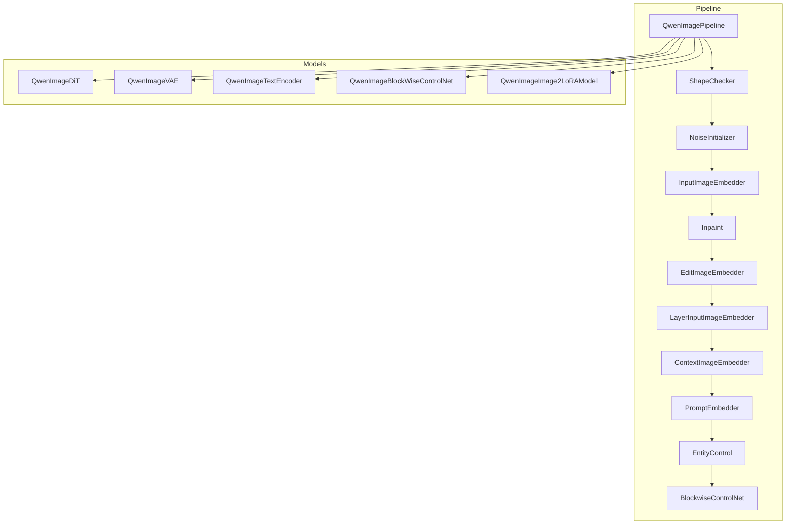
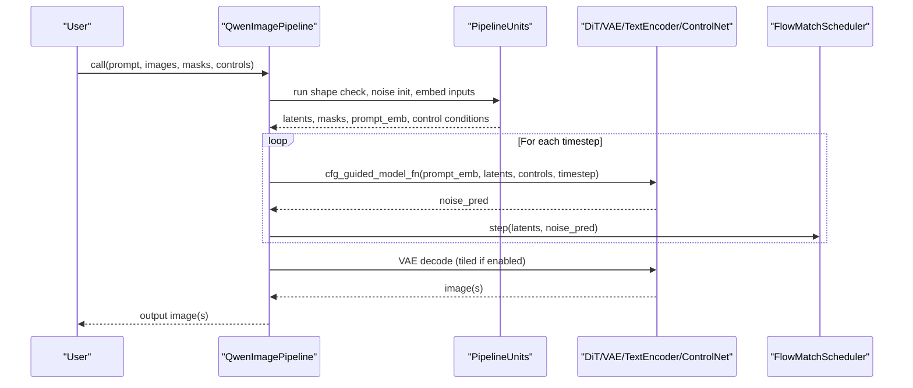
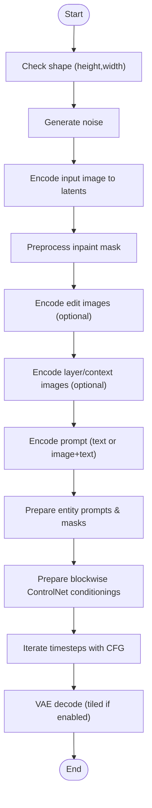
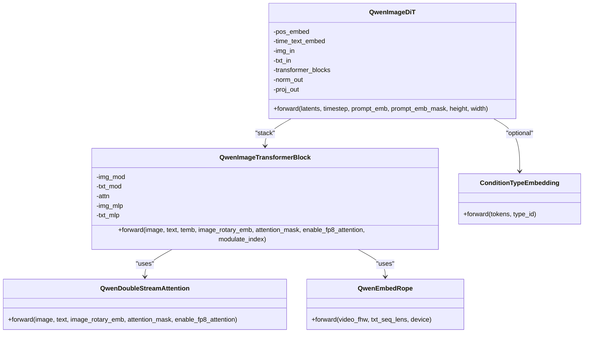
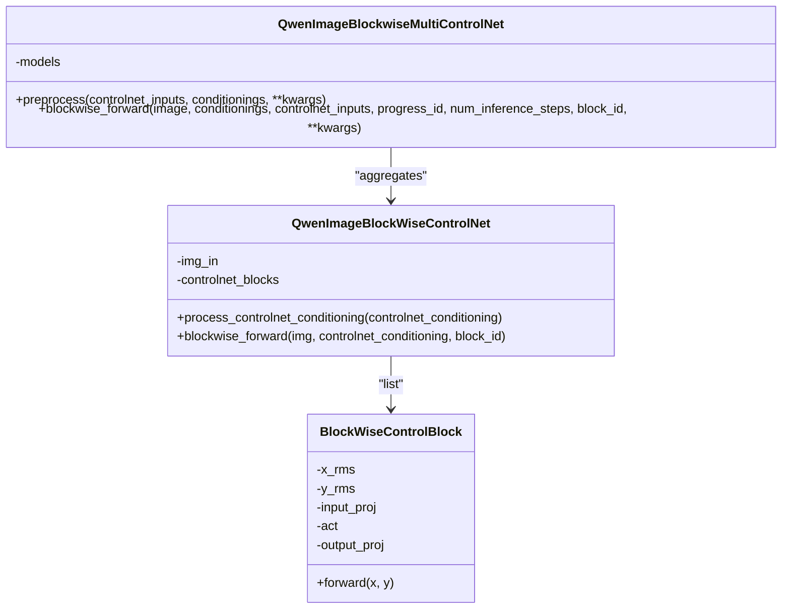
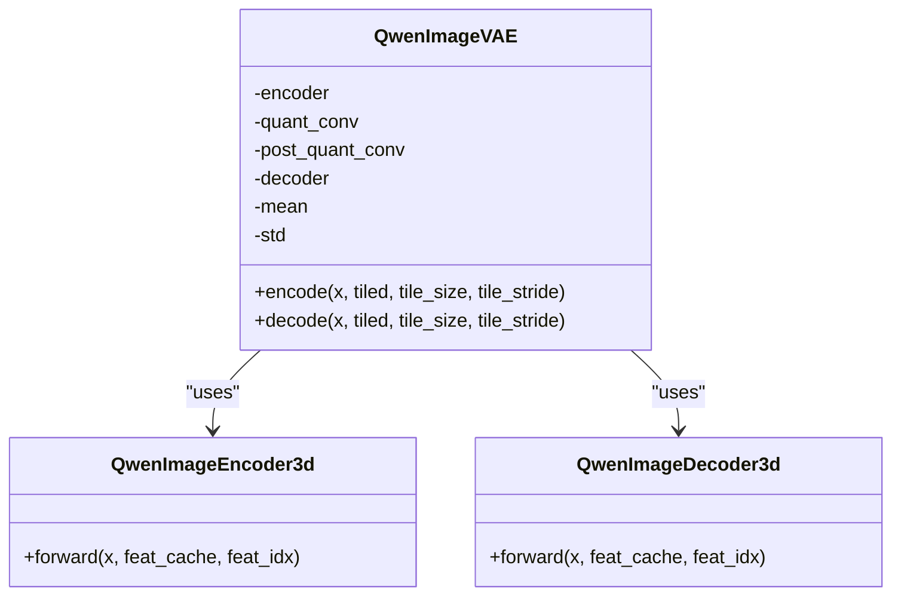
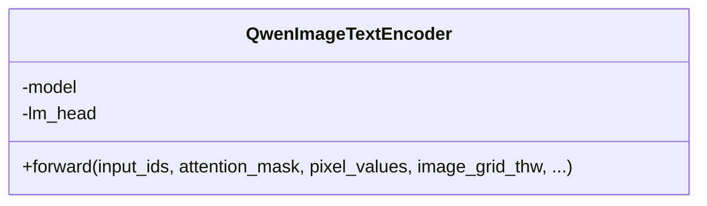
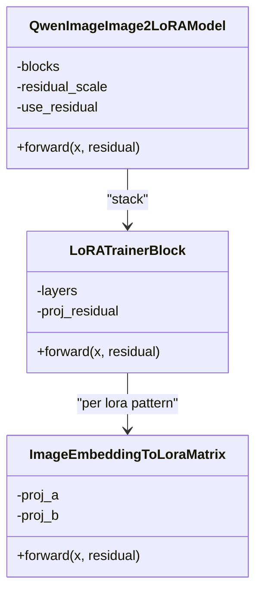
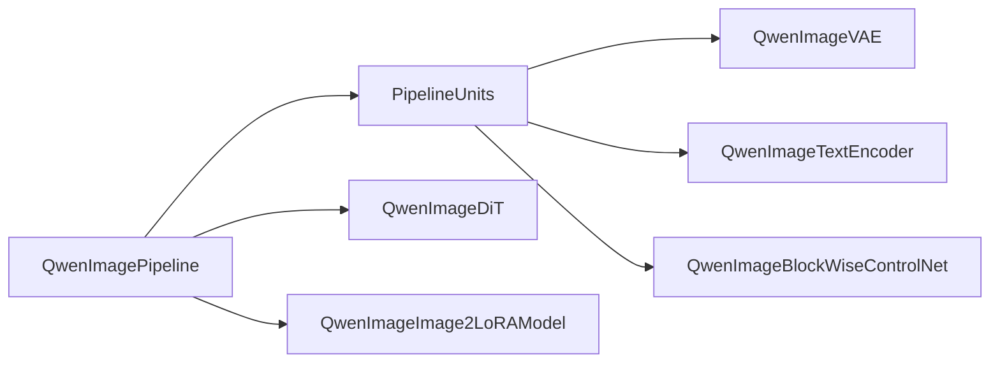

# Qwen-Image Pipeline

<cite>
**Referenced Files in This Document**
- [qwen_image.py](file://diffsynth/pipelines/qwen_image.py)
- [qwen_image_dit.py](file://diffsynth/models/qwen_image_dit.py)
- [qwen_image_controlnet.py](file://diffsynth/models/qwen_image_controlnet.py)
- [qwen_image_text_encoder.py](file://diffsynth/models/qwen_image_text_encoder.py)
- [qwen_image_vae.py](file://diffsynth/models/qwen_image_vae.py)
- [qwen_image_image2lora.py](file://diffsynth/models/qwen_image_image2lora.py)
- [Qwen-Image.py](file://examples/qwen_image/model_inference/Qwen-Image.py)
- [Qwen-Image-Edit.py](file://examples/qwen_image/model_inference/Qwen-Image-Edit.py)
- [Qwen-Image-Layered-Control.py](file://examples/qwen_image/model_inference/Qwen-Image-Layered-Control.py)
- [Qwen-Image-Blockwise-ControlNet-Inpaint.py](file://examples/qwen_image/model_inference/Qwen-Image-Blockwise-ControlNet-Inpaint.py)
- [Qwen-Image-Blockwise-ControlNet-Canny.py](file://examples/qwen_image/model_inference/Qwen-Image-Blockwise-ControlNet-Canny.py)
- [Qwen-Image-EliGen.py](file://examples/qwen_image/model_inference/Qwen-Image-EliGen.py)
- [Qwen-Image.md](file://docs/en/Model_Details/Qwen-Image.md)
</cite>

## Table of Contents
1. Introduction
2. Project Structure
3. Core Components
4. Architecture Overview
5. Detailed Component Analysis
6. Dependency Analysis
7. Performance Considerations
8. Troubleshooting Guide
9. Conclusion
10. Appendices

## Introduction
This document explains the Qwen-Image pipeline implementation for image understanding and editing tasks powered by Qwen’s multimodal capabilities. It covers blockwise ControlNet integration, layered control mechanisms, region-based editing via entity prompts and masks, style transfer through image-to-LoRA, and natural language guided editing using a vision-language text encoder. The documentation also outlines specialized training approaches and evaluation practices used across the Qwen-Image series.

## Project Structure
The Qwen-Image pipeline is implemented as a modular DiffSynth pipeline with:
- A central pipeline orchestrating processing units (shape checks, noise initialization, input embedding, inpainting mask handling, prompt encoding, entity control, blockwise ControlNet conditioning).
- Model components including DiT transformer, VAE, text encoder, and ControlNet variants.
- Example scripts demonstrating generation, editing, layered control, and ControlNet usage.

**Diagram sources**
- [qwen_image.py:25-60](file://diffsynth/pipelines/qwen_image.py#L25-L60)
- [qwen_image_dit.py:590-628](file://diffsynth/models/qwen_image_dit.py#L590-L628)
- [qwen_image_vae.py:643-754](file://diffsynth/models/qwen_image_vae.py#L643-L754)
- [qwen_image_text_encoder.py:5-147](file://diffsynth/models/qwen_image_text_encoder.py#L5-L147)
- [qwen_image_controlnet.py:29-57](file://diffsynth/models/qwen_image_controlnet.py#L29-L57)
- [qwen_image_image2lora.py:74-129](file://diffsynth/models/qwen_image_image2lora.py#L74-L129)

**Section sources**
- [qwen_image.py:25-60](file://diffsynth/pipelines/qwen_image.py#L25-L60)
- [Qwen-Image.md:53-105](file://docs/en/Model_Details/Qwen-Image.md#L53-L105)

## Core Components
- QwenImagePipeline: Orchestrates inference steps, manages model loading, and runs a sequence of PipelineUnits to prepare inputs and apply controls.
- QwenImageDiT: Transformer backbone with dual-stream attention, RoPE embeddings, and timestep conditioning.
- QwenImageVAE: Causal 3D encoder-decoder with tiled support for VRAM efficiency.
- QwenImageTextEncoder: Vision-language encoder based on Qwen2_5_VL that produces hidden states for prompts and image-text tokens.
- QwenImageBlockWiseControlNet: Per-block control signals injected into DiT layers; supports multiple ControlNets aggregated via MultiControlNet wrapper.
- QwenImageImage2LoRAModel: Generates LoRA weights from images using SigLIP2/DINOv3 features and optional residuals.

Key responsibilities:
- Input preparation: shape normalization, noise generation, latent encoding, mask preprocessing.
- Prompt encoding: text-only or image+text templates with token masking and attention masks.
- Entity control: per-region prompts and masks enabling localized edits.
- Blockwise ControlNet: conditionings applied at specific blocks during denoising.
- Layered control: multi-layer outputs from VAE for compositional editing.
- Image-to-LoRA: encode reference images and produce merged LoRA parameters for style/content transfer.

**Section sources**
- [qwen_image.py:25-60](file://diffsynth/pipelines/qwen_image.py#L25-L60)
- [qwen_image_dit.py:590-628](file://diffsynth/models/qwen_image_dit.py#L590-L628)
- [qwen_image_vae.py:643-754](file://diffsynth/models/qwen_image_vae.py#L643-L754)
- [qwen_image_text_encoder.py:5-147](file://diffsynth/models/qwen_image_text_encoder.py#L5-L147)
- [qwen_image_controlnet.py:29-57](file://diffsynth/models/qwen_image_controlnet.py#L29-L57)
- [qwen_image_image2lora.py:74-129](file://diffsynth/models/qwen_image_image2lora.py#L74-L129)

## Architecture Overview
The pipeline follows a unit-driven flow where each unit transforms shared inputs and produces positive/negative branch data for classifier-free guidance. Denoising iterates over timesteps, applying CFG-guided model calls and scheduler updates. Finally, VAE decoding yields images or layered outputs.

**Diagram sources**
- [qwen_image.py:100-197](file://diffsynth/pipelines/qwen_image.py#L100-L197)
- [qwen_image_dit.py:696-728](file://diffsynth/models/qwen_image_dit.py#L696-L728)
- [qwen_image_vae.py:732-754](file://diffsynth/models/qwen_image_vae.py#L732-L754)

**Section sources**
- [qwen_image.py:100-197](file://diffsynth/pipelines/qwen_image.py#L100-L197)

## Detailed Component Analysis

### QwenImagePipeline and Unit Flow
- ShapeChecker ensures height/width multiples of 16.
- NoiseInitializer generates Gaussian noise for latents.
- InputImageEmbedder encodes input images via VAE and optionally adds noise according to denoising strength.
- Inpaint preprocesses masks and applies blur when specified.
- EditImageEmbedder handles edit images with auto-resize options and encodes them to latents.
- LayerInputImageEmbedder and ContextImageEmbedder prepare additional conditioning latents for layered/contextual control.
- PromptEmbedder encodes text-only or image+text prompts using the text encoder and processor, producing masked embeddings and attention masks.
- EntityControl prepares per-entity prompt embeddings and masks for EliGen-style region control.
- BlockwiseControlNet prepares conditionings from ControlNet inputs, optionally applying inpaint masks to images and latents.

**Diagram sources**
- [qwen_image.py:229-564](file://diffsynth/pipelines/qwen_image.py#L229-L564)

**Section sources**
- [qwen_image.py:229-564](file://diffsynth/pipelines/qwen_image.py#L229-L564)

### QwenImageDiT: Transformer Backbone
- Dual-stream attention integrates image and text sequences with joint RoPE.
- Timestep embeddings modulate both streams via AdaLayerNorm-like mechanisms.
- Positional embeddings use QwenEmbedRope or QwenEmbedLayer3DRope for spatial-temporal consistency.
- Optional ConditionTypeEmbedding allows distinguishing different condition sources without interfering with RoPE.

**Diagram sources**
- [qwen_image_dit.py:590-728](file://diffsynth/models/qwen_image_dit.py#L590-L728)
- [qwen_image_dit.py:362-432](file://diffsynth/models/qwen_image_dit.py#L362-L432)
- [qwen_image_dit.py:60-166](file://diffsynth/models/qwen_image_dit.py#L60-L166)
- [qwen_image_dit.py:731-746](file://diffsynth/models/qwen_image_dit.py#L731-L746)

**Section sources**
- [qwen_image_dit.py:590-728](file://diffsynth/models/qwen_image_dit.py#L590-L728)

### QwenImageBlockWiseControlNet: Blockwise Conditioning
- Each ControlNet block processes conditioning tensors and injects residual corrections at corresponding DiT blocks.
- MultiControlNet aggregates multiple ControlNets with start/end progress windows and scaling factors.
- Supports inpaint mask application on both images and latents before encoding.

**Diagram sources**
- [qwen_image_controlnet.py:6-57](file://diffsynth/models/qwen_image_controlnet.py#L6-L57)
- [qwen_image.py:200-227](file://diffsynth/pipelines/qwen_image.py#L200-L227)

**Section sources**
- [qwen_image_controlnet.py:29-57](file://diffsynth/models/qwen_image_controlnet.py#L29-L57)
- [qwen_image.py:200-227](file://diffsynth/pipelines/qwen_image.py#L200-L227)

### QwenImageVAE: Latent Space and Tiling
- Encoder/decoder use causal 3D convolutions and residual blocks with attention.
- Tiled encode/decode reduces VRAM usage at the cost of minor artifacts and longer runtime.
- Mean/std normalization aligns latent distributions.

**Diagram sources**
- [qwen_image_vae.py:643-754](file://diffsynth/models/qwen_image_vae.py#L643-L754)
- [qwen_image_vae.py:345-451](file://diffsynth/models/qwen_image_vae.py#L345-L451)
- [qwen_image_vae.py:524-640](file://diffsynth/models/qwen_image_vae.py#L524-L640)

**Section sources**
- [qwen_image_vae.py:643-754](file://diffsynth/models/qwen_image_vae.py#L643-L754)

### QwenImageTextEncoder: Vision-Language Encoding
- Wraps Qwen2_5_VL model to output hidden states for text and image tokens.
- Supports pixel values and grid shapes for multimodal inputs.
- Used by PromptEmbedder to generate masked embeddings for CFG.

**Diagram sources**
- [qwen_image_text_encoder.py:5-147](file://diffsynth/models/qwen_image_text_encoder.py#L5-L147)

**Section sources**
- [qwen_image_text_encoder.py:5-147](file://diffsynth/models/qwen_image_text_encoder.py#L5-L147)

### Image-to-LoRA for Style Transfer
- Encodes reference images using SigLIP2 and DINOv3, optionally concatenating QwenVL residuals.
- Produces LoRA matrices per DiT block pattern, merging multiple sources with alpha weighting.
- Enables style/content transfer by injecting learned perturbations into the transformer.

**Diagram sources**
- [qwen_image_image2lora.py:74-129](file://diffsynth/models/qwen_image_image2lora.py#L74-L129)
- [qwen_image_image2lora.py:17-30](file://diffsynth/models/qwen_image_image2lora.py#L17-L30)
- [qwen_image_image2lora.py:49-72](file://diffsynth/models/qwen_image_image2lora.py#L49-L72)

**Section sources**
- [qwen_image_image2lora.py:74-129](file://diffsynth/models/qwen_image_image2lora.py#L74-L129)

## Dependency Analysis
- Pipeline depends on models via attribute access and dynamic loading; units manage onload_model_names to load only necessary components.
- ControlNet aggregation uses a list of models indexed by controlnet_id; preprocessing rearranges latent dimensions for blockwise injection.
- Text encoder and processor are optional depending on task (text-only vs image+text editing).
- VAE tiling is controlled by flags passed through units and decoder.

**Diagram sources**
- [qwen_image.py:25-60](file://diffsynth/pipelines/qwen_image.py#L25-L60)
- [qwen_image.py:200-227](file://diffsynth/pipelines/qwen_image.py#L200-L227)

**Section sources**
- [qwen_image.py:25-60](file://diffsynth/pipelines/qwen_image.py#L25-L60)

## Performance Considerations
- Use tiled VAE encode/decode to reduce VRAM usage; slight artifacts may occur.
- Enable gradient checkpointing during training to save memory.
- FP8 attention is supported in DiT when available; otherwise falls back to scaled dot-product attention.
- VRAM management can offload/preload models dynamically; minimum 8GB VRAM recommended for inference.

[No sources needed since this section provides general guidance]

## Troubleshooting Guide
- If prompts exceed expected token limits, warnings indicate potential unpredictable behavior; shorten prompts or adjust tokenizer settings.
- Ensure inpaint masks are resized to latent resolution (H/8 x W/8) and normalized appropriately.
- When using blockwise ControlNet, verify controlnet_id matches loaded models and that conditionings are correctly rearranged.
- For layered control, ensure layer_num is set consistently to retrieve correct outputs from VAE.

**Section sources**
- [qwen_image.py:386-396](file://diffsynth/pipelines/qwen_image.py#L386-L396)
- [qwen_image.py:338-355](file://diffsynth/pipelines/qwen_image.py#L338-L355)
- [qwen_image.py:523-564](file://diffsynth/pipelines/qwen_image.py#L523-L564)

## Conclusion
The Qwen-Image pipeline provides a flexible, modular framework for image understanding and editing. Its blockwise ControlNet integration, layered control, entity-based region editing, and image-to-LoRA style transfer enable diverse editing scenarios. Natural language guidance via Qwen’s vision-language encoder enhances controllability. With efficient VAE tiling and VRAM management, it supports high-resolution tasks on limited hardware.

[No sources needed since this section summarizes without analyzing specific files]

## Appendices

### Usage Examples
- Basic generation: see [Qwen-Image.py:1-18](file://examples/qwen_image/model_inference/Qwen-Image.py#L1-L18).
- Editing with image+text: see [Qwen-Image-Edit.py:1-26](file://examples/qwen_image/model_inference/Qwen-Image-Edit.py#L1-L26).
- Layered control: see [Qwen-Image-Layered-Control.py:1-35](file://examples/qwen_image/model_inference/Qwen-Image-Layered-Control.py#L1-L35).
- Blockwise ControlNet inpainting: see [Qwen-Image-Blockwise-ControlNet-Inpaint.py:1-34](file://examples/qwen_image/model_inference/Qwen-Image-Blockwise-ControlNet-Inpaint.py#L1-L34).
- Blockwise ControlNet Canny: see [Qwen-Image-Blockwise-ControlNet-Canny.py:1-32](file://examples/qwen_image/model_inference/Qwen-Image-Blockwise-ControlNet-Canny.py#L1-L32).
- EliGen region control: see [Qwen-Image-EliGen.py:1-108](file://examples/qwen_image/model_inference/Qwen-Image-EliGen.py#L1-L108).

**Section sources**
- [Qwen-Image.py:1-18](file://examples/qwen_image/model_inference/Qwen-Image.py#L1-L18)
- [Qwen-Image-Edit.py:1-26](file://examples/qwen_image/model_inference/Qwen-Image-Edit.py#L1-L26)
- [Qwen-Image-Layered-Control.py:1-35](file://examples/qwen_image/model_inference/Qwen-Image-Layered-Control.py#L1-L35)
- [Qwen-Image-Blockwise-ControlNet-Inpaint.py:1-34](file://examples/qwen_image/model_inference/Qwen-Image-Blockwise-ControlNet-Inpaint.py#L1-L34)
- [Qwen-Image-Blockwise-ControlNet-Canny.py:1-32](file://examples/qwen_image/model_inference/Qwen-Image-Blockwise-ControlNet-Canny.py#L1-L32)
- [Qwen-Image-EliGen.py:1-108](file://examples/qwen_image/model_inference/Qwen-Image-EliGen.py#L1-L108)

### Training and Evaluation Notes
- Unified training script supports full parameter and LoRA training; see [Qwen-Image.md:153-206](file://docs/en/Model_Details/Qwen-Image.md#L153-L206).
- Specialized training includes differential LoRA, FP8 precision, split training, and direct distillation.
- Evaluation metrics and datasets are provided in benchmark scripts and example datasets.

**Section sources**
- [Qwen-Image.md:106-206](file://docs/en/Model_Details/Qwen-Image.md#L106-L206)