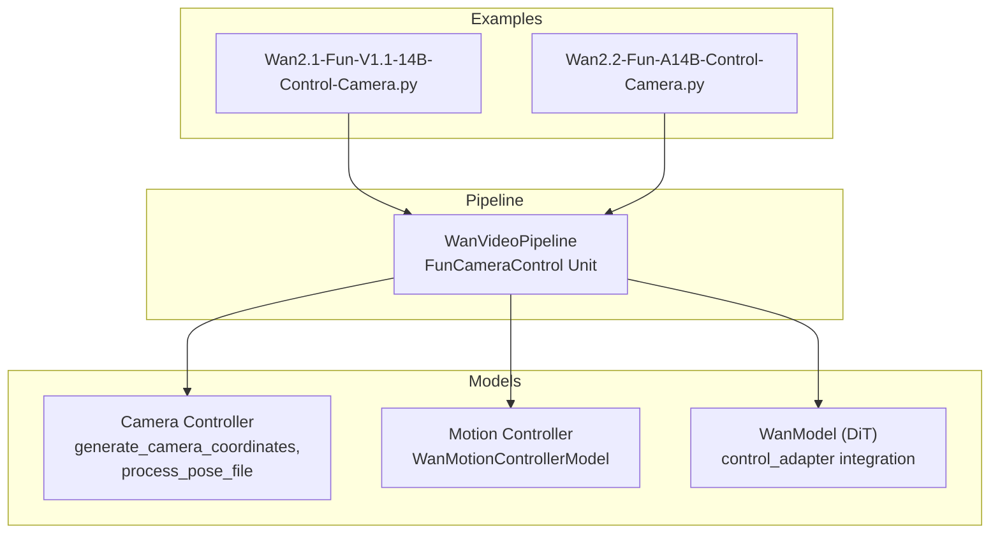
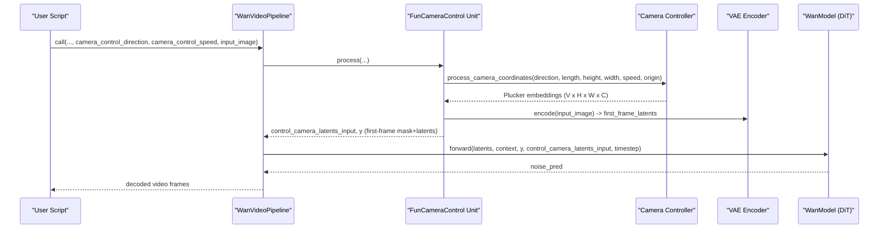
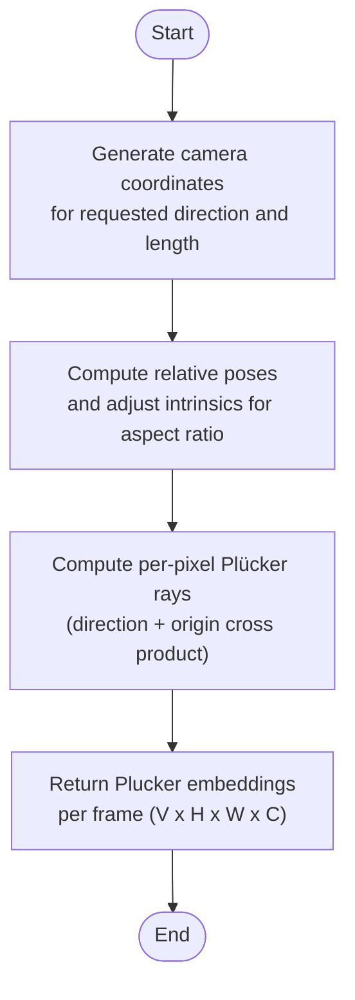
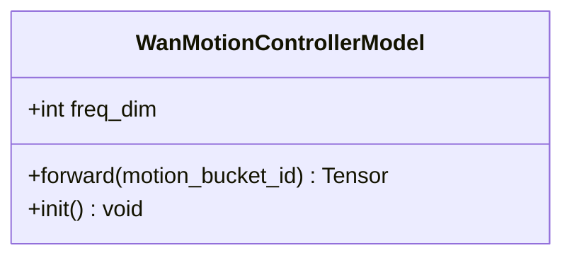
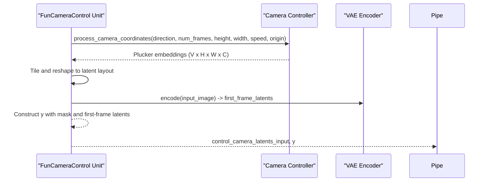
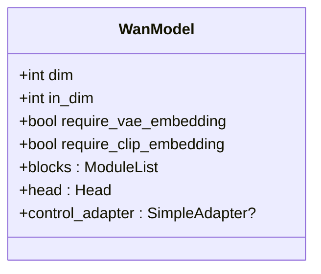
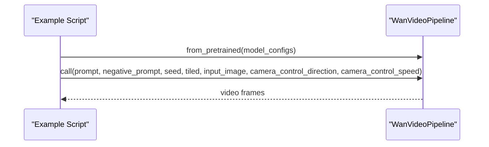
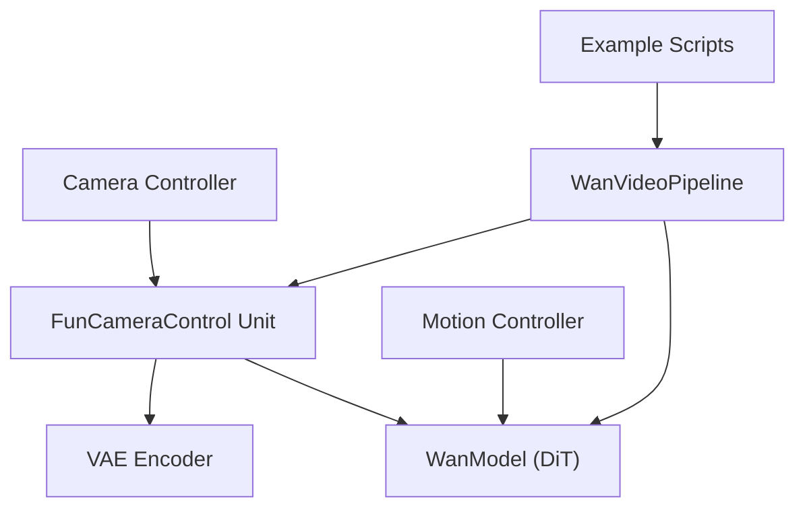

# Camera Control System

<cite>
**Referenced Files in This Document**
- [wan_video_camera_controller.py](file://diffsynth/models/wan_video_camera_controller.py)
- [wan_video_motion_controller.py](file://diffsynth/models/wan_video_motion_controller.py)
- [wan_video_dit.py](file://diffsynth/models/wan_video_dit.py)
- [wan_video.py](file://diffsynth/pipelines/wan_video.py)
- [Wan2.1-Fun-V1.1-14B-Control-Camera.py](file://examples/wanvideo/model_inference/Wan2.1-Fun-V1.1-14B-Control-Camera.py)
- [Wan2.2-Fun-A14B-Control-Camera.py](file://examples/wanvideo/model_inference/Wan2.2-Fun-A14B-Control-Camera.py)
</cite>

## Table of Contents
1. [Introduction](#introduction)
2. [Project Structure](#project-structure)
3. [Core Components](#core-components)
4. [Architecture Overview](#architecture-overview)
5. [Detailed Component Analysis](#detailed-component-analysis)
6. [Dependency Analysis](#dependency-analysis)
7. [Performance Considerations](#performance-considerations)
8. [Troubleshooting Guide](#troubleshooting-guide)
9. [Conclusion](#conclusion)
10. [Appendices](#appendices)

## Introduction
This document explains the WanVideo camera control system and how it simulates professional camera movements such as dolly, pan, tilt, jib, and zoom. It details the camera parameter space, coordinate systems, and how camera motions are encoded into Plücker ray embeddings that are integrated into the video generation pipeline. It also clarifies when to use camera controllers versus motion controllers, provides examples for generating videos with specific camera movements, and discusses trajectory specification, timing controls, and their effects on scene composition and viewer perception.

## Project Structure
The camera control functionality is implemented across a few key modules:
- A camera controller module that generates camera trajectories and converts them into Plücker embeddings.
- A motion controller module that encodes global motion intensity via a 1D embedding.
- The WanVideo pipeline unit that prepares camera control latents and first-frame conditioning.
- Example scripts demonstrating how to invoke camera control during inference.

**Diagram sources**
- [wan_video_camera_controller.py:184-207](file://diffsynth/models/wan_video_camera_controller.py#L184-L207)
- [wan_video_motion_controller.py:7-22](file://diffsynth/models/wan_video_motion_controller.py#L7-L22)
- [wan_video_dit.py:338-400](file://diffsynth/models/wan_video_dit.py#L338-L400)
- [wan_video.py:583-631](file://diffsynth/pipelines/wan_video.py#L583-L631)
- [Wan2.1-Fun-V1.1-14B-Control-Camera.py:28-44](file://examples/wanvideo/model_inference/Wan2.1-Fun-V1.1-14B-Control-Camera.py#L28-L44)
- [Wan2.2-Fun-A14B-Control-Camera.py:27-42](file://examples/wanvideo/model_inference/Wan2.2-Fun-A14B-Control-Camera.py#L27-L42)

**Section sources**
- [wan_video_camera_controller.py:1-207](file://diffsynth/models/wan_video_camera_controller.py#L1-L207)
- [wan_video_motion_controller.py:1-28](file://diffsynth/models/wan_video_motion_controller.py#L1-L28)
- [wan_video_dit.py:1-400](file://diffsynth/models/wan_video_dit.py#L1-L400)
- [wan_video.py:32-360](file://diffsynth/pipelines/wan_video.py#L32-L360)
- [Wan2.1-Fun-V1.1-14B-Control-Camera.py:1-45](file://examples/wanvideo/model_inference/Wan2.1-Fun-V1.1-14B-Control-Camera.py#L1-L45)
- [Wan2.2-Fun-A14B-Control-Camera.py:1-43](file://examples/wanvideo/model_inference/Wan2.2-Fun-A14B-Control-Camera.py#L1-L43)

## Core Components
- Camera Controller: Generates camera poses over time and converts them into per-pixel Plücker ray embeddings used as control signals.
- Motion Controller: Encodes a scalar motion bucket ID into a high-dimensional embedding that modulates overall motion intensity.
- Pipeline Integration: Prepares camera control latents and first-frame conditioning, then injects these into the DiT model through a control adapter.

Key responsibilities:
- Trajectory generation: linear increments along specified axes based on direction and speed.
- Pose processing: compute relative world-to-camera transforms and generate Plücker embeddings per frame.
- Latent preparation: tile and reshape Plücker frames to match VAE latent layout; prepare first-frame VAE latents for image-to-video.

**Section sources**
- [wan_video_camera_controller.py:77-107](file://diffsynth/models/wan_video_camera_controller.py#L77-L107)
- [wan_video_camera_controller.py:150-181](file://diffsynth/models/wan_video_camera_controller.py#L150-L181)
- [wan_video_camera_controller.py:184-207](file://diffsynth/models/wan_video_camera_controller.py#L184-L207)
- [wan_video_motion_controller.py:7-22](file://diffsynth/models/wan_video_motion_controller.py#L7-L22)
- [wan_video.py:583-631](file://diffsynth/pipelines/wan_video.py#L583-L631)

## Architecture Overview
The camera control flow integrates at the pipeline level by preparing control latents from Plücker embeddings and feeding them into the DiT model via a control adapter. The motion controller provides an independent signal for global motion intensity.

**Diagram sources**
- [wan_video.py:583-631](file://diffsynth/pipelines/wan_video.py#L583-L631)
- [wan_video_camera_controller.py:46-59](file://diffsynth/models/wan_video_camera_controller.py#L46-L59)
- [wan_video_camera_controller.py:150-181](file://diffsynth/models/wan_video_camera_controller.py#L150-L181)
- [wan_video_dit.py:338-400](file://diffsynth/models/wan_video_dit.py#L338-L400)

## Detailed Component Analysis

### Camera Controller: Trajectories and Plücker Embeddings
The camera controller defines:
- A simple adapter that can process camera coordinates into Plücker embeddings.
- A Camera class representing intrinsic parameters and world-to-camera matrices.
- Functions to compute relative poses and generate per-pixel Plücker rays.
- A generator that produces camera pose sequences for directions like Left, Right, Up, Down, In, Out.

Coordinate system and parameter space:
- Intrinsics: focal lengths fx, fy and principal point cx, cy.
- Poses: 4x4 world-to-camera matrices derived from entries; relative poses computed by aligning the first frame to a target transform.
- Plücker representation: per-pixel 6D vectors combining ray direction and cross product of origin and direction.

Trajectory encoding:
- Directional increments applied to specific pose components based on direction keywords.
- Speed controls the magnitude of incremental changes per frame.
- Origin allows specifying a starting pose configuration.

**Diagram sources**
- [wan_video_camera_controller.py:184-207](file://diffsynth/models/wan_video_camera_controller.py#L184-L207)
- [wan_video_camera_controller.py:92-107](file://diffsynth/models/wan_video_camera_controller.py#L92-L107)
- [wan_video_camera_controller.py:114-147](file://diffsynth/models/wan_video_camera_controller.py#L114-L147)
- [wan_video_camera_controller.py:150-181](file://diffsynth/models/wan_video_camera_controller.py#L150-L181)

**Section sources**
- [wan_video_camera_controller.py:77-107](file://diffsynth/models/wan_video_camera_controller.py#L77-L107)
- [wan_video_camera_controller.py:150-181](file://diffsynth/models/wan_video_camera_controller.py#L150-L181)
- [wan_video_camera_controller.py:184-207](file://diffsynth/models/wan_video_camera_controller.py#L184-L207)

### Motion Controller: Global Motion Intensity
The motion controller maps a scalar motion bucket ID to a high-dimensional embedding using sinusoidal positional encoding and a small MLP. This embedding modulates the DiT blocks to influence overall motion intensity.

**Diagram sources**
- [wan_video_motion_controller.py:7-22](file://diffsynth/models/wan_video_motion_controller.py#L7-L22)

**Section sources**
- [wan_video_motion_controller.py:7-22](file://diffsynth/models/wan_video_motion_controller.py#L7-L22)

### Pipeline Integration: FunCameraControl Unit
The FunCameraControl unit:
- Calls the camera controller to produce Plücker embeddings for the requested number of frames.
- Tiles and reshapes these embeddings to match the VAE latent structure.
- Encodes the input image to obtain first-frame latents and constructs a mask indicating the first frame.
- Outputs control_camera_latents_input and y (conditioning tensor) for the DiT model.

**Diagram sources**
- [wan_video.py:583-631](file://diffsynth/pipelines/wan_video.py#L583-L631)
- [wan_video_camera_controller.py:46-59](file://diffsynth/models/wan_video_camera_controller.py#L46-L59)

**Section sources**
- [wan_video.py:583-631](file://diffsynth/pipelines/wan_video.py#L583-L631)

### DiT Integration: Control Adapter
The DiT model supports an optional control adapter that consumes camera control latents. The pipeline passes control_camera_latents_input alongside latents and other conditioning tensors during the denoising loop.

**Diagram sources**
- [wan_video_dit.py:338-400](file://diffsynth/models/wan_video_dit.py#L338-L400)

**Section sources**
- [wan_video_dit.py:338-400](file://diffsynth/models/wan_video_dit.py#L338-L400)

### Examples: Generating Videos with Camera Movements
Example scripts demonstrate invoking camera control with different directions and speeds:
- “Left” and “Up” directions are shown with a small speed value.
- These scripts load the appropriate model configurations and pass camera_control_direction and camera_control_speed to the pipeline.

**Diagram sources**
- [Wan2.1-Fun-V1.1-14B-Control-Camera.py:28-44](file://examples/wanvideo/model_inference/Wan2.1-Fun-V1.1-14B-Control-Camera.py#L28-L44)
- [Wan2.2-Fun-A14B-Control-Camera.py:27-42](file://examples/wanvideo/model_inference/Wan2.2-Fun-A14B-Control-Camera.py#L27-L42)

**Section sources**
- [Wan2.1-Fun-V1.1-14B-Control-Camera.py:1-45](file://examples/wanvideo/model_inference/Wan2.1-Fun-V1.1-14B-Control-Camera.py#L1-L45)
- [Wan2.2-Fun-A14B-Control-Camera.py:1-43](file://examples/wanvideo/model_inference/Wan2.2-Fun-A14B-Control-Camera.py#L1-L43)

## Dependency Analysis
The camera control system depends on:
- The camera controller for trajectory generation and Plücker embedding computation.
- The VAE encoder for first-frame conditioning.
- The DiT model’s control adapter for integrating camera control signals.
- The pipeline units for orchestrating data flow and tensor shapes.

**Diagram sources**
- [wan_video_camera_controller.py:46-59](file://diffsynth/models/wan_video_camera_controller.py#L46-L59)
- [wan_video.py:583-631](file://diffsynth/pipelines/wan_video.py#L583-L631)
- [wan_video_motion_controller.py:7-22](file://diffsynth/models/wan_video_motion_controller.py#L7-L22)
- [wan_video_dit.py:338-400](file://diffsynth/models/wan_video_dit.py#L338-L400)

**Section sources**
- [wan_video_camera_controller.py:1-207](file://diffsynth/models/wan_video_camera_controller.py#L1-L207)
- [wan_video_motion_controller.py:1-28](file://diffsynth/models/wan_video_motion_controller.py#L1-L28)
- [wan_video_dit.py:1-400](file://diffsynth/models/wan_video_dit.py#L1-L400)
- [wan_video.py:32-360](file://diffsynth/pipelines/wan_video.py#L32-L360)

## Performance Considerations
- Tiling: The pipeline supports tiled encoding/decoding to reduce memory usage during large resolutions or long sequences.
- Sequence parallelism: Optional unified sequence parallelism can be enabled to distribute computation across devices.
- TeaCache: An optional caching mechanism can skip certain steps based on similarity thresholds to accelerate inference.
- Precision: Using bfloat16 reduces memory footprint while maintaining quality.

[No sources needed since this section provides general guidance]

## Troubleshooting Guide
Common issues and remedies:
- Mismatched dimensions: Ensure height, width, and num_frames satisfy the pipeline’s division factors and VAE constraints.
- Missing control adapter: If the DiT model lacks a control adapter, camera control latents will not be integrated; verify model configuration.
- Incorrect aspect ratios: Adjust camera controller origin or ensure intrinsic scaling matches sample resolution.
- Motion vs camera control confusion: Use motion_bucket_id for global motion intensity; use camera_control_direction/speed for spatial camera movement.

**Section sources**
- [wan_video.py:32-360](file://diffsynth/pipelines/wan_video.py#L32-L360)
- [wan_video_camera_controller.py:150-181](file://diffsynth/models/wan_video_camera_controller.py#L150-L181)
- [wan_video_motion_controller.py:7-22](file://diffsynth/models/wan_video_motion_controller.py#L7-L22)

## Conclusion
The WanVideo camera control system provides a robust framework for simulating professional camera movements through Plücker ray embeddings and a control adapter integrated into the DiT model. By separating spatial camera control from global motion intensity, users can precisely craft camera trajectories and tune motion dynamics. The pipeline’s modular design enables flexible integration, performance optimizations, and straightforward usage via example scripts.

[No sources needed since this section summarizes without analyzing specific files]

## Appendices

### Camera Parameter Space and Coordinate Systems
- Intrinsics: fx, fy, cx, cy define the camera’s focal lengths and principal point.
- Poses: 4x4 world-to-camera matrices represent orientation and position; relative poses align sequences to a common reference.
- Plücker rays: Per-pixel 6D vectors encode ray direction and origin cross product, providing a compact representation of viewing geometry.

**Section sources**
- [wan_video_camera_controller.py:77-107](file://diffsynth/models/wan_video_camera_controller.py#L77-L107)
- [wan_video_camera_controller.py:114-147](file://diffsynth/models/wan_video_camera_controller.py#L114-L147)

### When to Use Camera Controllers vs Motion Controllers
- Camera controllers: Use for directional movements (pan, tilt, dolly, jib, zoom) defined by direction and speed.
- Motion controllers: Use for global motion intensity via motion_bucket_id, independent of spatial camera paths.

**Section sources**
- [wan_video_camera_controller.py:184-207](file://diffsynth/models/wan_video_camera_controller.py#L184-L207)
- [wan_video_motion_controller.py:7-22](file://diffsynth/models/wan_video_motion_controller.py#L7-L22)

### Examples of Camera Movements
- Dolly in/out: Use direction “In” or “Out” with appropriate speed.
- Pan left/right: Use direction “Left” or “Right”.
- Jib up/down: Use direction “Up” or “Down”.
- Complex multi-axis paths: Combine multiple directions by chaining calls or adjusting origin and speed iteratively.

**Section sources**
- [Wan2.1-Fun-V1.1-14B-Control-Camera.py:28-44](file://examples/wanvideo/model_inference/Wan2.1-Fun-V1.1-14B-Control-Camera.py#L28-L44)
- [Wan2.2-Fun-A14B-Control-Camera.py:27-42](file://examples/wanvideo/model_inference/Wan2.2-Fun-A14B-Control-Camera.py#L27-L42)