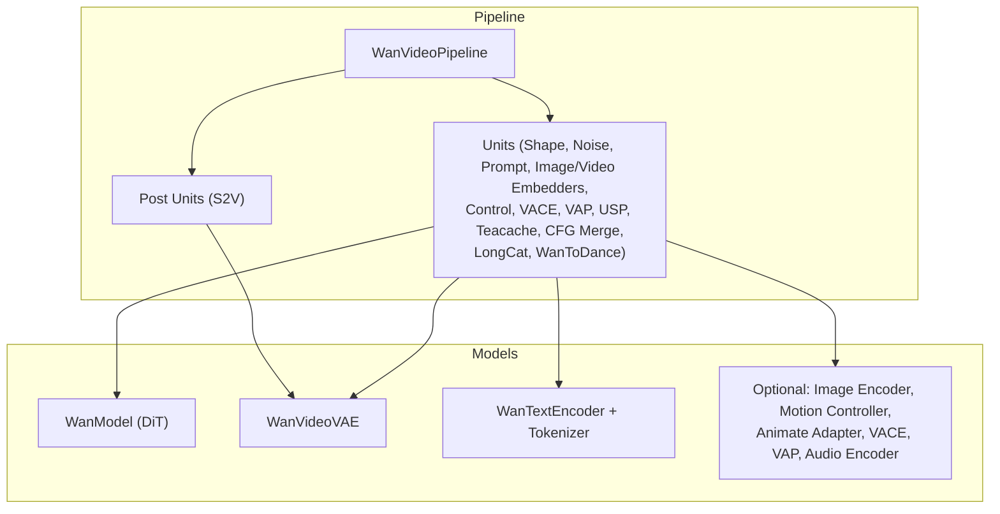
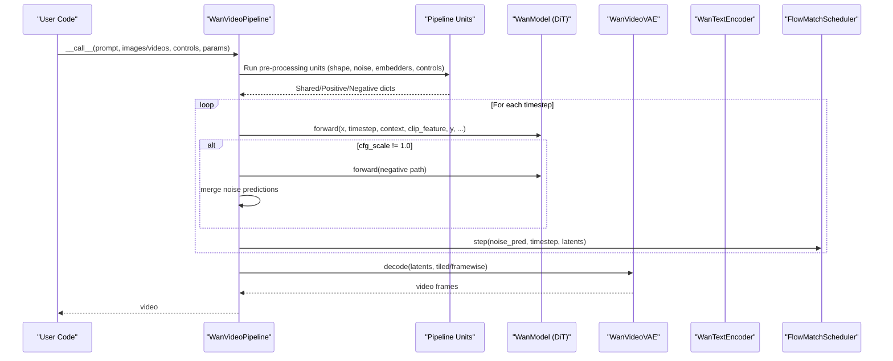
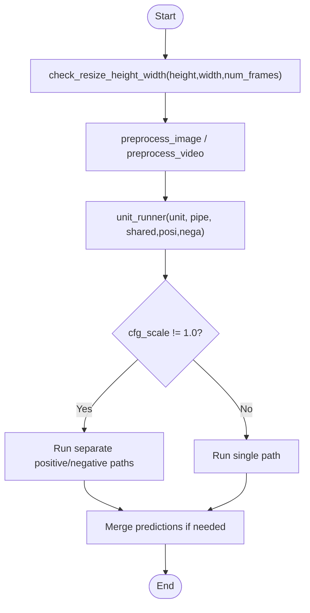
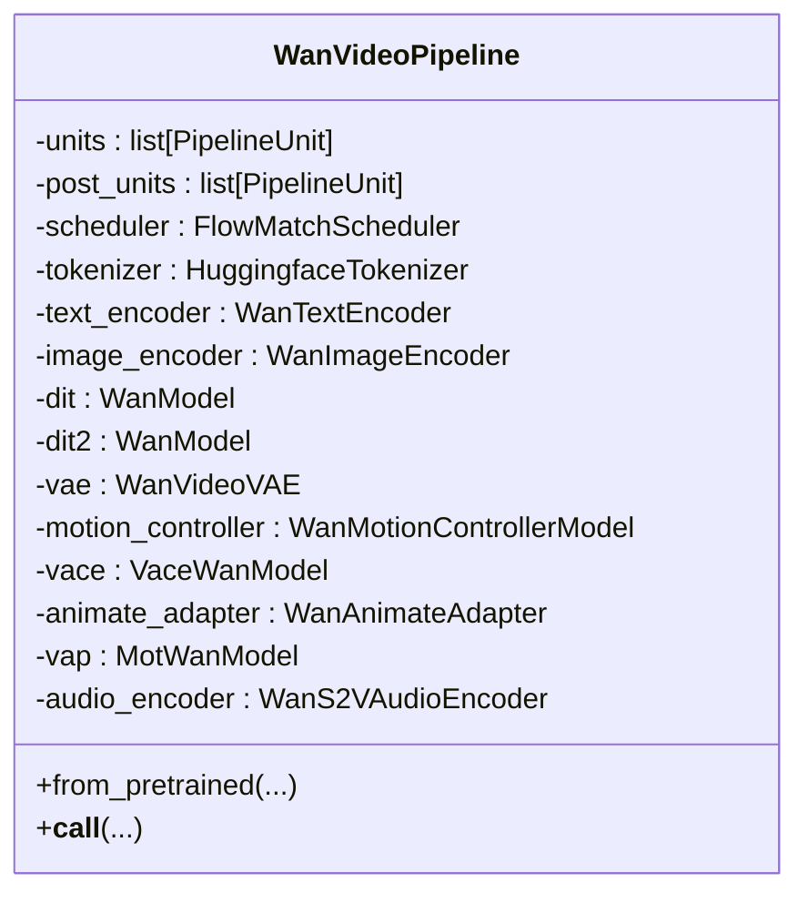
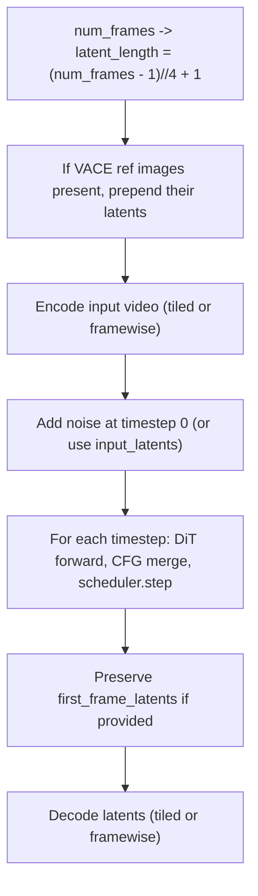
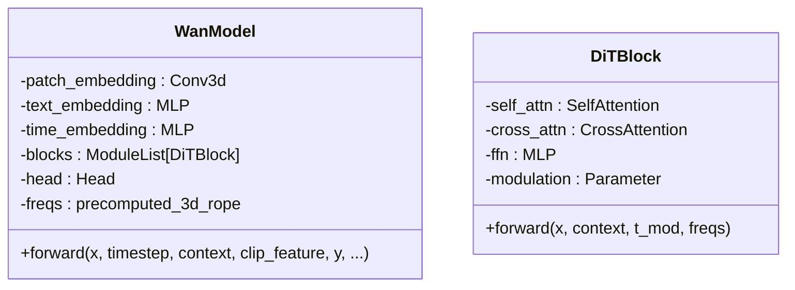
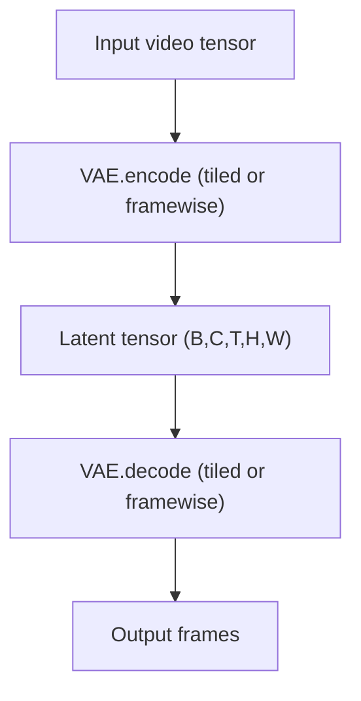
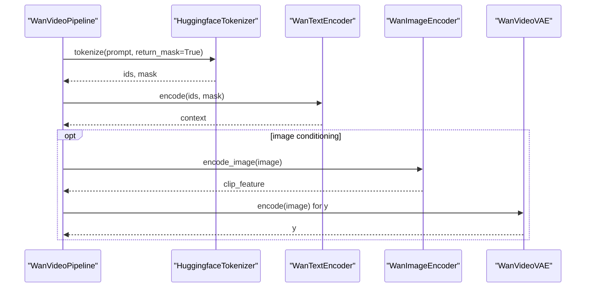
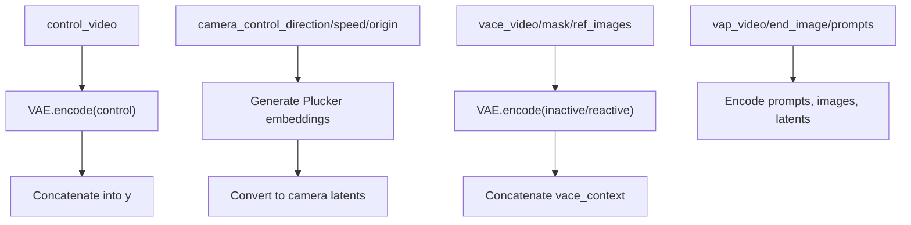
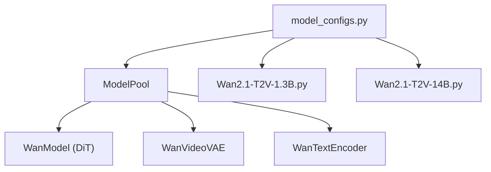

# Core WanVideo Pipeline Architecture

<cite>
**Referenced Files in This Document**
- [wan_video.py](file://diffsynth/pipelines/wan_video.py)
- [base_pipeline.py](file://diffsynth/diffusion/base_pipeline.py)
- [wan_video_dit.py](file://diffsynth/models/wan_video_dit.py)
- [wan_video_vae.py](file://diffsynth/models/wan_video_vae.py)
- [wan_video_text_encoder.py](file://diffsynth/models/wan_video_text_encoder.py)
- [model_configs.py](file://diffsynth/configs/model_configs.py)
- [Wan2.1-T2V-1.3B.py](file://examples/wanvideo/model_inference/Wan2.1-T2V-1.3B.py)
- [Wan2.1-T2V-14B.py](file://examples/wanvideo/model_inference/Wan2.1-T2V-14B.py)
</cite>

## Table of Contents
1. [Introduction](#introduction)
2. [Project Structure](#project-structure)
3. [Core Components](#core-components)
4. [Architecture Overview](#architecture-overview)
5. [Detailed Component Analysis](#detailed-component-analysis)
6. [Dependency Analysis](#dependency-analysis)
7. [Performance Considerations](#performance-considerations)
8. [Troubleshooting Guide](#troubleshooting-guide)
9. [Conclusion](#conclusion)
10. [Appendices](#appendices)

## Introduction
This document explains the core WanVideo pipeline architecture for text-to-video and related generation modes. It covers the base pipeline structure, temporal processing workflow, memory management differences between video and image generation, and the overall flow from prompts to video output. It also documents frame scheduling, temporal consistency mechanisms, variable-length video handling, and how configuration maps to model variants (e.g., 1.3B vs 14B).

## Project Structure
The WanVideo pipeline is implemented as a modular DiffSynth pipeline:
- Base pipeline framework defines unit-driven execution, VRAM management, and common utilities.
- The WanVideo pipeline composes multiple units for prompt embedding, image/video conditioning, control signals, VACE/VAP features, sequence parallelism, and decoding.
- Models include the DiT transformer, VAE encoder/decoder, text encoder, and optional encoders/adapters.

**Diagram sources**
- [wan_video.py:32-86](file://diffsynth/pipelines/wan_video.py#L32-L86)
- [base_pipeline.py:61-115](file://diffsynth/diffusion/base_pipeline.py#L61-L115)
- [wan_video_dit.py:338-423](file://diffsynth/models/wan_video_dit.py#L338-L423)
- [wan_video_vae.py:517-618](file://diffsynth/models/wan_video_vae.py#L517-L618)
- [wan_video_text_encoder.py:212-258](file://diffsynth/models/wan_video_text_encoder.py#L212-L258)

**Section sources**
- [wan_video.py:32-86](file://diffsynth/pipelines/wan_video.py#L32-L86)
- [base_pipeline.py:61-115](file://diffsynth/diffusion/base_pipeline.py#L61-L115)

## Core Components
- WanVideoPipeline orchestrates inputs, units, denoising loop, and decoding.
- BasePipeline provides shape checks, preprocessing, VRAM management, LoRA loading, and unit runner.
- WanModel (DiT) implements 3D attention with RoPE, cross-attention to text/image context, and modulation.
- WanVideoVAE provides causal 3D convolutions and tiled encode/decode for memory efficiency.
- WanTextEncoder and HuggingfaceTokenizer produce text embeddings.

Key responsibilities:
- Shape normalization and time dimension constraints.
- Unit-based data preparation and conditioning.
- Iterative denoising with scheduler steps and CFG merging.
- Optional switching between two DiTs based on timestep boundary.
- Tiled decode and framewise decode options for long videos.

**Section sources**
- [wan_video.py:32-86](file://diffsynth/pipelines/wan_video.py#L32-L86)
- [wan_video.py:189-359](file://diffsynth/pipelines/wan_video.py#L189-L359)
- [base_pipeline.py:97-115](file://diffsynth/diffusion/base_pipeline.py#L97-L115)
- [base_pipeline.py:157-187](file://diffsynth/diffusion/base_pipeline.py#L157-L187)
- [wan_video_dit.py:338-423](file://diffsynth/models/wan_video_dit.py#L338-L423)
- [wan_video_vae.py:517-618](file://diffsynth/models/wan_video_vae.py#L517-L618)
- [wan_video_text_encoder.py:212-258](file://diffsynth/models/wan_video_text_encoder.py#L212-L258)

## Architecture Overview
The pipeline follows a unit-driven graph where each unit transforms shared, positive, and negative contexts. The denoising loop applies the DiT forward pass per timestep, optionally switches models, merges CFG, and updates latents via the FlowMatchScheduler. Finally, the VAE decodes latents into frames.

**Diagram sources**
- [wan_video.py:189-359](file://diffsynth/pipelines/wan_video.py#L189-L359)
- [wan_video_dit.py:510-551](file://diffsynth/models/wan_video_dit.py#L510-L551)
- [wan_video_vae.py:736-800](file://diffsynth/models/wan_video_vae.py#L736-L800)
- [wan_video_text_encoder.py:212-258](file://diffsynth/models/wan_video_text_encoder.py#L212-L258)

## Detailed Component Analysis

### Base Pipeline and Unit Runner
- BasePipeline enforces height/width/time divisibility factors and provides preprocessors for images/videos.
- PipelineUnitRunner executes units with support for separate CFG paths and takeover semantics.
- VRAM management toggles offload/onload for modules when enabled.

**Diagram sources**
- [base_pipeline.py:97-115](file://diffsynth/diffusion/base_pipeline.py#L97-L115)
- [base_pipeline.py:470-501](file://diffsynth/diffusion/base_pipeline.py#L470-L501)

**Section sources**
- [base_pipeline.py:61-115](file://diffsynth/diffusion/base_pipeline.py#L61-L115)
- [base_pipeline.py:470-501](file://diffsynth/diffusion/base_pipeline.py#L470-L501)

### WanVideoPipeline: Initialization and Call Flow
- from_pretrained configures tokenizer, audio processor, downloads and loads models, sets division factors, and enables USP if requested.
- __call__ sets scheduler timesteps, prepares input dictionaries, runs units, iterates denoising steps, optionally switches DiT, applies CFG, updates latents, runs post units, and decodes.

**Diagram sources**
- [wan_video.py:32-86](file://diffsynth/pipelines/wan_video.py#L32-L86)
- [wan_video.py:111-186](file://diffsynth/pipelines/wan_video.py#L111-L186)
- [wan_video.py:189-359](file://diffsynth/pipelines/wan_video.py#L189-L359)

**Section sources**
- [wan_video.py:111-186](file://diffsynth/pipelines/wan_video.py#L111-L186)
- [wan_video.py:189-359](file://diffsynth/pipelines/wan_video.py#L189-L359)

### Temporal Processing Workflow and Frame Scheduling
- Time dimension is constrained by time_division_factor and remainder; units compute latent length accordingly.
- Input video encoding supports tiled and framewise modes; reference images can be concatenated along the temporal axis for VACE.
- Denoising loop uses FlowMatchScheduler timesteps; first-frame latents can be preserved across steps.

**Diagram sources**
- [wan_video.py:376-393](file://diffsynth/pipelines/wan_video.py#L376-L393)
- [wan_video.py:396-424](file://diffsynth/pipelines/wan_video.py#L396-L424)
- [wan_video.py:312-359](file://diffsynth/pipelines/wan_video.py#L312-L359)

**Section sources**
- [wan_video.py:376-424](file://diffsynth/pipelines/wan_video.py#L376-L424)
- [wan_video.py:312-359](file://diffsynth/pipelines/wan_video.py#L312-L359)

### DiT Model and Temporal Consistency
- WanModel uses 3D patching, sinusoidal time embedding, and 3D RoPE frequencies for spatiotemporal consistency.
- Cross-attention integrates text and optional image features; modulation parameters are derived from time embedding.
- Gradient checkpointing is available during training; inference uses direct block calls.

**Diagram sources**
- [wan_video_dit.py:338-423](file://diffsynth/models/wan_video_dit.py#L338-L423)
- [wan_video_dit.py:211-245](file://diffsynth/models/wan_video_dit.py#L211-L245)
- [wan_video_dit.py:510-551](file://diffsynth/models/wan_video_dit.py#L510-L551)

**Section sources**
- [wan_video_dit.py:338-423](file://diffsynth/models/wan_video_dit.py#L338-L423)
- [wan_video_dit.py:510-551](file://diffsynth/models/wan_video_dit.py#L510-L551)

### VAE Encoding/Decoding and Memory Management
- WanVideoVAE employs causal 3D convolutions and feature caching for chunked processing.
- Supports tiled encode/decode to reduce peak memory usage; framewise decode processes frames sequentially.
- Upsampling/downsampling blocks manage temporal and spatial resolution changes.

**Diagram sources**
- [wan_video_vae.py:517-618](file://diffsynth/models/wan_video_vae.py#L517-L618)
- [wan_video_vae.py:736-800](file://diffsynth/models/wan_video_vae.py#L736-L800)

**Section sources**
- [wan_video_vae.py:517-618](file://diffsynth/models/wan_video_vae.py#L517-L618)
- [wan_video_vae.py:736-800](file://diffsynth/models/wan_video_vae.py#L736-L800)

### Text and Image Conditioning
- WanTextEncoder tokenizes and encodes prompts; HuggingfaceTokenizer handles cleaning and truncation.
- Image encoders provide CLIP features; VAE-based image embeddings can be fused into latents for specific model variants.

**Diagram sources**
- [wan_video_text_encoder.py:285-330](file://diffsynth/models/wan_video_text_encoder.py#L285-L330)
- [wan_video_text_encoder.py:212-258](file://diffsynth/models/wan_video_text_encoder.py#L212-L258)
- [wan_video.py:427-451](file://diffsynth/pipelines/wan_video.py#L427-L451)
- [wan_video.py:454-509](file://diffsynth/pipelines/wan_video.py#L454-L509)

**Section sources**
- [wan_video_text_encoder.py:285-330](file://diffsynth/models/wan_video_text_encoder.py#L285-L330)
- [wan_video.py:427-509](file://diffsynth/pipelines/wan_video.py#L427-L509)

### Control, VACE, VAP, and Advanced Features
- FunControl injects control video latents into y.
- Camera control generates Plucker embeddings and converts to latents.
- VACE concatenates inactive/reactive latents and masks; supports reference images prepended temporally.
- VAP takes over processing to integrate video prompts, end images, and hidden states.

**Diagram sources**
- [wan_video.py:534-557](file://diffsynth/pipelines/wan_video.py#L534-L557)
- [wan_video.py:583-631](file://diffsynth/pipelines/wan_video.py#L583-L631)
- [wan_video.py:649-710](file://diffsynth/pipelines/wan_video.py#L649-L710)
- [wan_video.py:712-787](file://diffsynth/pipelines/wan_video.py#L712-L787)

**Section sources**
- [wan_video.py:534-787](file://diffsynth/pipelines/wan_video.py#L534-L787)

### Sequence Parallelism and Teacache
- UnifiedSequenceParallel unit flags enable distributed attention and DiT/VACE forward patches.
- Teacache unit integrates caching for acceleration.

**Section sources**
- [wan_video.py:790-800](file://diffsynth/pipelines/wan_video.py#L790-L800)
- [wan_video.py:89-108](file://diffsynth/pipelines/wan_video.py#L89-L108)

## Dependency Analysis
- WanVideoPipeline depends on BasePipeline for unit execution and VRAM management.
- Models are loaded via ModelPool configured by model_configs entries.
- Examples demonstrate instantiation with different model IDs and file patterns.

**Diagram sources**
- [model_configs.py:82-317](file://diffsynth/configs/model_configs.py#L82-L317)
- [Wan2.1-T2V-1.3B.py:7-16](file://examples/wanvideo/model_inference/Wan2.1-T2V-1.3B.py#L7-L16)
- [Wan2.1-T2V-14B.py:7-16](file://examples/wanvideo/model_inference/Wan2.1-T2V-14B.py#L7-L16)

**Section sources**
- [model_configs.py:82-317](file://diffsynth/configs/model_configs.py#L82-L317)
- [Wan2.1-T2V-1.3B.py:7-16](file://examples/wanvideo/model_inference/Wan2.1-T2V-1.3B.py#L7-L16)
- [Wan2.1-T2V-14B.py:7-16](file://examples/wanvideo/model_inference/Wan2.1-T2V-14B.py#L7-L16)

## Performance Considerations
- VRAM management: Offload non-active modules and empty cache before onload; reduces peak memory for large models.
- Tiled decode/encode: Splits spatial-temporal tiles to fit within GPU memory limits.
- Framewise decode: Processes frames sequentially to avoid large batch tensors.
- Switch_DiT_boundary: Allows using a second DiT for low-noise steps to improve quality/performance trade-offs.
- Sequence parallelism: Distributes attention computations across devices.
- Teacache: Caches intermediate activations to speed up repeated computations.

[No sources needed since this section provides general guidance]

## Troubleshooting Guide
- Shape errors: Ensure height/width divisible by 16 and num_frames satisfies time_division_factor and remainder; the pipeline rounds up automatically but may print warnings.
- OOM during decode: Use tiled=True and adjust tile_size/tile_stride; consider framewise_decoding for very long videos.
- CFG instability: Reduce cfg_scale or enable cfg_merge to stabilize predictions.
- Model mismatch: Verify model_configs match expected origin_file_pattern and model_id; ensure tokenizer_config aligns with text encoder expectations.
- VRAM issues: Enable vram_management_enabled via model configurations that support it; call load_models_to_device with minimal set during critical phases.

**Section sources**
- [base_pipeline.py:97-115](file://diffsynth/diffusion/base_pipeline.py#L97-L115)
- [wan_video.py:312-359](file://diffsynth/pipelines/wan_video.py#L312-L359)
- [wan_video.py:189-359](file://diffsynth/pipelines/wan_video.py#L189-L359)

## Conclusion
The WanVideo pipeline provides a flexible, unit-driven architecture for high-quality video generation. It integrates robust temporal modeling through 3D attention and RoPE, efficient memory management via tiled and framewise operations, and configurable conditioning pathways for diverse tasks. By mapping model configurations to specific variants (1.3B, 14B), users can balance performance and quality while leveraging advanced features like camera control, VACE, and sequence parallelism.

[No sources needed since this section summarizes without analyzing specific files]

## Appendices

### Example Usage: 1.3B and 14B Variants
- 1.3B example demonstrates text-to-video and video-to-video workflows with tiled decoding.
- 14B example shows similar usage with larger model weights.

**Section sources**
- [Wan2.1-T2V-1.3B.py:7-24](file://examples/wanvideo/model_inference/Wan2.1-T2V-1.3B.py#L7-L24)
- [Wan2.1-T2V-14B.py:7-24](file://examples/wanvideo/model_inference/Wan2.1-T2V-14B.py#L7-L24)

### Relationship Between Configuration and Model Selection
- model_configs specify model_class, extra_kwargs, and state_dict_converter to instantiate correct DiT variants and supporting components.
- Different variants configure has_image_input, in_dim, dim, ffn_dim, num_heads, num_layers, and other flags to tailor behavior (e.g., requiring CLIP embeddings, enabling control adapters).

**Section sources**
- [model_configs.py:82-317](file://diffsynth/configs/model_configs.py#L82-L317)