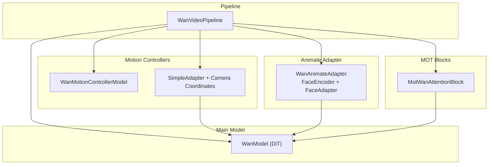
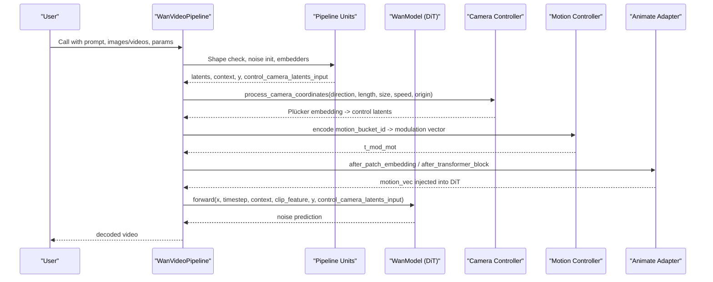
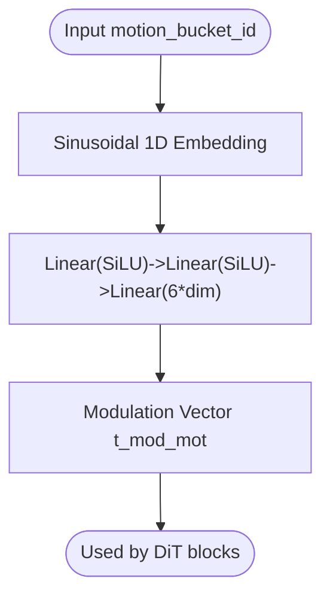
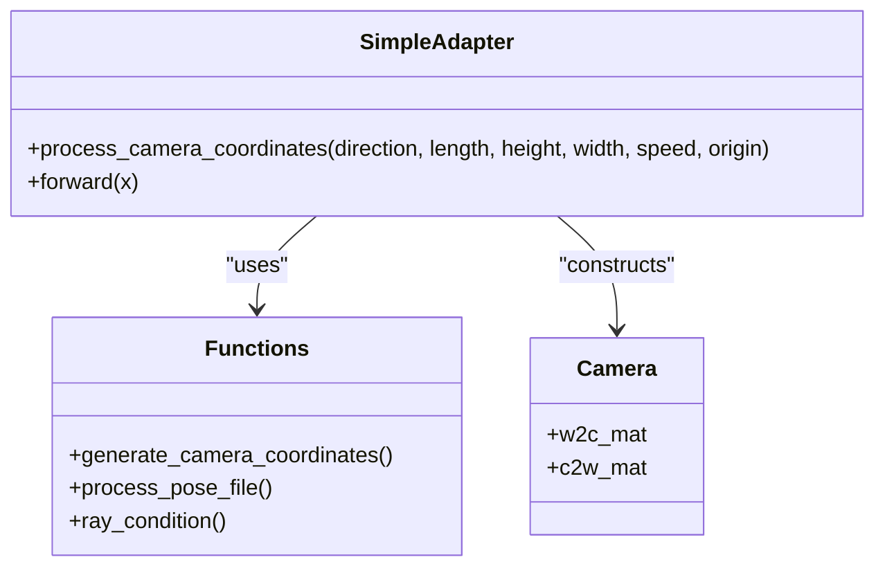
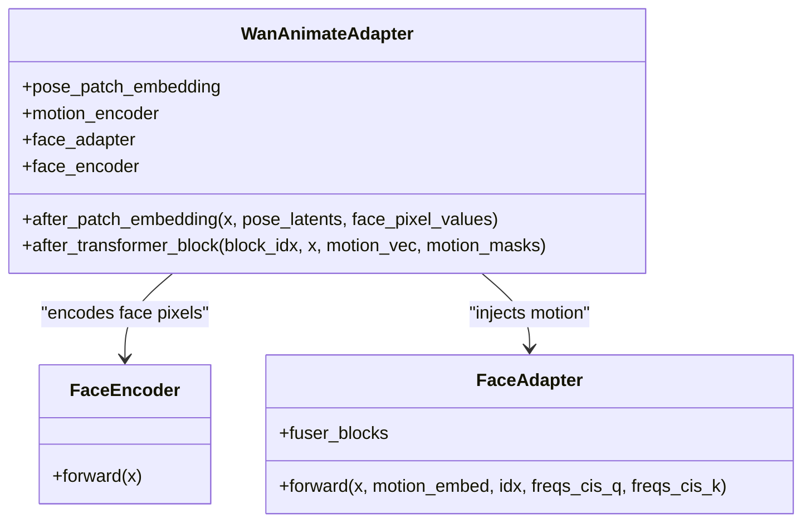
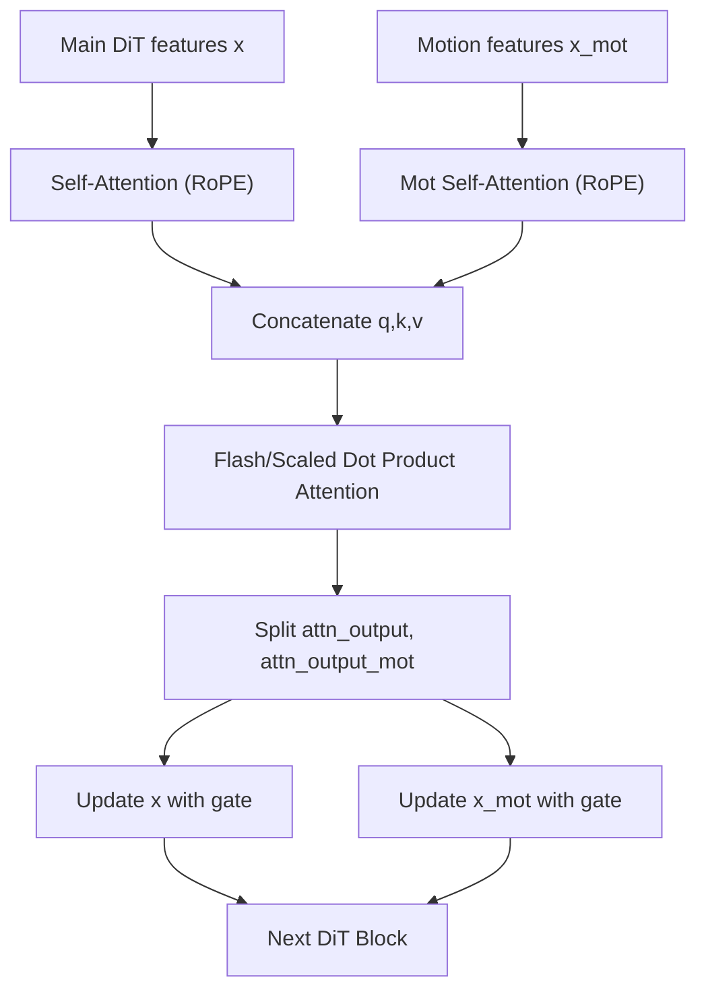
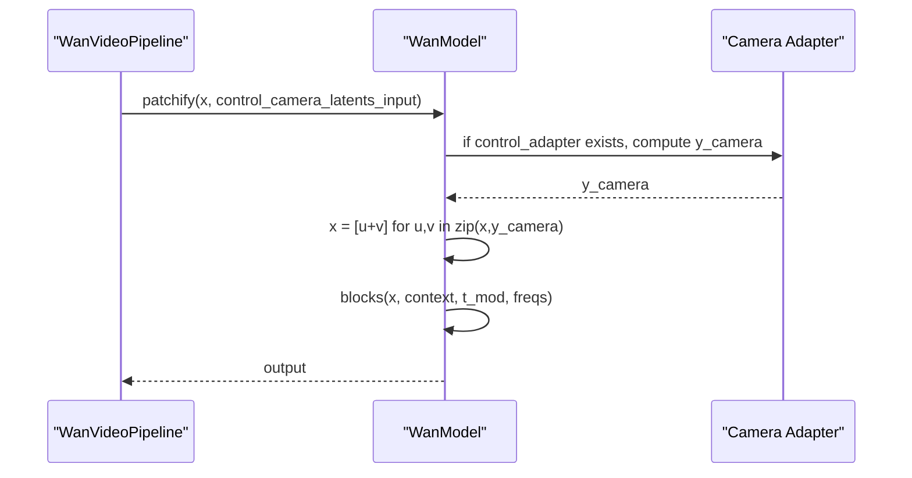
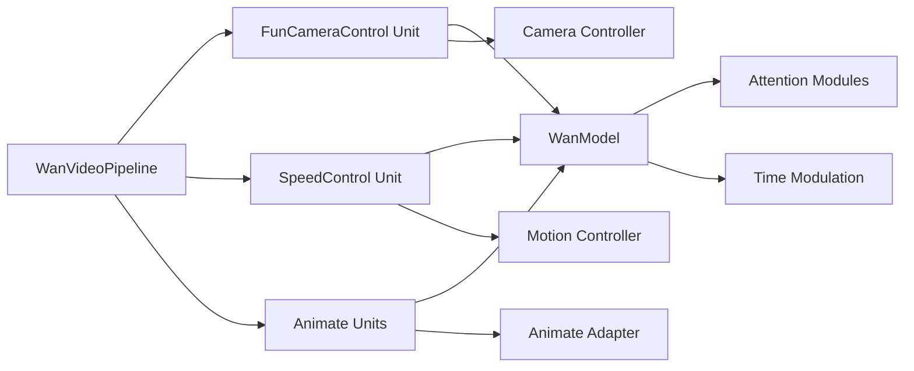

# Motion Control System

<cite>
**Referenced Files in This Document**
- [wan_video_motion_controller.py](file://diffsynth/models/wan_video_motion_controller.py)
- [wan_video_animate_adapter.py](file://diffsynth/models/wan_video_animate_adapter.py)
- [wan_video_camera_controller.py](file://diffsynth/models/wan_video_camera_controller.py)
- [wan_video_mot.py](file://diffsynth/models/wan_video_mot.py)
- [wan_video_dit.py](file://diffsynth/models/wan_video_dit.py)
- [wan_video.py](file://diffsynth/pipelines/wan_video.py)
- [Wan2.2-Animate-14B.py](file://examples/wanvideo/model_inference/Wan2.2-Animate-14B.py)
- [Wan2.2-Fun-A14B-Control-Camera.py](file://examples/wanvideo/model_inference/Wan2.2-Fun-A14B-Control-Camera.py)
</cite>

## Table of Contents
1. [Introduction](#introduction)
2. [Project Structure](#project-structure)
3. [Core Components](#core-components)
4. [Architecture Overview](#architecture-overview)
5. [Detailed Component Analysis](#detailed-component-analysis)
6. [Dependency Analysis](#dependency-analysis)
7. [Performance Considerations](#performance-considerations)
8. [Troubleshooting Guide](#troubleshooting-guide)
9. [Conclusion](#conclusion)
10. [Appendices](#appendices)

## Introduction
This document explains the WanVideo motion control system, focusing on how motion controllers enable precise control over object movement, camera motion, and temporal dynamics in generated videos. It covers:
- Motion encoding via a dedicated motion controller
- Temporal attention modulation through specialized blocks
- Integration with the main diffusion transformer (DiT)
- Animate adapter for transferring motion patterns between videos
- Practical examples for panning, zooming, tracking shots, and choreographed movements
- Conditioning parameters, strength controls, and combining multiple motion signals

## Project Structure
The motion control system spans several modules:
- Motion controller model for speed/motion bucket conditioning
- Camera controller for generating Plücker embeddings from camera trajectories
- Animate adapter for pose/face-driven motion transfer
- MOT (motion transformer) blocks that inject temporal attention into DiT
- Pipeline units that prepare inputs and integrate these components during inference

**Diagram sources**
- [wan_video_motion_controller.py:7-28](file://diffsynth/models/wan_video_motion_controller.py#L7-L28)
- [wan_video_camera_controller.py:8-60](file://diffsynth/models/wan_video_camera_controller.py#L8-L60)
- [wan_video_animate_adapter.py:615-651](file://diffsynth/models/wan_video_animate_adapter.py#L615-L651)
- [wan_video_mot.py:94-170](file://diffsynth/models/wan_video_mot.py#L94-L170)
- [wan_video_dit.py:338-552](file://diffsynth/models/wan_video_dit.py#L338-L552)
- [wan_video.py:32-359](file://diffsynth/pipelines/wan_video.py#L32-L359)

**Section sources**
- [wan_video_motion_controller.py:7-28](file://diffsynth/models/wan_video_motion_controller.py#L7-L28)
- [wan_video_camera_controller.py:8-60](file://diffsynth/models/wan_video_camera_controller.py#L8-L60)
- [wan_video_animate_adapter.py:615-651](file://diffsynth/models/wan_video_animate_adapter.py#L615-L651)
- [wan_video_mot.py:94-170](file://diffsynth/models/wan_video_mot.py#L94-L170)
- [wan_video_dit.py:338-552](file://diffsynth/models/wan_video_dit.py#L338-L552)
- [wan_video.py:32-359](file://diffsynth/pipelines/wan_video.py#L32-L359)

## Core Components
- WanMotionControllerModel: Encodes a motion bucket ID into a modulating vector used by DiT to adjust temporal dynamics.
- SimpleAdapter and Camera utilities: Generate Plücker embeddings from camera trajectory parameters and fuse them into DiT latents.
- WanAnimateAdapter: Extracts motion vectors from face pixel values and integrates them via cross-attention adapters at selected DiT layers.
- MotWanModel and MotWanAttentionBlock: Inject motion-specific self-attention streams alongside the main DiT stream, enabling temporal modulation.
- WanModel (DiT): The core diffusion transformer; accepts time embeddings, text/image context, optional camera latents, and optionally merges motion features.

Key responsibilities:
- Encode motion signals (speed, camera, pose/face) into latent-compatible forms
- Modulate DiT activations via modulation vectors or residual injections
- Provide pipeline units to assemble inputs and orchestrate inference

**Section sources**
- [wan_video_motion_controller.py:7-28](file://diffsynth/models/wan_video_motion_controller.py#L7-L28)
- [wan_video_camera_controller.py:8-60](file://diffsynth/models/wan_video_camera_controller.py#L8-L60)
- [wan_video_animate_adapter.py:615-651](file://diffsynth/models/wan_video_animate_adapter.py#L615-L651)
- [wan_video_mot.py:94-170](file://diffsynth/models/wan_video_mot.py#L94-L170)
- [wan_video_dit.py:338-552](file://diffsynth/models/wan_video_dit.py#L338-L552)
- [wan_video.py:583-631](file://diffsynth/pipelines/wan_video.py#L583-L631)

## Architecture Overview
At inference time, the pipeline prepares motion-related inputs and feeds them into the DiT. Motion control is applied through three primary channels:
- Speed/Motion Bucket: A scalar motion bucket ID is encoded and projected to modulation parameters that scale/shift DiT activations.
- Camera Control: Plücker embeddings derived from camera trajectories are transformed into control latents and added to DiT patch embeddings.
- Animate Motion Transfer: Pose and face videos produce motion vectors that are fused into DiT via adapter blocks at specific layers.

**Diagram sources**
- [wan_video.py:189-359](file://diffsynth/pipelines/wan_video.py#L189-L359)
- [wan_video_camera_controller.py:184-207](file://diffsynth/models/wan_video_camera_controller.py#L184-L207)
- [wan_video_motion_controller.py:19-22](file://diffsynth/models/wan_video_motion_controller.py#L19-L22)
- [wan_video_animate_adapter.py:623-651](file://diffsynth/models/wan_video_animate_adapter.py#L623-L651)
- [wan_video_dit.py:492-552](file://diffsynth/models/wan_video_dit.py#L492-L552)

## Detailed Component Analysis

### Motion Controller (Speed/Motion Bucket)
- Purpose: Convert a discrete motion bucket ID into a continuous modulation vector that influences DiT’s activation scaling and shifting.
- Mechanism: Sinusoidal 1D positional encoding followed by a small MLP producing a 6-channel modulation vector per timestep/frame.
- Usage: Integrated into DiT blocks via modulation parameters; can be combined with other controls without conflict.

**Diagram sources**
- [wan_video_motion_controller.py:7-28](file://diffsynth/models/wan_video_motion_controller.py#L7-L28)

**Section sources**
- [wan_video_motion_controller.py:7-28](file://diffsynth/models/wan_video_motion_controller.py#L7-L28)

### Camera Controller (Plücker Embeddings)
- Purpose: Translate user-specified camera directions and speeds into spatial-temporal cues for DiT.
- Mechanism:
  - generate_camera_coordinates builds a sequence of camera poses based on direction (Left/Right/Up/Down/In/Out).
  - process_pose_file computes ray conditions and produces Plücker embeddings (direction × origin cross product concatenated with direction).
  - SimpleAdapter reshapes and convolves frame-wise Plücker maps into control latents aligned with DiT patches.
- Integration: control_camera_latents_input is added to DiT patch embeddings during patchify.

**Diagram sources**
- [wan_video_camera_controller.py:8-60](file://diffsynth/models/wan_video_camera_controller.py#L8-L60)
- [wan_video_camera_controller.py:77-107](file://diffsynth/models/wan_video_camera_controller.py#L77-L107)
- [wan_video_camera_controller.py:114-180](file://diffsynth/models/wan_video_camera_controller.py#L114-L180)
- [wan_video_camera_controller.py:184-207](file://diffsynth/models/wan_video_camera_controller.py#L184-L207)

**Section sources**
- [wan_video_camera_controller.py:8-60](file://diffsynth/models/wan_video_camera_controller.py#L8-L60)
- [wan_video_camera_controller.py:184-207](file://diffsynth/models/wan_video_camera_controller.py#L184-L207)
- [wan_video.py:583-631](file://diffsynth/pipelines/wan_video.py#L583-L631)
- [wan_video_dit.py:492-501](file://diffsynth/models/wan_video_dit.py#L492-L501)

### Animate Adapter (Pose/Face Motion Transfer)
- Purpose: Transfer motion patterns from reference pose/face videos into the target generation.
- Mechanism:
  - Pose latents are embedded and added to DiT tokens after patch embedding.
  - Face pixel values are processed through an encoder to produce motion vectors per frame.
  - FaceAdapter applies cross-attention between DiT features and motion vectors at periodic layers (every 5th block), adding residuals.
- Inputs: animate_pose_video, animate_face_video; optional inpainting masks for region control.

**Diagram sources**
- [wan_video_animate_adapter.py:615-651](file://diffsynth/models/wan_video_animate_adapter.py#L615-L651)
- [wan_video_animate_adapter.py:67-114](file://diffsynth/models/wan_video_animate_adapter.py#L67-L114)
- [wan_video_animate_adapter.py:193-232](file://diffsynth/models/wan_video_animate_adapter.py#L193-L232)

**Section sources**
- [wan_video_animate_adapter.py:615-651](file://diffsynth/models/wan_video_animate_adapter.py#L615-L651)
- [wan_video.py:934-1030](file://diffsynth/pipelines/wan_video.py#L934-L1030)

### MOT Blocks (Temporal Attention Modulation)
- Purpose: Introduce a parallel motion-aware attention stream that interacts with the main DiT stream.
- Mechanism:
  - MotSelfAttention computes Q/K/V with RoPE frequency application.
  - MotWanAttentionBlock concatenates q/k/v from both main and motion branches, performs joint attention, then splits outputs.
  - Motion branch receives its own modulation and gating, allowing fine-grained temporal control.
- Integration: Called at specified layers mapped by mot_layers; requires motion latents and corresponding frequencies.

**Diagram sources**
- [wan_video_mot.py:7-92](file://diffsynth/models/wan_video_mot.py#L7-L92)
- [wan_video_mot.py:94-170](file://diffsynth/models/wan_video_mot.py#L94-L170)

**Section sources**
- [wan_video_mot.py:7-92](file://diffsynth/models/wan_video_mot.py#L7-L92)
- [wan_video_mot.py:94-170](file://diffsynth/models/wan_video_mot.py#L94-L170)

### DiT Integration Points
- Patch embedding stage: control_camera_latents_input is fused into patch embeddings when enabled.
- Time modulation: t_mod from sinusoidal embeddings drives DiT blocks; motion controller provides additional modulation for motion-specific paths.
- Context fusion: text and image CLIP features are concatenated and attended via cross-attention.
- Optional VACE and other controls can be merged similarly.

**Diagram sources**
- [wan_video_dit.py:492-501](file://diffsynth/models/wan_video_dit.py#L492-L501)
- [wan_video_dit.py:510-552](file://diffsynth/models/wan_video_dit.py#L510-L552)

**Section sources**
- [wan_video_dit.py:492-552](file://diffsynth/models/wan_video_dit.py#L492-L552)

## Dependency Analysis
- Pipeline orchestrates all motion controllers and adapters:
  - WanVideoUnit_FunCameraControl prepares camera control latents and first-frame y.
  - WanVideoUnit_SpeedControl ensures motion_bucket_id is available.
  - WanVideoUnit_Animate* units prepare pose/face inputs and masks.
- Models depend on shared utilities:
  - wan_video_dit provides flash attention variants, RoPE, and modulation helpers.
  - wan_video_camera_controller provides coordinate generation and Plücker computation.
  - wan_video_animate_adapter provides motion extraction and injection logic.
  - wan_video_mot provides MOT blocks for temporal attention.

**Diagram sources**
- [wan_video.py:583-631](file://diffsynth/pipelines/wan_video.py#L583-L631)
- [wan_video.py:634-646](file://diffsynth/pipelines/wan_video.py#L634-L646)
- [wan_video.py:934-1030](file://diffsynth/pipelines/wan_video.py#L934-L1030)
- [wan_video_dit.py:30-63](file://diffsynth/models/wan_video_dit.py#L30-L63)

**Section sources**
- [wan_video.py:583-646](file://diffsynth/pipelines/wan_video.py#L583-L646)
- [wan_video.py:934-1030](file://diffsynth/pipelines/wan_video.py#L934-L1030)
- [wan_video_dit.py:30-63](file://diffsynth/models/wan_video_dit.py#L30-L63)

## Performance Considerations
- Flash attention availability is detected and used automatically when present; otherwise falls back to scaled dot-product attention.
- Gradient checkpointing is supported for training and can be enabled during inference to reduce memory usage.
- Tiled VAE encoding/decoding reduces VRAM pressure for high-resolution videos.
- TeaCache can skip certain steps based on accumulated L1 distance thresholds to accelerate inference.

[No sources needed since this section provides general guidance]

## Troubleshooting Guide
- Camera control not applied:
  - Ensure camera_control_direction is set and input_image is provided.
  - Verify dimensions match expected ratios; Plücker embeddings are computed relative to width/height.
- Animate motion not visible:
  - Confirm animate_pose_video and animate_face_video lengths align with num_frames minus padding.
  - Check that animate_inpaint_video and animate_mask_video are provided when region control is desired.
- Motion bucket has no effect:
  - Ensure motion_bucket_id is passed and the motion controller is loaded.
  - Verify DiT expects modulation vectors; some configurations may require explicit enablement.
- VRAM issues:
  - Use tiled=True for VAE operations.
  - Reduce num_frames or resolution; consider enabling gradient checkpointing.

**Section sources**
- [wan_video.py:583-631](file://diffsynth/pipelines/wan_video.py#L583-L631)
- [wan_video.py:934-1030](file://diffsynth/pipelines/wan_video.py#L934-L1030)
- [wan_video_dit.py:510-552](file://diffsynth/models/wan_video_dit.py#L510-L552)

## Conclusion
The WanVideo motion control system combines modular controllers for speed, camera, and pose/face motion, integrating them seamlessly into the DiT backbone. By encoding motion signals into compatible latent forms and modulating DiT activations through projection, attention, and residual injection, it enables precise control over object movement, camera motion, and temporal dynamics. Users can combine multiple signals—camera direction/speed, motion bucket, and animate references—to achieve sophisticated choreographed results.

[No sources needed since this section summarizes without analyzing specific files]

## Appendices

### Practical Examples
- Panning (Left/Right): Set camera_control_direction to "Left" or "Right" with appropriate speed.
- Zooming (In/Out): Use "In" or "Out" direction to simulate dolly-in/out effects.
- Tracking Shots: Combine directional movement with moderate speed for smooth lateral tracking.
- Choreographed Movements: Blend motion_bucket_id for overall tempo, camera direction for framing, and animate videos for character motion.

Usage references:
- Camera control example script demonstrates Left/Up directions.
- Animate example shows pose/face-driven motion transfer.

**Section sources**
- [Wan2.2-Fun-A14B-Control-Camera.py:27-43](file://examples/wanvideo/model_inference/Wan2.2-Fun-A14B-Control-Camera.py#L27-L43)
- [Wan2.2-Animate-14B.py:27-41](file://examples/wanvideo/model_inference/Wan2.2-Animate-14B.py#L27-L41)

### Motion Conditioning Parameters
- motion_bucket_id: Scalar controlling global motion intensity/tempo; encoded via sinusoidal embedding and MLP.
- camera_control_direction: Literal string specifying pan/tilt/dolly directions.
- camera_control_speed: Float controlling velocity along chosen direction.
- camera_control_origin: Tuple defining initial camera pose parameters.
- animate_pose_video/animate_face_video: Videos providing motion templates.
- animate_inpaint_video/animate_mask_video: Optional masks for region-specific control.

**Section sources**
- [wan_video_motion_controller.py:7-28](file://diffsynth/models/wan_video_motion_controller.py#L7-L28)
- [wan_video_camera_controller.py:184-207](file://diffsynth/models/wan_video_camera_controller.py#L184-L207)
- [wan_video.py:212-229](file://diffsynth/pipelines/wan_video.py#L212-L229)