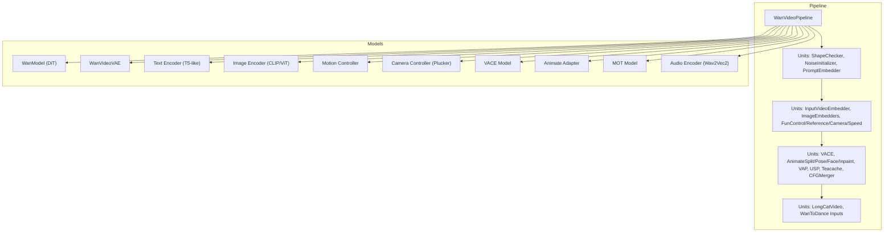
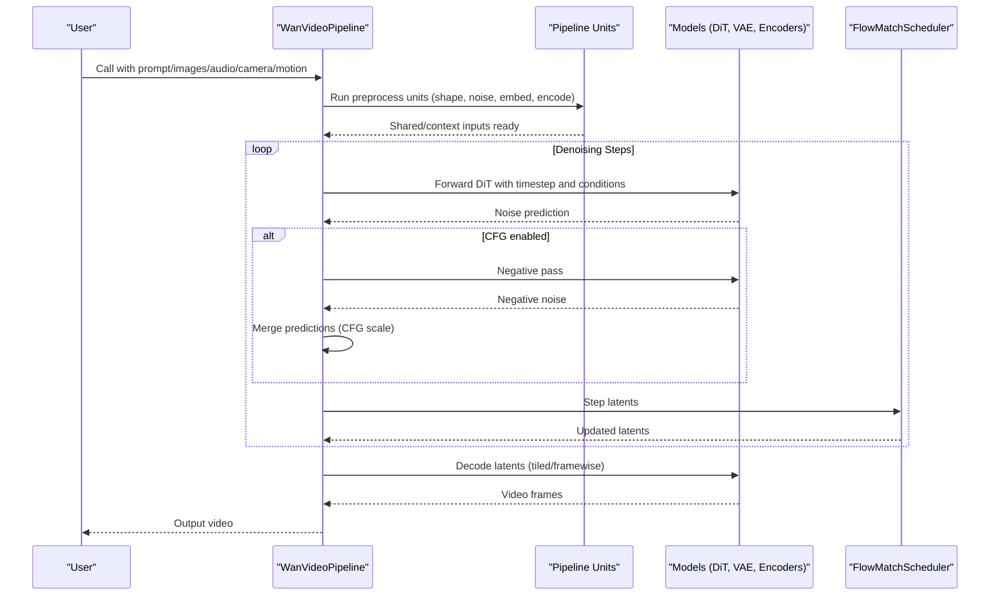
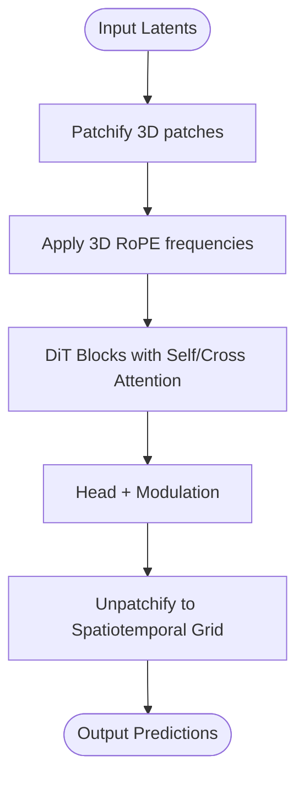
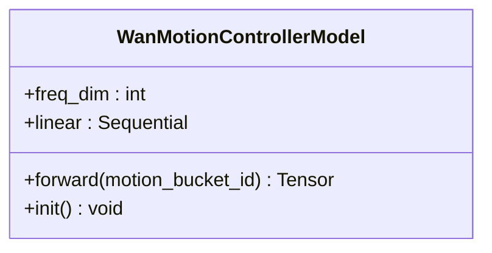
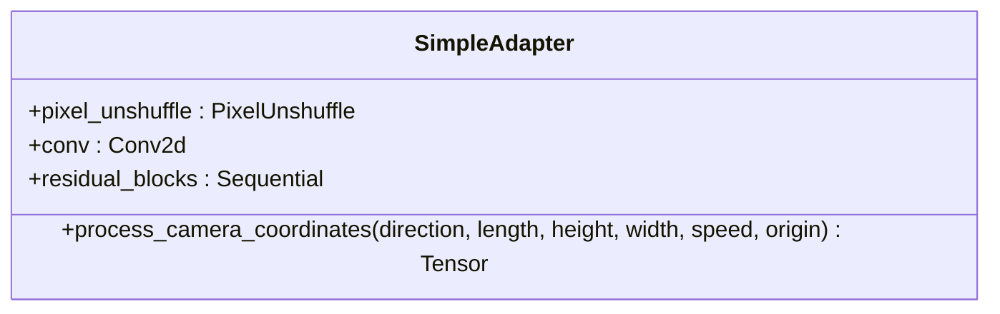
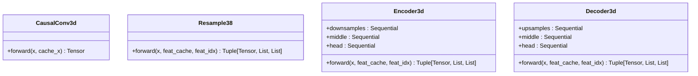
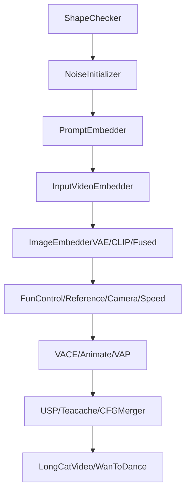
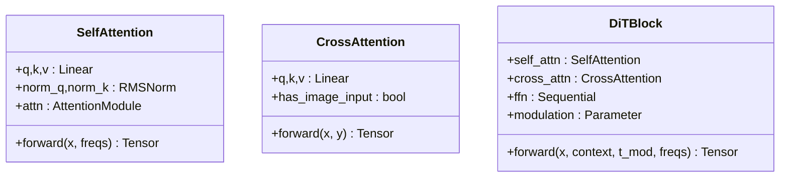
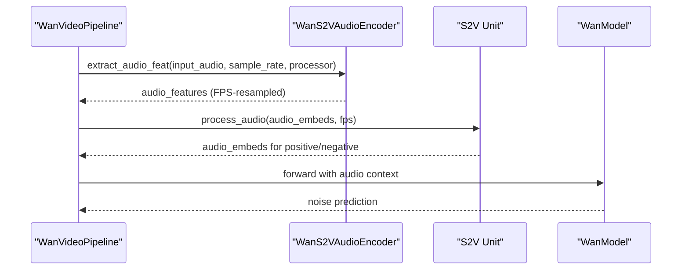
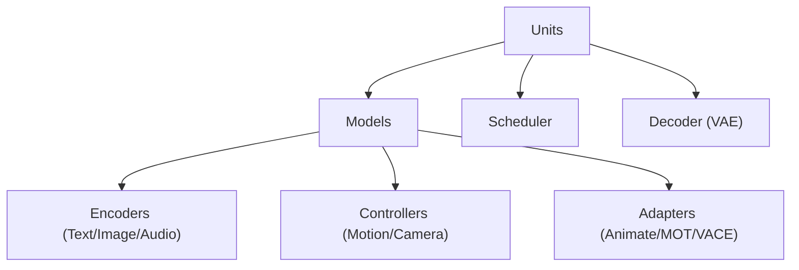

# WanVideo Pipeline

<cite>
**Referenced Files in This Document**
- [wan_video.py](file://diffsynth/pipelines/wan_video.py)
- [wan_video_dit.py](file://diffsynth/models/wan_video_dit.py)
- [wan_video_vae.py](file://diffsynth/models/wan_video_vae.py)
- [wan_video_motion_controller.py](file://diffsynth/models/wan_video_motion_controller.py)
- [wan_video_camera_controller.py](file://diffsynth/models/wan_video_camera_controller.py)
- [wan_video_vace.py](file://diffsynth/models/wan_video_vace.py)
- [wan_video_text_encoder.py](file://diffsynth/models/wan_video_text_encoder.py)
- [wan_video_image_encoder.py](file://diffsynth/models/wan_video_image_encoder.py)
- [wan_video_animate_adapter.py](file://diffsynth/models/wan_video_animate_adapter.py)
- [wan_video_mot.py](file://diffsynth/models/wan_video_mot.py)
- [wav2vec.py](file://diffsynth/models/wav2vec.py)
- [Wan2.1-T2V-14B.py](file://examples/wanvideo/model_inference/Wan2.1-T2V-14B.py)
</cite>

## Table of Contents
1. [Introduction](#introduction)
2. [Project Structure](#project-structure)
3. [Core Components](#core-components)
4. [Architecture Overview](#architecture-overview)
5. [Detailed Component Analysis](#detailed-component-analysis)
6. [Dependency Analysis](#dependency-analysis)
7. [Performance Considerations](#performance-considerations)
8. [Troubleshooting Guide](#troubleshooting-guide)
9. [Conclusion](#conclusion)
10. [Appendices](#appendices)

## Introduction
This document explains the WanVideo pipeline implementation for video generation with a focus on temporal consistency and spatial quality. It details how the pipeline integrates text, image, audio, motion, camera control, and VACE conditioning into a DiT-based video transformer, and how the VAE encoder/decoder preserves temporal coherence while enabling efficient memory usage. It also covers preprocessing units, frame interpolation strategies, motion conditioning, temporal attention mechanisms, and multi-modal integration. Practical examples are provided for generating videos with different camera movements, motion controls, and temporal constraints, along with guidance on frame rate, duration, resolution scaling, and VRAM optimization for long videos.

## Project Structure
The WanVideo pipeline is implemented as a modular DiffSynth pipeline that composes multiple processing units to prepare inputs, run diffusion denoising, and decode outputs. Core components include:
- A DiT-based video transformer (WanModel) with 3D rotary embeddings and optional control adapters
- A causal 3D VAE for encoding/decoding video latents
- Text and image encoders for multimodal conditioning
- Motion controller, camera controller, VACE, animate adapter, and MOT modules for specialized controls
- Audio encoder for speech-to-video conditioning
- A unit-driven pipeline orchestrating all steps



**Diagram sources**
- [wan_video.py:32-86](file://diffsynth/pipelines/wan_video.py#L32-L86)
- [wan_video_dit.py:338-423](file://diffsynth/models/wan_video_dit.py#L338-L423)
- [wan_video_vae.py:517-618](file://diffsynth/models/wan_video_vae.py#L517-L618)
- [wan_video_text_encoder.py:212-257](file://diffsynth/models/wan_video_text_encoder.py#L212-L257)
- [wan_video_image_encoder.py:386-478](file://diffsynth/models/wan_video_image_encoder.py#L386-L478)
- [wan_video_motion_controller.py:7-22](file://diffsynth/models/wan_video_motion_controller.py#L7-L22)
- [wan_video_camera_controller.py:8-44](file://diffsynth/models/wan_video_camera_controller.py#L8-L44)
- [wan_video_vace.py:27-74](file://diffsynth/models/wan_video_vace.py#L27-L74)
- [wan_video_animate_adapter.py:615-651](file://diffsynth/models/wan_video_animate_adapter.py#L615-L651)
- [wan_video_mot.py:94-169](file://diffsynth/models/wan_video_mot.py#L94-L169)
- [wav2vec.py:45-112](file://diffsynth/models/wav2vec.py#L45-L112)

**Section sources**
- [wan_video.py:32-86](file://diffsynth/pipelines/wan_video.py#L32-L86)

## Core Components
- WanVideoPipeline: Orchestrates units, manages models, runs scheduler steps, and handles decoding. Supports unified sequence parallelism, teacache, CFG merging, and framewise decoding.
- WanModel (DiT): Video transformer with 3D RoPE, cross-attention to text/image context, optional control adapter for camera coordinates, and gradient checkpointing.
- WanVideoVAE: Causal 3D encoder/decoder with block-wise temporal caching, tiled encode/decode, and framewise operations for memory efficiency.
- Text Encoder: T5-style encoder with relative positional embeddings; tokenizer supports cleaning modes.
- Image Encoder: CLIP/ViT-style vision transformer for image features; supports optional end-image concatenation.
- Motion Controller: Maps motion bucket IDs to modulation vectors via sinusoidal embedding and MLP.
- Camera Controller: Generates Plücker embeddings from camera trajectories; simple adapter projects them into DiT feature space.
- VACE: Extracts hints from selected DiT blocks to guide generation with reference or masked video.
- Animate Adapter: Injects pose and face motion features into DiT via residual connections.
- MOT Model: Dual-stream self-attention combining main and motion streams at specific layers.
- Audio Encoder: Wav2Vec2-based audio feature extraction with FPS resampling and batching utilities.

**Section sources**
- [wan_video.py:32-86](file://diffsynth/pipelines/wan_video.py#L32-L86)
- [wan_video_dit.py:338-423](file://diffsynth/models/wan_video_dit.py#L338-L423)
- [wan_video_vae.py:517-618](file://diffsynth/models/wan_video_vae.py#L517-L618)
- [wan_video_text_encoder.py:212-257](file://diffsynth/models/wan_video_text_encoder.py#L212-L257)
- [wan_video_image_encoder.py:386-478](file://diffsynth/models/wan_video_image_encoder.py#L386-L478)
- [wan_video_motion_controller.py:7-22](file://diffsynth/models/wan_video_motion_controller.py#L7-L22)
- [wan_video_camera_controller.py:8-44](file://diffsynth/models/wan_video_camera_controller.py#L8-L44)
- [wan_video_vace.py:27-74](file://diffsynth/models/wan_video_vace.py#L27-L74)
- [wan_video_animate_adapter.py:615-651](file://diffsynth/models/wan_video_animate_adapter.py#L615-L651)
- [wan_video_mot.py:94-169](file://diffsynth/models/wan_video_mot.py#L94-L169)
- [wav2vec.py:45-112](file://diffsynth/models/wav2vec.py#L45-L112)

## Architecture Overview
The pipeline follows a unit-driven flow:
- Preprocessing units shape inputs, initialize noise, embed prompts, encode images/videos, and prepare control signals (camera, motion, VACE, animate, MOT).
- Denoising loop alternates between positive/negative passes (CFG), applies scheduler steps, and optionally switches DiT variants based on timestep boundary.
- Post-processing units handle S2V adjustments; decoding uses VAE with tiled or framewise options.
- Optional features: Unified Sequence Parallelism (USP), Teacache acceleration, CFG merging, and WanToDance music/keyframe conditioning.



**Diagram sources**
- [wan_video.py:189-359](file://diffsynth/pipelines/wan_video.py#L189-L359)
- [wan_video_dit.py:510-551](file://diffsynth/models/wan_video_dit.py#L510-L551)
- [wan_video_vae.py:736-800](file://diffsynth/models/wan_video_vae.py#L736-L800)

**Section sources**
- [wan_video.py:189-359](file://diffsynth/pipelines/wan_video.py#L189-L359)

## Detailed Component Analysis

### Temporal Consistency and Spatial Quality
- Temporal consistency is ensured by:
  - 3D RoPE embeddings across time, height, width for coherent spatiotemporal modeling
  - Causal 3D convolutions in VAE to preserve temporal order during encoding/decoding
  - Block-wise temporal caching in VAE to maintain continuity across chunks
  - Optional first-frame latent anchoring to stabilize start frames
- Spatial quality is maintained by:
  - High-resolution patch embeddings in DiT
  - Tiled encode/decode in VAE to avoid memory limits while preserving detail
  - Optional fused VAE embedding in latents for stronger spatial priors



**Diagram sources**
- [wan_video_dit.py:492-551](file://diffsynth/models/wan_video_dit.py#L492-L551)

**Section sources**
- [wan_video_dit.py:77-101](file://diffsynth/models/wan_video_dit.py#L77-L101)
- [wan_video_vae.py:33-53](file://diffsynth/models/wan_video_vae.py#L33-L53)

### Video-Specific Components

#### Motion Controllers
- MotionControllerModel maps motion_bucket_id to modulation parameters using sinusoidal embeddings and an MLP, enabling speed/tempo control.



**Diagram sources**
- [wan_video_motion_controller.py:7-22](file://diffsynth/models/wan_video_motion_controller.py#L7-L22)

**Section sources**
- [wan_video_motion_controller.py:7-22](file://diffsynth/models/wan_video_motion_controller.py#L7-L22)

#### Camera Controllers
- SimpleAdapter processes camera coordinates into Plücker embeddings and projects them into DiT feature space via pixel unshuffle and convolutional residual blocks.



**Diagram sources**
- [wan_video_camera_controller.py:8-44](file://diffsynth/models/wan_video_camera_controller.py#L8-L44)

**Section sources**
- [wan_video_camera_controller.py:46-59](file://diffsynth/models/wan_video_camera_controller.py#L46-L59)

#### Video VAE Encoder/Decoder
- CausalConv3d ensures temporal causality; Resample38 supports up/downsampling with temporal factors; Encoder3d/Decoder3d use residual blocks and attention with feature caching for chunked inference.



**Diagram sources**
- [wan_video_vae.py:33-53](file://diffsynth/models/wan_video_vae.py#L33-L53)
- [wan_video_vae.py:227-266](file://diffsynth/models/wan_video_vae.py#L227-L266)
- [wan_video_vae.py:517-618](file://diffsynth/models/wan_video_vae.py#L517-L618)
- [wan_video_vae.py:736-800](file://diffsynth/models/wan_video_vae.py#L736-L800)

**Section sources**
- [wan_video_vae.py:33-53](file://diffsynth/models/wan_video_vae.py#L33-L53)

### Pipeline Units for Video Processing
- Preprocessing:
  - ShapeChecker: Validates/resizes height, width, num_frames
  - NoiseInitializer: Generates initial noise with optional VACE reference extension
  - PromptEmbedder: Tokenizes and encodes text prompts
  - InputVideoEmbedder: Encodes input video to latents with optional VACE reference concatenation
  - ImageEmbedderVAE/CLIP/Fused: Encodes images to VAE/CLIP features or fuses into latents
- Control:
  - FunControl: Concatenates control video latents into y-condition
  - FunReference: Encodes reference image to latents and CLIP features
  - FunCameraControl: Generates Plücker embeddings and y-condition for camera movement
  - SpeedControl: Converts motion_bucket_id to tensor
- Advanced Conditioning:
  - VACE: Prepares inactive/reactive latents and masks, optional reference images
  - AnimateVideoSplit/PoseLatents/FacePixelValues/Inpaint: Integrates pose and face motion features
  - VAP: Processes video-as-prompt with text and image encoders
  - UnifiedSequenceParallel: Flags USP usage
  - Teacache: Acceleration flag
  - CFGMerger: Merges positive/negative predictions
  - LongCatVideo/WanToDance: Additional conditioning units



**Diagram sources**
- [wan_video.py:363-800](file://diffsynth/pipelines/wan_video.py#L363-L800)

**Section sources**
- [wan_video.py:363-800](file://diffsynth/pipelines/wan_video.py#L363-L800)

### Temporal Attention Mechanisms
- DiT uses 3D RoPE for spatiotemporal attention, with self-attention over flattened patches and cross-attention to text/image contexts.
- Flash attention implementations support multiple backends (FlashAttention 2/3, SageAttention, SDPA fallback).
- MOT model combines main and motion streams in self-attention, enabling explicit motion modeling.



**Diagram sources**
- [wan_video_dit.py:139-201](file://diffsynth/models/wan_video_dit.py#L139-L201)
- [wan_video_dit.py:211-245](file://diffsynth/models/wan_video_dit.py#L211-L245)

**Section sources**
- [wan_video_dit.py:30-63](file://diffsynth/models/wan_video_dit.py#L30-L63)
- [wan_video_mot.py:7-91](file://diffsynth/models/wan_video_mot.py#L7-L91)

### Integration with Audio and Multi-Modal Conditioning
- Audio encoder extracts Wav2Vec2 features, resamples to video FPS, and batches for inference.
- Pipeline units integrate audio embeddings into positive/negative contexts.
- VAP unit processes video-as-prompt with text and image encoders for strong multimodal conditioning.



**Diagram sources**
- [wav2vec.py:102-112](file://diffsynth/models/wav2vec.py#L102-L112)
- [wan_video.py:896-905](file://diffsynth/pipelines/wan_video.py#L896-L905)

**Section sources**
- [wav2vec.py:45-112](file://diffsynth/models/wav2vec.py#L45-L112)
- [wan_video.py:896-905](file://diffsynth/pipelines/wan_video.py#L896-L905)

## Dependency Analysis
The pipeline has clear separation between units and models, with minimal coupling:
- Units depend on models via lazy loading and device management
- DiT depends on encoders for text/image context and optional control adapters
- VAE operates independently for encoding/decoding
- Audio encoder is isolated and integrated through units



**Diagram sources**
- [wan_video.py:32-86](file://diffsynth/pipelines/wan_video.py#L32-L86)
- [wan_video_dit.py:338-423](file://diffsynth/models/wan_video_dit.py#L338-L423)

**Section sources**
- [wan_video.py:32-86](file://diffsynth/pipelines/wan_video.py#L32-L86)

## Performance Considerations
- Memory Optimization:
  - Tiled VAE encode/decode reduces peak memory usage
  - Framewise decoding enables processing long videos in chunks
  - Gradient checkpointing in DiT reduces activation memory
  - Feature caching in VAE maintains temporal continuity across chunks
- Acceleration:
  - Unified Sequence Parallelism (USP) distributes attention across devices
  - Teacache skips redundant computations
  - Flash attention backends optimize attention computation
- Resolution Scaling:
  - Height/width division factors align with VAE upsampling factor
  - Time division factor ensures temporal alignment with VAE compression

**Section sources**
- [wan_video.py:168-171](file://diffsynth/pipelines/wan_video.py#L168-L171)
- [wan_video_vae.py:120-174](file://diffsynth/models/wan_video_vae.py#L120-L174)
- [wan_video_dit.py:538-547](file://diffsynth/models/wan_video_dit.py#L538-L547)

## Troubleshooting Guide
- Common Issues:
  - Memory errors: Enable tiled decoding, reduce resolution, or use framewise mode
  - Temporal artifacts: Check first-frame anchoring and VACE reference handling
  - Camera control mismatch: Verify Plücker embedding dimensions and aspect ratio adjustments
  - Audio sync issues: Ensure FPS resampling matches video frame rate
- Debugging Tips:
  - Inspect intermediate latents and masks in VACE units
  - Validate motion_bucket_id ranges for speed control
  - Monitor CFG merge behavior when combining positive/negative predictions

**Section sources**
- [wan_video.py:338-359](file://diffsynth/pipelines/wan_video.py#L338-L359)
- [wan_video_vace.py:53-74](file://diffsynth/models/wan_video_vace.py#L53-L74)

## Conclusion
The WanVideo pipeline provides a comprehensive framework for high-quality video generation with strong temporal consistency and spatial fidelity. Its modular design allows flexible integration of text, image, audio, motion, and camera controls. The use of causal 3D VAE, 3D RoPE, and advanced attention mechanisms ensures coherent spatiotemporal modeling. With optimizations like tiled decoding, USP, and Teacache, it supports efficient generation of long videos. The unit-driven architecture makes it easy to extend with new conditioning modalities and processing steps.

## Appendices

### Example Usage: Text-to-Video Generation
```python
from diffsynth.pipelines.wan_video import WanVideoPipeline, ModelConfig

pipe = WanVideoPipeline.from_pretrained(
    torch_dtype=torch.bfloat16,
    device="cuda",
    model_configs=[
        ModelConfig(model_id="Wan-AI/Wan2.1-T2V-14B", origin_file_pattern="diffusion_pytorch_model*.safetensors"),
        ModelConfig(model_id="Wan-AI/Wan2.1-T2V-14B", origin_file_pattern="models_t5_umt5-xxl-enc-bf16.pth"),
        ModelConfig(model_id="Wan-AI/Wan2.1-T2V-14B", origin_file_pattern="Wan2.1_VAE.pth"),
    ],
    tokenizer_config=ModelConfig(model_id="Wan-AI/Wan2.1-T2V-1.3B", origin_file_pattern="google/umt5-xxl/"),
)

video = pipe(
    prompt="Astronaut riding mechanical horse on Mars",
    negative_prompt="low quality, blurry",
    seed=0, tiled=True,
)
```

**Section sources**
- [Wan2.1-T2V-14B.py:7-24](file://examples/wanvideo/model_inference/Wan2.1-T2V-14B.py#L7-L24)

### Parameters Reference
- Frame Rate: Controlled via audio encoder FPS resampling and WanToDance settings
- Duration: Set via num_frames parameter
- Resolution Scaling: height_division_factor and width_division_factor derived from VAE upsampling
- Memory Optimization: tiled, tile_size, tile_stride, sliding_window_size, sliding_window_stride
- Temporal Constraints: denoising_strength, switch_DiT_boundary, tea_cache parameters

**Section sources**
- [wan_video.py:234-265](file://diffsynth/pipelines/wan_video.py#L234-L265)
- [wav2vec.py:147-184](file://diffsynth/models/wav2vec.py#L147-L184)