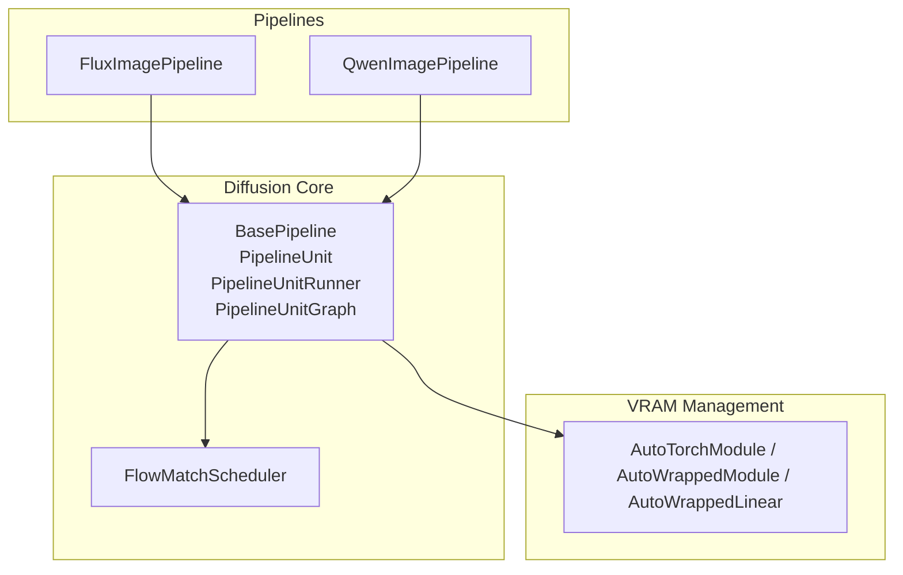
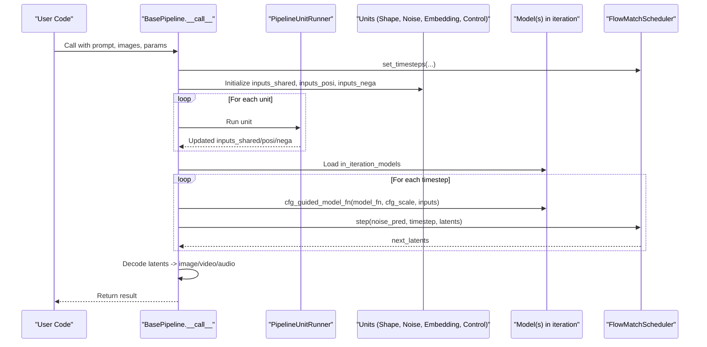
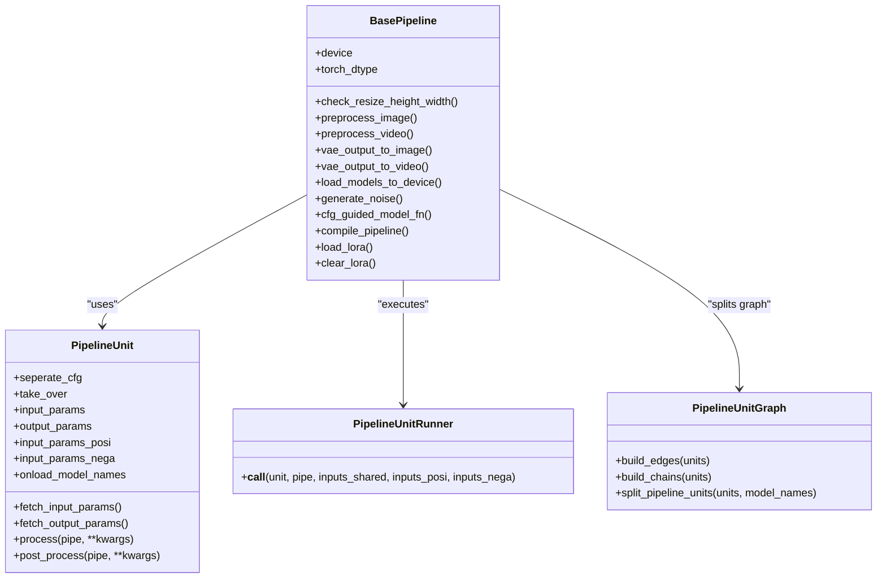
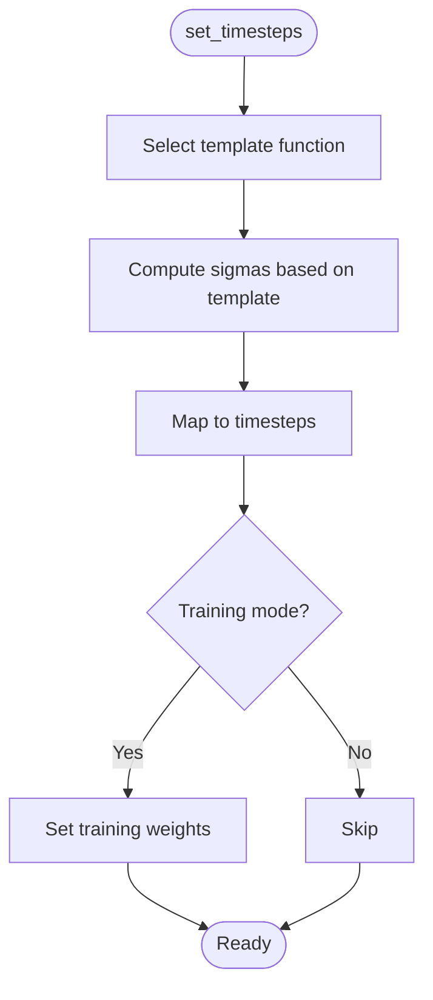
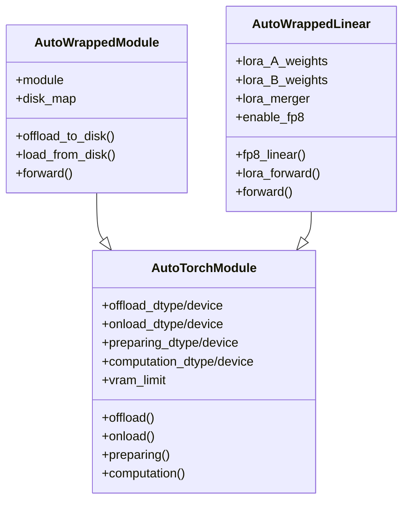
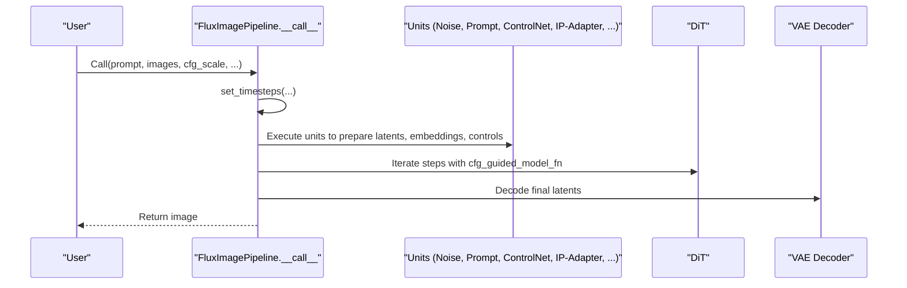
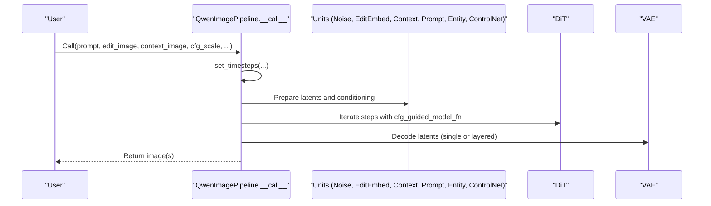
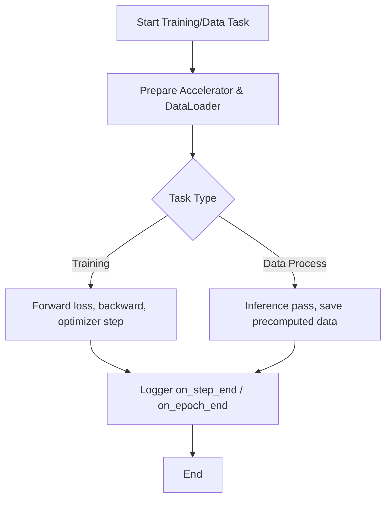
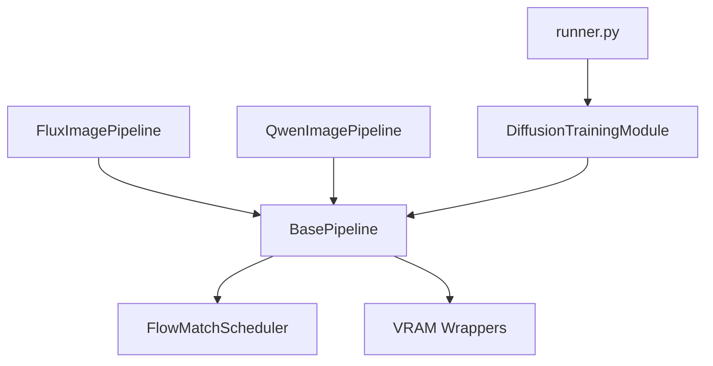

# Pipeline System

<cite>
**Referenced Files in This Document**
- [base_pipeline.py](file://diffsynth/diffusion/base_pipeline.py)
- [flow_match.py](file://diffsynth/diffusion/flow_match.py)
- [runner.py](file://diffsynth/diffusion/runner.py)
- [training_module.py](file://diffsynth/diffusion/training_module.py)
- [flux_image.py](file://diffsynth/pipelines/flux_image.py)
- [qwen_image.py](file://diffsynth/pipelines/qwen_image.py)
- [layers.py](file://diffsynth/core/vram/layers.py)
- [initialization.py](file://diffsynth/core/vram/initialization.py)
- [Building_a_Pipeline.md](file://docs/en/Developer_Guide/Building_a_Pipeline.md)
</cite>

## Table of Contents
1. [Introduction](#introduction)
2. [Project Structure](#project-structure)
3. [Core Components](#core-components)
4. [Architecture Overview](#architecture-overview)
5. [Detailed Component Analysis](#detailed-component-analysis)
6. [Dependency Analysis](#dependency-analysis)
7. [Performance Considerations](#performance-considerations)
8. [Troubleshooting Guide](#troubleshooting-guide)
9. [Conclusion](#conclusion)
10. [Appendices](#appendices)

## Introduction
This document explains the ODTSR-edit pipeline system built on DiffSynth’s unified pipeline architecture. It covers:
- The base pipeline design and how it standardizes inference across different model families (FLUX, Qwen-Image, etc.).
- The pipeline unit system for input/output handling, state management, and execution flow.
- How to build custom pipelines by composing existing units or creating new ones.
- Configuration, parameter passing, and result processing patterns.
- Model-specific extensions and optimizations, including VRAM management and torch.compile integration.

## Project Structure
The pipeline system is centered around a base class that orchestrates preprocessing units, iterative denoising, and decoding. Concrete pipelines implement their own units and model_fn while reusing shared infrastructure.

**Diagram sources**
- [base_pipeline.py](file://diffsynth/diffusion/base_pipeline.py)
- [flow_match.py](file://diffsynth/diffusion/flow_match.py)
- [flux_image.py](file://diffsynth/pipelines/flux_image.py)
- [qwen_image.py](file://diffsynth/pipelines/qwen_image.py)
- [layers.py](file://diffsynth/core/vram/layers.py)

**Section sources**
- [base_pipeline.py](file://diffsynth/diffusion/base_pipeline.py)
- [flow_match.py](file://diffsynth/diffusion/flow_match.py)
- [flux_image.py](file://diffsynth/pipelines/flux_image.py)
- [qwen_image.py](file://diffsynth/pipelines/qwen_image.py)
- [layers.py](file://diffsynth/core/vram/layers.py)

## Core Components
- BasePipeline: Central orchestration for device/dtype, shape checks, preprocessing helpers, VRAM-aware model loading, CFG-guided inference, compilation hooks, and LoRA hotloading/clearing.
- PipelineUnit: Declarative building block with explicit input/output parameters and optional CFG separation or takeover behavior.
- PipelineUnitRunner: Executes units in order, managing three dictionaries: inputs_shared, inputs_posi, inputs_nega.
- PipelineUnitGraph: Builds dependency edges and chains to split computation graphs for training/data-processing tasks.
- FlowMatchScheduler: Unified scheduler supporting multiple templates (FLUX, Qwen-Image, LTX-2, etc.) with step, add_noise, and target utilities.
- VRAM wrappers: AutoTorchModule/AutoWrappedModule/AutoWrappedLinear enable offload/onload/preparing/computation states and FP8 linear paths.

Key responsibilities:
- Input/output contract per unit via input_params, output_params, and CFG mappings.
- State propagation through shared/positive/negative dicts.
- On-demand model activation via onload_model_names and load_models_to_device.
- CFG guidance with optional positive-only LoRA hotloading.
- Optional torch.compile integration for repeated blocks or full models.

**Section sources**
- [base_pipeline.py](file://diffsynth/diffusion/base_pipeline.py)
- [flow_match.py](file://diffsynth/diffusion/flow_match.py)
- [layers.py](file://diffsynth/core/vram/layers.py)

## Architecture Overview
The pipeline follows a staged workflow:
1. Scheduler setup and parameter initialization.
2. Unit chain execution to prepare latents, embeddings, control signals, and other conditioning.
3. Iterative denoising loop using cfg_guided_model_fn and scheduler.step.
4. Decoding via VAE and postprocessing to images/videos/audio.

**Diagram sources**
- [base_pipeline.py](file://diffsynth/diffusion/base_pipeline.py)
- [flow_match.py](file://diffsynth/diffusion/flow_match.py)
- [flux_image.py](file://diffsynth/pipelines/flux_image.py)
- [qwen_image.py](file://diffsynth/pipelines/qwen_image.py)

## Detailed Component Analysis

### BasePipeline and Unit System
- Shape and dtype management: check_resize_height_width, preprocess_image/video, vae_output_to_image/video, audio format checks.
- VRAM-aware model lifecycle: load_models_to_device, flush_vram_management_device, check_vram_management_state.
- CFG guidance: cfg_guided_model_fn supports positive-only LoRA hotloading and tuple outputs for multi-modal latents.
- Compilation: compile_pipeline supports regional compilation for repeated blocks or whole-model compilation.
- LoRA: load_lora supports hotloading into AutoWrappedLinear or fusing; clear_lora resets patches.

**Diagram sources**
- [base_pipeline.py](file://diffsynth/diffusion/base_pipeline.py)

**Section sources**
- [base_pipeline.py](file://diffsynth/diffusion/base_pipeline.py)

### FlowMatchScheduler
- Template-based timestepping for FLUX, Wan, Qwen-Image, FLUX.2, Z-Image, LTX-2, ERNIE-Image.
- Provides step, add_noise, return_to_timestep, training_target, and training_weight utilities.
- Supports dynamic shift strategies and terminal adjustments for specific templates.

**Diagram sources**
- [flow_match.py](file://diffsynth/diffusion/flow_match.py)

**Section sources**
- [flow_match.py](file://diffsynth/diffusion/flow_match.py)

### VRAM Management Layers
- AutoTorchModule: Base with offload/onload/preparing/computation states and dtype/device configuration.
- AutoWrappedModule: Wraps arbitrary modules with disk/offload support and lazy loading.
- AutoWrappedLinear: Specialized for Linear layers with FP8 path and LoRA accumulation.
- enable_vram_management: Recursively wraps matching modules based on a module map and vram_config.

**Diagram sources**
- [layers.py](file://diffsynth/core/vram/layers.py)
- [initialization.py](file://diffsynth/core/vram/initialization.py)

**Section sources**
- [layers.py](file://diffsynth/core/vram/layers.py)
- [initialization.py](file://diffsynth/core/vram/initialization.py)

### FluxImagePipeline
- Implements a rich set of units for prompt embedding, image ID generation, IP-Adapter, EntityControl, NexusGen, Step1x, ValueControl, Flex inpaint/control, InfiniteYou, TeaCache, and LoRA encoding.
- Uses FlowMatchScheduler with FLUX template.
- Inference loop loads DiT and related models during iteration, then decodes via VAE decoder.

**Diagram sources**
- [flux_image.py](file://diffsynth/pipelines/flux_image.py)
- [base_pipeline.py](file://diffsynth/diffusion/base_pipeline.py)
- [flow_match.py](file://diffsynth/diffusion/flow_match.py)

**Section sources**
- [flux_image.py](file://diffsynth/pipelines/flux_image.py)

### QwenImagePipeline
- Implements units for noise initialization, input/image editing embedding, layer/context conditioning, prompt embedding, entity control, and blockwise ControlNet.
- Uses FlowMatchScheduler with Qwen-Image template and supports layered outputs.
- Inference loop similar to Flux but tailored to Qwen-Image features.

**Diagram sources**
- [qwen_image.py](file://diffsynth/pipelines/qwen_image.py)
- [base_pipeline.py](file://diffsynth/diffusion/base_pipeline.py)
- [flow_match.py](file://diffsynth/diffusion/flow_match.py)

**Section sources**
- [qwen_image.py](file://diffsynth/pipelines/qwen_image.py)

### Training and Data Processing Integration
- DiffusionTrainingModule provides utilities for switching pipelines to training mode, adding LoRA adapters, exporting trainable state dicts, and parsing VRAM configs.
- launch_training_task and launch_data_process_task integrate Accelerator, dataloaders, logging, and DeepSpeed activation checkpointing.

**Diagram sources**
- [runner.py](file://diffsynth/diffusion/runner.py)
- [training_module.py](file://diffsynth/diffusion/training_module.py)

**Section sources**
- [runner.py](file://diffsynth/diffusion/runner.py)
- [training_module.py](file://diffsynth/diffusion/training_module.py)

## Dependency Analysis
- BasePipeline depends on FlowMatchScheduler and VRAM wrappers.
- Concrete pipelines depend on BasePipeline and define their own units and model_fn.
- Training utilities depend on DiffusionTrainingModule and Accelerator.

**Diagram sources**
- [base_pipeline.py](file://diffsynth/diffusion/base_pipeline.py)
- [flow_match.py](file://diffsynth/diffusion/flow_match.py)
- [layers.py](file://diffsynth/core/vram/layers.py)
- [flux_image.py](file://diffsynth/pipelines/flux_image.py)
- [qwen_image.py](file://diffsynth/pipelines/qwen_image.py)
- [training_module.py](file://diffsynth/diffusion/training_module.py)
- [runner.py](file://diffsynth/diffusion/runner.py)

**Section sources**
- [base_pipeline.py](file://diffsynth/diffusion/base_pipeline.py)
- [flow_match.py](file://diffsynth/diffusion/flow_match.py)
- [layers.py](file://diffsynth/core/vram/layers.py)
- [flux_image.py](file://diffsynth/pipelines/flux_image.py)
- [qwen_image.py](file://diffsynth/pipelines/qwen_image.py)
- [training_module.py](file://diffsynth/diffusion/training_module.py)
- [runner.py](file://diffsynth/diffusion/runner.py)

## Performance Considerations
- VRAM management: Use onload_model_names to activate only necessary models per unit; leverage AutoWrappedLinear FP8 path when enabled; configure vram_limit to trigger preparing states.
- torch.compile: Use compile_pipeline to optimize repeated blocks or entire models; prefer dynamic=True for variable shapes.
- CFG optimization: Positive-only LoRA hotloading avoids recomputing negative branch when cfg_scale=1.
- Tiled decoding: Enable tiled VAE decode to reduce memory spikes.
- Scheduler tuning: Adjust denoising_strength and template-specific shifts for quality/speed trade-offs.

[No sources needed since this section provides general guidance]

## Troubleshooting Guide
Common issues and resolutions:
- Missing models in units: Ensure from_pretrained fetches all required components and onload_model_names are correct.
- CFG mismatch: Verify separate_cfg mappings and ensure inputs_posi/nega keys match unit expectations.
- VRAM errors: Confirm vram_management_enabled and proper offload/onload devices; use load_models_to_device([]) after heavy stages if needed.
- LoRA conflicts: Clear loras before applying new ones; verify hotload requires VRAM management enabled.
- Shape mismatches: Use check_resize_height_width and ensure time_division_factor/remainder for video.

**Section sources**
- [base_pipeline.py](file://diffsynth/diffusion/base_pipeline.py)
- [layers.py](file://diffsynth/core/vram/layers.py)

## Conclusion
The ODTSR-edit pipeline system offers a robust, modular framework for diverse diffusion models. By standardizing unit contracts, CFG handling, VRAM management, and scheduling, it enables flexible composition of complex pipelines while maintaining performance and memory efficiency. Developers can extend functionality through new units and model_fn implementations, leveraging shared infrastructure for consistency and reliability.

[No sources needed since this section summarizes without analyzing specific files]

## Appendices

### Building Custom Pipelines
Follow the standardized process:
- Define __init__ with scheduler, models, in_iteration_models, and units list.
- Implement from_pretrained to download/load models and tokenizers.
- Implement __call__ to run units, iterate denoising, and decode outputs.
- Design units with appropriate modes (direct, CFG separation, takeover) and declare input/output parameters.

**Section sources**
- [Building_a_Pipeline.md](file://docs/en/Developer_Guide/Building_a_Pipeline.md)