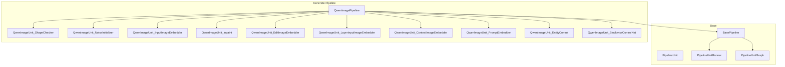
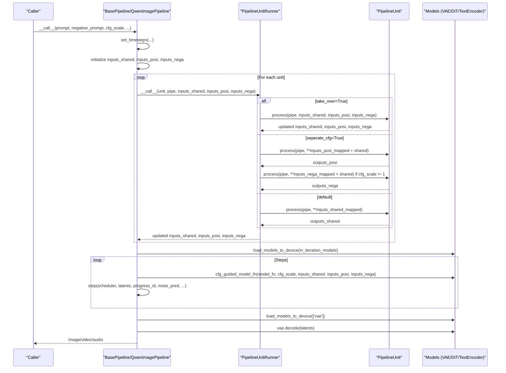
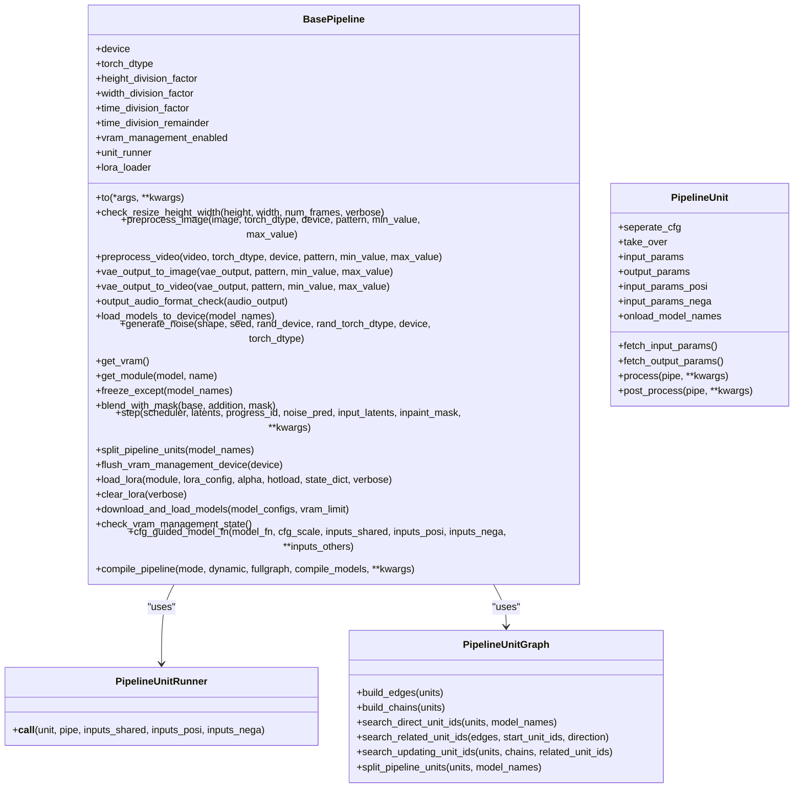
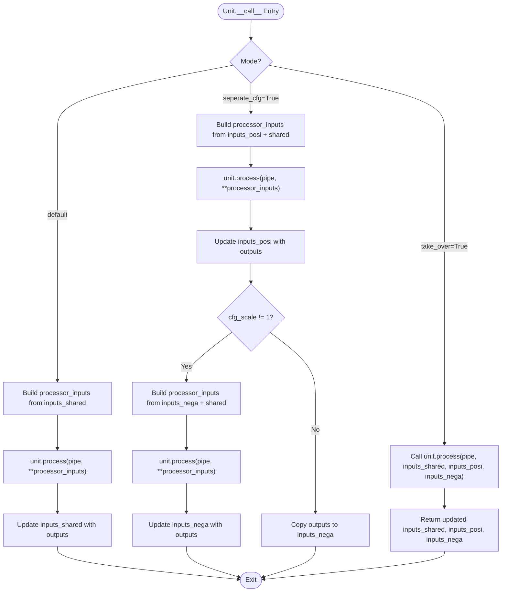
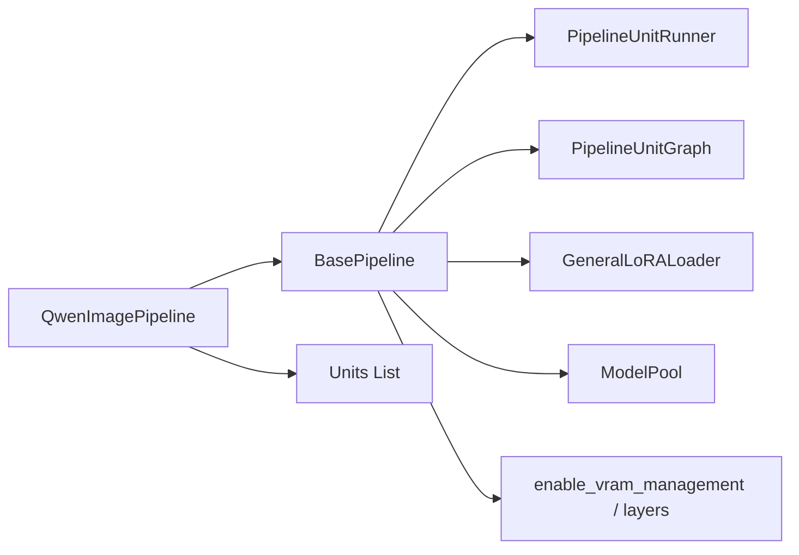

# Pipeline Units System

<cite>
**Referenced Files in This Document**
- [base_pipeline.py](file://diffsynth/diffusion/base_pipeline.py)
- [qwen_image.py](file://diffynth/pipelines/qwen_image.py)
- [Building_a_Pipeline.md](file://docs/en/Developer_Guide/Building_a_Pipeline.md)
- [VRAM_management.md](file://docs/en/Pipeline_Usage/VRAM_management.md)
- [layers.py](file://diffynth/core/vram/layers.py)
- [unit_test.py](file://examples/dev_tools/unit_test.py)
</cite>

## Table of Contents
1. [Introduction](#introduction)
2. [Project Structure](#project-structure)
3. [Core Components](#core-components)
4. [Architecture Overview](#architecture-overview)
5. [Detailed Component Analysis](#detailed-component-analysis)
6. [Dependency Analysis](#dependency-analysis)
7. [Performance Considerations](#performance-considerations)
8. [Troubleshooting Guide](#troubleshooting-guide)
9. [Conclusion](#conclusion)
10. [Appendices](#appendices)

## Introduction
This document explains the pipeline units system used to build modular, composable processing workflows for diffusion-based models. A pipeline is composed of a sequence of PipelineUnit components that transform and pass data through three isolated channels: shared inputs (independent of Classifier-Free Guidance), positive CFG inputs, and negative CFG inputs. The system provides unit registration via a list, configuration through explicit input/output parameter contracts, and execution via a runner that orchestrates data flow and model activation. It also includes utilities for VRAM management, compilation, LoRA hotloading, and graph splitting for advanced features like split training.

## Project Structure
The pipeline units system lives primarily in the base pipeline module and is instantiated by concrete pipelines such as QwenImagePipeline. Unit definitions and usage patterns are documented in the developer guide.

**Diagram sources**
- [base_pipeline.py](file://diffsynth/diffusion/base_pipeline.py)
- [qwen_image.py](file://diffynth/pipelines/qwen_image.py)

**Section sources**
- [base_pipeline.py](file://diffsynth/diffusion/base_pipeline.py)
- [qwen_image.py](file://diffynth/pipelines/qwen_image.py)
- [Building_a_Pipeline.md](file://docs/en/Developer_Guide/Building_a_Pipeline.md)

## Core Components
- BasePipeline: Provides device/dtype handling, shape checks, preprocessing helpers, VRAM management toggles, LoRA loading/clearing, CFG-guided model function wrapper, torch.compile integration, and the unit runner.
- PipelineUnit: Abstract unit with configurable input/output parameters, CFG separation flags, takeover mode, and model onload hooks.
- PipelineUnitRunner: Executes a unit in one of three modes: direct, CFG-separated, or takeover.
- PipelineUnitGraph: Builds dependency edges and update chains across units; supports splitting related vs unrelated units based on model names.

Key responsibilities:
- Data transformation: Units read from shared/positive/negative dicts and return new keys.
- State management: Shared state persists across units; CFG branches maintain separate positive/negative states.
- Inter-unit communication: Parameter contract via input_params and output_params; edges inferred automatically.
- Model lifecycle: Units declare which models they need; BasePipeline activates them on demand.

**Section sources**
- [base_pipeline.py](file://diffsynth/diffusion/base_pipeline.py)

## Architecture Overview
At runtime, a pipeline constructs three dictionaries (shared, positive, negative), iterates over its units, and delegates each step to the runner. During denoising, the pipeline loads iteration models, calls the CFG-aware model function, updates latents via the scheduler, and finally decodes outputs.

**Diagram sources**
- [base_pipeline.py](file://diffsynth/diffusion/base_pipeline.py)
- [qwen_image.py](file://diffynth/pipelines/qwen_image.py)

## Detailed Component Analysis

### BasePipeline
Responsibilities:
- Device/dtype propagation and shape validation helpers.
- Preprocessing utilities for images/videos and audio format checks.
- VRAM management toggle and selective model activation.
- Noise generation and latent stepping.
- CFG-guided model function wrapper supporting tuple outputs.
- torch.compile integration for selected models.
- LoRA hotload/fuse and clear utilities.

Important methods:
- load_models_to_device(model_names): Activates/deactivates modules with VRAM management enabled.
- cfg_guided_model_fn(model_fn, cfg_scale, ...): Computes positive-only or CFG-combined predictions.
- compile_pipeline(mode, dynamic, fullgraph, compile_models): Compiles specified models or repeated blocks.
- load_lora(...)/clear_lora(...): Hotloads or fuses LoRA weights into wrapped linear layers.

**Section sources**
- [base_pipeline.py](file://diffsynth/diffusion/base_pipeline.py)

### PipelineUnit
Contract:
- Constructor parameters:
  - seperate_cfg: Enable CFG separation mode.
  - take_over: Take over full control of processing.
  - input_params: Shared input keys.
  - output_params: Output keys produced by this unit.
  - input_params_posi: Mapping from internal param names to positive-side keys.
  - input_params_nega: Mapping from internal param names to negative-side keys.
  - onload_model_names: Tuple of model component names to activate before processing.
- Methods:
  - fetch_input_params(): Aggregates all input keys across shared/CFG branches.
  - fetch_output_params(): Returns declared output keys.
  - process(pipe, **kwargs): Core logic returning a dict of outputs.
  - post_process(pipe, **kwargs): Optional post-processing hook.

Design principles:
- Default fallbacks for optional inputs.
- Trigger behavior by parameter presence rather than model availability.
- Prefer direct mode; use takeover only when necessary.
- Use pipe.load_models_to_device(self.onload_model_names) inside process; do not manually release VRAM after unit completes.

**Section sources**
- [base_pipeline.py](file://diffsynth/diffusion/base_pipeline.py)
- [Building_a_Pipeline.md](file://docs/en/Developer_Guide/Building_a_Pipeline.md)

### PipelineUnitRunner
Execution modes:
- Direct mode: Reads shared inputs, writes outputs back to shared.
- CFG separation mode: Runs twice (positive and negative) when cfg_scale != 1; otherwise runs once and copies to both sides.
- Takeover mode: Full control; unit returns updated triple of dicts.

**Section sources**
- [base_pipeline.py](file://diffsynth/diffusion/base_pipeline.py)

### PipelineUnitGraph
Capabilities:
- build_edges(units): Constructs directed edges between units based on parameter dependencies.
- build_chains(units): Tracks update chains per parameter to understand rewrites.
- search_direct_unit_ids(units, model_names): Finds units that directly reference specific model names.
- search_related_unit_ids(edges, start_unit_ids, direction): Expands related units forward/backward along edges.
- search_updating_unit_ids(units, chains, related_unit_ids): Identifies units outside the subgraph that update inputs consumed by it.
- split_pipeline_units(units, model_names): Returns related vs unrelated unit sets for tasks like split training.

Complexity considerations:
- Edge building is O(U * K) where U is number of units and K is average number of input/output params.
- Graph expansion is bounded by total edges and parameters.

**Section sources**
- [base_pipeline.py](file://diffsynth/diffusion/base_pipeline.py)

### Concrete Pipeline Example: QwenImagePipeline
Structure:
- Inherits BasePipeline and defines a scheduler, model attributes, iteration models, and a list of units.
- __call__ initializes scheduler timesteps, populates inputs_shared/posi/nega, executes units, performs CFG-guided denoising, and decodes results.

Representative units:
- ShapeChecker: Normalizes height/width according to division factors.
- NoiseInitializer: Generates initial noise tensors with seed/device/dtype control.
- InputImageEmbedder: Encodes input images via VAE; handles tiled encoding and optional layer inputs.
- Inpaint: Prepares inpaint masks with optional blurring.
- PromptEmbedder: CFG-separated text encoding using tokenizer and text encoder; supports edit-image variants.
- EntityControl: Takeover mode for entity-level control; prepares entity embeddings and masks.
- BlockwiseControlNet: Integrates blockwise ControlNet conditioning during denoising.

These units demonstrate all three execution modes and illustrate how parameters flow across the pipeline.

**Section sources**
- [qwen_image.py](file://diffynth/pipelines/qwen_image.py)
- [Building_a_Pipeline.md](file://docs/en/Developer_Guide/Building_a_Pipeline.md)

### Class Diagram of Core Types

**Diagram sources**
- [base_pipeline.py](file://diffsynth/diffusion/base_pipeline.py)

### Execution Flowchart for a Unit

**Diagram sources**
- [base_pipeline.py](file://diffsynth/diffusion/base_pipeline.py)

## Dependency Analysis
- BasePipeline depends on core utilities (AutoTorchModule, AutoWrappedLinear, ModelConfig, parse_device_type), device helpers, LoRA loader, and model pool.
- Concrete pipelines depend on BasePipeline and define their own units and model_fn.
- VRAM management integrates via enable_vram_management and module maps; BasePipeline toggles vram_management_enabled and selectively loads/offloads models.

**Diagram sources**
- [base_pipeline.py](file://diffsynth/diffusion/base_pipeline.py)
- [layers.py](file://diffynth/core/vram/layers.py)

**Section sources**
- [base_pipeline.py](file://diffsynth/diffusion/base_pipeline.py)
- [layers.py](file://diffynth/core/vram/layers.py)

## Performance Considerations
- Compilation: Use compile_pipeline to optimize repeated blocks or entire models; choose appropriate mode and dynamic/fullgraph settings.
- VRAM Management:
  - Dynamic offload splits models between VRAM and memory based on vram_limit.
  - Disk offload lazily loads parameters from disk when memory is insufficient.
  - Module-level mapping controls granularity; ensure onload/preparing/computation devices align with workload.
- LoRA:
  - Hotload mode appends LoRA weights without fusing; clear_lora removes them efficiently.
  - Fuse mode merges LoRA into base model for faster inference at the cost of memory.
- Scheduler and Latent Sizing:
  - Ensure height/width/time dimensions satisfy division factors to avoid padding overhead.
- I/O and Tiling:
  - Use tiled encoding/decoding for large images to reduce peak memory.

[No sources needed since this section provides general guidance]

## Troubleshooting Guide
Common issues and resolutions:
- Missing model components: Ensure onload_model_names match actual attribute names; verify model_pool.fetch_model keys.
- CFG mismatch errors: Confirm input_params_posi/input_params_nega mappings align with keys in inputs_posi/inputs_nega.
- VRAM errors: Check vram_management_enabled flag and ensure models implement onload/offload; adjust vram_limit accordingly.
- Shape mismatches: Validate height/width/time division factors; use check_resize_height_width to auto-correct.
- LoRA conflicts: When using positive_only_lora, clear_lora is invoked automatically; ensure hotload is supported by enabling VRAM management.

Relevant utilities:
- get_vram: Inspect current VRAM usage.
- flush_vram_management_device: Set offload/onload/preparing/computation devices consistently.
- check_vram_management_state: Determine whether any child modules have VRAM management enabled.

**Section sources**
- [base_pipeline.py](file://diffsynth/diffusion/base_pipeline.py)
- [VRAM_management.md](file://docs/en/Pipeline_Usage/VRAM_management.md)

## Conclusion
The pipeline units system provides a robust, extensible framework for composing complex diffusion workflows. By defining clear input/output contracts and leveraging CFG-aware execution, developers can create modular units that are easy to test, optimize, and combine. VRAM management, compilation, and LoRA support further enhance performance and flexibility. Following the design principles and best practices outlined here will help you build efficient, maintainable pipelines.

[No sources needed since this section summarizes without analyzing specific files]

## Appendices

### Creating Custom Units: Step-by-Step
- Define a subclass of PipelineUnit with constructor parameters describing inputs/outputs and CFG behavior.
- Implement process(pipe, **kwargs) to perform transformations and return a dict of outputs.
- Optionally implement post_process(pipe, **kwargs) for final adjustments.
- Declare onload_model_names to activate required models within process.
- Add your unit to the pipeline’s units list in order of execution.

Example references:
- Direct mode example: noise initialization unit.
- CFG separation example: prompt embedder.
- Takeover mode example: entity control unit.

**Section sources**
- [Building_a_Pipeline.md](file://docs/en/Developer_Guide/Building_a_Pipeline.md)
- [qwen_image.py](file://diffynth/pipelines/qwen_image.py)

### Unit Testing Strategy
- Isolate units by invoking the runner with controlled inputs_shared/posi/nega.
- Validate output keys and shapes against expected contracts.
- Test CFG separation by setting cfg_scale > 1 and verifying positive/negative divergence.
- Test takeover mode by ensuring returned triples are consistent and side effects are minimal.
- Automate tests across multiple examples and configurations.

Reference tooling:
- Batch execution utility for running scripts/tests across GPUs.

**Section sources**
- [unit_test.py](file://examples/dev_tools/unit_test.py)

### Memory Management Strategies
- Use enable_vram_management with module maps to wrap models for fine-grained control.
- Set vram_limit to balance speed and memory footprint.
- Prefer tiled operations for large inputs.
- Clear LoRA layers when switching prompts or styles.

**Section sources**
- [layers.py](file://diffynth/core/vram/layers.py)
- [VRAM_management.md](file://docs/en/Pipeline_Usage/VRAM_management.md)