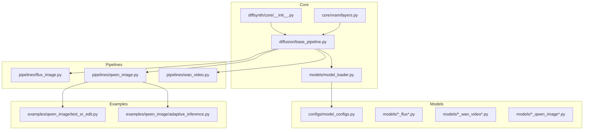
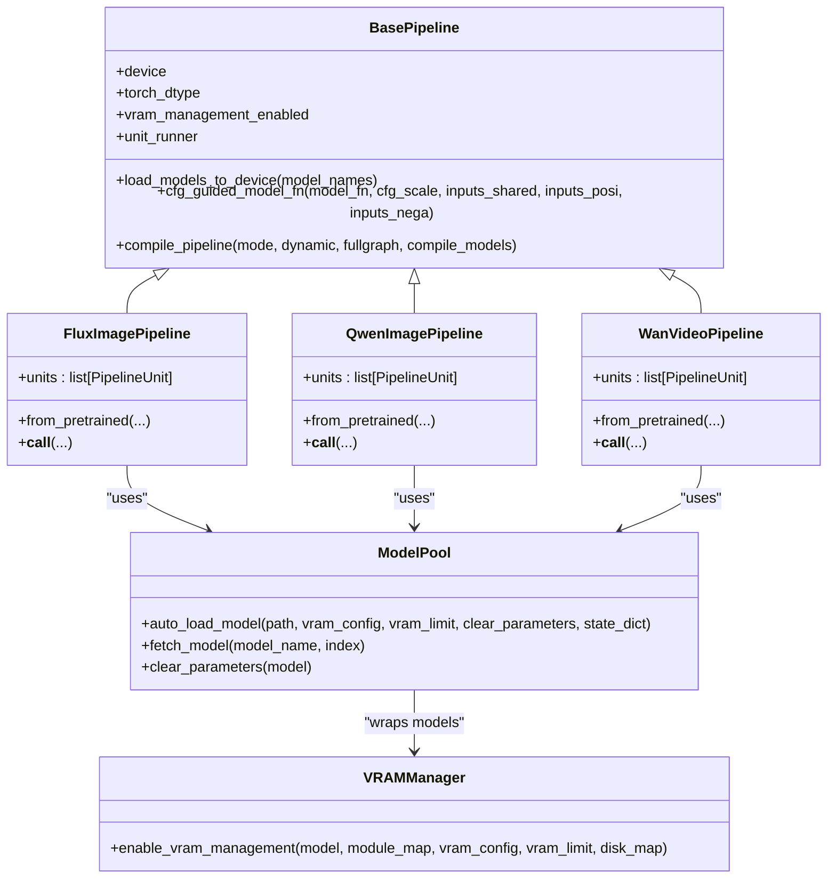
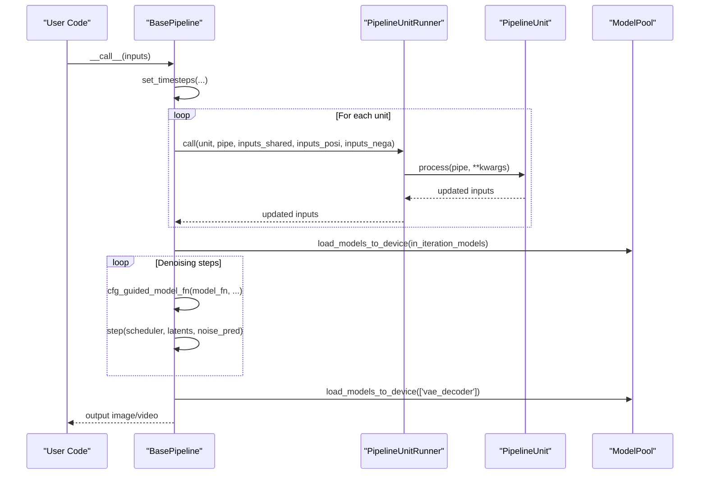
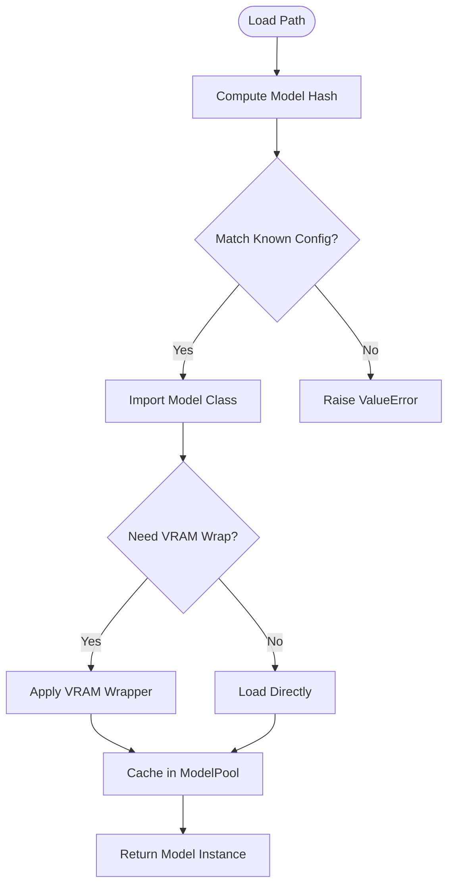
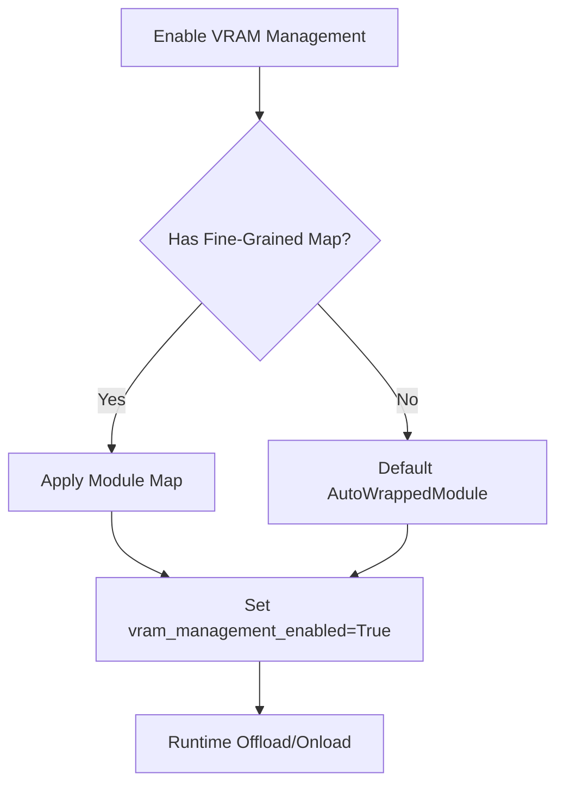
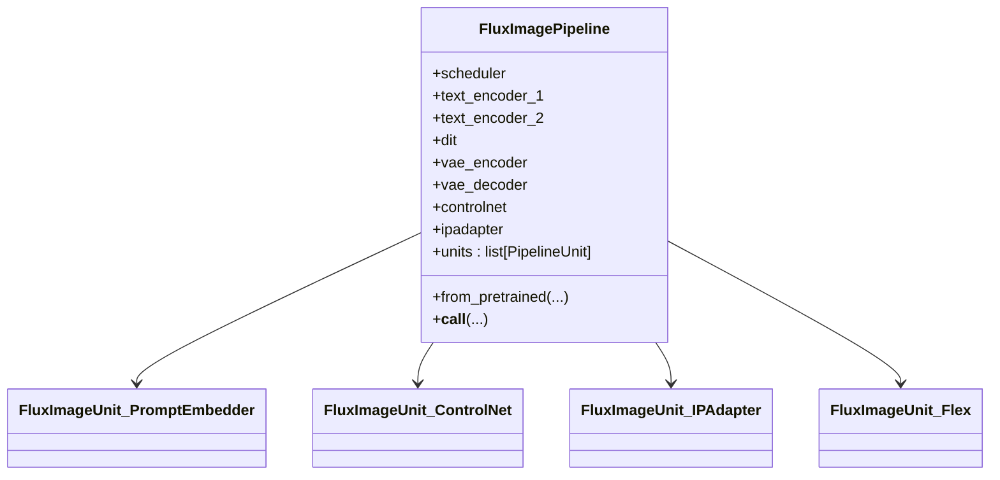
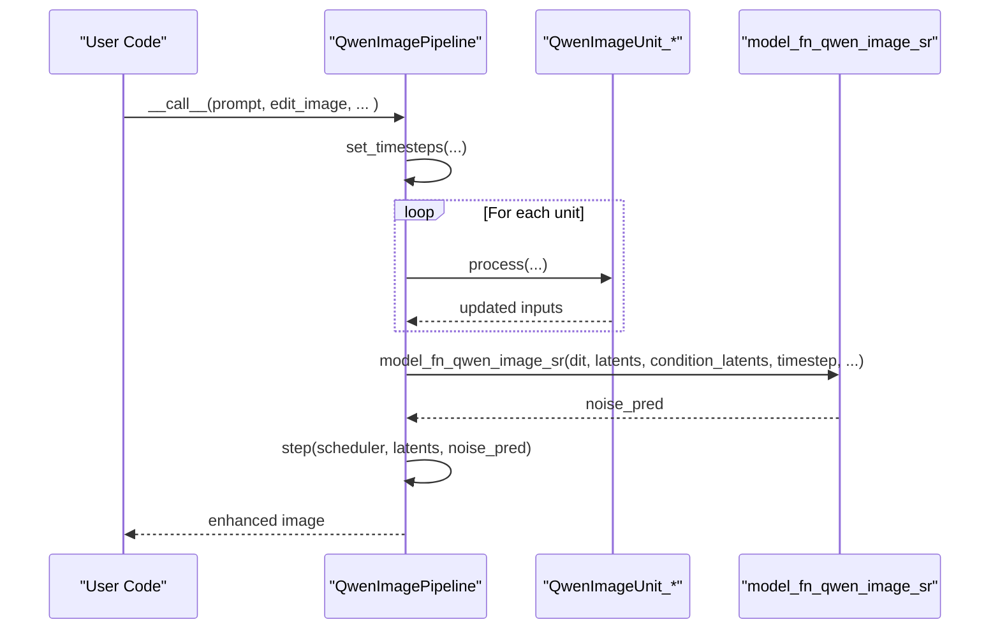
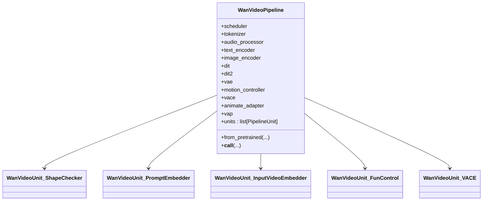
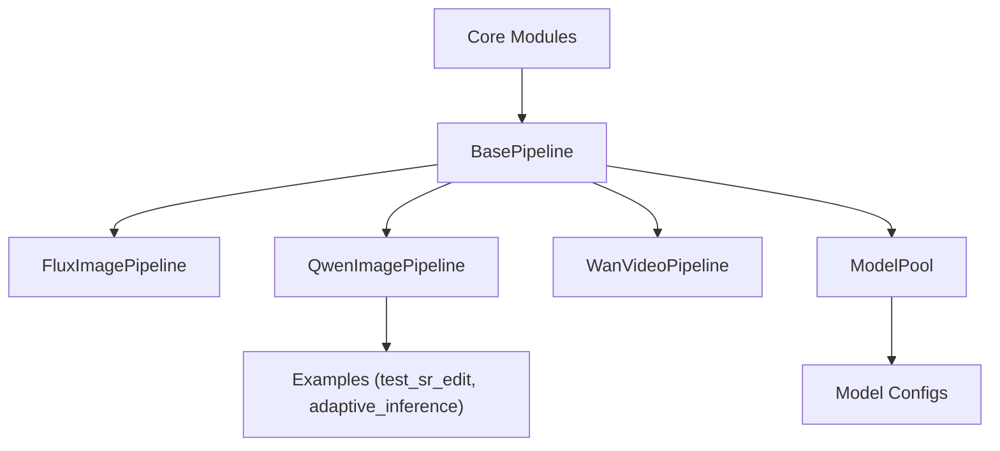

# Project Overview

<cite>
**Referenced Files in This Document**
- [README.md](file://README.md)
- [pyproject.toml](file://pyproject.toml)
- [setup.py](file://setup.py)
- [diffsynth/__init__.py](file://diffsynth/__init__.py)
- [diffsynth/version.py](file://diffsynth/version.py)
- [diffsynth/core/__init__.py](file://diffsynth/core/__init__.py)
- [diffsynth/diffusion/base_pipeline.py](file://diffsynth/diffusion/base_pipeline.py)
- [diffsynth/models/model_loader.py](file://diffsynth/models/model_loader.py)
- [diffsynth/configs/model_configs.py](file://diffsynth/configs/model_configs.py)
- [diffsynth/pipelines/flux_image.py](file://diffsynth/pipelines/flux_image.py)
- [diffsynth/pipelines/qwen_image.py](file://diffsynth/pipelines/qwen_image.py)
- [diffsynth/pipelines/wan_video.py](file://diffsynth/pipelines/wan_video.py)
- [diffsynth/core/vram/layers.py](file://diffsynth/core/vram/layers.py)
- [docs/en/README.md](file://docs/en/README.md)
- [examples/qwen_image/test_sr_edit.py](file://examples/qwen_image/test_sr_edit.py)
- [examples/qwen_image/adaptive_inference.py](file://examples/qwen_image/adaptive_inference.py)
</cite>

## Table of Contents
1. [Introduction](#introduction)
2. [Project Structure](#project-structure)
3. [Core Components](#core-components)
4. [Architecture Overview](#architecture-overview)
5. [Detailed Component Analysis](#detailed-component-analysis)
6. [Dependency Analysis](#dependency-analysis)
7. [Performance Considerations](#performance-considerations)
8. [Troubleshooting Guide](#troubleshooting-guide)
9. [Conclusion](#conclusion)
10. [Appendices](#appendices)

## Introduction
ODTSR-edit is a diffusion model framework built on top of DiffSynth that extends its capabilities with advanced super-resolution and editing workflows. It provides a unified engine for image and video generation, training, and inference across multiple state-of-the-art models such as FLUX, WanVideo, and Qwen-Image. The project emphasizes:

- Multi-model support: A single framework to run FLUX (image), WanVideo (video), and Qwen-Image (image/editing/super-resolution).
- VRAM management: Fine-grained offload/onload strategies enabling inference and training on GPUs with limited memory.
- Training infrastructure: Standardized pipelines for supervised fine-tuning, LoRA, distillation, split training, and FP8 precision.
- Pipeline architecture: A composable unit-based design that makes complex workflows modular, testable, and extensible.

Target audience ranges from beginners who want quick inference scripts to expert developers integrating new models or building custom pipelines. ODTSR-edit fits into the broader AI/ML ecosystem by providing a common abstraction over heterogeneous diffusion backends, accelerating research and production deployments alike.

Unique value proposition:
- Unified API across different model families.
- Advanced super-resolution and editing features tailored for ODTSR use cases.
- Robust VRAM control and compilation options for efficient execution.
- Extensive examples and documentation for both usage and development.

**Section sources**
- [docs/en/README.md:1-91](file://docs/en/README.md#L1-L91)
- [pyproject.toml:1-57](file://pyproject.toml#L1-L57)
- [setup.py:1-30](file://setup.py#L1-L30)

## Project Structure
At a high level, the repository organizes code into core modules, model implementations, pipelines, utilities, and extensive examples:

- Core modules: attention, data, gradient checkpointing, loader, VRAM management, device utilities.
- Models: DiT, VAE, text encoders, ControlNets, adapters for FLUX, WanVideo, Qwen-Image, and more.
- Pipelines: End-to-end workflows for each model family, composed of PipelineUnits.
- Utilities: LoRA loaders, controlnet inputs, state dict converters, sequence parallel helpers.
- Examples: Ready-to-run inference and training scripts per model family, including low-VRAM variants.

**Diagram sources**
- [diffsynth/core/__init__.py:1-7](file://diffsynth/core/__init__.py#L1-L7)
- [diffsynth/diffusion/base_pipeline.py:61-94](file://diffsynth/diffusion/base_pipeline.py#L61-L94)
- [diffsynth/core/vram/layers.py:468-479](file://diffsynth/core/vram/layers.py#L468-L479)
- [diffsynth/models/model_loader.py:1-114](file://diffsynth/models/model_loader.py#L1-L114)
- [diffsynth/configs/model_configs.py:1-200](file://diffsynth/configs/model_configs.py#L1-L200)
- [diffsynth/pipelines/flux_image.py:57-107](file://diffsynth/pipelines/flux_image.py#L57-L107)
- [diffsynth/pipelines/qwen_image.py:25-61](file://diffsynth/pipelines/qwen_image.py#L25-L61)
- [diffsynth/pipelines/wan_video.py:32-86](file://diffsynth/pipelines/wan_video.py#L32-L86)
- [examples/qwen_image/test_sr_edit.py:1-200](file://examples/qwen_image/test_sr_edit.py#L1-L200)
- [examples/qwen_image/adaptive_inference.py:1-41](file://examples/qwen_image/adaptive_inference.py#L1-L41)

**Section sources**
- [diffsynth/core/__init__.py:1-7](file://diffsynth/core/__init__.py#L1-L7)
- [diffsynth/diffusion/base_pipeline.py:61-94](file://diffsynth/diffusion/base_pipeline.py#L61-L94)
- [diffsynth/models/model_loader.py:1-114](file://diffsynth/models/model_loader.py#L1-L114)
- [diffsynth/configs/model_configs.py:1-200](file://diffsynth/configs/model_configs.py#L1-L200)

## Core Components
The framework’s core revolves around a base pipeline and supporting utilities:

- BasePipeline: Provides shared functionality for preprocessing, noise generation, CFG guidance, VRAM-aware model loading, and step scheduling. It also supports torch.compile integration and LoRA hotloading.
- ModelPool: Centralized loader that auto-detects model types via hashes, applies VRAM wrapping, and manages multiple instances.
- VRAM Management: Wraps modules to enable dynamic offload/onload and dtype/device placement, with flags to indicate enabled state.
- Configs: Declarative mappings linking model hashes to classes and optional state dict converters.

Key responsibilities:
- Abstraction over heterogeneous models through a consistent interface.
- Efficient resource management for large-scale models.
- Flexible composition of processing units within pipelines.

Practical implications:
- Users can switch between models without changing pipeline logic.
- Low-VRAM environments are supported via automatic offloading.
- Training and inference share the same VRAM strategy.

**Section sources**
- [diffsynth/diffusion/base_pipeline.py:61-94](file://diffsynth/diffusion/base_pipeline.py#L61-L94)
- [diffsynth/models/model_loader.py:1-114](file://diffsynth/models/model_loader.py#L1-L114)
- [diffsynth/core/vram/layers.py:468-479](file://diffsynth/core/vram/layers.py#L468-L479)
- [diffsynth/configs/model_configs.py:1-200](file://diffsynth/configs/model_configs.py#L1-L200)

## Architecture Overview
The ODTSR-edit architecture layers components to achieve modularity and performance:

- Pipelines orchestrate inference/training using a list of PipelineUnits. Each unit encapsulates a specific transformation (e.g., prompt embedding, input image encoding, ControlNet conditioning).
- BasePipeline coordinates scheduler steps, CFG guidance, and model lifecycle (onload/offload).
- ModelPool resolves model files, applies VRAM wrappers, and exposes named accessors for pipeline components.
- VRAM layering ensures only necessary parts of models reside in GPU memory at any time.

**Diagram sources**
- [diffsynth/diffusion/base_pipeline.py:61-94](file://diffsynth/diffusion/base_pipeline.py#L61-L94)
- [diffsynth/models/model_loader.py:1-114](file://diffsynth/models/model_loader.py#L1-L114)
- [diffsynth/core/vram/layers.py:468-479](file://diffsynth/core/vram/layers.py#L468-L479)
- [diffsynth/pipelines/flux_image.py:57-107](file://diffsynth/pipelines/flux_image.py#L57-L107)
- [diffsynth/pipelines/qwen_image.py:25-61](file://diffsynth/pipelines/qwen_image.py#L25-L61)
- [diffsynth/pipelines/wan_video.py:32-86](file://diffsynth/pipelines/wan_video.py#L32-L86)

## Detailed Component Analysis

### BasePipeline and Unit Runner
BasePipeline defines the shared behavior for all pipelines:
- Shape checks and resizing aligned to model-specific factors.
- Preprocessing for images/videos and output conversion.
- CFG-guided noise prediction with separate positive/negative branches.
- VRAM-aware model loading and device flushing.
- Compilation hooks for torch.compile.

PipelineUnitRunner executes units with three modes:
- Shared mode: updates shared inputs.
- Separate CFG mode: processes positive and negative branches independently.
- Take-over mode: allows a unit to fully control processing flow.

**Diagram sources**
- [diffsynth/diffusion/base_pipeline.py:61-94](file://diffsynth/diffusion/base_pipeline.py#L61-L94)
- [diffsynth/diffusion/base_pipeline.py:470-501](file://diffsynth/diffusion/base_pipeline.py#L470-L501)
- [diffsynth/models/model_loader.py:64-83](file://diffsynth/models/model_loader.py#L64-L83)

**Section sources**
- [diffsynth/diffusion/base_pipeline.py:61-94](file://diffsynth/diffusion/base_pipeline.py#L61-L94)
- [diffsynth/diffusion/base_pipeline.py:470-501](file://diffsynth/diffusion/base_pipeline.py#L470-L501)

### Model Pool and Configuration
ModelPool automates model discovery and loading:
- Hash-based detection maps file paths to known model classes.
- VRAM configuration determines whether to wrap models with AutoWrappedModule or fine-grained maps.
- State dict converters handle format differences across model families.

Configs define series of models (Qwen-Image, Wan, etc.) with metadata like model_class, extra_kwargs, and converters.

**Diagram sources**
- [diffsynth/models/model_loader.py:64-83](file://diffsynth/models/model_loader.py#L64-L83)
- [diffsynth/configs/model_configs.py:1-200](file://diffsynth/configs/model_configs.py#L1-L200)

**Section sources**
- [diffsynth/models/model_loader.py:1-114](file://diffsynth/models/model_loader.py#L1-L114)
- [diffsynth/configs/model_configs.py:1-200](file://diffsynth/configs/model_configs.py#L1-L200)

### VRAM Management
VRAM management enables running large models on constrained hardware:
- enable_vram_management wraps modules based on a mapping, applying dtype/device policies.
- Pipeline-level methods toggle offload/onload for specific model names.
- Flags indicate when VRAM management is active, allowing conditional behaviors (e.g., LoRA hotloading).

**Diagram sources**
- [diffsynth/core/vram/layers.py:468-479](file://diffsynth/core/vram/layers.py#L468-L479)
- [diffsynth/diffusion/base_pipeline.py:157-180](file://diffsynth/diffusion/base_pipeline.py#L157-L180)

**Section sources**
- [diffsynth/core/vram/layers.py:468-479](file://diffsynth/core/vram/layers.py#L468-L479)
- [diffsynth/diffusion/base_pipeline.py:157-180](file://diffsynth/diffusion/base_pipeline.py#L157-L180)

### FLUX Image Pipeline
FLUX pipeline demonstrates multi-control and advanced conditioning:
- Units handle shape checking, noise initialization, prompt embedding (CLIP+T5), IP-Adapter, ControlNet, entity control, Flex inpainting, Step1x connector, and LoRA encoder.
- CFG-guided denoising with flexible timestep scheduling.
- Optional compilation of DiT blocks for speedup.

**Diagram sources**
- [diffsynth/pipelines/flux_image.py:57-107](file://diffsynth/pipelines/flux_image.py#L57-L107)
- [diffsynth/pipelines/flux_image.py:336-395](file://diffsynth/pipelines/flux_image.py#L336-L395)
- [diffsynth/pipelines/flux_image.py:447-487](file://diffsynth/pipelines/flux_image.py#L447-L487)
- [diffsynth/pipelines/flux_image.py:490-516](file://diffsynth/pipelines/flux_image.py#L490-L516)
- [diffsynth/pipelines/flux_image.py:705-741](file://diffsynth/pipelines/flux_image.py#L705-L741)

**Section sources**
- [diffsynth/pipelines/flux_image.py:57-107](file://diffsynth/pipelines/flux_image.py#L57-L107)

### Qwen-Image Pipeline and ODTSR Super-Resolution
Qwen-Image pipeline integrates editing, layered inputs, blockwise ControlNet, and ODTSR-specific SR functions:
- Units manage shape checks, noise, input image embedding, inpaint masks, edit image encoding, context images, prompt embedding, entity control, and blockwise ControlNet.
- ODTSR SR model_fn supports tiled inference and condition_latents handling for single/multi reference inputs.
- Adaptive resolution inference allocates pixel budgets based on information density.

**Diagram sources**
- [diffsynth/pipelines/qwen_image.py:25-61](file://diffsynth/pipelines/qwen_image.py#L25-L61)
- [diffsynth/pipelines/qwen_image.py:738-988](file://diffsynth/pipelines/qwen_image.py#L738-L988)
- [examples/qwen_image/adaptive_inference.py:1-41](file://examples/qwen_image/adaptive_inference.py#L1-L41)

**Section sources**
- [diffsynth/pipelines/qwen_image.py:25-61](file://diffsynth/pipelines/qwen_image.py#L25-L61)
- [diffsynth/pipelines/qwen_image.py:738-988](file://diffsynth/pipelines/qwen_image.py#L738-L988)
- [examples/qwen_image/adaptive_inference.py:1-41](file://examples/qwen_image/adaptive_inference.py#L1-L41)

### WanVideo Pipeline
WanVideo pipeline supports text-to-video, image-to-video, and advanced controls:
- Units handle shape checks, noise, prompt embedding, S2V pose, input video/image embeddings, fun controls, camera control, VACE, animate adapters, VAP, unified sequence parallel, Teacache, and LongCat-Video.
- Supports switching between two DiTs during inference and framewise decoding.

**Diagram sources**
- [diffsynth/pipelines/wan_video.py:32-86](file://diffsynth/pipelines/wan_video.py#L32-L86)
- [diffsynth/pipelines/wan_video.py:363-373](file://diffsynth/pipelines/wan_video.py#L363-L373)
- [diffsynth/pipelines/wan_video.py:427-451](file://diffsynth/pipelines/wan_video.py#L427-L451)
- [diffsynth/pipelines/wan_video.py:396-424](file://diffsynth/pipelines/wan_video.py#L396-L424)
- [diffsynth/pipelines/wan_video.py:534-557](file://diffsynth/pipelines/wan_video.py#L534-L557)
- [diffsynth/pipelines/wan_video.py:649-710](file://diffsynth/pipelines/wan_video.py#L649-L710)

**Section sources**
- [diffsynth/pipelines/wan_video.py:32-86](file://diffsynth/pipelines/wan_video.py#L32-L86)

## Dependency Analysis
Dependencies are structured to promote modularity and reuse:

- Core modules expose reusable primitives (attention, data operators, gradient checkpointing, VRAM management).
- Pipelines depend on BasePipeline and ModelPool; they do not directly manage VRAM but rely on pipeline methods.
- Model configs decouple model definitions from runtime logic, enabling easy extension.
- Examples demonstrate practical usage patterns and integrate with the pipeline APIs.

**Diagram sources**
- [diffsynth/core/__init__.py:1-7](file://diffsynth/core/__init__.py#L1-L7)
- [diffsynth/diffusion/base_pipeline.py:61-94](file://diffsynth/diffusion/base_pipeline.py#L61-L94)
- [diffsynth/models/model_loader.py:1-114](file://diffsynth/models/model_loader.py#L1-L114)
- [diffsynth/configs/model_configs.py:1-200](file://diffsynth/configs/model_configs.py#L1-L200)
- [examples/qwen_image/test_sr_edit.py:1-200](file://examples/qwen_image/test_sr_edit.py#L1-L200)
- [examples/qwen_image/adaptive_inference.py:1-41](file://examples/qwen_image/adaptive_inference.py#L1-L41)

**Section sources**
- [diffsynth/core/__init__.py:1-7](file://diffsynth/core/__init__.py#L1-L7)
- [diffsynth/models/model_loader.py:1-114](file://diffsynth/models/model_loader.py#L1-L114)
- [diffsynth/configs/model_configs.py:1-200](file://diffsynth/configs/model_configs.py#L1-L200)

## Performance Considerations
- VRAM management reduces peak memory usage by dynamically moving parameters between CPU/disk and GPU.
- torch.compile integration accelerates repeated computations, especially for DiT blocks.
- Tiled inference splits large images/videos into manageable tiles to avoid OOM.
- FP8 precision offers potential speedups and memory savings for non-trainable components.

Best practices:
- Enable VRAM management for large models on constrained GPUs.
- Use tiled decoding/encoding for high-resolution outputs.
- Compile models where applicable to reduce overhead.
- Leverage CFG separation to avoid redundant computations when cfg_scale=1.

[No sources needed since this section provides general guidance]

## Troubleshooting Guide
Common issues and resolutions:
- Model not found: Ensure model hash matches known configurations; verify file paths and naming conventions.
- VRAM errors: Check vram_management_enabled flags and ensure offload/onload methods are available.
- CFG mismatch: Confirm positive/negative inputs are correctly separated in units using seperate_cfg mode.
- Compilation failures: Verify model attributes (_repeated_blocks) and compilation arguments.

Debugging tips:
- Use verbose logging in pipeline units to trace parameter flows.
- Inspect ModelPool logs for loaded model names and paths.
- Validate shapes with check_resize_height_width before inference.

**Section sources**
- [diffsynth/models/model_loader.py:81-83](file://diffsynth/models/model_loader.py#L81-L83)
- [diffsynth/diffusion/base_pipeline.py:157-180](file://diffsynth/diffusion/base_pipeline.py#L157-L180)
- [diffsynth/diffusion/base_pipeline.py:342-373](file://diffsynth/diffusion/base_pipeline.py#L342-L373)

## Conclusion
ODTSR-edit extends DiffSynth with a powerful, unified framework for diffusion-based image and video generation, training, and super-resolution. Its modular architecture, robust VRAM management, and comprehensive model support make it suitable for both rapid prototyping and production deployment. By abstracting complexity behind a consistent API, it empowers users to leverage state-of-the-art models like FLUX, WanVideo, and Qwen-Image seamlessly.

[No sources needed since this section summarizes without analyzing specific files]

## Appendices
- Installation and setup: Refer to docs/en/README.md for environment variables, GPU/NPU support, and dependencies.
- Example usage: Explore examples/qwen_image/test_sr_edit.py and examples/qwen_image/adaptive_inference.py for practical workflows.
- Version info: Check diffsynth/version.py for current version and release datetime.

**Section sources**
- [docs/en/README.md:1-91](file://docs/en/README.md#L1-L91)
- [examples/qwen_image/test_sr_edit.py:1-200](file://examples/qwen_image/test_sr_edit.py#L1-L200)
- [examples/qwen_image/adaptive_inference.py:1-41](file://examples/qwen_image/adaptive_inference.py#L1-L41)
- [diffsynth/version.py:1-5](file://diffsynth/version.py#L1-L5)