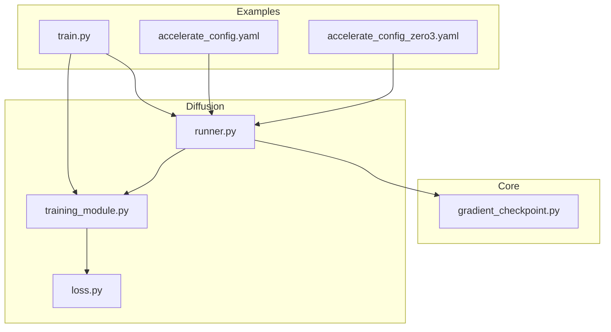
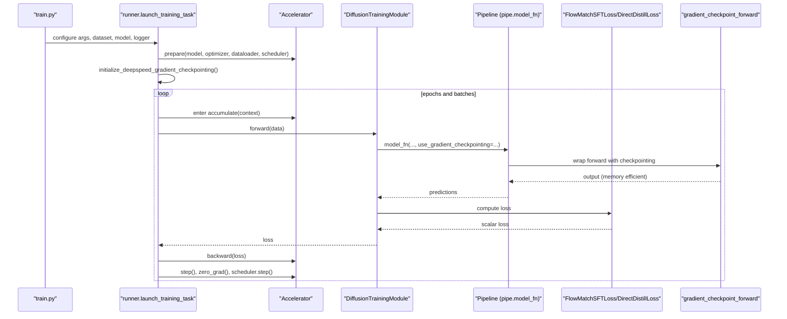
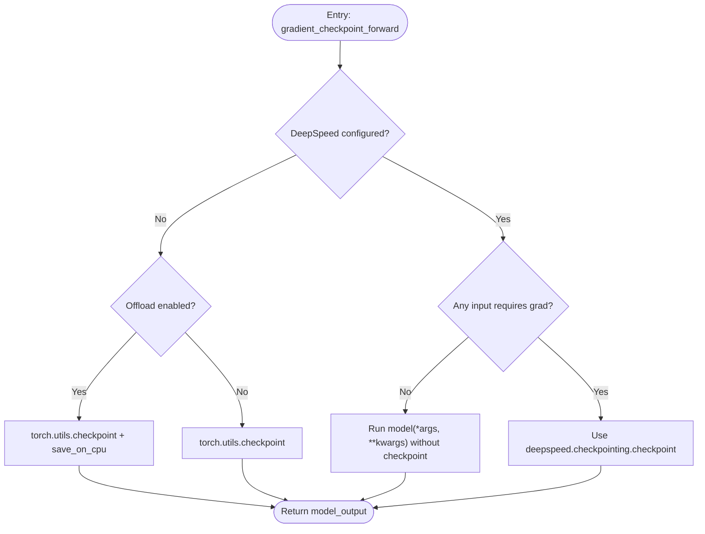
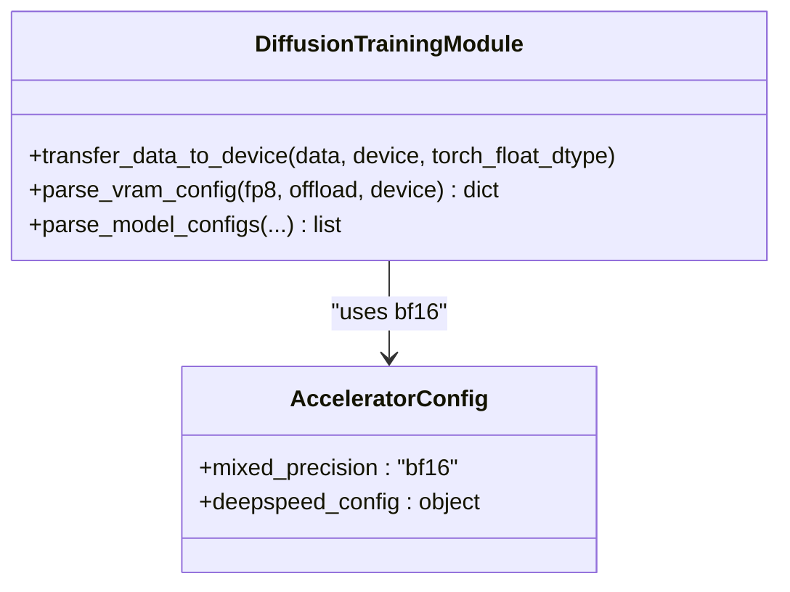
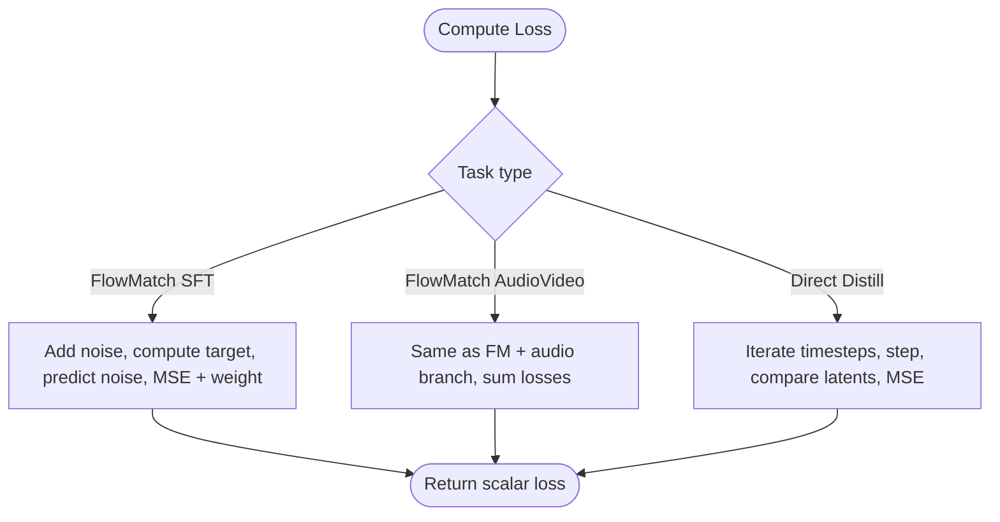
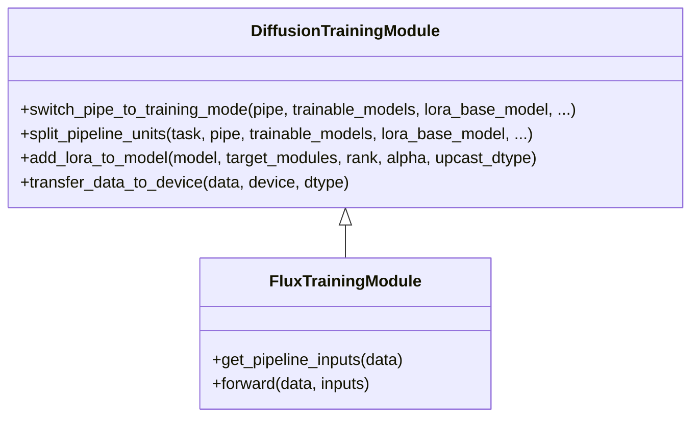
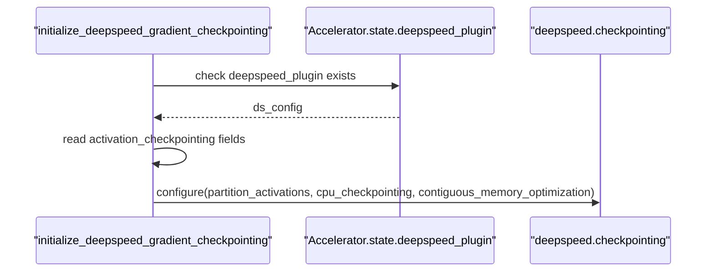
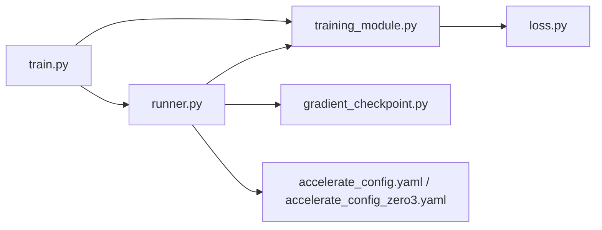

# Gradient Management

<cite>
**Referenced Files in This Document**
- [gradient_checkpoint.py](file://diffsynth/core/gradient/gradient_checkpoint.py)
- [runner.py](file://diffsynth/diffusion/runner.py)
- [training_module.py](file://diffsynth/diffusion/training_module.py)
- [loss.py](file://diffsynth/diffusion/loss.py)
- [train.py](file://examples/flux/model_training/train.py)
- [accelerate_config.yaml](file://examples/flux/model_training/full/accelerate_config.yaml)
- [accelerate_config_zero3.yaml](file://examples/flux/model_training/full/accelerate_config_zero3.yaml)
</cite>

## Table of Contents
1. [Introduction](#introduction)
2. [Project Structure](#project-structure)
3. [Core Components](#core-components)
4. [Architecture Overview](#architecture-overview)
5. [Detailed Component Analysis](#detailed-component-analysis)
6. [Dependency Analysis](#dependency-analysis)
7. [Performance Considerations](#performance-considerations)
8. [Troubleshooting Guide](#troubleshooting-guide)
9. [Conclusion](#conclusion)

## Introduction
This document explains gradient management in ODTSR-edit with a focus on memory-efficient training for large models. It covers:
- Gradient checkpointing implementation and configuration
- Gradient accumulation strategies via Accelerate and DeepSpeed
- Mixed precision training support and data type handling
- Loss computation and how gradients flow through the pipeline
- Practical guidance for debugging, stability, and performance optimization

The goal is to help you understand how gradients are computed, accumulated, and optimized while keeping VRAM usage manageable during training of large diffusion-based models.

## Project Structure
Gradient-related functionality is primarily implemented in:
- Core gradient utilities (checkpointing)
- Training runner (Accelerate integration, backward pass, optimizer steps)
- Training module (pipeline setup, LoRA patching, dtype handling)
- Loss functions (MSE-based objectives used for training)
- Example training scripts and Accelerate configurations



**Diagram sources**
- [gradient_checkpoint.py](file://diffsynth/core/gradient/gradient_checkpoint.py)
- [training_module.py](file://diffsynth/diffusion/training_module.py)
- [runner.py](file://diffsynth/diffusion/runner.py)
- [loss.py](file://diffsynth/diffusion/loss.py)
- [train.py](file://examples/flux/model_training/train.py)
- [accelerate_config.yaml](file://examples/flux/model_training/full/accelerate_config.yaml)
- [accelerate_config_zero3.yaml](file://examples/flux/model_training/full/accelerate_config_zero3.yaml)

**Section sources**
- [gradient_checkpoint.py](file://diffsynth/core/gradient/gradient_checkpoint.py)
- [runner.py](file://diffsynth/diffusion/runner.py)
- [training_module.py](file://diffsynth/diffusion/trading_module.py)
- [loss.py](file://diffsynth/diffusion/loss.py)
- [train.py](file://examples/flux/model_training/train.py)
- [accelerate_config.yaml](file://examples/flux/model_training/full/accelerate_config.yaml)
- [accelerate_config_zero3.yaml](file://examples/flux/model_training/full/accelerate_config_zero3.yaml)

## Core Components
- Gradient checkpointing utility that selects between DeepSpeed activation checkpointing, PyTorch CPU offloading, or standard checkpointing based on flags and environment.
- Training runner that sets up the optimizer, scheduler, dataloader, and uses Accelerate’s accumulate context for gradient accumulation; it also initializes DeepSpeed activation checkpointing when configured.
- Training module that prepares the pipeline for training, applies LoRA adapters, handles data/device/dtype transfers, and splits pipeline units for training vs data processing tasks.
- Loss functions implementing FlowMatch SFT and Direct Distillation objectives, which produce scalar losses driving gradient computation.

Key responsibilities:
- Memory efficiency: gradient checkpointing and optional CPU offloading
- Distributed training: Accelerate prepare and accumulate
- Mixed precision: bf16 throughout model and data paths
- Flexibility: configurable checkpointing behavior and task-specific loss selection

**Section sources**
- [gradient_checkpoint.py](file://diffsynth/core/gradient/gradient_checkpoint.py)
- [runner.py](file://diffsynth/diffusion/runner.py)
- [training_module.py](file://diffsynth/diffusion/training_module.py)
- [loss.py](file://diffsynth/diffusion/loss.py)
- [train.py](file://examples/flux/model_training/train.py)

## Architecture Overview
The training loop integrates Accelerate, DeepSpeed, and custom checkpointing to manage gradients efficiently.



**Diagram sources**
- [train.py](file://examples/flux/model_training/train.py)
- [runner.py](file://diffsynth/diffusion/runner.py)
- [training_module.py](file://diffsynth/diffusion/training_module.py)
- [loss.py](file://diffsynth/diffusion/loss.py)
- [gradient_checkpoint.py](file://diffsynth/core/gradient/gradient_checkpoint.py)

## Detailed Component Analysis

### Gradient Checkpointing Implementation
The checkpointing utility provides a unified entry point to choose among:
- DeepSpeed activation checkpointing when available and configured
- PyTorch checkpointing with save_on_cpu for reduced memory footprint
- Standard forward pass when checkpointing is disabled

Behavior highlights:
- If DeepSpeed is present and configured, it uses deepspeed.checkpointing.checkpoint with a reentrant wrapper when inputs require gradients; otherwise, it runs a non-checkpointed forward pass to avoid unnecessary overhead.
- When offload mode is enabled, it wraps the forward with torch.autograd.graph.save_on_cpu and uses torch.utils.checkpoint with use_reentrant=False.
- Otherwise, it uses torch.utils.checkpoint directly with use_reentrant=False.



**Diagram sources**
- [gradient_checkpoint.py](file://diffsynth/core/gradient/gradient_checkpoint.py)

**Section sources**
- [gradient_checkpoint.py](file://diffsynth/core/gradient/gradient_checkpoint.py)

### Gradient Accumulation Strategy
Gradient accumulation is handled by Accelerate’s accumulate context and can be combined with DeepSpeed’s own accumulation settings.

Key points:
- The training loop wraps each batch update inside accelerator.accumulate(model), ensuring gradients are scaled and accumulated across micro-steps before optimizer step.
- DeepSpeed configuration files specify gradient_accumulation_steps and mixed precision settings.
- Optimizer and scheduler are prepared alongside the model, and zero_grad is called after each step.

```mermaid
sequenceDiagram
participant Runner as "runner.launch_training_task"
participant Acc as "Accelerator"
participant Model as "DiffusionTrainingModule"
participant Opt as "Optimizer"
participant Sched as "Scheduler"
Runner->>Acc : prepare(model, optimizer, dataloader, scheduler)
loop per batch
Runner->>Acc : enter accumulate()
Runner->>Model : forward -> loss
Runner->>Acc : backward(loss)
Runner->>Opt : step()
Runner->>Sched : step()
Runner->>Opt : zero_grad()
end
```

**Diagram sources**
- [runner.py](file://diffsynth/diffusion/runner.py)
- [accelerate_config.yaml](file://examples/flux/model_training/full/accelerate_config.yaml)
- [accelerate_config_zero3.yaml](file://examples/flux/model_training/full/accelerate_config_zero3.yaml)

**Section sources**
- [runner.py](file://diffsynth/diffusion/runner.py)
- [accelerate_config.yaml](file://examples/flux/model_training/full/accelerate_config.yaml)
- [accelerate_config_zero3.yaml](file://examples/flux/model_training/full/accelerate_config_zero3.yaml)

### Mixed Precision and Data Type Handling
Mixed precision is set to bf16 in the Accelerate configuration. The training module ensures data tensors are cast to the appropriate dtype when transferred to device.

Highlights:
- Accelerate config specifies mixed_precision: bf16.
- Data transfer method supports float, float16, and bfloat16 casting to the target dtype.
- Some components explicitly use bfloat16 for computations and offloading preparation.



**Diagram sources**
- [training_module.py](file://diffsynth/diffusion/training_module.py)
- [accelerate_config.yaml](file://examples/flux/model_training/full/accelerate_config.yaml)
- [accelerate_config_zero3.yaml](file://examples/flux/model_training/full/accelerate_config_zero3.yaml)

**Section sources**
- [training_module.py](file://diffsynth/diffusion/training_module.py)
- [accelerate_config.yaml](file://examples/flux/model_training/full/accelerate_config.yaml)
- [accelerate_config_zero3.yaml](file://examples/flux/model_training/full/accelerate_config_zero3.yaml)

### Loss Functions and Gradient Computation
The framework implements several loss functions that drive gradient computation:
- FlowMatchSFTLoss: adds noise at a random timestep within boundaries, computes training target via scheduler, predicts noise, and applies MSE loss weighted by scheduler weights.
- FlowMatchSFTAudioVideoLoss: extends the above to include audio latents and combines losses.
- DirectDistillLoss: iterates over timesteps, performs one-step updates, and compares final latents to input latents via MSE.

These losses return scalar values that propagate gradients back through the model_fn and any checkpointed segments.



**Diagram sources**
- [loss.py](file://diffsynth/diffusion/loss.py)

**Section sources**
- [loss.py](file://diffsynth/diffusion/loss.py)

### Training Module and Pipeline Integration
The training module prepares the pipeline for training:
- Freezes non-trainable parts and optionally injects LoRA adapters into specified modules.
- Supports preset LoRA checkpoints and automatic target module detection.
- Splits pipeline units for training vs data processing tasks, controlling which parameters participate in backward passes.



**Diagram sources**
- [training_module.py](file://diffsynth/diffusion/training_module.py)
- [train.py](file://examples/flux/model_training/train.py)

**Section sources**
- [training_module.py](file://diffsynth/diffusion/training_module.py)
- [train.py](file://examples/flux/model_training/train.py)

### DeepSpeed Activation Checkpointing Initialization
When running under DeepSpeed, the runner initializes activation checkpointing based on the provided configuration. This enables memory-efficient recomputation of activations during backward passes.



**Diagram sources**
- [runner.py](file://diffsynth/diffusion/runner.py)

**Section sources**
- [runner.py](file://diffsynth/diffusion/runner.py)

## Dependency Analysis
The following diagram shows how components depend on each other during training:



**Diagram sources**
- [train.py](file://examples/flux/model_training/train.py)
- [runner.py](file://diffsynth/diffusion/runner.py)
- [training_module.py](file://diffsynth/diffusion/training_module.py)
- [gradient_checkpoint.py](file://diffsynth/core/gradient/gradient_checkpoint.py)
- [loss.py](file://diffsynth/diffusion/loss.py)
- [accelerate_config.yaml](file://examples/flux/model_training/full/accelerate_config.yaml)
- [accelerate_config_zero3.yaml](file://examples/flux/model_training/full/accelerate_config_zero3.yaml)

**Section sources**
- [train.py](file://examples/flux/model_training/train.py)
- [runner.py](file://diffsynth/diffusion/runner.py)
- [training_module.py](file://diffsynth/diffusion/training_module.py)
- [gradient_checkpoint.py](file://diffsynth/core/gradient/gradient_checkpoint.py)
- [loss.py](file://diffsynth/diffusion/loss.py)
- [accelerate_config.yaml](file://examples/flux/model_training/full/accelerate_config.yaml)
- [accelerate_config_zero3.yaml](file://examples/flux/model_training/full/accelerate_config_zero3.yaml)

## Performance Considerations
- Enable gradient checkpointing for large models to reduce peak VRAM usage. Prefer DeepSpeed activation checkpointing when available and configured; otherwise, use PyTorch checkpointing with CPU offloading.
- Use bf16 mixed precision consistently across data, model, and optimizer states as configured by Accelerate.
- Tune gradient_accumulation_steps in both Accelerate and DeepSpeed configs to balance throughput and memory.
- Avoid unnecessary parameter tracking by splitting pipeline units and freezing non-trainable components.
- Monitor memory usage and consider enabling contiguous memory optimization if supported by your DeepSpeed configuration.

[No sources needed since this section provides general guidance]

## Troubleshooting Guide
Common issues and remedies:
- Vanishing gradients:
  - Ensure proper learning rate and scheduler configuration.
  - Verify that checkpointing is not inadvertently bypassing gradient computation (inputs must require gradients).
  - Use gradient scaling or mixed precision appropriately; bf16 is recommended.
- Exploding gradients:
  - Apply gradient clipping at the optimizer level or via Accelerate hooks if needed.
  - Reduce learning rate or increase gradient accumulation steps.
  - Inspect loss values and ensure they remain stable across iterations.
- Memory errors:
  - Enable gradient checkpointing and/or CPU offloading.
  - Reduce batch size or sequence length.
  - Confirm DeepSpeed activation checkpointing is initialized correctly.
- Debugging techniques:
  - Log loss values and gradient norms at each step.
  - Temporarily disable checkpointing to isolate issues.
  - Validate data dtypes and device placement using the training module’s transfer utilities.

[No sources needed since this section provides general guidance]

## Conclusion
ODTSR-edit’s gradient management centers on robust checkpointing, efficient accumulation via Accelerate and DeepSpeed, and consistent mixed precision with bf16. By leveraging these mechanisms and following best practices for stability and performance, you can train large diffusion models effectively while managing memory constraints.

[No sources needed since this section summarizes without analyzing specific files]