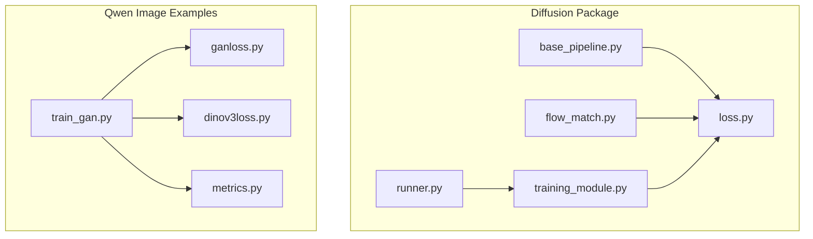
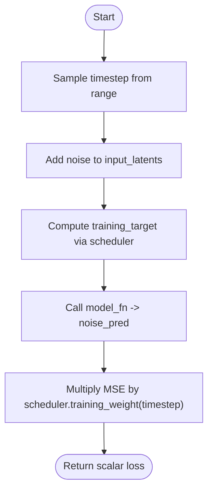
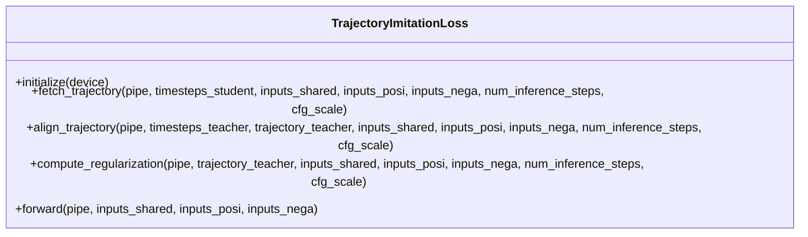
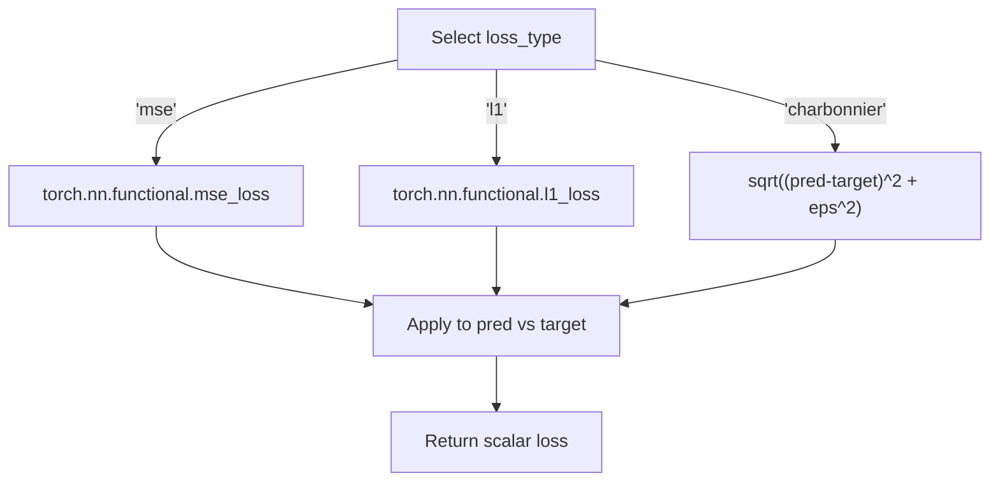
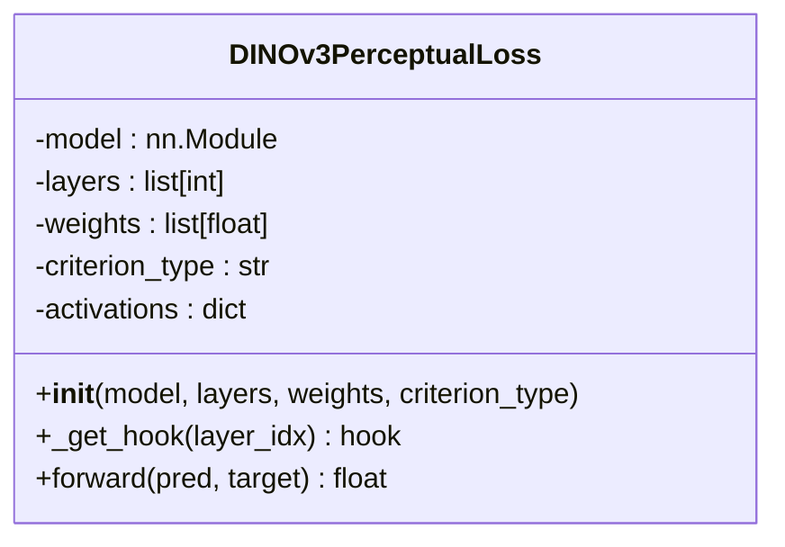
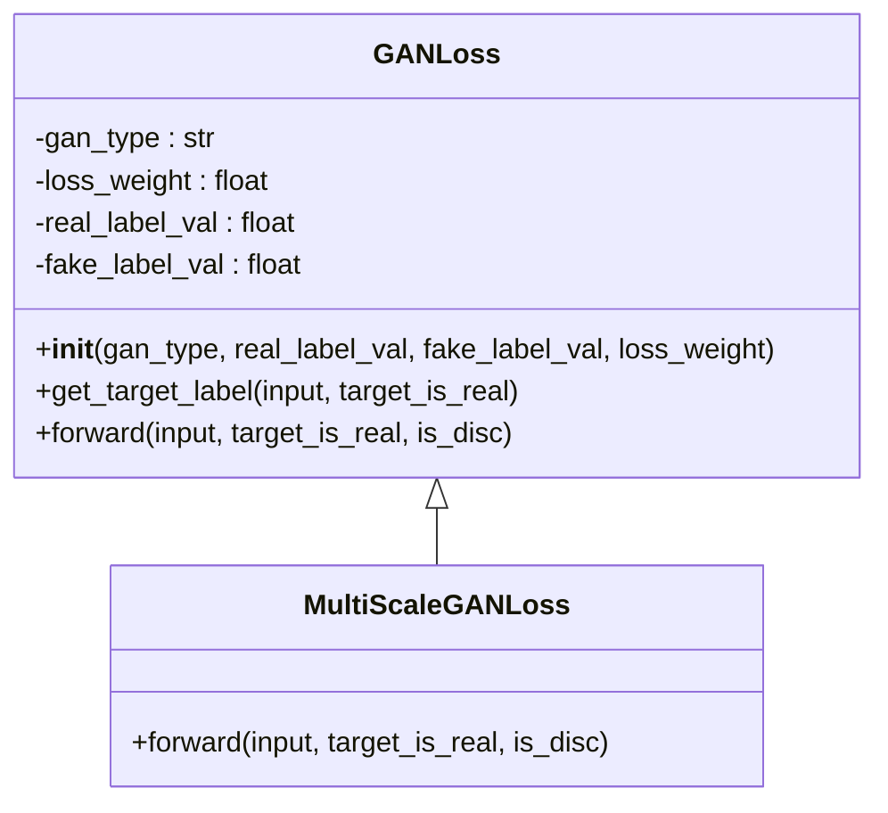
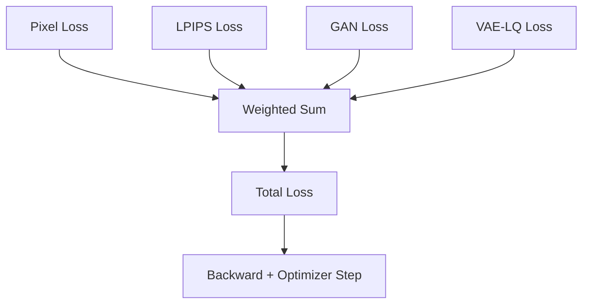
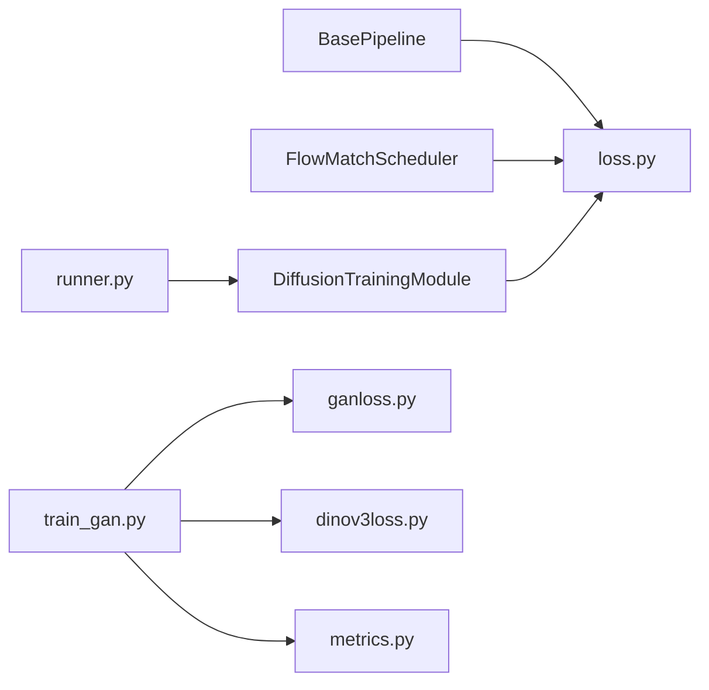

# Loss Functions

<cite>
**Referenced Files in This Document**
- [loss.py](file://diffsynth/diffusion/loss.py)
- [flow_match.py](file://diffsynth/diffusion/flow_match.py)
- [base_pipeline.py](file://diffsynth/diffusion/base_pipeline.py)
- [training_module.py](file://diffsynth/diffusion/training_module.py)
- [runner.py](file://diffsynth/diffusion/runner.py)
- [train_gan.py](file://examples/qwen_image/train_gan.py)
- [ganloss.py](file://examples/qwen_image/ganloss.py)
- [dinov3loss.py](file://examples/qwen_image/dinov3loss.py)
- [metrics.py](file://examples/qwen_image/metrics.py)
</cite>

## Table of Contents
1. Introduction
2. Project Structure
3. Core Components
4. Architecture Overview
5. Detailed Component Analysis
6. Dependency Analysis
7. Performance Considerations
8. Troubleshooting Guide
9. Conclusion
10. Appendices

## Introduction
This document provides a comprehensive guide to the loss functions used in the ODTSR-edit training infrastructure. It covers diffusion losses, reconstruction losses, perceptual losses, and GAN-based losses. It explains how these losses are composed and weighted, details parameter requirements and output formats, and offers guidance for implementing custom losses with robust gradient computation and numerical stability. Multi-task learning scenarios and balancing techniques are also addressed.

## Project Structure
The loss functionality is primarily implemented under the diffusion module and extended by example scripts for image editing and SR tasks:
- Diffusion losses and trajectory imitation live in the diffusion package.
- Perceptual and GAN losses are provided in the Qwen Image examples.
- Training orchestration integrates these losses via a pipeline and training runner.



**Diagram sources**
- [base_pipeline.py](file://diffsynth/diffusion/base_pipeline.py)
- [flow_match.py](file://diffsynth/diffusion/flow_match.py)
- [loss.py](file://diffsynth/diffusion/loss.py)
- [training_module.py](file://diffsynth/diffusion/training_module.py)
- [runner.py](file://diffsynth/diffusion/runner.py)
- [train_gan.py](file://examples/qwen_image/train_gan.py)
- [ganloss.py](file://examples/qwen_image/ganloss.py)
- [dinov3loss.py](file://examples/qwen_image/dinov3loss.py)
- [metrics.py](file://examples/qwen_image/metrics.py)

**Section sources**
- [loss.py](file://diffsynth/diffusion/loss.py)
- [flow_match.py](file://diffsynth/diffusion/flow_match.py)
- [train_gan.py](file://examples/qwen_image/train_gan.py)
- [ganloss.py](file://examples/qwen_image/ganloss.py)
- [dinov3loss.py](file://examples/qwen_image/dinov3loss.py)
- [metrics.py](file://examples/qwen_image/metrics.py)

## Core Components
- FlowMatchSFTLoss: Standard flow-matching supervised fine-tuning loss for images or videos; optionally supports audio latents.
- FlowMatchSFTAudioVideoLoss: Joint video + audio flow-matching SFT loss.
- DirectDistillLoss: Distillation-style loss that steps through timesteps and minimizes latent difference.
- TrajectoryImitationLoss: Teacher-student trajectory alignment plus LPIPS regularization.
- Pixel-level losses: MSE, L1, Charbonnier (in examples).
- Perceptual losses: LPIPS and DINOv3 feature matching (in examples).
- GAN losses: Vanilla, LSGAN, WGAN, WGAN-Softplus, Hinge; multi-scale variants; gradient penalty and R1 regularization utilities.

Key integration points:
- Scheduler weighting via training_weight(timestep).
- Pipeline unit processing to prepare inputs for model_fn.
- Training loop orchestrating backward passes and optimizer updates.

**Section sources**
- [loss.py](file://diffsynth/diffusion/loss.py)
- [flow_match.py](file://diffsynth/diffusion/flow_match.py)
- [train_gan.py](file://examples/qwen_image/train_gan.py)
- [ganloss.py](file://examples/qwen_image/ganloss.py)
- [dinov3loss.py](file://examples/qwen_image/dinov3loss.py)
- [metrics.py](file://examples/qwen_image/metrics.py)

## Architecture Overview
The training pipeline composes data preparation, model forward passes, and loss computation. The scheduler defines timestep schedules and weights. Losses consume pipeline outputs and targets, returning scalar values for backpropagation.

```mermaid
sequenceDiagram
participant Data as "Dataset"
participant Runner as "runner.launch_training_task"
participant Module as "DiffusionTrainingModule"
participant Pipe as "BasePipeline"
participant Sched as "FlowMatchScheduler"
participant Loss as "loss.*"
participant Opt as "Optimizer"
Data-->>Runner : batch
Runner->>Module : forward(data)
Module->>Pipe : preprocess units (inputs_shared, inputs_posi, inputs_nega)
Pipe->>Sched : set_timesteps(training=True)
Module->>Loss : task_to_loss(pipe, *inputs)
Loss->>Sched : training_weight(timestep)
Loss-->>Module : scalar loss
Module-->>Runner : loss
Runner->>Opt : backward(loss), step(), zero_grad()
```

**Diagram sources**
- [runner.py](file://diffsynth/diffusion/runner.py)
- [training_module.py](file://diffsynth/diffusion/training_module.py)
- [base_pipeline.py](file://diffsynth/diffusion/base_pipeline.py)
- [flow_match.py](file://diffsynth/diffusion/flow_match.py)
- [loss.py](file://diffsynth/diffusion/loss.py)

**Section sources**
- [runner.py](file://diffsynth/diffusion/runner.py)
- [training_module.py](file://diffsynth/diffusion/training_module.py)
- [base_pipeline.py](file://diffsynth/diffusion/base_pipeline.py)
- [flow_match.py](file://diffsynth/diffusion/flow_match.py)
- [loss.py](file://diffsynth/diffusion/loss.py)

## Detailed Component Analysis

### Flow-Matching Supervised Fine-Tuning Losses
- FlowMatchSFTLoss
  - Inputs: input_latents, optional first_frame_latents, max/min timestep boundaries.
  - Process: sample timestep, add noise, compute training_target via scheduler, call model_fn, apply MSE and scheduler weight.
  - Output: scalar loss tensor.
- FlowMatchSFTAudioVideoLoss
  - Extends above with audio_input_latents; computes separate audio loss and sums with video loss using shared timestep weighting.
- DirectDistillLoss
  - Iterates over all timesteps, calls model_fn and pipe.step each step, then MSE between final latents and input_latents.



**Diagram sources**
- [loss.py](file://diffsynth/diffusion/loss.py)
- [flow_match.py](file://diffsynth/diffusion/flow_match.py)

**Section sources**
- [loss.py](file://diffsynth/diffusion/loss.py)
- [flow_match.py](file://diffsynth/diffusion/flow_match.py)

### Trajectory Imitation Loss
- Purpose: Align student trajectories with teacher trajectories and regularize via LPIPS on decoded images.
- Key methods:
  - fetch_trajectory: runs teacher CFG-guided sampling to collect intermediate latents.
  - align_trajectory: matches student predictions to finite-difference targets derived from teacher trajectory; uses scheduler weights.
  - compute_regularization: applies LPIPS between decoded images from student and teacher endpoints.
- Numerical stability: denominator clamped to avoid division by near-zero sigma differences.



**Diagram sources**
- [loss.py](file://diffsynth/diffusion/loss.py)

**Section sources**
- [loss.py](file://diffsynth/diffusion/loss.py)

### Reconstruction and Pixel-Level Losses
- Available pixel losses:
  - MSE (default)
  - L1
  - Charbonnier (robust to outliers)
- Usage: selected via configuration and applied to reconstructed RGB or latent-space outputs.



**Diagram sources**
- [train_gan.py](file://examples/qwen_image/train_gan.py)

**Section sources**
- [train_gan.py](file://examples/qwen_image/train_gan.py)

### Perceptual Losses
- LPIPS: Used for perceptual similarity; can be integrated into total loss with a configurable weight.
- DINOv3PerceptualLoss: Feature-matching loss across specified layers of a frozen DINOv3 model; supports L1/L2 criteria and per-layer weights.



**Diagram sources**
- [dinov3loss.py](file://examples/qwen_image/dinov3loss.py)

**Section sources**
- [dinov3loss.py](file://examples/qwen_image/dinov3loss.py)
- [metrics.py](file://examples/qwen_image/metrics.py)

### GAN Losses and Regularization
- GANLoss supports multiple types: vanilla (BCEWithLogits), lsgan (MSE), wgan, wgan_softplus, hinge.
- MultiScaleGANLoss aggregates losses across discriminator scales.
- Utilities:
  - r1_penalty: gradient penalty on real data.
  - gradient_penalty_loss: standard WGAN-GP penalty.
  - g_path_regularize: path length regularization for generator latents.



**Diagram sources**
- [ganloss.py](file://examples/qwen_image/ganloss.py)

**Section sources**
- [ganloss.py](file://examples/qwen_image/ganloss.py)
- [train_gan.py](file://examples/qwen_image/train_gan.py)

### Multi-Task Learning and Loss Balancing
- Composition patterns:
  - Summation of multiple losses with scalar weights (e.g., pixel + LPIPS + GAN + VAE-LQ terms).
  - Dynamic weighting based on timestep or sigma (scheduler.training_weight).
  - Adaptive weighting strategies (e.g., sigma-dependent GAN weight).
- Practical tips:
  - Normalize loss magnitudes before weighting.
  - Use gradient clipping to stabilize training.
  - Monitor individual loss components to detect imbalance.



**Diagram sources**
- [train_gan.py](file://examples/qwen_image/train_gan.py)

**Section sources**
- [train_gan.py](file://examples/qwen_image/train_gan.py)

## Dependency Analysis
- Loss functions depend on:
  - BasePipeline for model_fn invocation and step routines.
  - FlowMatchScheduler for timestep generation and training_weight.
  - Optional external modules (e.g., lpips for perceptual metrics).
- Training module splits pipeline units and prepares required parameters for losses.
- Runner coordinates optimization loops and logging.



**Diagram sources**
- [base_pipeline.py](file://diffsynth/diffusion/base_pipeline.py)
- [flow_match.py](file://diffsynth/diffusion/flow_match.py)
- [loss.py](file://diffsynth/diffusion/loss.py)
- [training_module.py](file://diffsynth/diffusion/training_module.py)
- [runner.py](file://diffsynth/diffusion/runner.py)
- [train_gan.py](file://examples/qwen_image/train_gan.py)
- [ganloss.py](file://examples/qwen_image/ganloss.py)
- [dinov3loss.py](file://examples/qwen_image/dinov3loss.py)
- [metrics.py](file://examples/qwen_image/metrics.py)

**Section sources**
- [base_pipeline.py](file://diffsynth/diffusion/base_pipeline.py)
- [flow_match.py](file://diffsynth/diffusion/flow_match.py)
- [loss.py](file://diffsynth/diffusion/loss.py)
- [training_module.py](file://diffsynth/diffusion/training_module.py)
- [runner.py](file://diffsynth/diffusion/runner.py)
- [train_gan.py](file://examples/qwen_image/train_gan.py)
- [ganloss.py](file://examples/qwen_image/ganloss.py)
- [dinov3loss.py](file://examples/qwen_image/dinov3loss.py)
- [metrics.py](file://examples/qwen_image/metrics.py)

## Performance Considerations
- Scheduler weighting: Ensure training_weight is correctly configured to balance early vs late timesteps.
- Gradient checkpointing: Enabled via pipeline flags to reduce memory usage during long sequences.
- Mixed precision: Use appropriate torch_dtype to balance speed and stability.
- External perceptual models: Load lazily and keep eval mode to avoid unnecessary gradients.
- Batch size and accumulation: Adjust gradient_accumulation_steps to fit memory constraints.

[No sources needed since this section provides general guidance]

## Troubleshooting Guide
Common issues and resolutions:
- NaN/Inf losses:
  - Check for division by zero in trajectory alignment denominators; ensure clamping.
  - Verify input ranges and normalization for perceptual losses.
- Unstable GAN training:
  - Tune gan_loss_weight and label values.
  - Apply gradient penalties (R1 or GP) and consider hinge/WGAN formulations.
- Imbalanced multi-task losses:
  - Inspect individual loss curves; rescale weights accordingly.
  - Use adaptive weighting schemes if available.
- Memory overflow:
  - Enable gradient checkpointing and offloading options in training module.
  - Reduce sequence lengths or batch sizes.

**Section sources**
- [loss.py](file://diffsynth/diffusion/loss.py)
- [ganloss.py](file://examples/qwen_image/ganloss.py)
- [train_gan.py](file://examples/qwen_image/train_gan.py)
- [training_module.py](file://diffsynth/diffusion/training_module.py)

## Conclusion
The ODTSR-edit training infrastructure provides a flexible suite of loss functions spanning diffusion objectives, reconstruction, perceptual metrics, and adversarial training. Through scheduler-based weighting, modular composition, and robust regularization, users can tailor multi-task training regimes effectively. Careful attention to numerical stability, gradient management, and loss balancing ensures reliable convergence across diverse model types.

[No sources needed since this section summarizes without analyzing specific files]

## Appendices

### Custom Loss Development Guidelines
- Input requirements:
  - Ensure tensors match expected shapes and dtypes; use pipeline.transfer_data_to_device where applicable.
- Gradient computation:
  - Avoid detached operations that break the graph unless intentional.
  - Use stable numerics (epsilon for sqrt, clamp denominators).
- Output format:
  - Return a scalar tensor suitable for accelerator.backward.
- Example pattern:
  - Compute per-sample loss, aggregate (mean/sum), apply any scaling factors, return scalar.

[No sources needed since this section provides general guidance]

### Parameter Reference Summary
- FlowMatchSFTLoss:
  - Required: input_latents, timestep boundary params.
  - Optional: first_frame_latents, audio_input_latents.
  - Output: scalar loss.
- FlowMatchSFTAudioVideoLoss:
  - Adds audio_input_latents; returns summed video+audio loss.
- DirectDistillLoss:
  - Requires num_inference_steps; returns MSE between final and initial latents.
- TrajectoryImitationLoss:
  - Requires teacher/student pipelines and CFG settings; returns aligned+regularized loss.
- GANLoss:
  - Parameters: gan_type, real/fake labels, loss_weight; supports multi-scale variants.
- Pixel losses:
  - mse, l1, charbonnier; select via config.
- Perceptual losses:
  - LPIPS, DINOv3 feature matching; configure layers and weights.

**Section sources**
- [loss.py](file://diffsynth/diffusion/loss.py)
- [train_gan.py](file://examples/qwen_image/train_gan.py)
- [ganloss.py](file://examples/qwen_image/ganloss.py)
- [dinov3loss.py](file://examples/qwen_image/dinov3loss.py)