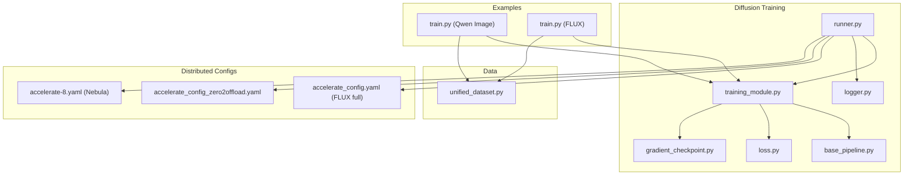
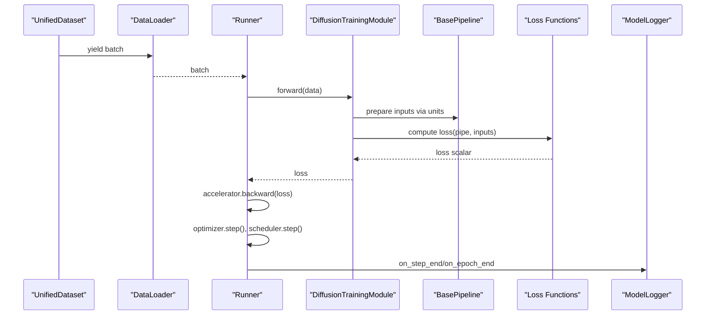
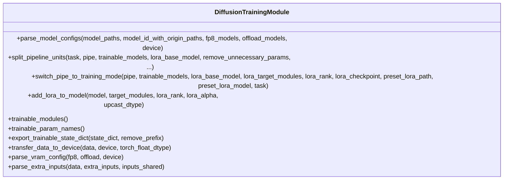
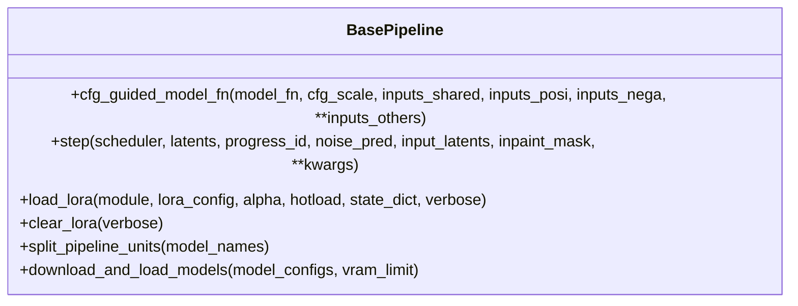
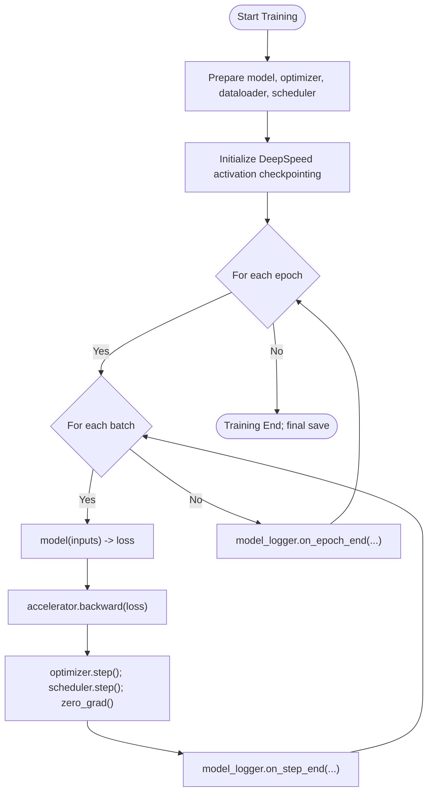
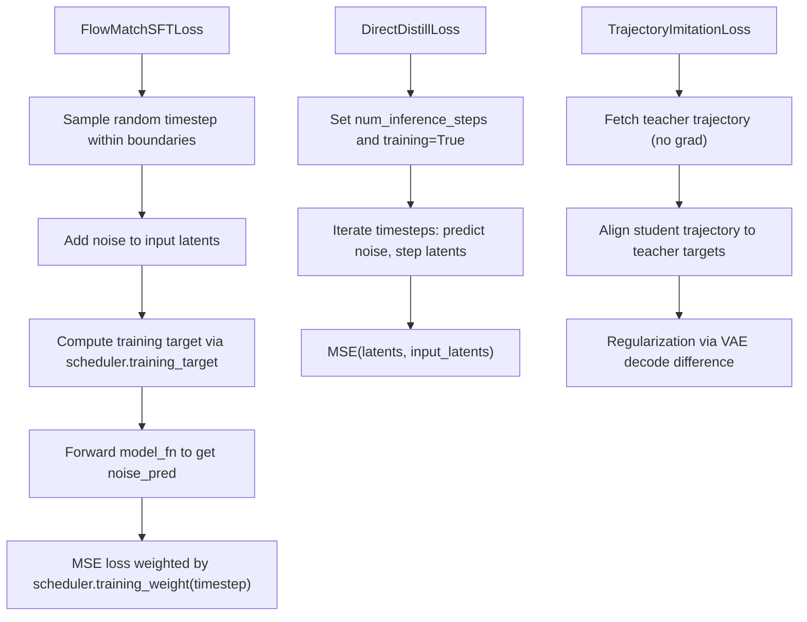
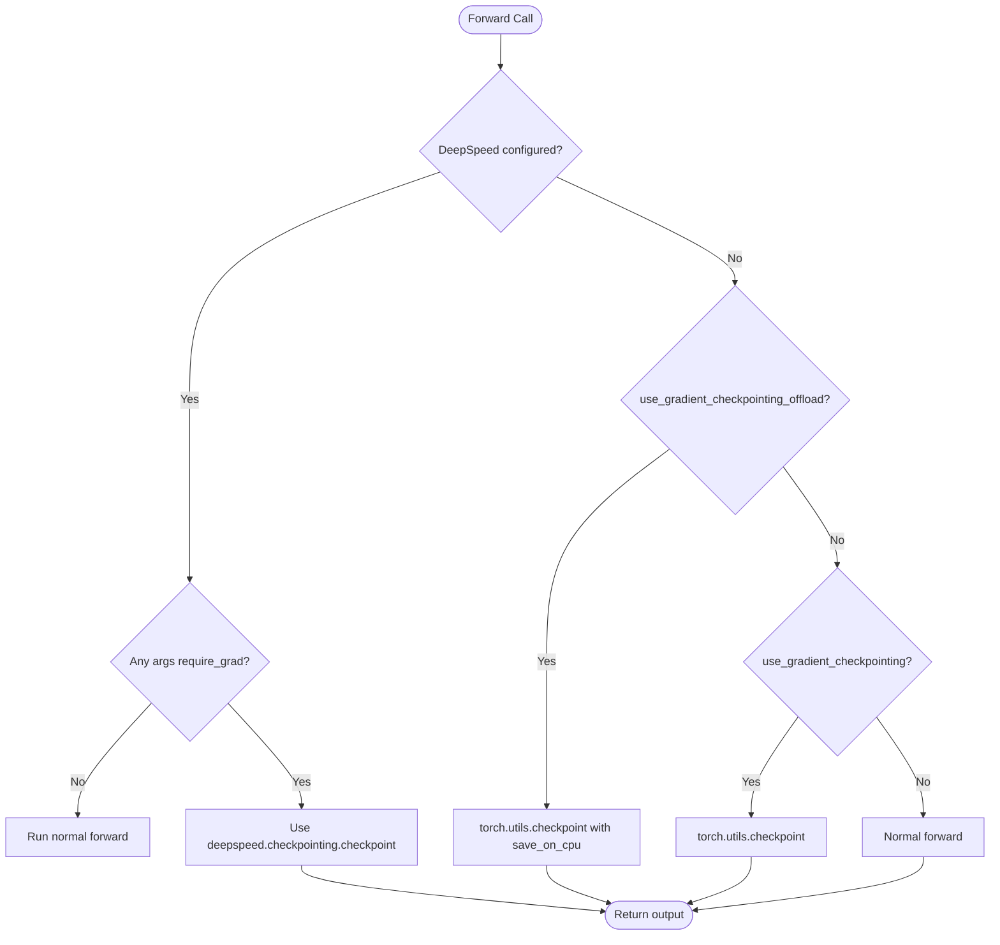
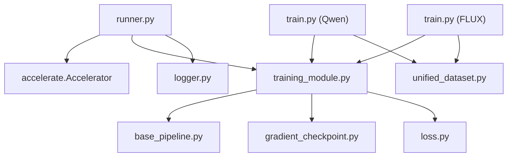

# Training Infrastructure

<cite>
**Referenced Files in This Document**
- [runner.py](file://diffsynth/diffusion/runner.py)
- [training_module.py](file://diffsynth/diffusion/training_module.py)
- [loss.py](file://diffsynth/diffusion/loss.py)
- [base_pipeline.py](file://diffsynth/diffusion/base_pipeline.py)
- [logger.py](file://diffsynth/diffusion/logger.py)
- [gradient_checkpoint.py](file://diffsynth/core/gradient/gradient_checkpoint.py)
- [unified_dataset.py](file://diffsynth/core/data/unified_dataset.py)
- [parsers.py](file://diffsynth/diffusion/parsers.py)
- [train.py (Qwen Image)](file://examples/qwen_image/model_training/train.py)
- [train.py (FLUX)](file://examples/flux/model_training/train.py)
- [accelerate_config.yaml (FLUX full)](file://examples/flux/model_training/full/accelerate_config.yaml)
- [accelerate_config_zero2offload.yaml (FLUX full)](file://examples/flux/model_training/full/accelerate_config_zero2offload.yaml)
- [accelerate-8.yaml (Nebula)](file://nebula_configs/accelerate-8.yaml)
- [ganloss.py](file://examples/qwen_image/ganloss.py)
- [metrics.py](file://examples/qwen_image/metrics.py)
</cite>

## Table of Contents
1. Introduction
2. Project Structure
3. Core Components
4. Architecture Overview
5. Detailed Component Analysis
6. Dependency Analysis
7. Performance Considerations
8. Troubleshooting Guide
9. Conclusion
10. Appendices

## Introduction
This document explains the training infrastructure in ODTSR-edit with a focus on the training module design, loss functions, gradient computation, optimization strategies, and distributed training support. It also covers checkpointing, progress monitoring, memory-efficient gradient checkpointing, custom loss implementation, dataset integration, and evaluation metrics. The goal is to provide both high-level understanding and code-level details for researchers and engineers extending or using the training system.

## Project Structure
The training system is organized around a few core modules:
- Diffusion training runner and logger
- Training module base class and pipeline utilities
- Loss functions for different objectives
- Gradient checkpointing utilities
- Unified dataset loader and operators
- Example training scripts per model family
- Accelerate/DeepSpeed configuration files for distributed training

**Diagram sources**
- [runner.py:1-89](file://diffsynth/diffusion/runner.py#L1-L89)
- [logger.py:1-44](file://diffsynth/diffusion/logger.py#L1-L44)
- [training_module.py:1-303](file://diffsynth/diffusion/training_module.py#L1-L303)
- [base_pipeline.py:1-501](file://diffsynth/diffusion/base_pipeline.py#L1-L501)
- [loss.py:1-159](file://diffsynth/diffusion/loss.py#L1-L159)
- [gradient_checkpoint.py:1-66](file://diffsynth/core/gradient/gradient_checkpoint.py#L1-L66)
- [unified_dataset.py:1-119](file://diffsynth/core/data/unified_dataset.py#L1-L119)
- [train.py (Qwen Image):1-175](file://examples/qwen_image/model_training/train.py#L1-L175)
- [train.py (FLUX):1-194](file://examples/flux/model_training/train.py#L1-L194)
- [accelerate_config.yaml (FLUX full):1-22](file://examples/flux/model_training/full/accelerate_config.yaml#L1-L22)
- [accelerate_config_zero2offload.yaml (FLUX full):1-22](file://examples/flux/model_training/full/accelerate_config_zero2offload.yaml#L1-L22)
- [accelerate-8.yaml (Nebula):1-16](file://nebula_configs/accelerate-8.yaml#L1-L16)

**Section sources**
- [runner.py:1-89](file://diffsynth/diffusion/runner.py#L1-L89)
- [training_module.py:1-303](file://diffsynth/diffusion/training_module.py#L1-L303)
- [loss.py:1-159](file://diffsynth/diffusion/loss.py#L1-L159)
- [base_pipeline.py:1-501](file://diffsynth/diffusion/base_pipeline.py#L1-L501)
- [logger.py:1-44](file://diffsynth/diffusion/logger.py#L1-L44)
- [gradient_checkpoint.py:1-66](file://diffsynth/core/gradient/gradient_checkpoint.py#L1-L66)
- [unified_dataset.py:1-119](file://diffsynth/core/data/unified_dataset.py#L1-L119)
- [train.py (Qwen Image):1-175](file://examples/qwen_image/model_training/train.py#L1-L175)
- [train.py (FLUX):1-194](file://examples/flux/model_training/train.py#L1-L194)
- [accelerate_config.yaml (FLUX full):1-22](file://examples/flux/model_training/full/accelerate_config.yaml#L1-L22)
- [accelerate_config_zero2offload.yaml (FLUX full):1-22](file://examples/flux/model_training/full/accelerate_config_zero2offload.yaml#L1-L22)
- [accelerate-8.yaml (Nebula):1-16](file://nebula_configs/accelerate-8.yaml#L1-L16)

## Core Components
- DiffusionTrainingModule: Base class that encapsulates model loading, LoRA injection, VRAM/offload configuration, pipeline unit splitting for training vs data processing, and device/dtype handling.
- BasePipeline: Provides pipeline execution primitives, CFG guidance, step function, VRAM management hooks, and LoRA hotloading/fusing.
- Runner: Orchestrates distributed training with Accelerate, prepares optimizer/scheduler/dataloader, performs backward passes, logging, and DeepSpeed activation checkpointing initialization.
- Logger: Handles periodic checkpoint saving and epoch-end saving with state dict filtering and optional conversion.
- Losses: FlowMatch SFT, audio-video extension, Direct Distillation, and Trajectory Imitation (teacher-student).
- Gradient Checkpointing: Utility to switch between torch.utils.checkpoint and DeepSpeed activation checkpointing based on environment and flags.
- UnifiedDataset: Flexible dataset abstraction supporting metadata-driven loading, operator pipelines, and cached data mode.

**Section sources**
- [training_module.py:1-303](file://diffsynth/diffusion/training_module.py#L1-L303)
- [base_pipeline.py:1-501](file://diffsynth/diffusion/base_pipeline.py#L1-L501)
- [runner.py:1-89](file://diffsynth/diffusion/runner.py#L1-L89)
- [logger.py:1-44](file://diffsynth/diffusion/logger.py#L1-L44)
- [loss.py:1-159](file://diffsynth/diffusion/loss.py#L1-L159)
- [gradient_checkpoint.py:1-66](file://diffsynth/core/gradient/gradient_checkpoint.py#L1-L66)
- [unified_dataset.py:1-119](file://diffsynth/core/data/unified_dataset.py#L1-L119)

## Architecture Overview
The training architecture integrates model pipelines, losses, and distributed orchestration through Accelerate. Each task (e.g., sft, direct_distill) selects a specific loss function. Data flows from UnifiedDataset into the training module, which constructs inputs for the pipeline units and computes the loss. The runner handles gradient accumulation, optimizer steps, and checkpointing.

**Diagram sources**
- [runner.py:1-89](file://diffsynth/diffusion/runner.py#L1-L89)
- [training_module.py:1-303](file://diffsynth/diffusion/training_module.py#L1-L303)
- [base_pipeline.py:1-501](file://diffsynth/diffusion/base_pipeline.py#L1-L501)
- [loss.py:1-159](file://diffsynth/diffusion/loss.py#L1-L159)
- [logger.py:1-44](file://diffsynth/diffusion/logger.py#L1-L44)
- [unified_dataset.py:1-119](file://diffsynth/core/data/unified_dataset.py#L1-L119)

## Detailed Component Analysis

### DiffusionTrainingModule
Responsibilities:
- Model configuration parsing and VRAM/offload setup
- Pipeline unit splitting for training vs data processing tasks
- LoRA injection and target module auto-detection
- Device/dtype transfer utilities
- Switching pipeline to training mode (freezing non-trainable parts, setting timesteps, applying preset LoRA)

Key methods:
- parse_model_configs: builds ModelConfig list with VRAM settings
- split_pipeline_units: separates units for training vs data processing
- switch_pipe_to_training_mode: freezes models, sets timesteps, applies LoRA
- add_lora_to_model: injects LoRA adapters and optionally upcasts parameters
- trainable_modules / trainable_param_names: exposes trainable parameters for optimizer
- export_trainable_state_dict: filters state dict to trainable params and optional prefix removal

**Diagram sources**
- [training_module.py:1-303](file://diffsynth/diffusion/training_module.py#L1-L303)

**Section sources**
- [training_module.py:1-303](file://diffsynth/diffusion/training_module.py#L1-L303)

### BasePipeline
Responsibilities:
- Pipeline unit graph construction and execution
- CFG-guided model function
- Step function for diffusion sampling
- VRAM management hooks (onload/offload)
- LoRA hotloading and fusing

Key methods:
- cfg_guided_model_fn: combines positive/negative predictions with CFG scale
- step: advances latents given noise prediction and timestep
- load_lora/clear_lora: supports hotloading and fusion
- split_pipeline_units: splits units by model dependencies

**Diagram sources**
- [base_pipeline.py:1-501](file://diffsynth/diffusion/base_pipeline.py#L1-L501)

**Section sources**
- [base_pipeline.py:1-501](file://diffsynth/diffusion/base_pipeline.py#L1-L501)

### Runner and Logger
Runner:
- Initializes AdamW optimizer and constant LR scheduler
- Prepares model, optimizer, dataloader, scheduler with Accelerate
- Initializes DeepSpeed activation checkpointing if configured
- Iterates over epochs and batches, accumulates gradients, logs progress, saves checkpoints

Logger:
- Saves checkpoints at step intervals and epoch ends
- Filters state dict to trainable parameters and applies optional converter

**Diagram sources**
- [runner.py:1-89](file://diffsynth/diffusion/runner.py#L1-L89)
- [logger.py:1-44](file://diffsynth/diffusion/logger.py#L1-L44)

**Section sources**
- [runner.py:1-89](file://diffsynth/diffusion/runner.py#L1-L89)
- [logger.py:1-44](file://diffsynth/diffusion/logger.py#L1-L44)

### Loss Functions
Available losses:
- FlowMatchSFTLoss: standard flow matching objective with optional first-frame conditioning and timestep weighting
- FlowMatchSFTAudioVideoLoss: extends video with optional audio latent branch
- DirectDistillLoss: iterative distillation across scheduler timesteps
- TrajectoryImitationLoss: teacher-student alignment with trajectory imitation and regularization

**Diagram sources**
- [loss.py:1-159](file://diffsynth/diffusion/loss.py#L1-L159)

**Section sources**
- [loss.py:1-159](file://diffsynth/diffusion/loss.py#L1-L159)

### Gradient Checkpointing
Two modes are supported:
- DeepSpeed activation checkpointing when configured via Accelerate’s deepspeed plugin
- PyTorch utils.checkpoint with optional CPU offload

Decision logic:
- If DeepSpeed is configured and arguments require gradients, use deepspeed.checkpointing.checkpoint
- Else if offload flag is set, use torch.utils.checkpoint with save_on_cpu context
- Else use torch.utils.checkpoint directly
- Otherwise run forward without checkpointing

**Diagram sources**
- [gradient_checkpoint.py:1-66](file://diffsynth/core/gradient/gradient_checkpoint.py#L1-L66)

**Section sources**
- [gradient_checkpoint.py:1-66](file://diffsynth/core/gradient/gradient_checkpoint.py#L1-L66)

### Distributed Training Configuration
Accelerate supports multiple configurations:
- MULTI_GPU for multi-GPU runs
- DEEPSPEED with ZeRO stages and optional CPU offload
- Mixed precision (bf16) and gradient accumulation steps

Example configs:
- examples/flux/model_training/full/accelerate_config.yaml: DEEPSPEED ZeRO stage 2, bf16, 8 processes
- examples/flux/model_training/full/accelerate_config_zero2offload.yaml: ZeRO stage 2 with optimizer/param offload to CPU
- nebula_configs/accelerate-8.yaml: MULTI_GPU, bf16, 8 processes

**Section sources**
- [accelerate_config.yaml (FLUX full):1-22](file://examples/flux/model_training/full/accelerate_config.yaml#L1-L22)
- [accelerate_config_zero2offload.yaml (FLUX full):1-22](file://examples/flux/model_training/full/accelerate_config_zero2offload.yaml#L1-L22)
- [accelerate-8.yaml (Nebula):1-16](file://nebula_configs/accelerate-8.yaml#L1-L16)

### Custom Dataset Integration
UnifiedDataset supports:
- Metadata-driven loading (JSON, JSONL, CSV)
- Operator pipelines for images/videos with dynamic resolution constraints
- Cached data mode for preprocessed batches

Usage patterns:
- default_image_operator: routes string/list inputs to image loaders and resizers
- default_video_operator: routes various formats to loaders with frame selection and resizing
- special_operator_map: allows per-key custom operators

**Section sources**
- [unified_dataset.py:1-119](file://diffsynth/core/data/unified_dataset.py#L1-L119)

### Evaluation Metrics Integration
The project includes a comprehensive metrics toolkit:
- Per-image metrics: PSNR, SSIM, LPIPS, DISTS, NIQE, MUSIQ, CLIPIQA, MANIQA variants
- Dataset-level metrics: FID
- Accumulator pattern for collecting and summarizing results
- Distributed gathering utility to merge per-rank results and compute dataset-level metrics

Integration points:
- MetricsAccumulator.update for per-image scoring
- compute_dataset_metrics for FID and similar
- distributed_gather_metrics for multi-process aggregation

**Section sources**
- [metrics.py:1-572](file://examples/qwen_image/metrics.py#L1-L572)

## Dependency Analysis
The training components have clear separation of concerns:
- Runner depends on Accelerate and optionally DeepSpeed
- Training module depends on BasePipeline and utilities for VRAM/LoRA
- Loss functions depend on BasePipeline scheduler and model_fn
- Logger depends on Accelerate for state dict extraction and safe serialization
- UnifiedDataset depends on operator utilities for data transformations

**Diagram sources**
- [runner.py:1-89](file://diffsynth/diffusion/runner.py#L1-L89)
- [training_module.py:1-303](file://diffsynth/diffusion/training_module.py#L1-L303)
- [base_pipeline.py:1-501](file://diffsynth/diffusion/base_pipeline.py#L1-L501)
- [loss.py:1-159](file://diffsynth/diffusion/loss.py#L1-L159)
- [gradient_checkpoint.py:1-66](file://diffsynth/core/gradient/gradient_checkpoint.py#L1-L66)
- [unified_dataset.py:1-119](file://diffsynth/core/data/unified_dataset.py#L1-L119)
- [train.py (Qwen Image):1-175](file://examples/qwen_image/model_training/train.py#L1-L175)
- [train.py (FLUX):1-194](file://examples/flux/model_training/train.py#L1-L194)

**Section sources**
- [runner.py:1-89](file://diffsynth/diffusion/runner.py#L1-L89)
- [training_module.py:1-303](file://diffsynth/diffusion/training_module.py#L1-L303)
- [base_pipeline.py:1-501](file://diffsynth/diffusion/base_pipeline.py#L1-L501)
- [loss.py:1-159](file://diffsynth/diffusion/loss.py#L1-L159)
- [gradient_checkpoint.py:1-66](file://diffsynth/core/gradient/gradient_checkpoint.py#L1-L66)
- [unified_dataset.py:1-119](file://diffsynth/core/data/unified_dataset.py#L1-L119)
- [train.py (Qwen Image):1-175](file://examples/qwen_image/model_training/train.py#L1-L175)
- [train.py (FLUX):1-194](file://examples/flux/model_training/train.py#L1-L194)

## Performance Considerations
- Use gradient checkpointing to reduce peak memory usage during backpropagation
- Enable DeepSpeed activation checkpointing for large models when running under DeepSpeed
- Leverage mixed precision (bf16) and appropriate optimizer settings (AdamW with weight decay)
- Employ VRAM management (onload/offload) for models with vram_management_enabled
- Tune dataloader workers and batch sizes to balance throughput and memory
- For distillation tasks, consider reducing inference steps to speed up teacher trajectory generation

[No sources needed since this section provides general guidance]

## Troubleshooting Guide
Common issues and resolutions:
- Missing activation checkpointing config: Ensure DeepSpeed config includes activation_checkpointing keys; otherwise, fallback to torch.utils.checkpoint
- Unused parameters in DDP: Set find_unused_parameters=True in Accelerator kwargs when some branches are not used
- LoRA key mismatch: Verify mapping_lora_state_dict behavior and ensure correct naming conventions
- Dataset caching mode: When metadata_path is None, UnifiedDataset searches for .pth cache files; ensure paths exist
- Metrics missing GT: Full-reference metrics skip if no ground truth provided; supply gt_dir for FR metrics and FID

**Section sources**
- [runner.py:75-89](file://diffsynth/diffusion/runner.py#L75-L89)
- [train.py (Qwen Image):108-175](file://examples/qwen_image/model_training/train.py#L108-L175)
- [train.py (FLUX):139-194](file://examples/flux/model_training/train.py#L139-L194)
- [unified_dataset.py:62-119](file://diffsynth/core/data/unified_dataset.py#L62-L119)
- [metrics.py:427-517](file://examples/qwen_image/metrics.py#L427-L517)

## Conclusion
The ODTSR-edit training infrastructure provides a modular, extensible framework for diffusion model training. It integrates robust loss functions, efficient gradient checkpointing, flexible dataset handling, and comprehensive evaluation tools. With Accelerate and DeepSpeed support, it scales across multi-GPU environments while offering memory-efficient options for large models. Users can customize losses, datasets, and evaluation metrics to fit diverse research and production needs.

[No sources needed since this section summarizes without analyzing specific files]

## Appendices

### Available Loss Functions Summary
- FlowMatchSFTLoss: Standard flow matching with timestep boundaries and weighting
- FlowMatchSFTAudioVideoLoss: Extends FlowMatchSFTLoss with audio latent branch
- DirectDistillLoss: Iterative distillation across scheduler steps
- TrajectoryImitationLoss: Teacher-student alignment with regularization

**Section sources**
- [loss.py:1-159](file://diffsynth/diffusion/loss.py#L1-L159)

### Custom Loss Function Implementation Example
To implement a custom loss:
- Define a function that accepts the pipeline and inputs
- Compute predictions via model_fn or cfg_guided_model_fn
- Return a scalar loss tensor compatible with accelerator.backward

Example reference:
- GANLoss implementations demonstrate how to structure custom losses for discriminators/generators

**Section sources**
- [ganloss.py:1-121](file://examples/qwen_image/ganloss.py#L1-L121)

### Training Loop Customization
- Override forward in your training module to construct inputs and select loss
- Use split_pipeline_units to control which units participate in training
- Configure task_to_loss mapping to select different objectives per task

**Section sources**
- [train.py (Qwen Image):1-175](file://examples/qwen_image/model_training/train.py#L1-L175)
- [train.py (FLUX):1-194](file://examples/flux/model_training/train.py#L1-L194)

### Distributed Training Configurations
- MULTI_GPU: Simple multi-GPU setup with bf16
- DEEPSPEED ZeRO Stage 2: Balanced memory and performance
- DEEPSPEED with CPU offload: Lower memory footprint at potential speed cost

**Section sources**
- [accelerate_config.yaml (FLUX full):1-22](file://examples/flux/model_training/full/accelerate_config.yaml#L1-L22)
- [accelerate_config_zero2offload.yaml (FLUX full):1-22](file://examples/flux/model_training/full/accelerate_config_zero2offload.yaml#L1-L22)
- [accelerate-8.yaml (Nebula):1-16](file://nebula_configs/accelerate-8.yaml#L1-L16)