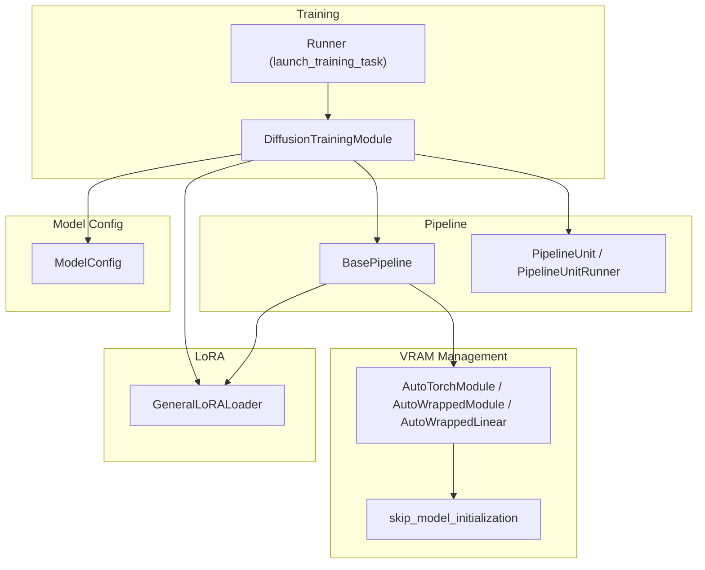
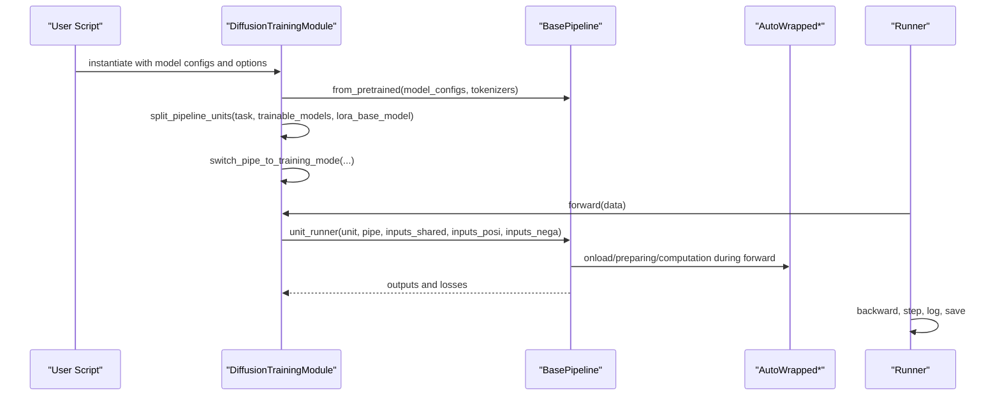
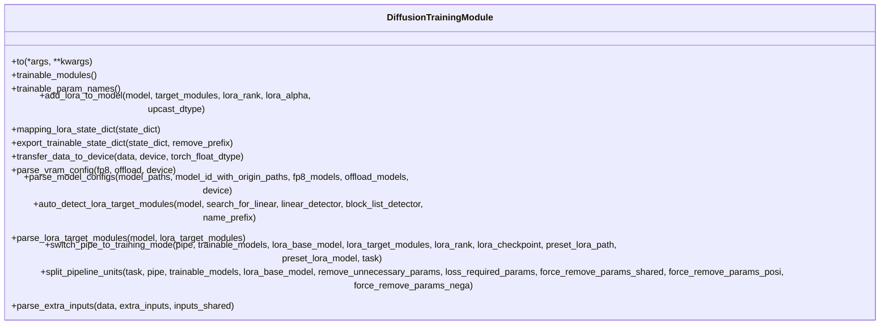
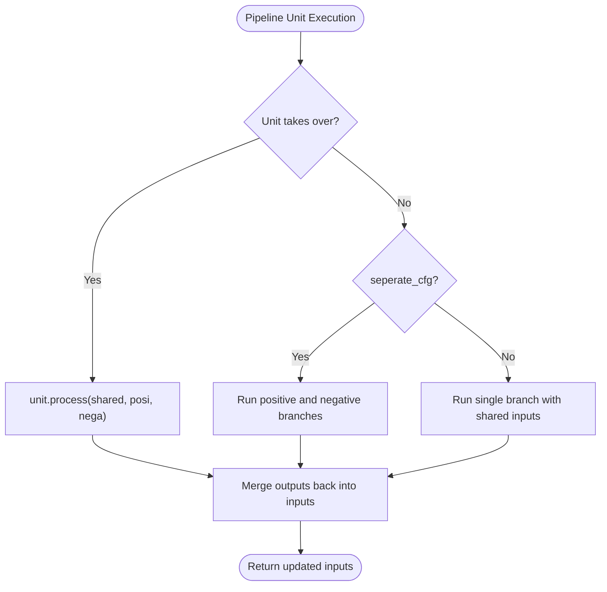
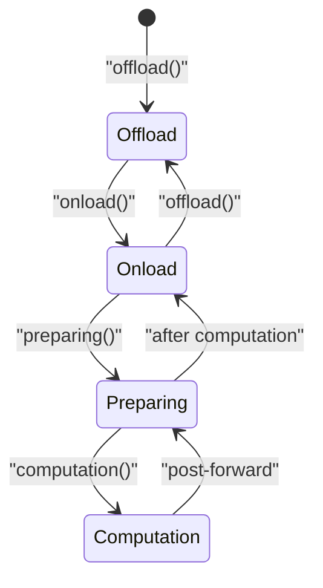
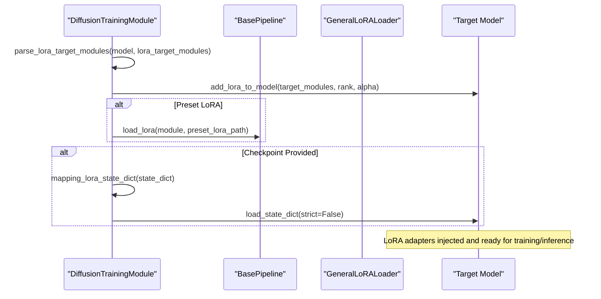
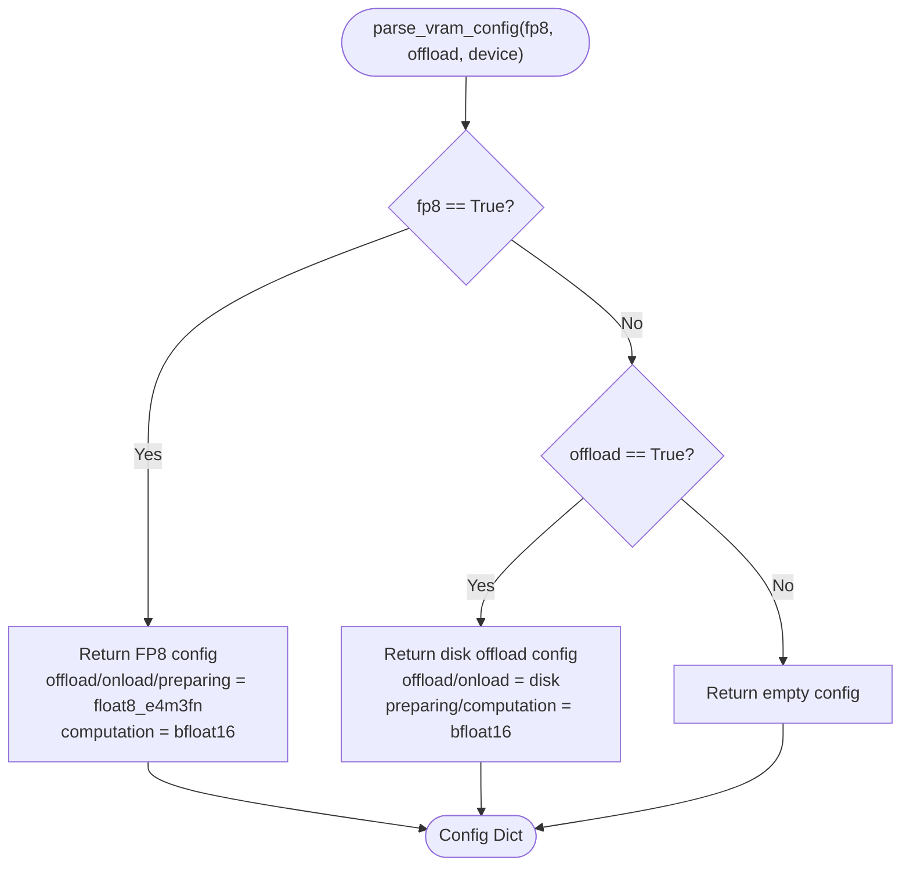
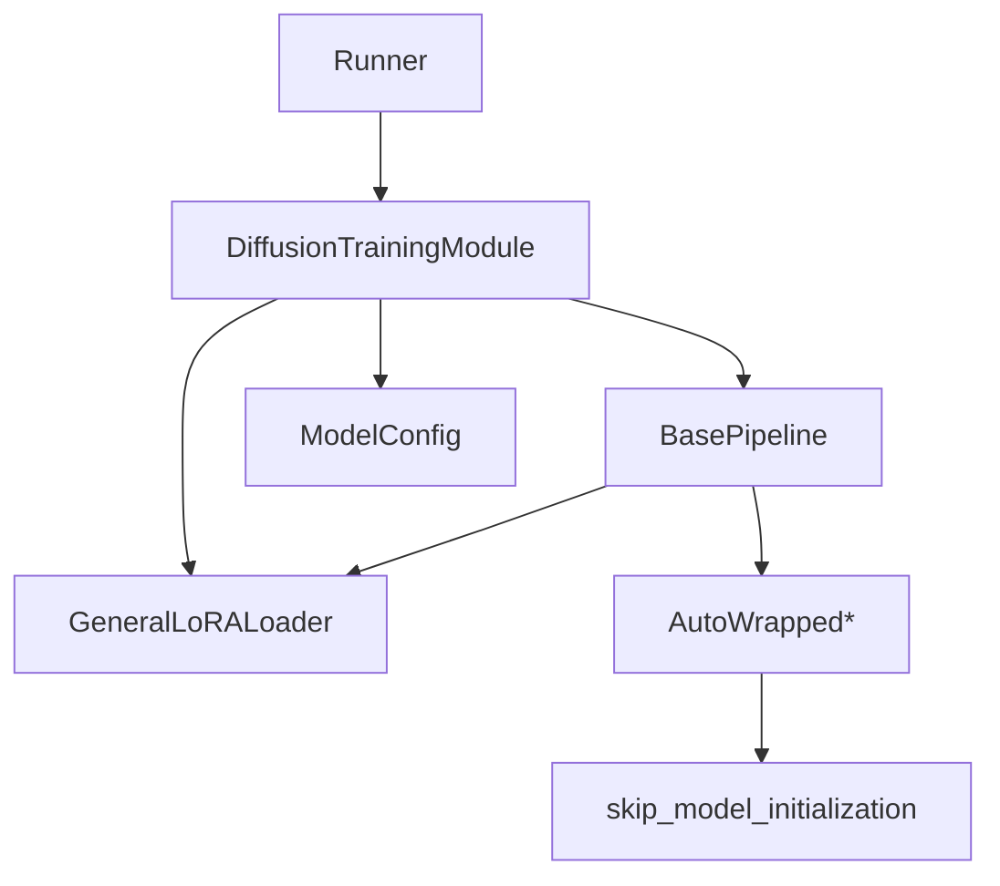

# Training Module Design

<cite>
**Referenced Files in This Document**
- [training_module.py](file://diffsynth/diffusion/training_module.py)
- [base_pipeline.py](file://diffsynth/diffusion/base_pipeline.py)
- [layers.py](file://diffsynth/core/vram/layers.py)
- [initialization.py](file://diffsynth/core/vram/initialization.py)
- [config.py](file://diffsynth/core/loader/config.py)
- [runner.py](file://diffsynth/diffusion/runner.py)
- [train.py](file://examples/flux/model_training/train.py)
- [general.py](file://diffsynth/utils/lora/general.py)
</cite>

## Table of Contents
1. [Introduction](#introduction)
2. [Project Structure](#project-structure)
3. [Core Components](#core-components)
4. [Architecture Overview](#architecture-overview)
5. [Detailed Component Analysis](#detailed-component-analysis)
6. [Dependency Analysis](#dependency-analysis)
7. [Performance Considerations](#performance-considerations)
8. [Troubleshooting Guide](#troubleshooting-guide)
9. [Conclusion](#conclusion)
10. [Appendices](#appendices)

## Introduction
This document explains the training module design in ODTSR-edit with a focus on DiffusionTrainingModule, its integration with the pipeline system, trainable modules management, device transfer utilities, LoRA integration (automatic target detection, state dictionary mapping, checkpoint loading), and VRAM configuration parsing for FP8 and offloading strategies. It also provides guidance for implementing custom training modules and optimizing parameters efficiently.

## Project Structure
The training system is built around:
- A base training module that extends torch.nn.Module and integrates with the diffusion pipeline.
- A pipeline abstraction that manages units, VRAM lifecycle, and LoRA hotloading.
- VRAM management wrappers enabling dynamic memory control and FP8 linear execution.
- Model configuration and loader utilities to parse model sources and VRAM settings.
- A runner that orchestrates data loading, optimization, logging, and DeepSpeed activation checkpointing.

**Diagram sources**
- [training_module.py:30-110](file://diffsynth/diffusion/training_module.py#L30-L110)
- [base_pipeline.py:61-120](file://diffsynth/diffusion/base_pipeline.py#L61-L120)
- [layers.py:8-120](file://diffsynth/core/vram/layers.py#L8-L120)
- [initialization.py:5-21](file://diffsynth/core/vram/initialization.py#L5-L21)
- [config.py:9-120](file://diffsynth/core/loader/config.py#L9-L120)
- [runner.py:8-48](file://diffsynth/diffusion/runner.py#L8-L48)
- [general.py:4-49](file://diffsynth/utils/lora/general.py#L4-L49)

**Section sources**
- [training_module.py:30-110](file://diffsynth/diffusion/training_module.py#L30-L110)
- [base_pipeline.py:61-120](file://diffsynth/diffusion/base_pipeline.py#L61-L120)
- [layers.py:8-120](file://diffsynth/core/vram/layers.py#L8-L120)
- [initialization.py:5-21](file://diffsynth/core/vram/initialization.py#L5-L21)
- [config.py:9-120](file://diffsynth/core/loader/config.py#L9-L120)
- [runner.py:8-48](file://diffsynth/diffusion/runner.py#L8-L48)
- [general.py:4-49](file://diffsynth/utils/lora/general.py#L4-L49)

## Core Components
- DiffusionTrainingModule: Base class for training modules; provides LoRA injection, parameter discovery, device/data transfer, VRAM config parsing, and pipeline splitting utilities.
- BasePipeline: Encapsulates pipeline behavior including unit execution, VRAM lifecycle control, LoRA hotloading/fusing, and CFG-guided inference.
- VRAM Wrappers: AutoTorchModule, AutoWrappedModule, AutoWrappedLinear implement stateful memory management (offload/onload/preparing/computation) and FP8 linear path.
- ModelConfig: Centralized configuration for model sources, download behavior, and VRAM settings per component.
- Runner: Orchestrates training loops, optimizer/scheduler setup, gradient accumulation, and DeepSpeed activation checkpointing initialization.

Key responsibilities:
- Trainable modules management: freeze/unfreeze, collect trainable parameters, export filtered state dicts.
- Device transfer: recursive tensor/device/dtype casting across nested structures.
- LoRA integration: automatic target detection, adapter injection, state dict mapping, checkpoint loading.
- VRAM configuration: FP8 vs disk offload modes, per-model selection via strings or lists.

**Section sources**
- [training_module.py:30-110](file://diffsynth/diffusion/training_module.py#L30-L110)
- [base_pipeline.py:61-120](file://diffsynth/diffusion/base_pipeline.py#L61-L120)
- [layers.py:8-120](file://diffsynth/core/vram/layers.py#L8-L120)
- [config.py:9-120](file://diffsynth/core/loader/config.py#L9-L120)
- [runner.py:8-48](file://diffsynth/diffusion/runner.py#L8-L48)

## Architecture Overview
The training architecture composes a DiffusionTrainingModule with a BasePipeline. The training module prepares models, splits pipeline units based on task type, enables LoRA where applicable, and computes loss through the pipeline’s unit graph. VRAM management is enabled at the model level to dynamically move parameters between devices and disk as needed.

**Diagram sources**
- [train.py:8-84](file://examples/flux/model_training/train.py#L8-L84)
- [training_module.py:214-284](file://diffsynth/diffusion/training_module.py#L214-L284)
- [base_pipeline.py:470-501](file://diffsynth/diffusion/base_pipeline.py#L470-L501)
- [layers.py:194-199](file://diffsynth/core/vram/layers.py#L194-L199)
- [runner.py:8-48](file://diffsynth/diffusion/runner.py#L8-L48)

## Detailed Component Analysis

### DiffusionTrainingModule
Responsibilities:
- Inheritance from torch.nn.Module and custom to() propagation to children.
- Trainable parameter discovery and filtering.
- LoRA injection with automatic target detection and state dict mapping.
- Data/device transfer utilities for nested structures.
- VRAM configuration parsing for FP8 and disk offload.
- Pipeline splitting for data processing vs training tasks.

Key methods:
- add_lora_to_model: injects PEFT LoRA adapters into a target module with optional upcast dtype.
- mapping_lora_state_dict: normalizes LoRA keys for compatibility.
- export_trainable_state_dict: filters state dict by trainable parameters and optional prefix removal.
- transfer_data_to_device: recursively moves tensors and containers to device and dtype.
- parse_vram_config: returns VRAM config dict for FP8 or disk offload modes.
- parse_model_configs: builds ModelConfig list with per-model VRAM settings.
- auto_detect_lora_target_modules: scans model hierarchy to find suitable LoRA targets.
- parse_lora_target_modules: resolves string or auto-detected targets.
- switch_pipe_to_training_mode: freezes non-trainable parts, applies preset LoRA, adds LoRA to base model, loads checkpoint if provided.
- split_pipeline_units: separates units for data processing vs training and optionally prunes unnecessary params.
- parse_extra_inputs: maps extra dataset fields to shared inputs and ControlNet inputs.

**Diagram sources**
- [training_module.py:30-303](file://diffsynth/diffusion/training_module.py#L30-L303)

**Section sources**
- [training_module.py:30-303](file://diffsynth/diffusion/training_module.py#L30-L303)

### BasePipeline Integration
Responsibilities:
- Manages pipeline units and their execution order.
- Provides VRAM lifecycle hooks (onload/offload) and checks.
- Implements LoRA hotloading for wrapped linear layers and fusing when not using hotload.
- Supports CFG-guided model function execution.
- Downloads and loads models with VRAM configurations.

Key methods:
- load_models_to_device: offloads unused models and onloads required ones.
- freeze_except: sets train/eval mode and requires_grad flags selectively.
- load_lora: hotloads or fuses LoRA weights into wrapped linear layers.
- clear_lora: clears accumulated LoRA weights.
- download_and_load_models: uses ModelPool with vram_config.
- cfg_guided_model_fn: runs positive/negative passes and blends predictions.

**Diagram sources**
- [base_pipeline.py:470-501](file://diffsynth/diffusion/base_pipeline.py#L470-L501)

**Section sources**
- [base_pipeline.py:61-120](file://diffsynth/diffusion/base_pipeline.py#L61-L120)
- [base_pipeline.py:157-180](file://diffsynth/diffusion/base_pipeline.py#L157-L180)
- [base_pipeline.py:204-214](file://diffsynth/diffusion/base_pipeline.py#L204-L214)
- [base_pipeline.py:242-294](file://diffsynth/diffusion/base_pipeline.py#L242-L294)
- [base_pipeline.py:296-310](file://diffsynth/diffusion/base_pipeline.py#L296-L310)
- [base_pipeline.py:321-340](file://diffsynth/diffusion/base_pipeline.py#L321-L340)

### VRAM Management and FP8 Linear Path
Responsibilities:
- Wrap modules to manage states: offload, onload, preparing, computation.
- Support disk offloading and memory limit enforcement.
- Provide FP8-aware linear forward path with scaling and fused matmul.

Key classes:
- AutoTorchModule: base with dtype/device state and check_free_vram.
- AutoWrappedModule: wraps arbitrary modules with lifecycle methods and disk offload support.
- AutoWrappedLinear: specialized wrapper for nn.Linear with FP8 path and LoRA accumulation.

**Diagram sources**
- [layers.py:71-80](file://diffsynth/core/vram/layers.py#L71-L80)
- [layers.py:150-176](file://diffsynth/core/vram/layers.py#L150-L176)
- [layers.py:368-394](file://diffsynth/core/vram/layers.py#L368-L394)

**Section sources**
- [layers.py:8-120](file://diffsynth/core/vram/layers.py#L8-L120)
- [layers.py:194-199](file://diffsynth/core/vram/layers.py#L194-L199)
- [layers.py:271-337](file://diffsynth/core/vram/layers.py#L271-L337)
- [layers.py:439-479](file://diffsynth/core/vram/layers.py#L439-L479)
- [initialization.py:5-21](file://diffsynth/core/vram/initialization.py#L5-L21)

### LoRA Integration
Responsibilities:
- Automatic target module detection via recursion and heuristics.
- Adapter injection using PEFT LoraConfig and inject_adapter_in_model.
- State dictionary mapping to align key formats across sources.
- Loading checkpoints with strict=False and reporting mismatches.
- Hotloading LoRA into AutoWrappedLinear layers without fusing.

Key flows:
- parse_lora_target_modules: auto-detect or parse comma-separated names.
- add_lora_to_model: create LoraConfig and inject adapters; optional upcast.
- mapping_lora_state_dict: normalize keys for default weight suffixes.
- switch_pipe_to_training_mode: apply preset LoRA, add LoRA to base model, load checkpoint.
- GeneralLoRALoader.convert_state_dict: convert various LoRA formats to unified naming.

**Diagram sources**
- [training_module.py:177-212](file://diffsynth/diffusion/training_module.py#L177-L212)
- [training_module.py:52-74](file://diffsynth/diffusion/training_module.py#L52-L74)
- [training_module.py:214-255](file://diffsynth/diffusion/training_module.py#L214-L255)
- [base_pipeline.py:242-294](file://diffsynth/diffusion/base_pipeline.py#L242-L294)
- [general.py:4-49](file://diffsynth/utils/lora/general.py#L4-L49)

**Section sources**
- [training_module.py:52-74](file://diffsynth/diffusion/training_module.py#L52-L74)
- [training_module.py:177-212](file://diffsynth/diffusion/training_module.py#L177-L212)
- [training_module.py:214-255](file://diffsynth/diffusion/training_module.py#L214-L255)
- [base_pipeline.py:242-294](file://diffsynth/diffusion/base_pipeline.py#L242-L294)
- [general.py:4-49](file://diffsynth/utils/lora/general.py#L4-L49)

### VRAM Configuration Parsing (FP8 and Offload)
Responsibilities:
- Generate VRAM config dictionaries for FP8 quantization or disk offload.
- Apply per-model selection via comma-separated lists.
- Integrate with ModelConfig to propagate VRAM settings to loaders.

Key behaviors:
- parse_vram_config: returns FP8 or disk offload configs with appropriate dtypes/devices.
- parse_model_configs: constructs ModelConfig entries with VRAM settings per model.
- fill_vram_config: ensures consistent onload/preparing/computation defaults when fine-grained config is missing.

**Diagram sources**
- [training_module.py:110-136](file://diffsynth/diffusion/training_module.py#L110-L136)
- [config.py:109-120](file://diffsynth/core/loader/config.py#L109-L120)
- [layers.py:455-466](file://diffsynth/core/vram/layers.py#L455-L466)

**Section sources**
- [training_module.py:110-161](file://diffsynth/diffusion/training_module.py#L110-L161)
- [config.py:109-120](file://diffsynth/core/loader/config.py#L109-L120)
- [layers.py:455-466](file://diffsynth/core/vram/layers.py#L455-L466)

### Custom Training Module Implementation
Guidelines:
- Subclass DiffusionTrainingModule and implement __init__ and forward.
- Use parse_model_configs to build ModelConfig list with VRAM settings.
- Initialize BasePipeline via from_pretrained with model_configs and tokenizers.
- Call split_pipeline_units to separate data processing vs training units.
- Use switch_pipe_to_training_mode to configure LoRA and freezing.
- Implement get_pipeline_inputs to map dataset fields to shared/positive/negative inputs.
- Compute loss in forward using task-specific loss functions.

Example reference:
- FluxTrainingModule demonstrates full setup including tokenizer configs, pipeline instantiation, unit splitting, training mode switching, and forward logic.

**Section sources**
- [train.py:8-84](file://examples/flux/model_training/train.py#L8-L84)
- [training_module.py:214-284](file://diffsynth/diffusion/training_module.py#L214-L284)

### Parameter Optimization Techniques
Recommendations:
- Use trainable_modules() to pass only trainable parameters to optimizers.
- Leverage gradient checkpointing via pipeline flags to reduce memory usage.
- Employ FP8 linear path for compute-heavy layers when supported.
- Enable disk offload for large models when VRAM is constrained.
- Use export_trainable_state_dict to save minimal checkpoints containing only trainable parameters.

**Section sources**
- [runner.py:27-48](file://diffsynth/diffusion/runner.py#L27-L48)
- [training_module.py:41-49](file://diffsynth/diffusion/training_module.py#L41-L49)
- [training_module.py:77-87](file://diffsynth/diffusion/training_module.py#L77-L87)
- [layers.py:321-337](file://diffsynth/core/vram/layers.py#L321-L337)

## Dependency Analysis
High-level dependencies:
- DiffusionTrainingModule depends on BasePipeline, ModelConfig, and LoRA utilities.
- BasePipeline depends on VRAM wrappers and LoRA loader.
- VRAM wrappers depend on initialization utilities and device abstractions.
- Runner depends on DiffusionTrainingModule and ModelLogger.

**Diagram sources**
- [training_module.py:30-110](file://diffsynth/diffusion/training_module.py#L30-L110)
- [base_pipeline.py:61-120](file://diffsynth/diffusion/base_pipeline.py#L61-L120)
- [layers.py:8-120](file://diffsynth/core/vram/layers.py#L8-L120)
- [initialization.py:5-21](file://diffsynth/core/vram/initialization.py#L5-L21)
- [runner.py:8-48](file://diffsynth/diffusion/runner.py#L8-L48)

**Section sources**
- [training_module.py:30-110](file://diffsynth/diffusion/training_module.py#L30-L110)
- [base_pipeline.py:61-120](file://diffsynth/diffusion/base_pipeline.py#L61-L120)
- [layers.py:8-120](file://diffsynth/core/vram/layers.py#L8-L120)
- [initialization.py:5-21](file://diffsynth/core/vram/initialization.py#L5-L21)
- [runner.py:8-48](file://diffsynth/diffusion/runner.py#L8-L48)

## Performance Considerations
- Prefer FP8 linear path for compute-bound layers when hardware supports it.
- Use disk offload for models exceeding VRAM capacity; ensure sufficient CPU/memory bandwidth.
- Enable gradient checkpointing to trade compute for memory savings.
- Minimize unnecessary parameter movement by using transfer_data_to_device with appropriate dtypes.
- Avoid frequent LoRA hotloading/clearing within tight loops; batch operations where possible.

[No sources needed since this section provides general guidance]

## Troubleshooting Guide
Common issues and resolutions:
- LoRA key mismatch during checkpoint loading: review mapping_lora_state_dict and verify key formats; inspect warnings printed by load_state_dict.
- No LoRA base model found: ensure lora_base_model attribute exists in pipeline; data processing stage may skip LoRA patching intentionally.
- VRAM errors during forward: confirm vram_limit and device settings; enable check_free_vram and monitor memory usage.
- Gradient checkpointing not applied: verify accelerator DeepSpeed plugin configuration and activation_checkpointing settings.

**Section sources**
- [training_module.py:247-254](file://diffsynth/diffusion/training_module.py#L247-L254)
- [training_module.py:237-246](file://diffsynth/diffusion/training_module.py#L237-L246)
- [layers.py:65-70](file://diffsynth/core/vram/layers.py#L65-L70)
- [runner.py:75-89](file://diffsynth/diffusion/runner.py#L75-L89)

## Conclusion
The training module design in ODTSR-edit provides a robust, extensible framework for diffusion model training. DiffusionTrainingModule centralizes LoRA integration, parameter management, device handling, and VRAM configuration. BasePipeline abstracts unit execution and VRAM lifecycle, while VRAM wrappers enable dynamic memory control and FP8 acceleration. Together, these components offer a flexible foundation for both research and production training workflows.

[No sources needed since this section summarizes without analyzing specific files]

## Appendices
- Example training script: see examples/flux/model_training/train.py for a complete implementation pattern.
- VRAM management documentation: refer to core/vram/layers.py and initialization.py for detailed behavior.
- LoRA utilities: consult utils/lora/general.py for format conversion and merging.

[No sources needed since this section references existing files without direct analysis]