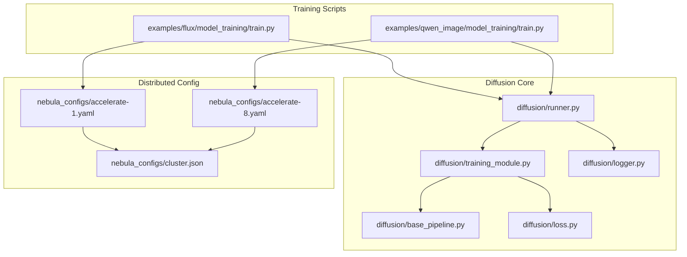
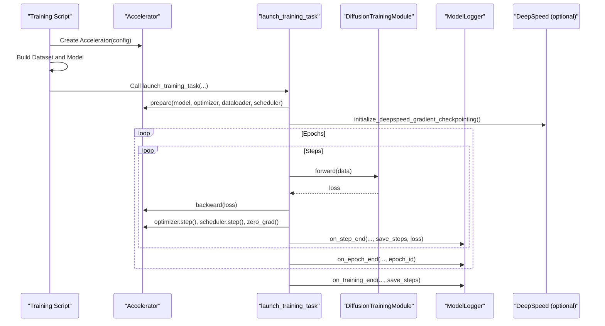
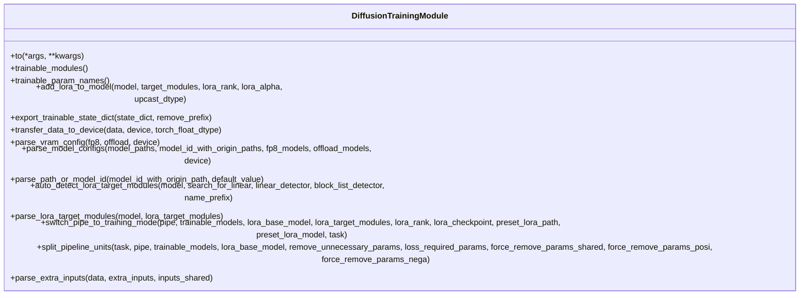
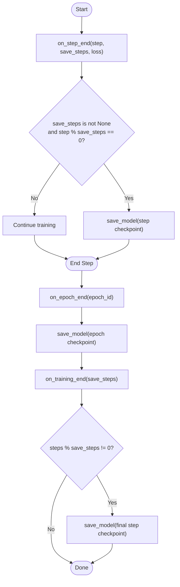
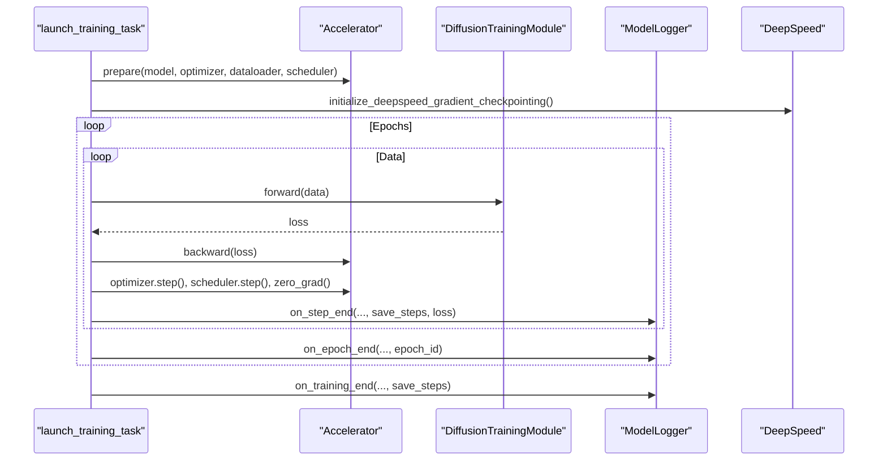
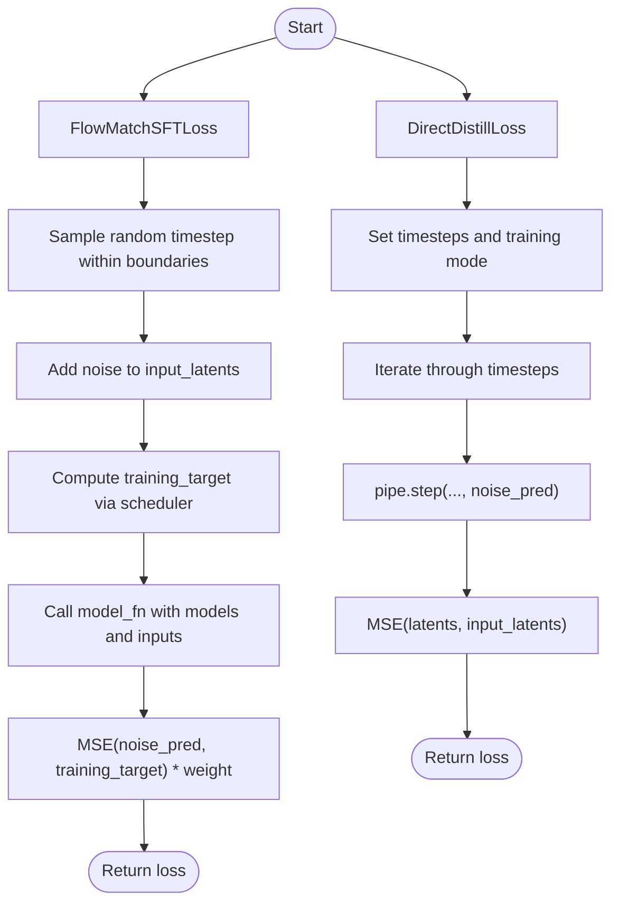
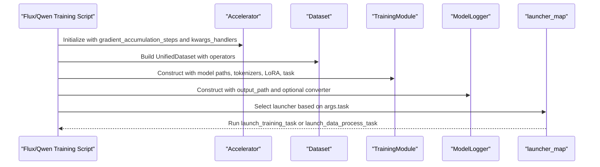
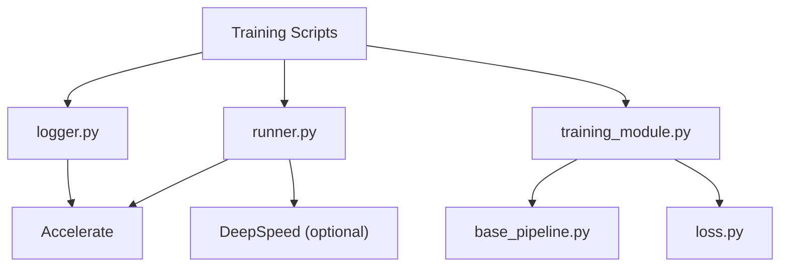

# Training Runner

<cite>
**Referenced Files in This Document**
- [runner.py](file://diffvsynth/diffusion/runner.py)
- [training_module.py](file://diffvsynth/diffusion/training_module.py)
- [logger.py](file://diffvsynth/diffusion/logger.py)
- [base_pipeline.py](file://diffvsynth/diffusion/base_pipeline.py)
- [loss.py](file://diffvsynth/diffusion/loss.py)
- [train.py (Flux)](file://examples/flux/model_training/train.py)
- [train.py (Qwen Image)](file://examples/qwen_image/model_training/train.py)
- [accelerate-1.yaml](file://nebula_configs/accelerate-1.yaml)
- [accelerate-8.yaml](file://nebula_configs/accelerate-8.yaml)
- [cluster.json](file://nebula_configs/cluster.json)
</cite>

## Table of Contents
1. [Introduction](#introduction)
2. [Project Structure](#project-structure)
3. [Core Components](#core-components)
4. [Architecture Overview](#architecture-overview)
5. [Detailed Component Analysis](#detailed-component-analysis)
6. [Dependency Analysis](#dependency-analysis)
7. [Performance Considerations](#performance-considerations)
8. [Troubleshooting Guide](#troubleshooting-guide)
9. [Conclusion](#conclusion)
10. [Appendices](#appendices)

## Introduction
This document explains the training runner system in ODTSR-edit, focusing on distributed training support, checkpointing, progress monitoring, logging, metrics collection, custom training loops, evaluation strategies, callbacks, error handling, recovery mechanisms, optimization techniques, and integration with external monitoring tools. The system is built around Accelerate for multi-GPU/multi-node orchestration, a modular DiffusionTrainingModule for model setup and LoRA patching, a ModelLogger for checkpointing, and example training scripts that wire everything together.

## Project Structure
The training system centers around:
- A launcher that prepares data, optimizer, scheduler, and runs the training loop under Accelerate.
- A DiffusionTrainingModule base class that configures pipelines, LoRA, VRAM management, and task-specific losses.
- A ModelLogger that saves checkpoints at step or epoch boundaries.
- Example training scripts per model family (e.g., Flux, Qwen Image) that define inputs, tasks, and launchers.
- Accelerate configuration files for multi-GPU setups.

**Diagram sources**
- [train.py (Flux):139-194](file://examples/flux/model_training/train.py#L139-L194)
- [train.py (Qwen Image):108-175](file://examples/qwen_image/model_training/train.py#L108-L175)
- [runner.py:8-48](file://diffvsynth/diffusion/runner.py#L8-L48)
- [training_module.py:30-303](file://diffvsynth/diffusion/training_module.py#L30-L303)
- [logger.py:5-44](file://diffvsynth/diffusion/logger.py#L5-L44)
- [base_pipeline.py:61-200](file://diffvsynth/diffusion/base_pipeline.py#L61-L200)
- [loss.py:5-159](file://diffvsynth/diffusion/loss.py#L5-L159)
- [accelerate-1.yaml:1-16](file://nebula_configs/accelerate-1.yaml#L1-L16)
- [accelerate-8.yaml:1-16](file://nebula_configs/accelerate-8.yaml#L1-L16)
- [cluster.json:1-7](file://nebula_configs/cluster.json#L1-L7)

**Section sources**
- [runner.py:8-48](file://diffvsynth/diffusion/runner.py#L8-L48)
- [training_module.py:30-303](file://diffvsynth/diffusion/training_module.py#L30-L303)
- [logger.py:5-44](file://diffvsynth/diffusion/logger.py#L5-L44)
- [train.py (Flux):139-194](file://examples/flux/model_training/train.py#L139-L194)
- [train.py (Qwen Image):108-175](file://examples/qwen_image/model_training/train.py#L108-L175)
- [accelerate-1.yaml:1-16](file://nebula_configs/accelerate-1.yaml#L1-L16)
- [accelerate-8.yaml:1-16](file://nebula_configs/accelerate-8.yaml#L1-L16)
- [cluster.json:1-7](file://nebula_configs/cluster.json#L1-L7)

## Core Components
- DiffusionTrainingModule: Base class to configure pipeline units, LoRA injection, VRAM/offload settings, and task-to-loss mapping. It also provides utilities for parameter filtering, device transfer, and LoRA state dict mapping.
- ModelLogger: Handles saving checkpoints at step or epoch boundaries, unwrapping DDP models, and applying optional state_dict converters.
- Runner: Provides launch_training_task and launch_data_process_task to run the training loop under Accelerate, including gradient accumulation, backward passes, optimizer steps, and logging hooks.
- Loss functions: FlowMatchSFTLoss, DirectDistillLoss, and related utilities implement common diffusion training objectives.
- BasePipeline: Defines the pipeline unit architecture, VRAM management hooks, and helper utilities used by training modules.

Key responsibilities:
- Distributed setup via Accelerate (DDP, mixed precision, gradient accumulation).
- Modular training loop with step/epoch hooks for checkpointing and potential metrics.
- Flexible input parsing and extra inputs (e.g., ControlNet).
- LoRA patching and optional preset LoRA loading.
- Optional DeepSpeed activation checkpointing initialization.

**Section sources**
- [training_module.py:30-303](file://diffvsynth/diffusion/training_module.py#L30-L303)
- [logger.py:5-44](file://diffvsynth/diffusion/logger.py#L5-L44)
- [runner.py:8-89](file://diffvsynth/diffusion/runner.py#L8-L89)
- [loss.py:5-159](file://diffvsynth/diffusion/loss.py#L5-L159)
- [base_pipeline.py:61-200](file://diffvsynth/diffusion/base_pipeline.py#L61-L200)

## Architecture Overview
The training flow is orchestrated by example scripts that construct an Accelerator, dataset, training module, and logger, then dispatch to either data processing or training launchers. The runner prepares the model, optimizer, dataloader, and scheduler, initializes DeepSpeed activation checkpointing if configured, and iterates over data with gradient accumulation. At each step, the logger may save checkpoints; at epoch boundaries, it saves epoch-based checkpoints.

**Diagram sources**
- [runner.py:8-48](file://diffvsynth/diffusion/runner.py#L8-L48)
- [logger.py:13-44](file://diffvsynth/diffusion/logger.py#L13-L44)
- [train.py (Flux):139-194](file://examples/flux/model_training/train.py#L139-L194)
- [train.py (Qwen Image):108-175](file://examples/qwen_image/model_training/train.py#L108-L175)

## Detailed Component Analysis

### DiffusionTrainingModule
Responsibilities:
- Pipeline construction and splitting into trainable units.
- LoRA injection and preset LoRA loading.
- VRAM/offload configuration parsing.
- Data transfer utilities for tensors, lists, tuples, dicts.
- Extra input parsing (ControlNet keys).
- Task-to-loss mapping via subclass overrides.

Key methods and patterns:
- add_lora_to_model: Injects LoRA adapters with configurable rank/alpha and dtype upcasting.
- export_trainable_state_dict: Filters state dict to trainable parameters and optionally removes prefixes.
- parse_vram_config: Returns VRAM/offload configurations for FP8 or disk offloading.
- split_pipeline_units: Splits pipeline units based on task type (data_process vs train).
- switch_pipe_to_training_mode: Freezes non-trainable parts, sets timesteps, applies preset LoRA, and patches LoRA.

**Diagram sources**
- [training_module.py:30-303](file://diffvsynth/diffusion/training_module.py#L30-L303)

**Section sources**
- [training_module.py:30-303](file://diffvsynth/diffusion/training_module.py#L30-L303)

### ModelLogger
Responsibilities:
- Step-based checkpointing when save_steps is set.
- Epoch-based checkpointing on main process.
- Saving final checkpoint if needed after training ends.
- Unwrapping DDP model and applying optional state_dict converter.

Checkpoint naming:
- step-{num_steps}.safetensors
- epoch-{epoch_id}.safetensors

**Diagram sources**
- [logger.py:13-44](file://diffvsynth/diffusion/logger.py#L13-L44)

**Section sources**
- [logger.py:5-44](file://diffvsynth/diffusion/logger.py#L5-L44)

### Runner (launch_training_task and launch_data_process_task)
Responsibilities:
- Optimizer and scheduler setup.
- Data loader creation and preparation under Accelerate.
- Device placement and DeepSpeed activation checkpointing initialization.
- Training loop with gradient accumulation and logging hooks.
- Data processing task for caching outputs per process.

**Diagram sources**
- [runner.py:8-48](file://diffvsynth/diffusion/runner.py#L8-L48)
- [runner.py:75-89](file://diffvsynth/diffusion/runner.py#L75-L89)

**Section sources**
- [runner.py:8-48](file://diffvsynth/diffusion/runner.py#L8-L48)
- [runner.py:50-73](file://diffvsynth/diffusion/runner.py#L50-L73)
- [runner.py:75-89](file://diffvsynth/diffusion/runner.py#L75-L89)

### Loss Functions
Responsibilities:
- FlowMatchSFTLoss: Random timestep sampling, noise addition, training target computation, MSE loss weighted by scheduler weights.
- DirectDistillLoss: Iterative distillation across timesteps with MSE between predicted and input latents.
- TrajectoryImitationLoss: Teacher-student trajectory alignment and regularization using LPIPS.

**Diagram sources**
- [loss.py:5-71](file://diffvsynth/diffusion/loss.py#L5-L71)

**Section sources**
- [loss.py:5-159](file://diffvsynth/diffusion/loss.py#L5-L159)

### Example Training Scripts (Flux and Qwen Image)
Responsibilities:
- Define model families’ training modules with specific tokenizer/processor configs.
- Configure dataset operators and special operators.
- Instantiate Accelerator, dataset, model, and logger.
- Map tasks to launchers (data_process vs training).

Key aspects:
- Task mapping includes sft:data_process, direct_distill:data_process, sft, sft:train, direct_distill, direct_distill:train.
- Gradient checkpointing flags and extra inputs are passed to the training module.
- Optional LoRA format conversion for open-source compatibility.

**Diagram sources**
- [train.py (Flux):139-194](file://examples/flux/model_training/train.py#L139-L194)
- [train.py (Qwen Image):108-175](file://examples/qwen_image/model_training/train.py#L108-L175)

**Section sources**
- [train.py (Flux):139-194](file://examples/flux/model_training/train.py#L139-L194)
- [train.py (Qwen Image):108-175](file://examples/qwen_image/model_training/train.py#L108-L175)

## Dependency Analysis
The training system has clear separation of concerns:
- Scripts depend on runner, training_module, logger, and loss components.
- training_module depends on base_pipeline and utils (LoRA loader, controlnet).
- runner depends on accelerate and optionally deepspeed.
- logger depends on accelerate for DDP state handling.

**Diagram sources**
- [runner.py:1-89](file://diffvsynth/diffusion/runner.py#L1-L89)
- [training_module.py:1-303](file://diffvsynth/diffusion/training_module.py#L1-L303)
- [logger.py:1-44](file://diffvsynth/diffusion/logger.py#L1-L44)
- [base_pipeline.py:1-200](file://diffvsynth/diffusion/base_pipeline.py#L1-L200)
- [loss.py:1-159](file://diffvsynth/diffusion/loss.py#L1-L159)

**Section sources**
- [runner.py:1-89](file://diffvsynth/diffusion/runner.py#L1-L89)
- [training_module.py:1-303](file://diffvsynth/diffusion/training_module.py#L1-L303)
- [logger.py:1-44](file://diffvsynth/diffusion/logger.py#L1-L44)
- [base_pipeline.py:1-200](file://diffvsynth/diffusion/base_pipeline.py#L1-L200)
- [loss.py:1-159](file://diffvsynth/diffusion/loss.py#L1-L159)

## Performance Considerations
- Mixed precision: Accelerate supports bf16; ensure consistent dtype across pipeline and data transfer.
- Gradient accumulation: Use gradient_accumulation_steps to simulate larger batch sizes.
- Activation checkpointing: DeepSpeed activation checkpointing can be initialized automatically if configured.
- VRAM management: Offload models to disk or use FP8 modes via parse_vram_config; enable vram_management_enabled in pipelines where supported.
- Data loading: Adjust num_workers and collate functions to balance throughput and memory usage.
- LoRA: Use appropriate rank/alpha and target modules; auto-detection helps identify suitable layers.

[No sources needed since this section provides general guidance]

## Troubleshooting Guide
Common issues and resolutions:
- Missing activation_checkpointing config: Ensure DeepSpeed config includes activation_checkpointing keys; otherwise, initialization prints a message and skips.
- DDP find_unused_parameters: If gradients are not computed for some parameters, set find_unused_parameters=True in DDPKwargs.
- State dict key mismatch during LoRA load: Mapping function handles key renaming; verify unexpected keys and adjust mapping if needed.
- Output path permissions: Ensure output_path exists or is writable; logger creates directories as needed.
- Multi-process data caching: In data_process task, outputs are saved per process index; verify accelerator.process_index and folder structure.

**Section sources**
- [runner.py:75-89](file://diffvsynth/diffusion/runner.py#L75-L89)
- [train.py (Flux):139-194](file://examples/flux/model_training/train.py#L139-L194)
- [train.py (Qwen Image):108-175](file://examples/qwen_image/model_training/train.py#L108-L175)
- [logger.py:13-44](file://diffvsynth/diffusion/logger.py#L13-L44)

## Conclusion
The ODTSR-edit training runner provides a robust, modular framework for distributed diffusion model training. It leverages Accelerate for multi-GPU/multi-node orchestration, offers flexible checkpointing and logging, and supports advanced features like LoRA, VRAM offloading, and DeepSpeed activation checkpointing. Example scripts demonstrate how to integrate model-specific pipelines, datasets, and loss functions into a cohesive training workflow.

[No sources needed since this section summarizes without analyzing specific files]

## Appendices

### Distributed Training Configuration
- Multi-GPU: Use accelerate-*.yaml files to configure num_processes and mixed precision.
- Multi-node: Extend cluster.json with worker resources and configure Accelerate accordingly.

**Section sources**
- [accelerate-1.yaml:1-16](file://nebula_configs/accelerate-1.yaml#L1-L16)
- [accelerate-8.yaml:1-16](file://nebula_configs/accelerate-8.yaml#L1-L16)
- [cluster.json:1-7](file://nebula_configs/cluster.json#L1-L7)

### Custom Training Loop Examples
- Implement a new training module by extending DiffusionTrainingModule, overriding get_pipeline_inputs and forward, and mapping tasks to losses.
- Integrate custom callbacks by extending ModelLogger or adding hooks in the runner loop.

**Section sources**
- [training_module.py:30-303](file://diffvsynth/diffusion/training_module.py#L30-L303)
- [logger.py:5-44](file://diffvsynth/diffusion/logger.py#L5-L44)
- [runner.py:8-48](file://diffvsynth/diffusion/runner.py#L8-L48)