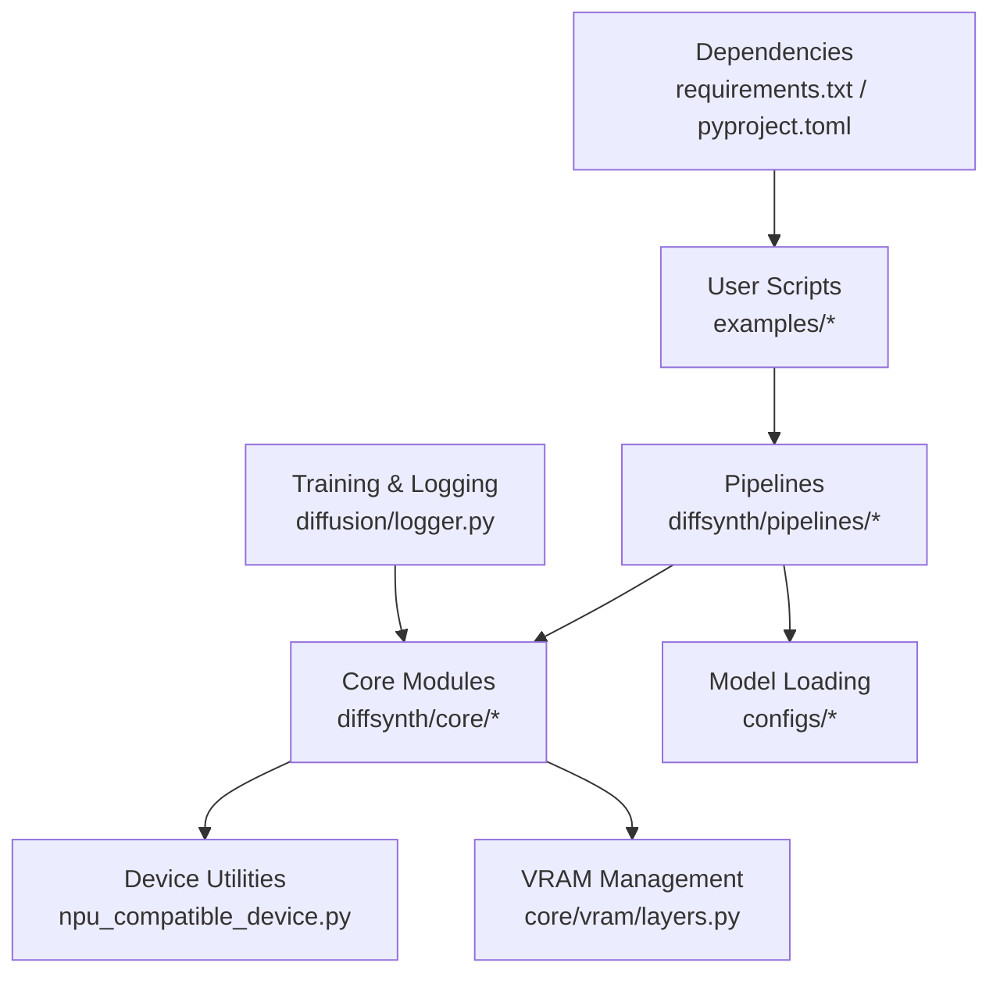
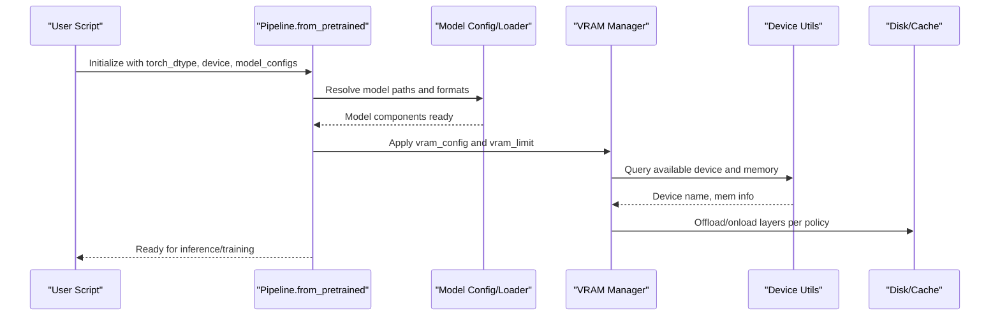
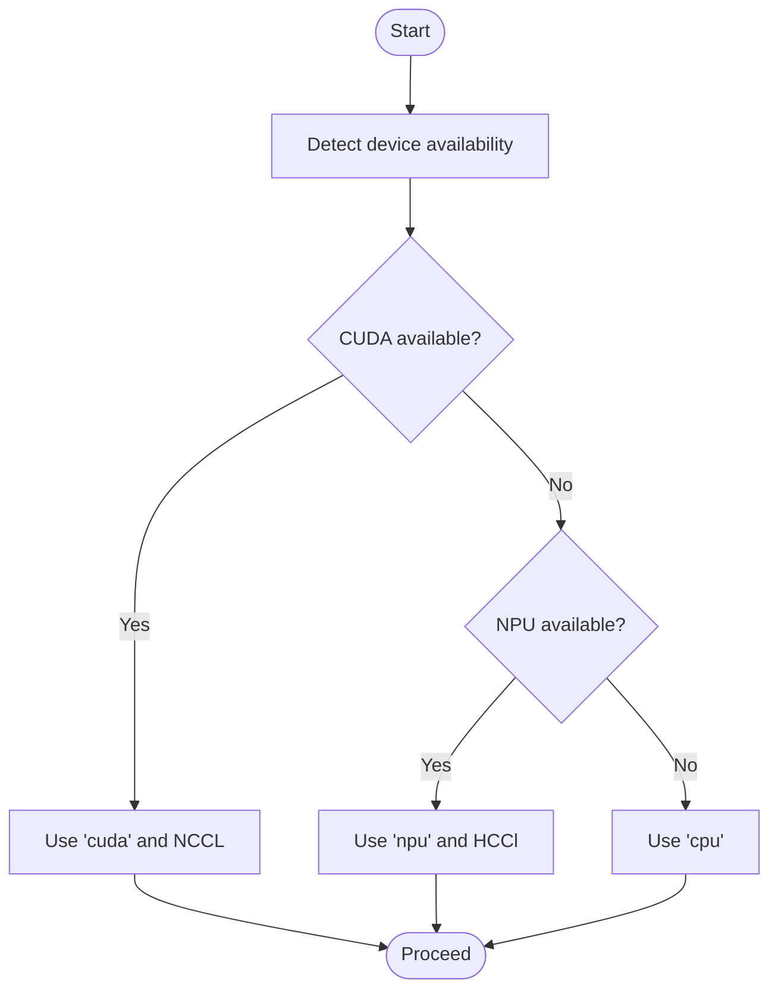
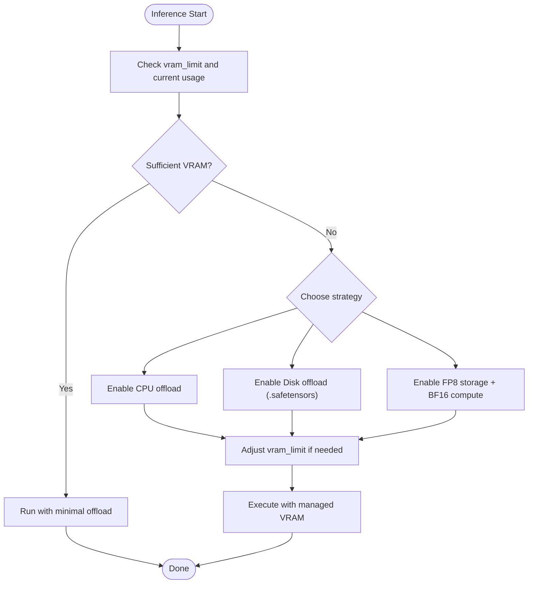

# Troubleshooting and FAQ

<cite>
**Referenced Files in This Document**
- [requirements.txt](file://requirements.txt)
- [setup.py](file://setup.py)
- [pyproject.toml](file://pyproject.toml)
- [Setup.md](file://docs/en/Pipeline_Usage/Setup.md)
- [GPU_support.md](file://docs/en/Pipeline_Usage/GPU_support.md)
- [VRAM_management.md](file://docs/en/Pipeline_Usage/VRAM_management.md)
- [Environment_Variables.md](file://docs/en/Pipeline_Usage/Environment_Variables.md)
- [QA.md](file://docs/en/QA.md)
- [layers.py](file://diffsynth/core/vram/layers.py)
- [npu_compatible_device.py](file://diffsynth/core/device/npu_compatible_device.py)
- [logger.py](file://diffsynth/diffusion/logger.py)
- [FLUX.1-dev.py](file://examples/flux/model_inference/FLUX.1-dev.py)
</cite>

## Table of Contents
1. Introduction
2. Project Structure
3. Core Components
4. Architecture Overview
5. Detailed Component Analysis
6. Dependency Analysis
7. Performance Considerations
8. Troubleshooting Guide
9. Conclusion
10. Appendices

## Introduction
This document provides comprehensive troubleshooting and FAQ guidance for ODTSR-edit (DiffSynth-Studio). It focuses on common installation issues, dependency conflicts, hardware compatibility problems, runtime errors related to memory limitations and device mismatches, model loading failures, performance optimization tips, debugging techniques, known limitations, workarounds, diagnostic commands, logging practices, and community resources.

## Project Structure
ODTSR-edit is organized around a core library (diffsynth), example pipelines, training scripts, configuration files, and documentation. Key areas relevant to troubleshooting include:
- Installation and dependencies defined in requirements and project metadata
- Device support utilities for CUDA/NPU/CPU
- VRAM management subsystem for low-memory inference
- Logging and checkpointing utilities
- Example inference scripts demonstrating typical usage patterns

**Diagram sources**
- [layers.py:38-479](file://diffsynth/core/vram/layers.py#L38-L479)
- [npu_compatible_device.py:1-107](file://diffsynth/core/device/npu_compatible_device.py#L1-L107)
- [logger.py:1-44](file://diffsynth/diffusion/logger.py#L1-L44)

**Section sources**
- [requirements.txt:1-43](file://requirements.txt#L1-L43)
- [pyproject.toml:1-57](file://pyproject.toml#L1-L57)
- [setup.py:1-30](file://setup.py#L1-L30)

## Core Components
- Device abstraction and detection: Provides unified device type selection (CUDA/NPU/CPU), backend selection (NCCL/HCCl), synchronization, cache clearing, and high-precision settings.
- VRAM management: Enables CPU/Disk offload, dynamic layer-level splitting, FP8 storage with BF16 computation, and vram_limit-based adaptive behavior.
- Logging and checkpoints: Saves training artifacts at step/epoch boundaries using Accelerate and safetensors serialization.
- Example pipelines: Demonstrate model loading and inference flows across supported models.

**Section sources**
- [npu_compatible_device.py:1-107](file://diffsynth/core/device/npu_compatible_device.py#L1-L107)
- [VRAM_management.md:1-206](file://docs/en/Pipeline_Usage/VRAM_management.md#L1-L206)
- [logger.py:1-44](file://diffsynth/diffusion/logger.py#L1-L44)
- [FLUX.1-dev.py:1-27](file://examples/flux/model_inference/FLUX.1-dev.py#L1-L27)

## Architecture Overview
The system composes user-facing pipelines that load models via ModelConfig, apply VRAM management when configured, and execute inference or training on the selected device. Device utilities abstract differences between CUDA and NPU, while VRAM management dynamically moves parameters between devices and disk based on limits and configurations.

**Diagram sources**
- [VRAM_management.md:98-137](file://docs/en/Pipeline_Usage/VRAM_management.md#L98-L137)
- [npu_compatible_device.py:42-69](file://diffsynth/core/device/npu_compatible_device.py#L42-L69)
- [layers.py:468-479](file://diffsynth/core/vram/layers.py#L468-L479)

## Detailed Component Analysis

### Device Compatibility and Mismatches
Common symptoms:
- “No available distributed communication backend”
- Incorrect device selection leading to crashes
- NPU-specific environment variables not set

Resolution steps:
- Ensure correct PyTorch build for your device (CUDA ROCm for AMD; torch-npu for Ascend NPU).
- Use provided device utilities to detect and select the appropriate backend.
- For NPU, replace “cuda” with “npu” in code and set required environment variables.

**Diagram sources**
- [npu_compatible_device.py:19-70](file://diffsynth/core/device/npu_compatible_device.py#L19-L70)

**Section sources**
- [GPU_support.md:1-94](file://docs/en/Pipeline_Usage/GPU_support.md#L1-L94)
- [npu_compatible_device.py:1-107](file://diffsynth/core/device/npu_compatible_device.py#L1-L107)

### VRAM Limitation Errors and Workarounds
Symptoms:
- Out-of-memory during model loading or inference
- Slow performance due to excessive offloading

Workarounds:
- Enable CPU offload or Disk offload depending on available RAM and storage speed.
- Use FP8 quantization for storage with BF16 computation to reduce VRAM footprint.
- Set vram_limit to guide dynamic layer splitting; tune lower values for smaller VRAM but expect slower speed.
- Prefer .safetensors for Disk Offload; avoid binary formats unsupported by this feature.

**Diagram sources**
- [VRAM_management.md:98-173](file://docs/en/Pipeline_Usage/VRAM_management.md#L98-L173)
- [layers.py:468-479](file://diffsynth/core/vram/layers.py#L468-L479)

**Section sources**
- [VRAM_management.md:1-206](file://docs/en/Pipeline_Usage/VRAM_management.md#L1-L206)
- [layers.py:38-479](file://diffsynth/core/vram/layers.py#L38-L479)

### Model Loading Failures
Symptoms:
- Missing or incompatible model files
- Unsupported file formats for certain features (e.g., Disk Offload requires .safetensors)
- Download source misconfiguration

Resolution steps:
- Verify model IDs and origin_file_pattern match repository structure.
- Confirm download source environment variable matches available mirrors.
- Ensure local_model_path or base path points to correctly downloaded assets.

**Section sources**
- [Environment_Variables.md:21-39](file://docs/en/Pipeline_Usage/Environment_Variables.md#L21-L39)
- [VRAM_management.md:139-173](file://docs/en/Pipeline_Usage/VRAM_management.md#L139-L173)
- [FLUX.1-dev.py:1-27](file://examples/flux/model_inference/FLUX.1-dev.py#L1-L27)

### Training Issues and Logging
Symptoms:
- Checkpoints not saved or corrupted
- Multi-GPU inconsistencies due to unused parameters

Resolution steps:
- Use the provided logger to save checkpoints at step/epoch boundaries.
- For models with unused parameters, enable find_unused_parameters where applicable.
- Follow framework guidance on batch size and gradient accumulation strategies.

**Section sources**
- [logger.py:1-44](file://diffsynth/diffusion/logger.py#L1-L44)
- [QA.md:1-36](file://docs/en/QA.md#L1-L36)

## Dependency Analysis
Key dependencies and constraints:
- PyTorch version >= 2.0.0; specific optional extras for NPU and audio
- Transformers, accelerate, datasets, peft for model and training workflows
- OpenCV pinned to 4.7.0.72; numpy < 2.0.0 for compatibility
- Optional CuPy for GPU-accelerated image processing

Potential conflicts:
- Upstream package versions (torch, transformers, sentencepiece) may require specific builds for your OS/hardware
- NPU installations require torch-npu and matching CANN setup

Mitigation:
- Install from source for latest features and better control
- Use official installation guides for PyTorch variants (CUDA/ROCm/NPU)
- Pin problematic packages as indicated in requirements

**Section sources**
- [requirements.txt:1-43](file://requirements.txt#L1-L43)
- [pyproject.toml:1-57](file://pyproject.toml#L1-L57)
- [setup.py:1-30](file://setup.py#L1-L30)
- [Setup.md:1-54](file://docs/en/Pipeline_Usage/Setup.md#L1-L54)

## Performance Considerations
- Prefer flash attention implementations when available; configure via environment variables.
- Use CPU offload or Disk offload judiciously; Disk Offload benefits from fast SSDs.
- Avoid native FP8 computation unless on supported hardware; current approach uses FP8 storage only.
- Reduce unnecessary data transfers by aligning offload/onload/preparing devices with computation device.
- For NPU, enable expandable segments and kernel binding environment variables as documented.

[No sources needed since this section provides general guidance]

## Troubleshooting Guide

### Installation Issues
- Symptom: pip install fails due to missing system libraries or incompatible wheels.
  - Action: Install from source following the Setup guide; ensure cmake and compilers are present.
  - Reference: [Setup.md:1-54](file://docs/en/Pipeline_Usage/Setup.md#L1-L54)

- Symptom: NPU installation does not work.
  - Action: Install CANN; use the npu_aarch64 or np extra targets; verify torch-npu availability.
  - Reference: [GPU_support.md:31-94](file://docs/en/Pipeline_Usage/GPU_support.md#L31-L94)

- Symptom: Dependency conflicts (numpy, opencv-python, cupy-cuda12x).
  - Action: Pin versions as specified in requirements; consider separate virtual environments.
  - Reference: [requirements.txt:1-43](file://requirements.txt#L1-L43)

### Runtime Errors
- Symptom: Out-of-memory (OOM) during model loading/inference.
  - Action: Enable CPU/Disk offload; set vram_limit; use FP8 storage; ensure .safetensors for Disk Offload.
  - Reference: [VRAM_management.md:98-173](file://docs/en/Pipeline_Usage/VRAM_management.md#L98-L173)

- Symptom: Device mismatch errors (“cuda” vs “npu”).
  - Action: Replace device strings; use device utilities to get correct names and backends.
  - Reference: [npu_compatible_device.py:19-70](file://diffsynth/core/device/npu_compatible_device.py#L19-L70)

- Symptom: Distributed training backend errors.
  - Action: Ensure proper backend selection (nccl for CUDA, hccl for NPU); check environment variables.
  - Reference: [npu_compatible_device.py:62-70](file://diffsynth/core/device/npu_compatible_device.py#L62-L70)

### Model Loading Failures
- Symptom: Models not found or downloads fail.
  - Action: Set DIFFSYNTH_MODEL_BASE_PATH or local_model_path; choose download source via DIFFSYNTH_DOWNLOAD_SOURCE.
  - Reference: [Environment_Variables.md:21-39](file://docs/en/Pipeline_Usage/Environment_Variables.md#L21-L39)

- Symptom: Disk Offload not working.
  - Action: Convert to .safetensors; avoid state dict converters that reshape tensors.
  - Reference: [VRAM_management.md:139-173](file://docs/en/Pipeline_Usage/VRAM_management.md#L139-L173)

### Performance Optimization
- Symptom: Slow inference or training.
  - Action: Select efficient attention implementation; enable NPU optimizations; adjust vram_limit; minimize data movement.
  - Reference: [Environment_Variables.md:29-35](file://docs/en/Pipeline_Usage/Environment_Variables.md#L29-L35), [GPU_support.md:74-94](file://docs/en/Pipeline_Usage/GPU_support.md#L74-L94)

### Debugging Techniques
- Use synchronize and empty_cache calls to flush device state when diagnosing memory leaks.
- Log checkpoints at intervals to validate training progress and recover from failures.
- Inspect device names and types to confirm correct backend selection.

**Section sources**
- [npu_compatible_device.py:52-59](file://diffsynth/core/device/npu_compatible_device.py#L52-L59)
- [logger.py:13-44](file://diffsynth/diffusion/logger.py#L13-L44)

### Known Limitations and Workarounds
- Batch size > 1 not supported by training framework: Use multi-GPU or gradient accumulation.
- Redundant parameters in some models: Use find_unused_parameters flag.
- FP8 quantization does not accelerate: Only reduces VRAM; native FP8 computation not enabled.
- Native FP8 precision training not supported: Stability and quality concerns.

**Section sources**
- [QA.md:1-36](file://docs/en/QA.md#L1-L36)

### Diagnostic Commands and Logging
- Check device availability and type:
  - Use device utilities to print device type, id, and name.
- Clear caches and synchronize:
  - Call empty_cache() and synchronize() after heavy operations.
- Save checkpoints:
  - Configure logger to save epoch and step checkpoints safely.

**Section sources**
- [npu_compatible_device.py:42-59](file://diffsynth/core/device/npu_compatible_device.py#L42-L59)
- [logger.py:13-44](file://diffsynth/diffusion/logger.py#L13-L44)

### Community Resources and Support
- Refer to official installation guides for PyTorch variants and NPU setups.
- Consult upstream package documentation for dependency issues (sentencepiece, cmake).
- Report issues on GitHub when encountering unsupported scenarios (e.g., Disk Offload failures).

**Section sources**
- [Setup.md:46-54](file://docs/en/Pipeline_Usage/Setup.md#L46-L54)
- [VRAM_management.md:139-173](file://docs/en/Pipeline_Usage/VRAM_management.md#L139-L173)

## Conclusion
This guide consolidates practical solutions for installation, dependency conflicts, device compatibility, memory constraints, model loading, performance tuning, and debugging within ODTSR-edit. By leveraging device utilities, VRAM management, and environment variables, most common issues can be resolved efficiently. For unresolved cases, consult upstream documentation and report issues with detailed logs and reproduction steps.

## Appendices

### Quick Reference: Environment Variables
- DIFFSYNTH_SKIP_DOWNLOAD: Control model downloads
- DIFFSYNTH_MODEL_BASE_PATH: Root directory for model downloads
- DIFFSYNTH_ATTENTION_IMPLEMENTATION: Choose attention backend
- DIFFSYNTH_DISK_MAP_BUFFER_SIZE: Buffer size for disk mapping
- DIFFSYNTH_DOWNLOAD_SOURCE: Choose modelscope or huggingface

**Section sources**
- [Environment_Variables.md:21-39](file://docs/en/Pipeline_Usage/Environment_Variables.md#L21-L39)