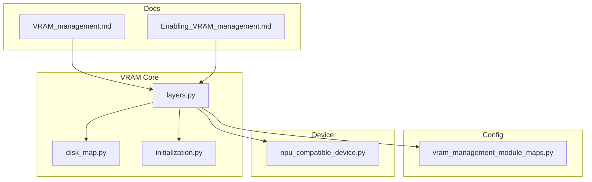
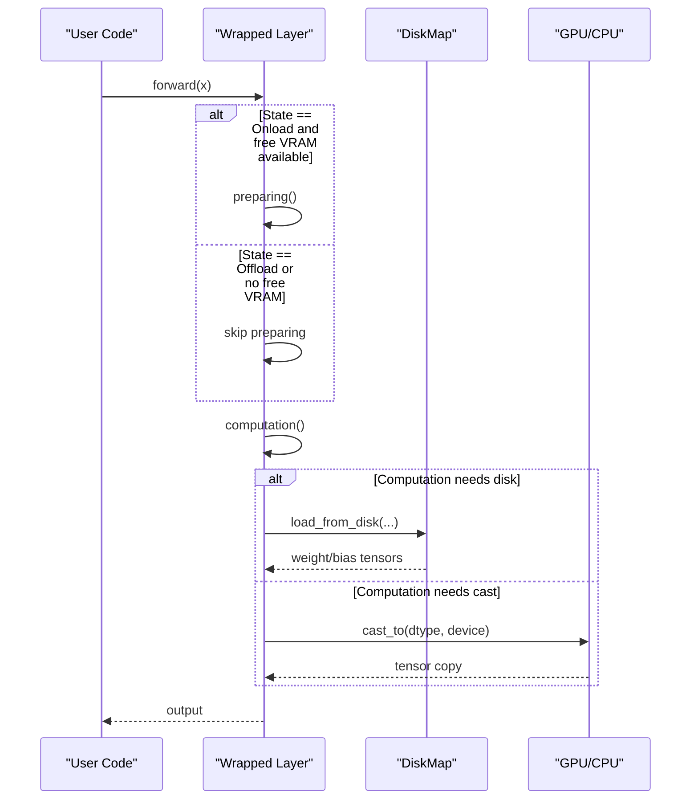
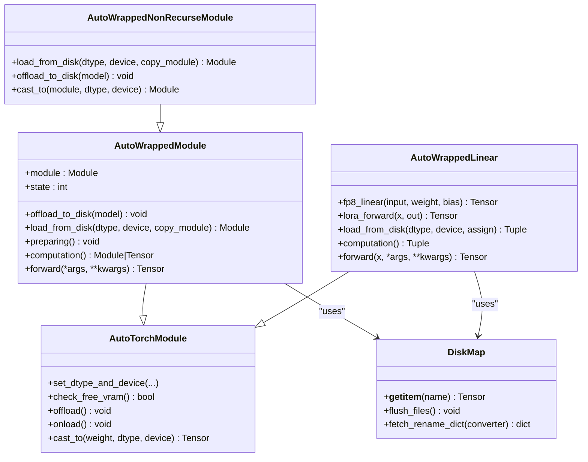
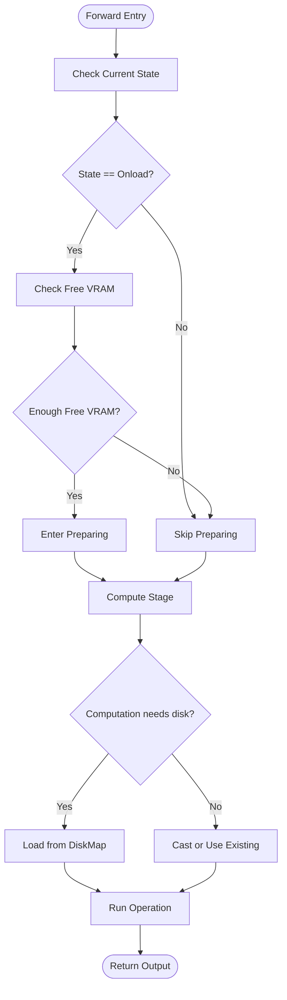
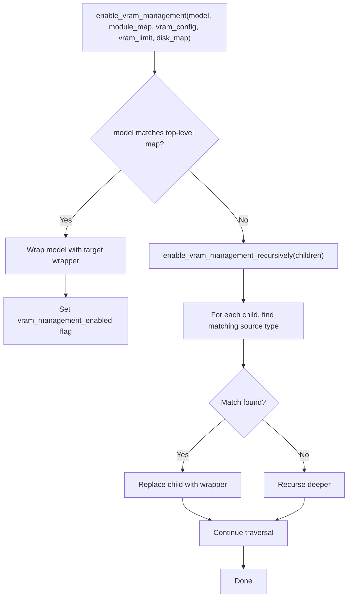
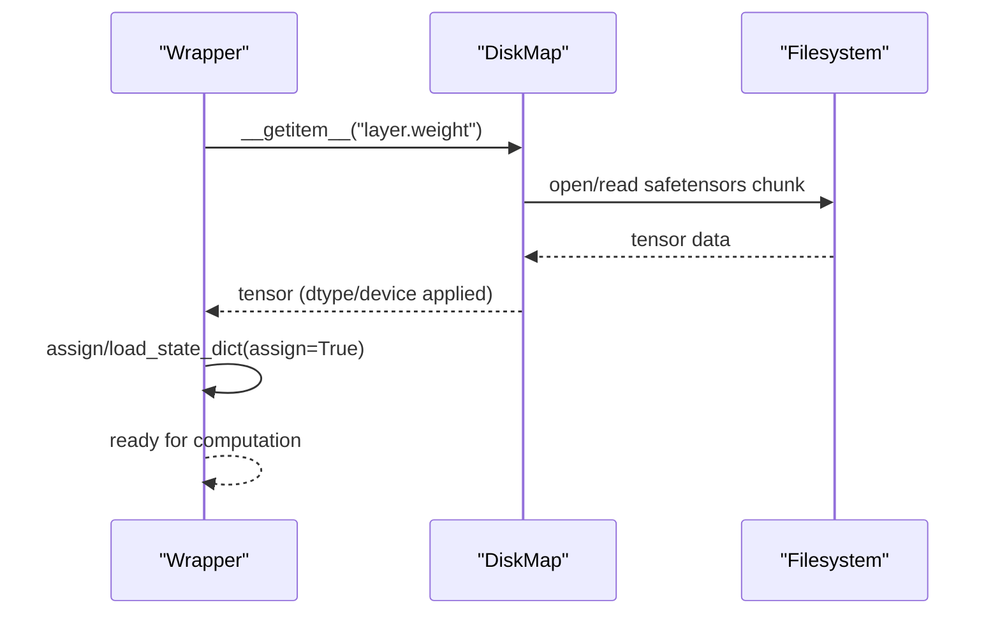

# VRAM Management

<cite>
**Referenced Files in This Document**
- [layers.py](file://diffsynth/core/vram/layers.py)
- [disk_map.py](file://diffsynth/core/vram/disk_map.py)
- [initialization.py](file://diffsynth/core/vram/initialization.py)
- [vram_management_module_maps.py](file://diffsynth/configs/vram_management_module_maps.py)
- [npu_compatible_device.py](file://diffsynth/core/device/npu_compatible_device.py)
- [VRAM_management.md](file://docs/en/Pipeline_Usage/VRAM_management.md)
- [Enabling_VRAM_management.md](file://docs/en/Developer_Guide/Enabling_VRAM_management.md)
- [FLUX.1-dev.py](file://examples/flux/model_inference_low_vram/FLUX.1-dev.py)
</cite>

## Table of Contents
1. [Introduction](#introduction)
2. [Project Structure](#project-structure)
3. [Core Components](#core-components)
4. [Architecture Overview](#architecture-overview)
5. [Detailed Component Analysis](#detailed-component-analysis)
6. [Dependency Analysis](#dependency-analysis)
7. [Performance Considerations](#performance-considerations)
8. [Troubleshooting Guide](#troubleshooting-guide)
9. [Conclusion](#conclusion)
10. [Appendices](#appendices)

## Introduction
This document explains the VRAM management system in ODTSR-edit (DiffSynth). It covers dynamic device placement, disk offloading, and memory optimization strategies used to run large models on low-memory hardware. You will learn how layers are wrapped for automatic memory control, how tensors are moved between CPU/GPU/disk, and how to configure VRAM limits and precision for different constraints. Practical examples and debugging guidance are included to help you monitor usage and optimize for your hardware.

## Project Structure
The VRAM management subsystem is implemented under diffsynth/core/vram with supporting configuration and device utilities:
- Core layer wrappers and auto-wrapping logic live in layers.py
- Disk-backed parameter loading is handled by disk_map.py
- Initialization helpers are provided by initialization.py
- Per-model module maps that specify which layers to wrap are defined in vram_management_module_maps.py
- Device abstraction and memory queries are in npu_compatible_device.py
- Usage guides and developer documentation are in docs/en

**Diagram sources**
- [layers.py:1-480](file://diffsynth/core/vram/layers.py#L1-L480)
- [disk_map.py:1-94](file://diffsynth/core/vram/disk_map.py#L1-L94)
- [initialization.py:1-22](file://diffsynth/core/vram/initialization.py#L1-L22)
- [vram_management_module_maps.py:1-312](file://diffsynth/configs/vram_management_module_maps.py#L1-L312)
- [npu_compatible_device.py:1-108](file://diffsynth/core/device/npu_compatible_device.py#L1-L108)
- [VRAM_management.md:1-206](file://docs/en/Pipeline_Usage/VRAM_management.md#L1-L206)
- [Enabling_VRAM_management.md:1-455](file://docs/en/Developer_Guide/Enabling_VRAM_management.md#L1-L455)

**Section sources**
- [layers.py:1-480](file://diffsynth/core/vram/layers.py#L1-L480)
- [disk_map.py:1-94](file://diffsynth/core/vram/disk_map.py#L1-L94)
- [initialization.py:1-22](file://diffsynth/core/vram/initialization.py#L1-L22)
- [vram_management_module_maps.py:1-312](file://diffsynth/configs/vram_management_module_maps.py#L1-L312)
- [npu_compatible_device.py:1-108](file://diffsynth/core/device/npu_compatible_device.py#L1-L108)
- [VRAM_management.md:1-206](file://docs/en/Pipeline_Usage/VRAM_management.md#L1-L206)
- [Enabling_VRAM_management.md:1-455](file://docs/en/Developer_Guide/Enabling_VRAM_management.md#L1-L455)

## Core Components
- AutoTorchModule: Base class providing dtype/device state management, casting, and optional VRAM limit checks.
- AutoWrappedModule: Wraps arbitrary torch.nn.Module with offload/onload/preparing/computation states and optional disk offload.
- AutoWrappedNonRecurseModule: Variant that only manages top-level parameters (useful for blocks with internal recursion).
- AutoWrappedLinear: Specialized wrapper for Linear layers with FP8 path and LoRA support.
- DiskMap: Lazy loader for safetensors or compatible binary files with buffer-based flushing and optional key renaming.
- enable_vram_management / enable_vram_management_recursively: Automatically replace model layers based on a module map and apply VRAM policies.
- fill_vram_config: Normalizes per-layer VRAM config defaults.

Key capabilities:
- Dynamic device placement across CPU/GPU/NPU with explicit dtype per stage.
- Optional disk-backed lazy loading for extreme memory constraints.
- Automatic forward-time preparation and temporary computation staging.
- Fine-grained control via per-model module maps.

**Section sources**
- [layers.py:8-480](file://diffsynth/core/vram/layers.py#L8-L480)
- [disk_map.py:1-94](file://diffsynth/core/vram/disk_map.py#L1-L94)
- [vram_management_module_maps.py:1-312](file://diffsynth/configs/vram_management_module_maps.py#L1-L312)

## Architecture Overview
At runtime, each layer is wrapped by an Auto* class that tracks its state (offload, onload, preparing, computation). During forward, the wrapper decides whether to move parameters from offload storage (CPU or disk) into a preparing stage if VRAM allows, then compute in the target dtype/device, and finally return to the previous state.

**Diagram sources**
- [layers.py:194-198](file://diffsynth/core/vram/layers.py#L194-L198)
- [layers.py:395-408](file://diffsynth/core/vram/layers.py#L395-L408)
- [disk_map.py:59-71](file://diffsynth/core/vram/disk_map.py#L59-L71)

## Detailed Component Analysis

### AutoTorchModule
- Purpose: Base behavior for dtype/device lifecycle and optional VRAM limit enforcement.
- Key methods:
  - set_dtype_and_device: stores per-stage dtypes/devices and vram_limit.
  - check_free_vram: queries current device memory usage against vram_limit.
  - offload/onload: moves module to offload or onload device/dtype.
  - cast_to: creates a new tensor copy with target dtype/device.

Complexity: O(1) for state transitions; memory movement cost depends on tensor size.

**Section sources**
- [layers.py:8-70](file://diffsynth/core/vram/layers.py#L8-L70)

### AutoWrappedModule
- Purpose: Generic wrapper for any Module with four-state lifecycle and optional disk offload.
- States:
  - Offload: not needed soon; stored in offload device/dtype (or disk).
  - Onload: ready soon; moved to onload device/dtype.
  - Preparing: intermediate staging when VRAM permits.
  - Computation: temporary execution context during forward.
- Disk offload:
  - If offload_dtype == "disk", parameters are kept on disk until needed.
  - load_from_disk reads required parameters from DiskMap and assigns them to the module.
  - offload_to_disk sets parameters to meta to release memory.

Forward flow:
- If state is Onload and free VRAM exists, enter preparing.
- Compute using either direct module, disk-loaded copy, or casted copy.

**Section sources**
- [layers.py:88-198](file://diffsynth/core/vram/layers.py#L88-L198)

### AutoWrappedNonRecurseModule
- Purpose: Wrap modules where only top-level parameters should be managed (e.g., DiT blocks with internal recursion).
- Differences:
  - load_from_disk uses non-recursive named_parameters.
  - offload_to_disk targets only top-level parameters.
  - cast_to returns the original module (no deep copy), relying on architecture-specific casting.

**Section sources**
- [layers.py:207-269](file://diffsynth/core/vram/layers.py#L207-L269)

### AutoWrappedLinear
- Purpose: Optimized wrapper for Linear layers with FP8 path and LoRA accumulation.
- Features:
  - fp8_linear: scales inputs and weights to FP8 and performs scaled matmul when computation_dtype supports float8.
  - lora_forward: accumulates LoRA outputs optionally via a merger.
  - load_from_disk: loads weight and bias from DiskMap and assigns to module.
  - computation: returns weight/bias in computation dtype/device, possibly from disk or via casting.

Forward flow:
- Prepare if needed.
- Get weight/bias via computation().
- Execute linear_forward (FP8 path or standard linear).
- Apply LoRA if present.

**Section sources**
- [layers.py:271-437](file://diffsynth/core/vram/layers.py#L271-L437)

### DiskMap
- Purpose: Lazy, streaming access to model parameters stored in safetensors or compatible binaries.
- Behavior:
  - Opens files lazily and caches handles.
  - Tracks cumulative bytes loaded and flushes file handles after a buffer threshold to avoid holding too many open handles.
  - Supports optional key renaming via state_dict_converter.
  - Returns tensors on requested dtype/device; clones CPU tensors to ensure ownership.

Constraints:
- Disk offload requires .safetensors format for optimal performance.
- Non-safetensors formats fall back to slower loaders.

**Section sources**
- [disk_map.py:1-94](file://diffsynth/core/vram/disk_map.py#L1-L94)

### Initialization Helpers
- skip_model_initialization: Context manager that temporarily replaces register_parameter to place newly created parameters on a specified device (commonly meta) to avoid allocating memory during construction.

Use case: Constructing wrapper layers without instantiating heavy parameters prematurely.

**Section sources**
- [initialization.py:1-22](file://diffsynth/core/vram/initialization.py#L1-L22)

### VRAM Configuration and Module Maps
- vram_management_module_maps.py defines per-model mappings from source layer types to target wrapper classes.
- Common mappings include torch.nn.Linear -> AutoWrappedLinear and various norm/conv/embedding layers -> AutoWrappedModule.
- Version-aware updates adjust mapping keys for external library changes.

How it works:
- enable_vram_management matches the model type to a pre-defined map and wraps accordingly.
- If no exact match, recursively walks children and applies mappings.

**Section sources**
- [vram_management_module_maps.py:1-312](file://diffsynth/configs/vram_management_module_maps.py#L1-L312)
- [layers.py:439-480](file://diffsynth/core/vram/layers.py#L439-L480)

### Device Abstraction and Memory Queries
- parse_device_type, get_device_name, IS_NPU_AVAILABLE, etc., abstract device selection and memory introspection.
- check_free_vram uses these utilities to query current device memory usage and compare against vram_limit.

**Section sources**
- [npu_compatible_device.py:1-108](file://diffsynth/core/device/npu_compatible_device.py#L1-L108)
- [layers.py:65-69](file://diffsynth/core/vram/layers.py#L65-L69)

## Architecture Overview
The VRAM management pipeline integrates three main pieces:
- Wrapper classes manage per-layer lifecycle and device/dtype transitions.
- DiskMap provides lazy parameter loading from disk.
- Module maps define which layers to wrap for each model.

**Diagram sources**
- [layers.py:8-480](file://diffsynth/core/vram/layers.py#L8-L480)
- [disk_map.py:1-94](file://diffsynth/core/vram/disk_map.py#L1-L94)

## Detailed Component Analysis

### Dynamic Device Placement and Forward Flow

**Diagram sources**
- [layers.py:194-198](file://diffsynth/core/vram/layers.py#L194-L198)
- [layers.py:395-408](file://diffsynth/core/vram/layers.py#L395-L408)
- [disk_map.py:59-71](file://diffsynth/core/vram/disk_map.py#L59-L71)

### Enabling VRAM Management Recursively

**Diagram sources**
- [layers.py:439-480](file://diffsynth/core/vram/layers.py#L439-L480)

### Disk Offload Data Path

**Diagram sources**
- [disk_map.py:28-94](file://diffsynth/core/vram/disk_map.py#L28-L94)
- [layers.py:126-138](file://diffsynth/core/vram/layers.py#L126-L138)
- [layers.py:359-366](file://diffsynth/core/vram/layers.py#L359-L366)

## Dependency Analysis
- layers.py depends on:
  - initialization.py for safe parameter registration
  - disk_map.py for disk-backed parameter access
  - device utilities for device parsing and memory queries
  - vram_management_module_maps.py for per-model wrapping rules
- disk_map.py depends on safetensors and PyTorch for tensor operations
- npu_compatible_device.py abstracts device detection and memory APIs

Potential coupling:
- Wrapper classes assume consistent naming for parameters when loading from DiskMap.
- Module maps must align with actual layer types in each model.

Circular dependencies:
- None detected within the VRAM core.

External dependencies:
- safetensors for efficient disk loading
- torch for tensor operations and device APIs

**Section sources**
- [layers.py:1-480](file://diffsynth/core/vram/layers.py#L1-L480)
- [disk_map.py:1-94](file://diffsynth/core/vram/disk_map.py#L1-L94)
- [npu_compatible_device.py:1-108](file://diffsynth/core/device/npu_compatible_device.py#L1-L108)
- [vram_management_module_maps.py:1-312](file://diffsynth/configs/vram_management_module_maps.py#L1-L312)

## Performance Considerations
- Precision trade-offs:
  - Storing parameters in FP8 reduces VRAM but does not speed up computation unless native FP8 matmul is used.
  - Computation typically runs in BF16 for numerical stability and compatibility.
- Device transfer costs:
  - Frequent CPU-GPU transfers can dominate latency; prefer keeping frequently used layers in GPU memory.
  - Disk offload introduces I/O overhead; use fast SSDs and minimize redundant loads.
- Buffering strategy:
  - DiskMap flushes file handles after a configurable byte threshold to balance memory and I/O efficiency.
- VRAM limit tuning:
  - Setting vram_limit slightly below available VRAM helps maintain headroom while allowing occasional spikes.
- LoRA handling:
  - Accumulating LoRA outputs can add overhead; consider merging LoRA weights when possible.

[No sources needed since this section provides general guidance]

## Troubleshooting Guide
Common issues and resolutions:
- Out-of-memory errors despite vram_limit:
  - The framework may exceed vram_limit temporarily to complete forward passes. Set vram_limit lower than total VRAM (e.g., 0.5 GB less).
- Disk offload failures:
  - Ensure model files are in .safetensors format; non-safetensors formats are slower and may not fully support all features.
  - Avoid state dict converters that reshape tensors when using disk offload.
- Unexpected high memory usage:
  - Verify that wrappers are correctly applied via module maps.
  - Check that buffers (non-parameter tensors) are not preventing full offload.
- Slow inference with disk offload:
  - Use high-speed SSDs and reduce unnecessary reloads by adjusting buffer_size or minimizing frequent state transitions.
- Monitoring VRAM:
  - Use device utilities to query memory info and track usage patterns during inference.

Practical references:
- Dynamic VRAM management and best practices are documented in the user guide.
- Developer guide details fine-grained configuration and enabling steps.

**Section sources**
- [VRAM_management.md:98-206](file://docs/en/Pipeline_Usage/VRAM_management.md#L98-L206)
- [Enabling_VRAM_management.md:172-218](file://docs/en/Developer_Guide/Enabling_VRAM_management.md#L172-L218)
- [layers.py:65-69](file://diffsynth/core/vram/layers.py#L65-L69)
- [disk_map.py:13-26](file://diffsynth/core/vram/disk_map.py#L13-L26)

## Conclusion
ODTSR-edit’s VRAM management system enables running large models on constrained hardware through layered wrapping, dynamic device placement, and optional disk-backed lazy loading. By configuring per-layer dtypes/devices and setting appropriate vram_limit values, users can balance memory usage and performance. For developers, fine-grained module maps allow precise control over which layers are wrapped and how they behave. With careful tuning and monitoring, this system delivers robust inference across diverse hardware configurations.

[No sources needed since this section summarizes without analyzing specific files]

## Appendices

### Configuration Options Summary
- vram_config fields:
  - offload_dtype/offload_device: Where and how to store parameters when not needed.
  - onload_dtype/onload_device: Where and how to prepare parameters for near-future use.
  - preparing_dtype/preparing_device: Temporary staging before computation.
  - computation_dtype/computation_device: Execution precision and device.
- vram_limit:
  - None: unlimited VRAM assumption; dynamic management disabled.
  - Positive number: cap VRAM usage; excess layers offloaded to CPU/disk.
  - Zero: maximize offloading; only bring parameters to GPU when necessary.

Examples:
- Basic inference (no VRAM management): see user guide.
- CPU offload with FP8 storage: see user guide and example scripts.
- Disk offload: see user guide and example scripts.

**Section sources**
- [VRAM_management.md:1-206](file://docs/en/Pipeline_Usage/VRAM_management.md#L1-L206)
- [Enabling_VRAM_management.md:1-455](file://docs/en/Developer_Guide/Enabling_VRAM_management.md#L1-L455)
- [FLUX.1-dev.py:1-38](file://examples/flux/model_inference_low_vram/FLUX.1-dev.py#L1-L38)

### Practical Low-Memory Inference Setup
- Use FP8 storage with BF16 computation for reduced VRAM footprint.
- Set vram_limit to slightly below available VRAM to allow transient spikes.
- Prefer CPU offload when memory is sufficient; otherwise enable disk offload with safetensors.
- Monitor memory usage and adjust vram_limit and buffer_size as needed.

**Section sources**
- [VRAM_management.md:61-137](file://docs/en/Pipeline_Usage/VRAM_management.md#L61-L137)
- [FLUX.1-dev.py:1-38](file://examples/flux/model_inference_low_vram/FLUX.1-dev.py#L1-L38)